# QARvGut - Actor-UseCase Mapping Matrix

**Document Version:** 1.0  
**Projekt:** QARvGut Enhanced User Management  
**Erstellt:** 5. Januar 2026  
**Type:** Actor-UseCase Traceability Matrix  

---

## Overview: Actors and Their UseCases

This document provides a comprehensive mapping of all actors to the use cases they participate in (either as primary or secondary actors).

---

## Actor Inventory

### Human Actors (User Roles)

| **Actor ID** | **Actor Name** | **Type** | **Description** |
|---|---|---|---|
| ACT-001 | Neuer Gutachter | User | New appraiser registering for the system |
| ACT-002 | Registrierter Gutachter/Mitarbeiter | User | Authenticated appraiser or staff member using the system |
| ACT-003 | Gutachter | User | Experienced appraiser managing orders and documents |
| ACT-004 | Gutachtermitarbeiter | User | Staff member working under an appraiser |
| ACT-005 | DRV-Mitarbeiter | User | DRV employee with support/administrative access |
| ACT-006 | 8023-Mitarbeiter | User | rvSMD operator managing appraiser and order data |

### System Actors (Integrated Systems)

| **Actor ID** | **Actor Name** | **Type** | **Description** |
|---|---|---|---|
| ACT-SYS-001 | rvGutachten-System | System | Core application system (this project) |
| ACT-SYS-002 | eLogin | System | Identity management system |
| ACT-SYS-003 | rvSMD | System | Master data management system |
| ACT-SYS-004 | rvPUR | System | Document archive system |
| ACT-SYS-005 | rvGutachtenAdmin | System | Administrative portal for DRV |
| ACT-SYS-006 | System (automatisch) | System | Automated system processes |

---

## Master Actor-UseCase Matrix

### **ACT-001: Neuer Gutachter (New Appraiser)**

| **UseCase** | **Role** | **Description** | **Status** |
|---|---|---|---|
| BUC-01: Gutachter-Onboarding-Prozess | **PRIMARY** | Registration and activation of new appraiser | 🟢 Critical |
| BUC-02: System-Authentifizierung | Secondary | Logs in after account activation | 🟢 Critical |

**Participation:** 2 use cases (1 primary, 1 secondary)

---

### **ACT-002: Registrierter Benutzer (Registered User - Gutachter/Mitarbeiter)**

| **UseCase** | **Role** | **Description** | **Status** |
|---|---|---|---|
| BUC-02: System-Authentifizierung | **PRIMARY** | User login to the system | 🟢 Critical |
| BUC-06: E-Mail-Benachrichtigungssystem | Secondary | Receives automated notifications | 🟡 Medium |

**Participation:** 2 use cases (1 primary, 1 secondary)

---

### **ACT-003: Gutachter (Appraiser)**

| **UseCase** | **Role** | **Description** | **Status** |
|---|---|---|---|
| BUC-01: Gutachter-Onboarding-Prozess | Secondary | Involved in account activation | 🟢 Critical |
| BUC-04: Auftragsübersicht und -verwaltung | **PRIMARY** | Views and manages assigned orders | 🟡 High |
| BUC-05: Auftragsdetails und Dokumenteneinsicht | **PRIMARY** | Views order details and manages documents | 🟡 High |
| BUC-06: E-Mail-Benachrichtigungssystem | Secondary | Receives order and status notifications | 🟡 Medium |
| BUC-08: Erweiterte Gutachtermitarbeiter-Verwaltung | **PRIMARY** | Manages staff members | 🔴 Low |
| BUC-12a: Gutachter ändert Auftragsstatus | **PRIMARY** | Changes order status in system | 🟡 Medium |

**Participation:** 6 use cases (4 primary, 2 secondary)

---

### **ACT-004: Gutachtermitarbeiter (Appraiser Staff Member)**

| **UseCase** | **Role** | **Description** | **Status** |
|---|---|---|---|
| BUC-04: Auftragsübersicht und -verwaltung | **PRIMARY** | Views and manages assigned orders | 🟡 High |
| BUC-05: Auftragsdetails und Dokumenteneinsicht | **PRIMARY** | Views order details and manages documents | 🟡 High |
| BUC-06: E-Mail-Benachrichtigungssystem | Secondary | Receives order and status notifications | 🟡 Medium |
| BUC-08: Erweiterte Gutachtermitarbeiter-Verwaltung | Secondary | Gets registered and managed by appraiser | 🔴 Low |
| BUC-12a: Gutachter ändert Auftragsstatus | **PRIMARY** | Changes order status in system | 🟡 Medium |

**Participation:** 5 use cases (3 primary, 2 secondary)

---

### **ACT-005: DRV-Mitarbeiter (DRV Staff Member)**

| **UseCase** | **Role** | **Description** | **Status** |
|---|---|---|---|
| BUC-01: Gutachter-Onboarding-Prozess | Secondary | Approves new appraiser registrations | 🟢 Critical |
| BUC-03: DRV-Mitarbeiter-Zugriffsverwaltung | **PRIMARY** | Registers for system access and support functions | 🟢 Critical |
| BUC-06: E-Mail-Benachrichtigungssystem | Secondary | Receives critical system notifications | 🟡 Medium |
| BUC-07: Support-Dashboard und Überwachung | **PRIMARY** | Monitors system health and assists users | 🔴 Low |
| BUC-08: Erweiterte Gutachtermitarbeiter-Verwaltung | Secondary | Approves staff member registrations | 🔴 Low |
| BUC-09: Datenaufbewahrung und Löschung | Secondary | Configures data retention policies | 🟡 Medium |

**Participation:** 6 use cases (2 primary, 4 secondary)

---

### **ACT-006: 8023-Mitarbeiter (rvSMD Operator)**

| **UseCase** | **Role** | **Description** | **Status** |
|---|---|---|---|
| BUC-11: Statusänderungen Gutachter | **PRIMARY** | Changes appraiser status in rvSMD | 🟡 Medium |
| BUC-13: Auftragsstornierung | **PRIMARY** | Initiates order cancellation | 🟡 Medium |

**Participation:** 2 use cases (2 primary)

---

### **ACT-SYS-001: rvGutachten-System (Core Application)**

| **UseCase** | **Role** | **Description** | **Status** |
|---|---|---|---|
| BUC-01: Gutachter-Onboarding-Prozess | Secondary | Validates input, creates accounts | 🟢 Critical |
| BUC-02: System-Authentifizierung | Secondary | Authenticates users, manages sessions | 🟢 Critical |
| BUC-03: DRV-Mitarbeiter-Zugriffsverwaltung | Secondary | Creates accounts with extended rights | 🟢 Critical |
| BUC-04: Auftragsübersicht und -verwaltung | Secondary | Loads and manages order data | 🟡 High |
| BUC-05: Auftragsdetails und Dokumenteneinsicht | Secondary | Loads document data, provides viewer | 🟡 High |
| BUC-06: E-Mail-Benachrichtigungssystem | **PRIMARY** | Sends notifications automatically | 🟡 Medium |
| BUC-07: Support-Dashboard und Überwachung | Secondary | Provides dashboard data and monitoring | 🔴 Low |
| BUC-09: Datenaufbewahrung und Löschung | Secondary | Executes automated deletion | 🟡 Medium |
| BUC-10: Automatische Dokumentenbereitstellung | **PRIMARY** | Retrieves and caches documents | 🟡 High |
| BUC-11: Statusänderungen Gutachter | Secondary | Synchronizes status from rvSMD | 🟡 Medium |
| BUC-12a: Gutachter ändert Auftragsstatus | Secondary | Updates status in database | 🟡 Medium |
| BUC-13: Auftragsstornierung | Secondary | Updates status, triggers deletion | 🟡 Medium |

**Participation:** 12 use cases (2 primary, 10 secondary)

---

### **ACT-SYS-002: eLogin (Identity Management)**

| **UseCase** | **Role** | **Description** | **Status** |
|---|---|---|---|
| BUC-01: Gutachter-Onboarding-Prozess | Secondary | Validates appraiser credentials | 🟢 Critical |
| BUC-03: DRV-Mitarbeiter-Zugriffsverwaltung | Secondary | Validates DRV staff status | 🟢 Critical |
| BUC-08: Erweiterte Gutachtermitarbeiter-Verwaltung | Secondary | Validates staff member credentials | 🔴 Low |

**Participation:** 3 use cases (all secondary)

---

### **ACT-SYS-003: rvSMD (Master Data Management)**

| **UseCase** | **Role** | **Description** | **Status** |
|---|---|---|---|
| BUC-01: Gutachter-Onboarding-Prozess | Secondary | Validates appraiser master data | 🟢 Critical |
| BUC-10: Automatische Dokumentenbereitstellung | Secondary | Triggers order creation, provides order data | 🟡 High |
| BUC-11: Statusänderungen Gutachter | Secondary | Initiates status sync with rvGutachten | 🟡 Medium |
| BUC-12a: Gutachter ändert Auftragsstatus | Secondary | Receives status updates from rvGutachten | 🟡 Medium |
| BUC-13: Auftragsstornierung | Secondary | Receives cancellation updates from rvGutachten | 🟡 Medium |

**Participation:** 5 use cases (all secondary)

---

### **ACT-SYS-004: rvPUR (Document Archive)**

| **UseCase** | **Role** | **Description** | **Status** |
|---|---|---|---|
| BUC-10: Automatische Dokumentenbereitstellung | Secondary | Provides documents for order | 🟡 High |

**Participation:** 1 use case (secondary)

---

### **ACT-SYS-005: rvGutachtenAdmin (Admin Portal)**

| **UseCase** | **Role** | **Description** | **Status** |
|---|---|---|---|
| BUC-03: DRV-Mitarbeiter-Zugriffsverwaltung | Secondary | Portal for requesting/approving access | 🟢 Critical |

**Participation:** 1 use case (secondary)

---

### **ACT-SYS-006: System (Automated Processes)**

| **UseCase** | **Role** | **Description** | **Status** |
|---|---|---|---|
| BUC-06: E-Mail-Benachrichtigungssystem | **PRIMARY** | Sends automated notifications | 🟡 Medium |
| BUC-09: Datenaufbewahrung und Löschung | **PRIMARY** | Automated data deletion | 🟡 Medium |
| BUC-10: Automatische Dokumentenbereitstellung | **PRIMARY** | Automatic document provisioning | 🟡 High |

**Participation:** 3 use cases (all primary)

---

## UseCase-Actor Matrix (Alternative View)

### **BUC-01: Gutachter-Onboarding-Prozess** 🟢 CRITICAL

| **Role** | **Actors** |
|---|---|
| **Primary** | ACT-001 (Neuer Gutachter) |
| **Secondary** | ACT-005 (DRV-Mitarbeiter), ACT-SYS-002 (eLogin), ACT-SYS-003 (rvSMD), ACT-SYS-001 (rvGutachten) |

---

### **BUC-02: System-Authentifizierung** 🟢 CRITICAL

| **Role** | **Actors** |
|---|---|
| **Primary** | ACT-002 (Registrierter Benutzer) |
| **Secondary** | ACT-SYS-001 (rvGutachten) |

---

### **BUC-03: DRV-Mitarbeiter-Zugriffsverwaltung** 🟢 CRITICAL

| **Role** | **Actors** |
|---|---|
| **Primary** | ACT-005 (DRV-Mitarbeiter) |
| **Secondary** | ACT-SYS-005 (rvGutachtenAdmin), ACT-SYS-002 (eLogin), ACT-SYS-001 (rvGutachten) |

---

### **BUC-04: Auftragsübersicht und -verwaltung** 🟡 HIGH

| **Role** | **Actors** |
|---|---|
| **Primary** | ACT-003 (Gutachter), ACT-004 (Gutachtermitarbeiter) |
| **Secondary** | ACT-SYS-001 (rvGutachten) |

---

### **BUC-05: Auftragsdetails und Dokumenteneinsicht** 🟡 HIGH

| **Role** | **Actors** |
|---|---|
| **Primary** | ACT-003 (Gutachter), ACT-004 (Gutachtermitarbeiter) |
| **Secondary** | ACT-SYS-001 (rvGutachten) |

---

### **BUC-06: E-Mail-Benachrichtigungssystem** 🟡 MEDIUM

| **Role** | **Actors** |
|---|---|
| **Primary** | ACT-SYS-006 (System - Automatisch) |
| **Secondary** | ACT-002 (Registrierter Benutzer), ACT-003 (Gutachter), ACT-004 (Gutachtermitarbeiter), ACT-005 (DRV-Mitarbeiter), ACT-SYS-001 (rvGutachten) |

---

### **BUC-07: Support-Dashboard und Überwachung** 🔴 LOW

| **Role** | **Actors** |
|---|---|
| **Primary** | ACT-005 (DRV-Mitarbeiter) |
| **Secondary** | ACT-SYS-001 (rvGutachten) |

---

### **BUC-08: Erweiterte Gutachtermitarbeiter-Verwaltung** 🔴 LOW

| **Role** | **Actors** |
|---|---|
| **Primary** | ACT-003 (Gutachter) |
| **Secondary** | ACT-004 (Gutachtermitarbeiter), ACT-005 (DRV-Mitarbeiter), ACT-SYS-002 (eLogin) |

---

### **BUC-09: Datenaufbewahrung und Löschung** 🟡 MEDIUM

| **Role** | **Actors** |
|---|---|
| **Primary** | ACT-SYS-006 (System - Automatisch) |
| **Secondary** | ACT-005 (DRV-Mitarbeiter), ACT-SYS-001 (rvGutachten) |

---

### **BUC-10: Automatische Dokumentenbereitstellung** 🟡 HIGH

| **Role** | **Actors** |
|---|---|
| **Primary** | ACT-SYS-006 (System - Automatisch) |
| **Secondary** | ACT-003 (Gutachter), ACT-004 (Gutachtermitarbeiter), ACT-SYS-001 (rvGutachten), ACT-SYS-003 (rvSMD), ACT-SYS-004 (rvPUR) |

---

### **BUC-11: Statusänderungen Gutachter** 🟡 MEDIUM

| **Role** | **Actors** |
|---|---|
| **Primary** | ACT-006 (8023-Mitarbeiter) |
| **Secondary** | ACT-SYS-003 (rvSMD), ACT-SYS-001 (rvGutachten) |

---

### **BUC-12a: Gutachter ändert Auftragsstatus** 🟡 MEDIUM

| **Role** | **Actors** |
|---|---|
| **Primary** | ACT-003 (Gutachter), ACT-004 (Gutachtermitarbeiter) |
| **Secondary** | ACT-SYS-001 (rvGutachten), ACT-SYS-003 (rvSMD) |

---

### **BUC-13: Auftragsstornierung** 🟡 MEDIUM

| **Role** | **Actors** |
|---|---|
| **Primary** | ACT-006 (8023-Mitarbeiter) |
| **Secondary** | ACT-SYS-003 (rvSMD), ACT-SYS-001 (rvGutachten) |

---

## Statistics and Insights

### Actor Participation Summary

| **Actor** | **Primary UseCases** | **Secondary UseCases** | **Total** |
|---|---|---|---|
| ACT-001 (Neuer Gutachter) | 1 | 1 | 2 |
| ACT-002 (Registrierter Benutzer) | 1 | 1 | 2 |
| ACT-003 (Gutachter) | 4 | 2 | 6 |
| ACT-004 (Gutachtermitarbeiter) | 3 | 2 | 5 |
| ACT-005 (DRV-Mitarbeiter) | 2 | 4 | 6 |
| ACT-006 (8023-Mitarbeiter) | 2 | 0 | 2 |
| ACT-SYS-001 (rvGutachten) | 0 | 10 | 10 |
| ACT-SYS-002 (eLogin) | 0 | 3 | 3 |
| ACT-SYS-003 (rvSMD) | 0 | 5 | 5 |
| ACT-SYS-004 (rvPUR) | 0 | 1 | 1 |
| ACT-SYS-005 (rvGutachtenAdmin) | 0 | 1 | 1 |
| ACT-SYS-006 (System - Automatisch) | 3 | 0 | 3 |

**Key Insights:**
- **Most Active Human Actors:** Gutachter (6), DRV-Mitarbeiter (6), Gutachtermitarbeiter (5)
- **Most Active System:** rvGutachten (10 use cases)
- **Most Complex Integration:** rvSMD (5 use cases) - critical for order and appraiser management
- **Primary System Drivers:** System Automation (3), eLogin/rvSMD/rvGutachten integration

### UseCase Distribution by Priority

| **Priority** | **Count** | **UseCases** |
|---|---|---|
| 🟢 Critical | 3 | BUC-01, BUC-02, BUC-03 |
| 🟡 High/Medium | 8 | BUC-04, BUC-05, BUC-06, BUC-09, BUC-10, BUC-11, BUC-12a, BUC-13 |
| 🔴 Low | 2 | BUC-07, BUC-08 |

---

## Actor Groupings by Role Category

### User Management & Onboarding
- **BUC-01, BUC-02, BUC-03:** ACT-001, ACT-002, ACT-005, eLogin, rvSMD

### Order Management (Appraiser Focus)
- **BUC-04, BUC-05, BUC-12a:** ACT-003, ACT-004, rvGutachten

### Order Management (DRV Focus)
- **BUC-11, BUC-13:** ACT-006, rvSMD, rvGutachten

### Support & Operations
- **BUC-06, BUC-07, BUC-09:** ACT-005, System (Automated), rvGutachten

### Extended Functionality
- **BUC-08, BUC-10:** ACT-003, ACT-004, System (Automated), rvPUR

---

## Dependencies and Data Flow

```
┌─────────────────────────────────────────────────────────────────┐
│                    System Integration Model                      │
├─────────────────────────────────────────────────────────────────┤
│                                                                   │
│  Neuer Gutachter                                                │
│       │                                                          │
│       ├─→ BUC-01 (Onboarding) ────→ eLogin (validate)           │
│       │                            ↓                             │
│       │                        rvSMD (master data)               │
│       │                            ↓                             │
│       │                    rvGutachten (create account)          │
│       │                            ↓                             │
│       └─→ BUC-02 (Login) ────→ rvGutachten (authenticate)        │
│                                    │                             │
│                                    ↓                             │
│                    ┌───────────────┴───────────────┐             │
│                    │   Order Management           │             │
│                    │   BUC-04, BUC-05, BUC-12a   │             │
│                    │                               │             │
│              Gutachter/Gutachtermitarbeiter        │             │
│              ↓                    ↓               │             │
│            BUC-10            BUC-04/05           │             │
│         (Auto-Docs)       (Order Mgmt)           │             │
│              ↓                    ↓               │             │
│          rvPUR ←──────→ rvGutachten ←──────→ rvSMD            │
│        (Archive)        (Core App)      (Master Data)         │
│                                                    │             │
│    ┌──────────────────────────────────────────────┘             │
│    │                                                             │
│    ↓                                                             │
│  8023-Mitarbeiter                                              │
│    │                                                             │
│    ├─→ BUC-11 (Appraiser Status) ─────→ rvSMD → rvGutachten   │
│    │                                                             │
│    └─→ BUC-13 (Order Cancellation) ────→ rvSMD → rvGutachten  │
│            ├─→ BUC-09 (Data Deletion)                          │
│            └─→ BUC-06 (Notifications)                          │
│                                                                 │
│  DRV-Mitarbeiter                                               │
│    │                                                             │
│    ├─→ BUC-03 (Access) ────→ rvGutachtenAdmin → rvGutachten   │
│    │                                                             │
│    ├─→ BUC-07 (Support Dashboard) ──→ rvGutachten             │
│    │                                                             │
│    └─→ BUC-06, BUC-09 (notifications, deletion config)         │
│                                                                 │
└─────────────────────────────────────────────────────────────────┘
```

---

## Mermaid Diagram: Actor-UseCase Relationships

```mermaid
graph TB
    %% Human Actors
    NG["👤 ACT-001<br/>Neuer Gutachter"]
    RU["👤 ACT-002<br/>Registrierter<br/>Benutzer"]
    GA["👤 ACT-003<br/>Gutachter"]
    GM["👤 ACT-004<br/>Gutachter-<br/>mitarbeiter"]
    DM["👤 ACT-005<br/>DRV-Mitarbeiter"]
    SM["👤 ACT-006<br/>8023-Mitarbeiter"]
    
    %% System Actors
    RG["🖥️ rvGutachten"]
    EL["🖥️ eLogin"]
    RSD["🖥️ rvSMD"]
    RP["🖥️ rvPUR"]
    RA["🖥️ rvGutachtenAdmin"]
    SYS["⚙️ System<br/>Automatisch"]
    
    %% UseCases
    UC01["BUC-01<br/>Onboarding<br/>🟢"]
    UC02["BUC-02<br/>Authentication<br/>🟢"]
    UC03["BUC-03<br/>DRV Access<br/>🟢"]
    UC04["BUC-04<br/>Order View<br/>🟡"]
    UC05["BUC-05<br/>Order Details<br/>🟡"]
    UC06["BUC-06<br/>Notifications<br/>🟡"]
    UC07["BUC-07<br/>Dashboard<br/>🔴"]
    UC08["BUC-08<br/>Staff Mgmt<br/>🔴"]
    UC09["BUC-09<br/>Data Retention<br/>🟡"]
    UC10["BUC-10<br/>Auto Docs<br/>🟡"]
    UC11["BUC-11<br/>Appraiser<br/>Status<br/>🟡"]
    UC12["BUC-12a<br/>Order Status<br/>🟡"]
    UC13["BUC-13<br/>Cancellation<br/>🟡"]
    
    %% Primary Relationships
    NG -->|primary| UC01
    RU -->|primary| UC02
    DM -->|primary| UC03
    GA -->|primary| UC04
    GA -->|primary| UC05
    GA -->|primary| UC08
    GA -->|primary| UC12
    GM -->|primary| UC04
    GM -->|primary| UC05
    GM -->|primary| UC12
    SM -->|primary| UC11
    SM -->|primary| UC13
    SYS -->|primary| UC06
    SYS -->|primary| UC09
    SYS -->|primary| UC10
    
    %% Secondary Relationships (selected key ones)
    DM -->|secondary| UC01
    RU -->|secondary| UC06
    GA -->|secondary| UC01
    EL -->|secondary| UC01
    RSD -->|secondary| UC01
    RG -->|secondary| UC01
    RG -->|secondary| UC04
    RG -->|secondary| UC05
    RG -->|secondary| UC10
    RP -->|secondary| UC10
    RSD -->|secondary| UC10
    
    style UC01 fill:#90EE90
    style UC02 fill:#90EE90
    style UC03 fill:#90EE90
    style UC04 fill:#FFD700
    style UC05 fill:#FFD700
    style UC06 fill:#FFD700
    style UC07 fill:#FFB6C1
    style UC08 fill:#FFB6C1
    style UC09 fill:#FFD700
    style UC10 fill:#FFD700
    style UC11 fill:#FFD700
    style UC12 fill:#FFD700
    style UC13 fill:#FFD700
```



---

## Access Control Matrix

### Who can do what?

| **UseCase** | **Actor** | **Access Level** | **Notes** |
|---|---|---|---|
| BUC-01 | Neuer Gutachter | Public | Registration page accessible |
| BUC-01 | DRV-Mitarbeiter | Admin | Must approve registrations |
| BUC-02 | All Registered Users | Authenticated | Password-protected login |
| BUC-03 | DRV-Mitarbeiter | Admin | Self-service with approval |
| BUC-04 | Gutachter/Gutachtermitarbeiter | Own Orders | Can only view assigned orders |
| BUC-05 | Gutachter/Gutachtermitarbeiter | Own Orders | Can only view assigned documents |
| BUC-06 | All Users | Automatic | Notifications sent based on role |
| BUC-07 | DRV-Mitarbeiter Support | Admin | Full system visibility |
| BUC-08 | Gutachter | Manage Team | Can manage own staff members |
| BUC-09 | System | Automated | Based on configured rules |
| BUC-10 | System | Automated | Triggered on order creation |
| BUC-11 | 8023-Mitarbeiter | Admin (rvSMD) | Changes synced to rvGutachten |
| BUC-12a | Gutachter/Gutachtermitarbeiter | Own Orders | Status changes synced to rvSMD |
| BUC-13 | 8023-Mitarbeiter | Admin (rvSMD) | Cancellations synced to rvGutachten |

---

## Cross-System Dependencies

### Critical Integration Points

1. **eLogin Integration**
   - Required for: BUC-01, BUC-03, BUC-08
   - Purpose: User authentication and validation
   - Failure Impact: Registration and access control blocked

2. **rvSMD Integration**
   - Required for: BUC-01, BUC-10, BUC-11, BUC-12a, BUC-13
   - Purpose: Master data sync, order management
   - Failure Impact: Data inconsistency between systems

3. **rvPUR Integration**
   - Required for: BUC-10
   - Purpose: Document retrieval
   - Failure Impact: Documents unavailable to appraisers

4. **Email System**
   - Required for: BUC-01, BUC-06, BUC-09, BUC-11, BUC-13
   - Purpose: Notifications and activation codes
   - Failure Impact: Users not informed of events

---

## Recommended Reading Order

**For Implementation Planning:**
1. Critical UseCases: BUC-01, BUC-02, BUC-03 (Foundation)
2. Core Features: BUC-04, BUC-05 (User Experience)
3. Integrations: BUC-10, BUC-12a, BUC-11, BUC-13 (System Sync)
4. Operations: BUC-06, BUC-07, BUC-09 (Support)
5. Extensions: BUC-08 (Additional Features)

**For Training:**
1. Gutachter: BUC-02, BUC-04, BUC-05, BUC-12a, BUC-10
2. DRV-Mitarbeiter: BUC-03, BUC-07, BUC-01, BUC-06, BUC-09
3. Administrators: All BUCs with priority on integration points

---

**Document Control:**
- Version 1.0 - Initial creation from use-cases-mvp-development.md
- Created: January 5, 2026
- Maintainer: Product Owner Sarah
- Next Review: When new use cases are added
