# QARvGut - Akteur-Anwendungsfall-Zuordnungsmatrix

**Dokumentversion:** 1.0  
**Projekt:** QARvGut Enhanced User Management  
**Erstellt:** 5. Januar 2026  
**Typ:** Akteur-Anwendungsfall-Nachverfolgungsmatrix  

---

## Übersicht: Akteure und ihre Anwendungsfälle

Dieses Dokument bietet eine umfassende Zuordnung aller Akteure zu den Anwendungsfällen, an denen sie teilnehmen (entweder als primäre oder sekundäre Akteure).

---

## Akteur-Bestand

### Menschliche Akteure (Benutzerrollen)

| **Akteur-ID** | **Akteur-Name** | **Typ** | **Beschreibung** |
|---|---|---|---|
| ACT-001 | Neuer Gutachter | Benutzer | Neuer Gutachter, der sich für das System registriert |
| ACT-002 | Registrierter Gutachter/Mitarbeiter | Benutzer | Authentifizierter Gutachter oder Mitarbeiter, der das System nutzt |
| ACT-003 | Gutachter | Benutzer | Erfahrener Gutachter, der Aufträge und Dokumente verwaltet |
| ACT-004 | Gutachtermitarbeiter | Benutzer | Mitarbeiter, der unter einem Gutachter arbeitet |
| ACT-005 | DRV-Mitarbeiter | Benutzer | DRV-Mitarbeiter mit Support-/Administratorzugriff |
| ACT-006 | 8023-Mitarbeiter | Benutzer | rvSMD-Betreiber, der Gutachter- und Auftragsdaten verwaltet |

### System-Akteure (Integrierte Systeme)

| **Akteur-ID** | **Akteur-Name** | **Typ** | **Beschreibung** |
|---|---|---|---|
| ACT-SYS-001 | rvGutachten-System | System | Kernanwendungssystem (dieses Projekt) |
| ACT-SYS-002 | eLogin | System | Identitätsverwaltungssystem |
| ACT-SYS-003 | rvSMD | System | Stammdatenverwaltungssystem |
| ACT-SYS-004 | rvPUR | System | Dokumentenarchivierungssystem |
| ACT-SYS-005 | rvGutachtenAdmin | System | Verwaltungsportal für DRV |
| ACT-SYS-006 | System (automatisch) | System | Automatisierte Systemprozesse |

---

## Master-Akteur-Anwendungsfall-Matrix

### **ACT-001: Neuer Gutachter**

| **Anwendungsfall** | **Rolle** | **Beschreibung** | **Status** |
|---|---|---|---|
| BUC-01: Gutachter-Onboarding-Prozess | **PRIMÄR** | Registrierung und Aktivierung neuer Gutachter | 🟢 Kritisch |
| BUC-02: System-Authentifizierung | Sekundär | Anmeldung nach Kontoaktivierung | 🟢 Kritisch |

**Teilnahme:** 2 Anwendungsfälle (1 primär, 1 sekundär)

---

### **ACT-002: Registrierter Benutzer (Gutachter/Mitarbeiter)**

| **Anwendungsfall** | **Rolle** | **Beschreibung** | **Status** |
|---|---|---|---|
| BUC-02: System-Authentifizierung | **PRIMÄR** | Benutzeranmeldung im System | 🟢 Kritisch |
| BUC-06: E-Mail-Benachrichtigungssystem | Sekundär | Empfängt automatische Benachrichtigungen | 🟡 Mittel |

**Teilnahme:** 2 Anwendungsfälle (1 primär, 1 sekundär)

---

### **ACT-003: Gutachter**

| **Anwendungsfall** | **Rolle** | **Beschreibung** | **Status** |
|---|---|---|---|
| BUC-01: Gutachter-Onboarding-Prozess | Sekundär | Beteiligung bei Kontoaktivierung | 🟢 Kritisch |
| BUC-04: Auftragsübersicht und -verwaltung | **PRIMÄR** | Zeigt und verwaltet zugewiesene Aufträge | 🟡 Hoch |
| BUC-05: Auftragsdetails und Dokumenteneinsicht | **PRIMÄR** | Zeigt Auftragsdetails und verwaltet Dokumente | 🟡 Hoch |
| BUC-06: E-Mail-Benachrichtigungssystem | Sekundär | Empfängt Auftrags- und Statusbenachrichtigungen | 🟡 Mittel |
| BUC-08: Erweiterte Gutachtermitarbeiter-Verwaltung | **PRIMÄR** | Verwaltet Mitarbeiter | 🔴 Niedrig |
| BUC-12a: Gutachter ändert Auftragsstatus | **PRIMÄR** | Ändert Auftragsstatus im System | 🟡 Mittel |

**Teilnahme:** 6 Anwendungsfälle (4 primär, 2 sekundär)

---

### **ACT-004: Gutachtermitarbeiter**

| **Anwendungsfall** | **Rolle** | **Beschreibung** | **Status** |
|---|---|---|---|
| BUC-04: Auftragsübersicht und -verwaltung | **PRIMÄR** | Zeigt und verwaltet zugewiesene Aufträge | 🟡 Hoch |
| BUC-05: Auftragsdetails und Dokumenteneinsicht | **PRIMÄR** | Zeigt Auftragsdetails und verwaltet Dokumente | 🟡 Hoch |
| BUC-06: E-Mail-Benachrichtigungssystem | Sekundär | Empfängt Auftrags- und Statusbenachrichtigungen | 🟡 Mittel |
| BUC-08: Erweiterte Gutachtermitarbeiter-Verwaltung | Sekundär | Wird registriert und von Gutachter verwaltet | 🔴 Niedrig |
| BUC-12a: Gutachter ändert Auftragsstatus | **PRIMÄR** | Ändert Auftragsstatus im System | 🟡 Mittel |

**Teilnahme:** 5 Anwendungsfälle (3 primär, 2 sekundär)

---

### **ACT-005: DRV-Mitarbeiter**

| **Anwendungsfall** | **Rolle** | **Beschreibung** | **Status** |
|---|---|---|---|
| BUC-01: Gutachter-Onboarding-Prozess | Sekundär | Genehmigt neue Gutachter-Registrierungen | 🟢 Kritisch |
| BUC-03: DRV-Mitarbeiter-Zugriffsverwaltung | **PRIMÄR** | Registriert sich für Systemzugriff und Support-Funktionen | 🟢 Kritisch |
| BUC-06: E-Mail-Benachrichtigungssystem | Sekundär | Empfängt kritische Systembenachrichtigungen | 🟡 Mittel |
| BUC-07: Support-Dashboard und Überwachung | **PRIMÄR** | Überwacht Systemzustand und unterstützt Benutzer | 🔴 Niedrig |
| BUC-08: Erweiterte Gutachtermitarbeiter-Verwaltung | Sekundär | Genehmigt Mitarbeiter-Registrierungen | 🔴 Niedrig |
| BUC-09: Datenaufbewahrung und Löschung | Sekundär | Konfiguriert Datenspeicherungsrichtlinien | 🟡 Mittel |

**Teilnahme:** 6 Anwendungsfälle (2 primär, 4 sekundär)

---

### **ACT-006: 8023-Mitarbeiter**

| **Anwendungsfall** | **Rolle** | **Beschreibung** | **Status** |
|---|---|---|---|
| BUC-11: Statusänderungen Gutachter | **PRIMÄR** | Ändert Gutachter-Status in rvSMD | 🟡 Mittel |
| BUC-13: Auftragsstornierung | **PRIMÄR** | Initiiert Auftragsstornierung | 🟡 Mittel |

**Teilnahme:** 2 Anwendungsfälle (2 primär)

---

### **ACT-SYS-001: rvGutachten-System (Kernanwendung)**

| **Anwendungsfall** | **Rolle** | **Beschreibung** | **Status** |
|---|---|---|---|
| BUC-01: Gutachter-Onboarding-Prozess | Sekundär | Validiert Eingaben, erstellt Konten | 🟢 Kritisch |
| BUC-02: System-Authentifizierung | Sekundär | Authentifiziert Benutzer, verwaltet Sitzungen | 🟢 Kritisch |
| BUC-03: DRV-Mitarbeiter-Zugriffsverwaltung | Sekundär | Erstellt Konten mit erweiterten Rechten | 🟢 Kritisch |
| BUC-04: Auftragsübersicht und -verwaltung | Sekundär | Lädt und verwaltet Auftragsdaten | 🟡 Hoch |
| BUC-05: Auftragsdetails und Dokumenteneinsicht | Sekundär | Lädt Dokumentendaten, stellt Viewer zur Verfügung | 🟡 Hoch |
| BUC-06: E-Mail-Benachrichtigungssystem | **PRIMÄR** | Sendet automatische Benachrichtigungen | 🟡 Mittel |
| BUC-07: Support-Dashboard und Überwachung | Sekundär | Stellt Dashboard-Daten und Überwachung bereit | 🔴 Niedrig |
| BUC-09: Datenaufbewahrung und Löschung | Sekundär | Führt automatisches Löschen aus | 🟡 Mittel |
| BUC-10: Automatische Dokumentenbereitstellung | **PRIMÄR** | Ruft Dokumente ab und speichert sie zwischen | 🟡 Hoch |
| BUC-11: Statusänderungen Gutachter | Sekundär | Synchronisiert Status von rvSMD | 🟡 Mittel |
| BUC-12a: Gutachter ändert Auftragsstatus | Sekundär | Aktualisiert Status in Datenbank | 🟡 Mittel |
| BUC-13: Auftragsstornierung | Sekundär | Aktualisiert Status, triggert Löschung | 🟡 Mittel |

**Teilnahme:** 12 Anwendungsfälle (2 primär, 10 sekundär)

---

### **ACT-SYS-002: eLogin (Identitätsverwaltung)**

| **Anwendungsfall** | **Rolle** | **Beschreibung** | **Status** |
|---|---|---|---|
| BUC-01: Gutachter-Onboarding-Prozess | Sekundär | Validiert Gutachter-Anmeldedaten | 🟢 Kritisch |
| BUC-03: DRV-Mitarbeiter-Zugriffsverwaltung | Sekundär | Validiert DRV-Mitarbeiterstatus | 🟢 Kritisch |
| BUC-08: Erweiterte Gutachtermitarbeiter-Verwaltung | Sekundär | Validiert Mitarbeiter-Anmeldedaten | 🔴 Niedrig |

**Teilnahme:** 3 Anwendungsfälle (alle sekundär)

---

### **ACT-SYS-003: rvSMD (Stammdatenverwaltung)**

| **Anwendungsfall** | **Rolle** | **Beschreibung** | **Status** |
|---|---|---|---|
| BUC-01: Gutachter-Onboarding-Prozess | Sekundär | Validiert Gutachter-Stammdaten | 🟢 Kritisch |
| BUC-10: Automatische Dokumentenbereitstellung | Sekundär | Triggert Auftragserstellung, stellt Auftragsdaten bereit | 🟡 Hoch |
| BUC-11: Statusänderungen Gutachter | Sekundär | Initiiert Status-Synchronisation mit rvGutachten | 🟡 Mittel |
| BUC-12a: Gutachter ändert Auftragsstatus | Sekundär | Empfängt Statusaktualisierungen von rvGutachten | 🟡 Mittel |
| BUC-13: Auftragsstornierung | Sekundär | Empfängt Stornierungsaktualisierungen von rvGutachten | 🟡 Mittel |

**Teilnahme:** 5 Anwendungsfälle (alle sekundär)

---

### **ACT-SYS-004: rvPUR (Dokumentenarchiv)**

| **Anwendungsfall** | **Rolle** | **Beschreibung** | **Status** |
|---|---|---|---|
| BUC-10: Automatische Dokumentenbereitstellung | Sekundär | Stellt Dokumente für Auftrag bereit | 🟡 Hoch |

**Teilnahme:** 1 Anwendungsfall (sekundär)

---

### **ACT-SYS-005: rvGutachtenAdmin (Admin-Portal)**

| **Anwendungsfall** | **Rolle** | **Beschreibung** | **Status** |
|---|---|---|---|
| BUC-03: DRV-Mitarbeiter-Zugriffsverwaltung | Sekundär | Portal für Zugangsanforderung/-genehmigung | 🟢 Kritisch |

**Teilnahme:** 1 Anwendungsfall (sekundär)

---

### **ACT-SYS-006: System (Automatisierte Prozesse)**

| **Anwendungsfall** | **Rolle** | **Beschreibung** | **Status** |
|---|---|---|---|
| BUC-06: E-Mail-Benachrichtigungssystem | **PRIMÄR** | Sendet automatische Benachrichtigungen | 🟡 Mittel |
| BUC-09: Datenaufbewahrung und Löschung | **PRIMÄR** | Automatische Datenlöschung | 🟡 Mittel |
| BUC-10: Automatische Dokumentenbereitstellung | **PRIMÄR** | Automatische Dokumentenbereitstellung | 🟡 Hoch |

**Teilnahme:** 3 Anwendungsfälle (alle primär)

---

## Anwendungsfall-Akteur-Matrix (Alternative Ansicht)

### **BUC-01: Gutachter-Onboarding-Prozess** 🟢 KRITISCH

| **Rolle** | **Akteure** |
|---|---|
| **Primär** | ACT-001 (Neuer Gutachter) |
| **Sekundär** | ACT-005 (DRV-Mitarbeiter), ACT-SYS-002 (eLogin), ACT-SYS-003 (rvSMD), ACT-SYS-001 (rvGutachten) |

---

### **BUC-02: System-Authentifizierung** 🟢 KRITISCH

| **Rolle** | **Akteure** |
|---|---|
| **Primär** | ACT-002 (Registrierter Benutzer) |
| **Sekundär** | ACT-SYS-001 (rvGutachten) |

---

### **BUC-03: DRV-Mitarbeiter-Zugriffsverwaltung** 🟢 KRITISCH

| **Rolle** | **Akteure** |
|---|---|
| **Primär** | ACT-005 (DRV-Mitarbeiter) |
| **Sekundär** | ACT-SYS-005 (rvGutachtenAdmin), ACT-SYS-002 (eLogin), ACT-SYS-001 (rvGutachten) |

---

### **BUC-04: Auftragsübersicht und -verwaltung** 🟡 HOCH

| **Rolle** | **Akteure** |
|---|---|
| **Primär** | ACT-003 (Gutachter), ACT-004 (Gutachtermitarbeiter) |
| **Sekundär** | ACT-SYS-001 (rvGutachten) |

---

### **BUC-05: Auftragsdetails und Dokumenteneinsicht** 🟡 HOCH

| **Rolle** | **Akteure** |
|---|---|
| **Primär** | ACT-003 (Gutachter), ACT-004 (Gutachtermitarbeiter) |
| **Sekundär** | ACT-SYS-001 (rvGutachten) |

---

### **BUC-06: E-Mail-Benachrichtigungssystem** 🟡 MITTEL

| **Rolle** | **Akteure** |
|---|---|
| **Primär** | ACT-SYS-006 (System - Automatisch) |
| **Sekundär** | ACT-002 (Registrierter Benutzer), ACT-003 (Gutachter), ACT-004 (Gutachtermitarbeiter), ACT-005 (DRV-Mitarbeiter), ACT-SYS-001 (rvGutachten) |

---

### **BUC-07: Support-Dashboard und Überwachung** 🔴 NIEDRIG

| **Rolle** | **Akteure** |
|---|---|
| **Primär** | ACT-005 (DRV-Mitarbeiter) |
| **Sekundär** | ACT-SYS-001 (rvGutachten) |

---

### **BUC-08: Erweiterte Gutachtermitarbeiter-Verwaltung** 🔴 NIEDRIG

| **Rolle** | **Akteure** |
|---|---|
| **Primär** | ACT-003 (Gutachter) |
| **Sekundär** | ACT-004 (Gutachtermitarbeiter), ACT-005 (DRV-Mitarbeiter), ACT-SYS-002 (eLogin) |

---

### **BUC-09: Datenaufbewahrung und Löschung** 🟡 MITTEL

| **Rolle** | **Akteure** |
|---|---|
| **Primär** | ACT-SYS-006 (System - Automatisch) |
| **Sekundär** | ACT-005 (DRV-Mitarbeiter), ACT-SYS-001 (rvGutachten) |

---

### **BUC-10: Automatische Dokumentenbereitstellung** 🟡 HOCH

| **Rolle** | **Akteure** |
|---|---|
| **Primär** | ACT-SYS-006 (System - Automatisch) |
| **Sekundär** | ACT-003 (Gutachter), ACT-004 (Gutachtermitarbeiter), ACT-SYS-001 (rvGutachten), ACT-SYS-003 (rvSMD), ACT-SYS-004 (rvPUR) |

---

### **BUC-11: Statusänderungen Gutachter** 🟡 MITTEL

| **Rolle** | **Akteure** |
|---|---|
| **Primär** | ACT-006 (8023-Mitarbeiter) |
| **Sekundär** | ACT-SYS-003 (rvSMD), ACT-SYS-001 (rvGutachten) |

---

### **BUC-12a: Gutachter ändert Auftragsstatus** 🟡 MITTEL

| **Rolle** | **Akteure** |
|---|---|
| **Primär** | ACT-003 (Gutachter), ACT-004 (Gutachtermitarbeiter) |
| **Sekundär** | ACT-SYS-001 (rvGutachten), ACT-SYS-003 (rvSMD) |

---

### **BUC-13: Auftragsstornierung** 🟡 MITTEL

| **Rolle** | **Akteure** |
|---|---|
| **Primär** | ACT-006 (8023-Mitarbeiter) |
| **Sekundär** | ACT-SYS-003 (rvSMD), ACT-SYS-001 (rvGutachten) |

---

## Statistiken und Erkenntnisse

### Zusammenfassung der Akteur-Teilnahme

| **Akteur** | **Primäre Anwendungsfälle** | **Sekundäre Anwendungsfälle** | **Summe** |
|---|---|---|---|
| ACT-001 (Neuer Gutachter) | 1 | 1 | 2 |
| ACT-002 (Registrierter Benutzer) | 1 | 1 | 2 |
| ACT-003 (Gutachter) | 4 | 2 | 6 |
| ACT-004 (Gutachtermitarbeiter) | 3 | 2 | 5 |
| ACT-005 (DRV-Mitarbeiter) | 2 | 4 | 6 |
| ACT-006 (8023-Mitarbeiter) | 2 | 0 | 2 |
| ACT-SYS-001 (rvGutachten) | 0 | 10 | 10 |
| ACT-SYS-002 (eLogin) | 0 | 3 | 3 |
| ACT-SYS-003 (rvSMD) | 0 | 5 | 5 |
| ACT-SYS-004 (rvPUR) | 0 | 1 | 1 |
| ACT-SYS-005 (rvGutachtenAdmin) | 0 | 1 | 1 |
| ACT-SYS-006 (System - Automatisch) | 3 | 0 | 3 |

**Wichtige Erkenntnisse:**
- **Aktivste menschliche Akteure:** Gutachter (6), DRV-Mitarbeiter (6), Gutachtermitarbeiter (5)
- **Aktivstes System:** rvGutachten (10 Anwendungsfälle)
- **Komplexeste Integration:** rvSMD (5 Anwendungsfälle) - kritisch für Auftrags- und Gutachter-Verwaltung
- **Primäre Systemtreiber:** System-Automatisierung (3), eLogin/rvSMD/rvGutachten-Integration

### Verteilung der Anwendungsfälle nach Priorität

| **Priorität** | **Anzahl** | **Anwendungsfälle** |
|---|---|---|
| 🟢 Kritisch | 3 | BUC-01, BUC-02, BUC-03 |
| 🟡 Hoch/Mittel | 8 | BUC-04, BUC-05, BUC-06, BUC-09, BUC-10, BUC-11, BUC-12a, BUC-13 |
| 🔴 Niedrig | 2 | BUC-07, BUC-08 |

---

## Akteur-Gruppierungen nach Rollenkategorie

### Benutzer-Verwaltung & Onboarding
- **BUC-01, BUC-02, BUC-03:** ACT-001, ACT-002, ACT-005, eLogin, rvSMD

### Auftrags-Verwaltung (Gutachter-Fokus)
- **BUC-04, BUC-05, BUC-12a:** ACT-003, ACT-004, rvGutachten

### Auftrags-Verwaltung (DRV-Fokus)
- **BUC-11, BUC-13:** ACT-006, rvSMD, rvGutachten

### Support & Betrieb
- **BUC-06, BUC-07, BUC-09:** ACT-005, System (Automatisch), rvGutachten

### Erweiterte Funktionalität
- **BUC-08, BUC-10:** ACT-003, ACT-004, System (Automatisch), rvPUR

---

## Abhängigkeiten und Datenfluss

```
┌─────────────────────────────────────────────────────────────────┐
│              Systemintegrationsmodell                            │
├─────────────────────────────────────────────────────────────────┤
│                                                                   │
│  Neuer Gutachter                                                │
│       │                                                          │
│       ├─→ BUC-01 (Onboarding) ────→ eLogin (validieren)         │
│       │                            ↓                             │
│       │                        rvSMD (Stammdaten)               │
│       │                            ↓                             │
│       │                    rvGutachten (Konto erstellen)        │
│       │                            ↓                             │
│       └─→ BUC-02 (Login) ────→ rvGutachten (authentifizieren)   │
│                                    │                             │
│                                    ↓                             │
│                    ┌───────────────┴───────────────┐             │
│                    │   Auftrags-Verwaltung        │             │
│                    │   BUC-04, BUC-05, BUC-12a   │             │
│                    │                               │             │
│              Gutachter/Gutachtermitarbeiter        │             │
│              ↓                    ↓               │             │
│            BUC-10            BUC-04/05           │             │
│         (Auto-Dokumente)  (Auftrags-Verwaltung)  │             │
│              ↓                    ↓               │             │
│          rvPUR ←──────→ rvGutachten ←──────→ rvSMD            │
│        (Archiv)        (Kern-App)      (Stammdaten)           │
│                                                    │             │
│    ┌──────────────────────────────────────────────┘             │
│    │                                                             │
│    ↓                                                             │
│  8023-Mitarbeiter                                              │
│    │                                                             │
│    ├─→ BUC-11 (Gutachter-Status) ─────→ rvSMD → rvGutachten   │
│    │                                                             │
│    └─→ BUC-13 (Auftragsstornierung) ────→ rvSMD → rvGutachten │
│            ├─→ BUC-09 (Datenlöschung)                          │
│            └─→ BUC-06 (Benachrichtigungen)                     │
│                                                                 │
│  DRV-Mitarbeiter                                               │
│    │                                                             │
│    ├─→ BUC-03 (Zugang) ────→ rvGutachtenAdmin → rvGutachten   │
│    │                                                             │
│    ├─→ BUC-07 (Support-Dashboard) ──→ rvGutachten             │
│    │                                                             │
│    └─→ BUC-06, BUC-09 (Benachrichtigungen, Lösch-Konfiguration)│
│                                                                 │
└─────────────────────────────────────────────────────────────────┘
```

---

## Mermaid-Diagramm: Akteur-Anwendungsfall-Beziehungen

```mermaid
graph TB
    %% Menschliche Akteure
    NG["👤 ACT-001<br/>Neuer<br/>Gutachter"]
    RU["👤 ACT-002<br/>Registrierter<br/>Benutzer"]
    GA["👤 ACT-003<br/>Gutachter"]
    GM["👤 ACT-004<br/>Gutachter-<br/>mitarbeiter"]
    DM["👤 ACT-005<br/>DRV-<br/>Mitarbeiter"]
    SM["👤 ACT-006<br/>8023-<br/>Mitarbeiter"]
    
    %% System-Akteure
    RG["🖥️ rvGutachten"]
    EL["🖥️ eLogin"]
    RSD["🖥️ rvSMD"]
    RP["🖥️ rvPUR"]
    RA["🖥️ rvGutachten<br/>Admin"]
    SYS["⚙️ System<br/>Automatisch"]
    
    %% Anwendungsfälle
    UC01["BUC-01<br/>Onboarding<br/>🟢"]
    UC02["BUC-02<br/>Authentifizierung<br/>🟢"]
    UC03["BUC-03<br/>DRV-Zugang<br/>🟢"]
    UC04["BUC-04<br/>Auftragsansicht<br/>🟡"]
    UC05["BUC-05<br/>Auftragsdetails<br/>🟡"]
    UC06["BUC-06<br/>Benachrichtigungen<br/>🟡"]
    UC07["BUC-07<br/>Dashboard<br/>🔴"]
    UC08["BUC-08<br/>Mitarbeiter-<br/>Verwaltung<br/>🔴"]
    UC09["BUC-09<br/>Datenspeicherung<br/>🟡"]
    UC10["BUC-10<br/>Auto-<br/>Dokumente<br/>🟡"]
    UC11["BUC-11<br/>Gutachter-<br/>Status<br/>🟡"]
    UC12["BUC-12a<br/>Auftrags-<br/>Status<br/>🟡"]
    UC13["BUC-13<br/>Stornierung<br/>🟡"]
    
    %% Primäre Beziehungen
    NG -->|primär| UC01
    RU -->|primär| UC02
    DM -->|primär| UC03
    GA -->|primär| UC04
    GA -->|primär| UC05
    GA -->|primär| UC08
    GA -->|primär| UC12
    GM -->|primär| UC04
    GM -->|primär| UC05
    GM -->|primär| UC12
    SM -->|primär| UC11
    SM -->|primär| UC13
    SYS -->|primär| UC06
    SYS -->|primär| UC09
    SYS -->|primär| UC10
    
    %% Sekundäre Beziehungen (ausgewählte wichtige)
    DM -->|sekundär| UC01
    RU -->|sekundär| UC06
    GA -->|sekundär| UC01
    EL -->|sekundär| UC01
    RSD -->|sekundär| UC01
    RG -->|sekundär| UC01
    RG -->|sekundär| UC04
    RG -->|sekundär| UC05
    RG -->|sekundär| UC10
    RP -->|sekundär| UC10
    RSD -->|sekundär| UC10
    
    style UC01 fill:#90EE90
    style UC02 fill:#90EE90
    style UC03 fill:#90EE90
    style UC04 fill:#FFD700
    style UC05 fill:#FFD700
    style UC06 fill:#FFD700
    style UC07 fill:#FFB6C1
    style UC08 fill:#FFB6C1
    style UC09 fill:#FFD700
    style UC10 fill:#FFD700
    style UC11 fill:#FFD700
    style UC12 fill:#FFD700
    style UC13 fill:#FFD700
```



---

## Zugriffskontrollmatrix

### Wer kann was tun?

| **Anwendungsfall** | **Akteur** | **Zugriffsstufe** | **Anmerkungen** |
|---|---|---|---|
| BUC-01 | Neuer Gutachter | Öffentlich | Registrierungsseite zugänglich |
| BUC-01 | DRV-Mitarbeiter | Admin | Muss Registrierungen genehmigen |
| BUC-02 | Alle registrierten Benutzer | Authentifiziert | Passwort-geschützte Anmeldung |
| BUC-03 | DRV-Mitarbeiter | Admin | Selbstbedienung mit Genehmigung |
| BUC-04 | Gutachter/Gutachtermitarbeiter | Eigene Aufträge | Kann nur zugewiesene Aufträge einsehen |
| BUC-05 | Gutachter/Gutachtermitarbeiter | Eigene Aufträge | Kann nur zugewiesene Dokumente einsehen |
| BUC-06 | Alle Benutzer | Automatisch | Benachrichtigungen basierend auf Rolle |
| BUC-07 | DRV-Mitarbeiter Support | Admin | Vollständige Systemsichtbarkeit |
| BUC-08 | Gutachter | Mitarbeiter verwalten | Kann eigene Mitarbeiter verwalten |
| BUC-09 | System | Automatisiert | Basierend auf konfigurierten Regeln |
| BUC-10 | System | Automatisiert | Triggert bei Auftragserstellung |
| BUC-11 | 8023-Mitarbeiter | Admin (rvSMD) | Änderungen werden mit rvGutachten synchronisiert |
| BUC-12a | Gutachter/Gutachtermitarbeiter | Eigene Aufträge | Status-Änderungen werden mit rvSMD synchronisiert |
| BUC-13 | 8023-Mitarbeiter | Admin (rvSMD) | Stornierungen werden mit rvGutachten synchronisiert |

---

## Systemübergreifende Abhängigkeiten

### Kritische Integrationspunkte

1. **eLogin-Integration**
   - Erforderlich für: BUC-01, BUC-03, BUC-08
   - Zweck: Benutzerauthentifizierung und Validierung
   - Auswirkung bei Ausfall: Registrierung und Zugriffskontrolle blockiert

2. **rvSMD-Integration**
   - Erforderlich für: BUC-01, BUC-10, BUC-11, BUC-12a, BUC-13
   - Zweck: Stammdaten-Synchronisation, Auftrags-Verwaltung
   - Auswirkung bei Ausfall: Dateninkonsistenz zwischen Systemen

3. **rvPUR-Integration**
   - Erforderlich für: BUC-10
   - Zweck: Dokumentenabruf
   - Auswirkung bei Ausfall: Dokumente nicht verfügbar für Gutachter

4. **E-Mail-System**
   - Erforderlich für: BUC-01, BUC-06, BUC-09, BUC-11, BUC-13
   - Zweck: Benachrichtigungen und Aktivierungscodes
   - Auswirkung bei Ausfall: Benutzer nicht über Ereignisse informiert

---

## Empfohlene Lesereihenfolge

**Für Implementierungsplanung:**
1. Kritische Anwendungsfälle: BUC-01, BUC-02, BUC-03 (Grundlagen)
2. Kernfeatures: BUC-04, BUC-05 (Benutzererfahrung)
3. Integrationen: BUC-10, BUC-12a, BUC-11, BUC-13 (System-Synchronisation)
4. Betrieb: BUC-06, BUC-07, BUC-09 (Support)
5. Erweiterungen: BUC-08 (Zusätzliche Features)

**Für Training:**
1. Gutachter: BUC-02, BUC-04, BUC-05, BUC-12a, BUC-10
2. DRV-Mitarbeiter: BUC-03, BUC-07, BUC-01, BUC-06, BUC-09
3. Administratoren: Alle BUCs mit Fokus auf Integrationspunkte

---

**Dokumentkontrolle:**
- Version 1.0 - Initialisierung aus use-cases-mvp-development.md
- Erstellt: 5. Januar 2026
- Betreuer: Product Owner Sarah
- Nächste Überprüfung: Wenn neue Anwendungsfälle hinzugefügt werden
