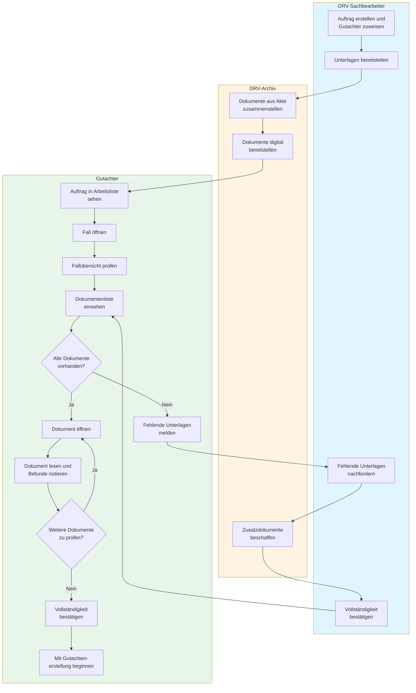

# BUC-10: Gutachter arbeitet mit Fallunterlagen

**Business Use Case ID:** BUC-10  
**Name:** Gutachter sichtet und bearbeitet medizinische Fallunterlagen  
**Domäne:** Medizinische Begutachtung / Fallbearbeitung  
**Version:** 1.0  
**Erstellt:** 13. November 2025  

---

## Geschäftsziel

Ein medizinischer Gutachter muss alle relevanten Unterlagen zu einem Begutachtungsfall zeitnah und vollständig einsehen können, um eine fundierte medizinische Beurteilung erstellen zu können.

---

## Beteiligte Personen & Organisationen

- **Primärer Akteur:** Medizinischer Gutachter (Arzt/Ärztin mit Zulassung)
- **Sekundäre Akteure:**
  - DRV-Sachbearbeiter (verwaltet Aufträge)
  - Proband/Versicherter (dessen Fall begutachtet wird)
  - Archiv-Mitarbeiter (bei Nachfragen zu fehlenden Unterlagen)

---

## Auslöser

Der Gutachter hat einen neuen Begutachtungsauftrag erhalten und möchte mit der Fallbearbeitung beginnen.

---

## Vorbedingungen

1. Gutachter hat gültigen Zugang zum Begutachtungssystem
2. Begutachtungsauftrag wurde von der DRV an den Gutachter vergeben
3. Medizinische Unterlagen zum Fall sind im DRV-Archiv vorhanden
4. Gutachter hat die erforderlichen fachlichen Qualifikationen

---

## Geschäftsprozess (Erfolgsszenario)

### Schritt 1: Auftrag öffnen
Der Gutachter öffnet seine Arbeitsliste und wählt einen zugewiesenen Begutachtungsfall aus.

**Geschäftsregel:** Gutachter kann nur auf Fälle zugreifen, die ihm offiziell zugewiesen wurden.

### Schritt 2: Fallübersicht prüfen
Der Gutachter sieht grundlegende Informationen zum Fall:
- Name und Versicherungsnummer des Probanden
- Art der Begutachtung (z.B. Erwerbsminderung, Rehabilitation)
- Fragestellung der DRV
- Frist für Gutachtenerstellung

### Schritt 3: Dokumentenliste einsehen
Der Gutachter erhält eine Übersicht aller verfügbaren Unterlagen:
- Arztbriefe
- Röntgenbilder und Bildgebung
- Laborbefunde
- Vorbefunde anderer Gutachter
- Sozialversicherungsunterlagen
- Patientenanamnese

**Geschäftsregel:** Alle für die Begutachtung relevanten Dokumente müssen vollständig vorliegen, bevor das Gutachten erstellt werden kann.

### Schritt 4: Dokumente einzeln öffnen
Der Gutachter öffnet einzelne Dokumente nacheinander und liest sie sorgfältig durch.

**Qualitätsanforderung:** Dokumente müssen sofort (innerhalb von 2 Sekunden) verfügbar sein, um den Arbeitsfluss nicht zu unterbrechen.

### Schritt 5: Relevante Informationen notieren
Der Gutachter markiert oder notiert wichtige Befunde für die spätere Gutachtenerstellung.

### Schritt 6: Vollständigkeit prüfen
Der Gutachter prüft, ob alle erforderlichen Unterlagen vorliegen.

---

## Geschäftsprozess-Diagramm (Swimlane)

**Legende:**
- **Blau**: Administrative Tätigkeiten (DRV-Sachbearbeiter)
- **Gelb**: Dokumentenbereitstellung (Archiv)
- **Grün**: Begutachtungstätigkeiten (Gutachter)

---

## Alternative Szenarien

### A1: Dokumente fehlen
**Situation:** Der Gutachter stellt fest, dass wichtige Unterlagen fehlen (z.B. aktuelles Röntgenbild).

**Handlung:**
1. Gutachter meldet fehlende Unterlagen an DRV-Sachbearbeiter
2. DRV-Sachbearbeiter fordert fehlende Unterlagen nach
3. Gutachter pausiert Bearbeitung bis Unterlagen vorliegen
4. Nach Erhalt: Gutachter setzt Bearbeitung fort

**Geschäftsauswirkung:** Begutachtung verzögert sich, Frist muss ggf. verlängert werden.

### A2: Dokumente nicht lesbar
**Situation:** Dokument ist beschädigt, unleserlich oder in falscher Sprache.

**Handlung:**
1. Gutachter meldet Problem
2. DRV-Sachbearbeiter beschafft lesbare Version oder Übersetzung
3. Bearbeitung wird pausiert

### A3: Archiv nicht verfügbar
**Situation:** Dokumentenarchiv ist temporär nicht erreichbar (technische Störung).

**Handlung:**
1. Gutachter kann nicht auf Unterlagen zugreifen
2. Gutachter bearbeitet andere Fälle oder pausiert Arbeit
3. Nach Wiederherstellung: Gutachter setzt Bearbeitung fort

**Geschäftswert des Systems:** Durch lokale Zwischenspeicherung sollte dieser Fall vermieden werden - Gutachter kann auch bei Archivausfall weiterarbeiten.

### A4: Zusätzliche Dokumente während Bearbeitung
**Situation:** Während der Gutachter den Fall bearbeitet, werden neue Unterlagen (z.B. Nachbefunde) ergänzt.

**Handlung:**
1. Gutachter wird über neue Dokumente informiert
2. Gutachter prüft neue Unterlagen
3. Gutachter integriert neue Informationen in Beurteilung

---

## Erfolgskriterien (Nachbedingungen)

1. ✅ Gutachter hat alle relevanten Unterlagen gesichtet
2. ✅ Gutachter kann fundierte medizinische Beurteilung erstellen
3. ✅ Dokumentenvollständigkeit ist bestätigt
4. ✅ Arbeitszeit wurde effizient genutzt (keine Wartezeiten)
5. ✅ Alle Dokumentenzugriffe sind dokumentiert (Compliance)

---

## Geschäftswert & Nutzen

**Für den Gutachter:**
- Effizienter Arbeitsablauf ohne Unterbrechungen
- Vollständiger Überblick über medizinische Vorgeschichte
- Fundierte Entscheidungsgrundlage

**Für die DRV:**
- Qualitativ hochwertige Gutachten
- Einhaltung von Fristen
- Rechtssichere Dokumentation

**Für den Versicherten:**
- Schnelle Bearbeitung des Antrags
- Sorgfältige medizinische Prüfung
- Faire Entscheidung basierend auf vollständigen Informationen

---

## Geschäftsregeln

| ID | Regel | Begründung |
|----|-------|------------|
| BR-10.1 | Gutachter darf nur zugewiesene Fälle öffnen | Datenschutz, ärztliche Schweigepflicht |
| BR-10.2 | Alle Dokumente müssen vor Gutachtenerstellung vorliegen | Qualitätssicherung, vollständige Beurteilung |
| BR-10.3 | Dokumentenzugriffe müssen protokolliert werden | DSGVO-Compliance, Revisionssicherheit |
| BR-10.4 | Dokumente dürfen nicht verändert werden | Beweissicherung, Originalität |
| BR-10.5 | Arbeitsunfähigkeitszeiten sind zu respektieren | Arbeitszeitgesetz, Work-Life-Balance |

---

## Qualitätsanforderungen (nicht-technisch)

| Anforderung | Messgröße | Zielwert | Begründung |
|-------------|-----------|----------|------------|
| Dokumentenverfügbarkeit | Verfügbarkeit | 99,5% | Gutachter müssen jederzeit arbeiten können |
| Zugriffgeschwindigkeit | Subjektives Empfinden | "Sofort verfügbar" | Kein Unterbrechen des Denkprozesses |
| Dokumentenvollständigkeit | Anteil vollständiger Fälle | >95% | Nachforderungen vermeiden |
| Benutzerfreundlichkeit | Schulungszeit neue Gutachter | <2 Stunden | Intuitive Bedienung |

---

## Häufigkeit & Volumen

- **Häufigkeit:** 50-200 Mal pro Tag (je nach Gutachter-Auslastung)
- **Dauer pro Fall:** 30-120 Minuten Dokumentensichtung
- **Anzahl Dokumente:** Durchschnittlich 5-15 Dokumente pro Fall
- **Dokumentengröße:** Meist 100KB - 10MB pro Dokument

---

## Schnittstellen zu anderen Geschäftsprozessen

- **Vorgelagert:** BUC-04 "Auftrag annehmen und bestätigen"
- **Parallel:** BUC-11 "Proband untersuchen" (ambulante Untersuchung)
- **Nachgelagert:** BUC-12 "Gutachten erstellen und einreichen"

---

## Compliance & Rechtliche Anforderungen

- **DSGVO:** Zugriff nur durch autorisierte Personen, Protokollierung
- **SGB (Sozialgesetzbuch):** Versicherungsdaten unterliegen besonderem Schutz
- **Ärztliche Schweigepflicht:** Dokumente dürfen nicht an unbefugte Dritte weitergegeben werden
- **Archivierung:** Aufbewahrungsfristen gemäß Sozialversicherungsrecht

---

## Varianten & Sonderfälle

**Variante 1: Eilbegutachtung**
- Gutachter benötigt prioritären Zugriff
- Verkürzte Fristen (z.B. 48 Stunden)

**Variante 2: Gutachtermitarbeiter**
- Mitarbeiter des Gutachters (z.B. Praxispersonal) bereitet Unterlagen vor
- Gutachter führt finale Sichtung und Beurteilung durch

**Variante 3: Kollegiale Zweitmeinung**
- Gutachter konsultiert Fachkollegen
- Dokumentenzugriff muss temporär erweitert werden (mit Einwilligung)

---

## Risiken ohne IT-Unterstützung

| Risiko | Auswirkung | Eintrittswahrscheinlichkeit |
|--------|------------|----------------------------|
| Dokumente nicht auffindbar | Verzögerung, unvollständige Begutachtung | Hoch |
| Dokumente veraltet | Falsche Entscheidung | Mittel |
| Lange Wartezeiten (Archiv) | Ineffizienz, Fristversäumnis | Hoch |
| Dokumente verloren | Aufwändige Neubeschaffung | Niedrig |
| Unbefugter Zugriff | Datenschutzverletzung | Mittel |

---

## Erfolgsmessung (Business KPIs)

- **Durchschnittliche Bearbeitungszeit pro Fall:** Ziel <2 Stunden
- **Anzahl Nachforderungen fehlender Dokumente:** Ziel <5%
- **Gutachter-Zufriedenheit:** Ziel >4.0/5.0
- **Fristüberschreitungen:** Ziel <2%
- **Dokumentenvollständigkeit bei Erstübermittlung:** Ziel >95%

---

## Unterschied zum technischen Use Case

**Dieser Business Use Case (BUC-10)** beschreibt:
- **WAS** der Gutachter erreichen möchte (Unterlagen sichten)
- **WARUM** es wichtig ist (fundierte Beurteilung)
- **WER** beteiligt ist (reale Personen)

**Der technische System Use Case (UC-10)** beschreibt:
- **WIE** das IT-System den Geschäftsprozess unterstützt
- **WELCHE** technischen Komponenten beteiligt sind (APIs, Datenbanken)
- **WIE** Daten zwischen Systemen fließen

**Mapping:** BUC-10 wird technisch realisiert durch UC-10 (Automatisches PDF-Caching)

---

## Offene Fragen

1. Wie erfolgt die Benachrichtigung bei neuen/ergänzten Dokumenten?
2. Gibt es Priorisierungsregeln für Eilfälle?
3. Wie lange müssen Dokumente nach Gutachtenerstellung verfügbar bleiben?
4. Sind spezielle Anforderungen für Bilddateien (DICOM) zu beachten?

---

**Document Owner:** Fachbereich Medizinische Begutachtung  
**Review Status:** Draft - Zur Abstimmung mit Gutachtern  
**Nächster Review:** Q1 2026
