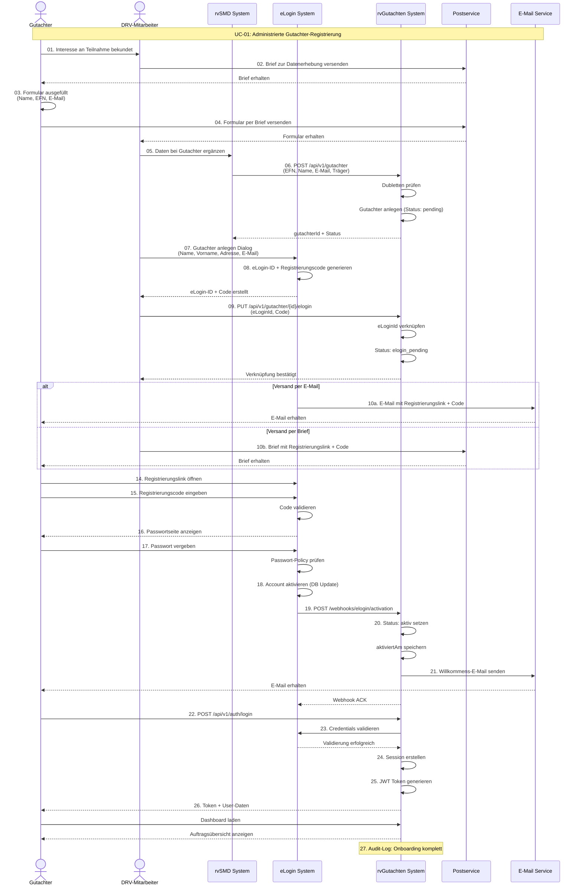

# UC-01: Datenfluss-Rückverfolgbarkeitsmatrix
## Gutachter-Onboarding-Prozess (Administrierte Registrierung)

**Use Case:** UC-01: Gutachter-Registrierung und -Aktivierung  
**Datum:** November 2025  
**Zweck:** Rückverfolgbarkeit des kompletten Onboarding-Workflows zwischen DRV, eLogin, rvSMD und rvGutachten

**WICHTIG:** Dies ist ein administrierter Prozess - DRV-Mitarbeiter legen Gutachter manuell an, nachdem postalische Formulare eingegangen sind. Der Gutachter selbst registriert sich nicht direkt im System.

---

## Legende

| Symbol | Bedeutung |
|--------|-----------|
| [R] | **Read** - Daten werden gelesen/abgefragt |
| [C] | **Create** - Daten werden erstellt |
| [U] | **Update** - Daten werden aktualisiert |
| [OK] | **Display** - Daten werden dem Benutzer angezeigt |
| [WARN] | **Validate** - Daten werden validiert/geprüft |
| [AUTH] | **Check** - Berechtigungsprüfung |
| [SYNC] | **Synchronize** - Daten werden zwischen Systemen synchronisiert |
| [SEND] | **Transmit** - Daten werden übertragen (E-Mail/Post) |
| - | Nicht beteiligt in diesem Schritt |

---
## Sequenzschritte zu API-Aufrufen Mapping

| Schritt | Aktor | Aktion | API Aufruf | Methode | System |
|---------|-------|--------|------------|---------|--------|
| 1 | Gutachter | Interesse bekundet | - | Offline | DRV |
| 2 | DRV-MA | Brief zur Datenerhebung versenden | - | Postal | Postservice |
| 3 | Gutachter | Formular ausfüllen (Name, EFN, E-Mail) | - | Offline | - |
| 4 | Gutachter | Formular per Brief versenden | - | Postal | Postservice |
| 5 | DRV-MA | Daten bei Gutachter in rvSMD ergänzen | `rvSMD Web UI` | Manual | rvSMD |
| 6 | rvSMD | Gutachter in rvGutachten anlegen | `POST /api/v1/gutachter` | POST | rvGutachten API |
| 7 | DRV-MA | eLogin-Account anlegen (Dialog) | `eLogin Web UI` | Manual | eLogin |
| 8 | eLogin | eLogin-ID + Registrierungscode generieren | Internal Process | - | eLogin |
| 9 | DRV-MA | eLogin-ID am Gutachter ergänzen | `PUT /api/v1/gutachter/{id}/elogin` | PUT | rvGutachten API |
| 10a | eLogin | Registrierungslink per E-Mail versenden | Email Service | - | E-Mail System |
| 10b | DRV-MA | Registrierungslink per Brief versenden (Alt.) | - | Postal | Postservice |
| 11 | rvGutachten | Gutachter nach Name/Vorname suchen | `GET /api/v1/gutachter?search=name` | GET | rvGutachten API |
| 12 | rvGutachten | eLogin-ID nach Name/Vorname suchen | Cache/Internal Mapping | - | rvGutachten |
| 13 | rvGutachten | EFN mit eLogin-ID verknüpfen | `PUT /api/v1/gutachter/{id}/link` | PUT | rvGutachten API |
| 14 | Gutachter | Registrierungslink öffnen | `GET https://elogin.drv.de/activate?code=...` | GET | eLogin |
| 15 | Gutachter | Registrierungscode eingeben | `POST /activate/verify` | POST | eLogin |
| 16 | eLogin | Passwortseite anzeigen | UI Rendering | - | eLogin Frontend |
| 17 | Gutachter | Passwort vergeben | `POST /activate/password` | POST | eLogin |
| 18 | eLogin | Account aktivieren | Database Update | - | eLogin DB |
| 19 | eLogin | Aktivierung an rvGutachten melden | `POST /api/v1/webhooks/elogin/activation` | POST | rvGutachten API |
| 20 | rvGutachten | Gutachter-Status auf "aktiv" setzen | Database Update | - | rvGutachten DB |
| 21 | rvGutachten | Willkommens-E-Mail senden | Email Service | - | E-Mail System |
| 22 | Gutachter | Erste Anmeldung durchführen | `POST /api/v1/auth/login` | POST | rvGutachten API |
| 23 | rvGutachten | Credentials gegen eLogin validieren | `POST https://elogin.drv.de/api/validate` | POST | eLogin API |
| 24 | rvGutachten | Session erstellen | Internal Process | - | Session Manager |
| 25 | rvGutachten | JWT Token generieren | JWT Sign | - | Auth Service |
| 26 | Frontend | Dashboard anzeigen | UI Rendering | - | Browser |
| 27 | System | Audit-Log erstellen | Database Insert | - | Audit Manager |

---

## Datenfluss-Matrix: Business Objects × API-Schritte

### Gutachter Business Object

| Attribut | Typ | MVP | S1-4: Postal | S5: rvSMD Entry | S6: Create API | S7-8: eLogin | S9: Link eLogin | S11-13: Mapping | S18: Activate | S20: Set Active | S22-25: Login | S27: Audit |
|----------|-----|-----|-------------|----------------|----------------|--------------|----------------|----------------|---------------|----------------|--------------|------------|
| **gutachterId** | uuid | 1 | - | - | [C] | - | [R] | [R] | - | [R] | [R] | [R] |
| **efn** | string(15) | 1 | [OK] | [C] | [C] | - | - | [R] | - | - | [AUTH] | [OK] |
| **anrede** | enum | 1 | [OK] | [C] | [C] | [OK] | - | - | - | - | - | - |
| **titel** | string | ? | [OK] | [C] | [C] | [OK] | - | - | - | - | - | - |
| **vorname** | string | 1 | [OK] | [C] | [C] | [OK] | - | [R] | - | - | [OK] | [OK] |
| **nachname** | string | 1 | [OK] | [C] | [C] | [OK] | - | [R] | - | - | [OK] | [OK] |
| **namenszusatz** | string | ? | [OK] | [C] | [C] | - | - | - | - | - | - | - |
| **geburtsdatum** | date | ? | [OK] | [C] | [C] | - | - | - | - | - | - | - |
| **email** | string | 1 | [OK] | [C] | [C] | [OK] | - | - | - | - | - | [OK] |
| **adresse** | object | 1 | [OK] | [C] | [C] | [OK] | - | - | - | - | - | - |
| **telefon** | string | ? | [OK] | [C] | [C] | - | - | - | - | - | - | - |
| **traegerKtan** | string | 1 | - | [C] | [C] | - | - | - | - | - | [AUTH] | - |
| **eLoginId** | string | 1 | - | - | - | [C] | [R] | [U] | - | - | [AUTH] | [OK] |
| **eLoginRegistrierungscode** | string | 1 | - | - | - | [C] | - | - | - | - | - | - |
| **status** | enum | 1 | - | - | [C] | - | - | - | [U] | [U] | [R] | [OK] |
| **aktiviertAm** | datetime | 1 | - | - | - | - | - | - | [C] | [C] | [R] | [OK] |
| **angelegtVon** | uuid | 1 | - | - | - | [C] | - | - | - | - | - | [OK] |
| **angelegtAm** | datetime | 1 | - | - | - | [C] | - | - | - | - | - | [OK] |
| **gesperrtSeit** | datetime | ? | - | - | - | - | - | - | - | - | [WARN] | [OK] |
| **gesperrtGrund** | string | ? | - | - | - | - | - | - | - | - | [WARN] | [OK] |
| **letzterLogin** | datetime | ? | - | - | - | - | - | - | - | - | [U] | [OK] |

**[CRIT] Kritische Erkenntnisse:**

1. **EFN ist der Primärschlüssel** für die Gutachter-Identifikation zwischen Systemen
   - In rvSMD bekannt
   - Wird von Gutachter im Formular angegeben
   - Muss in rvGutachten eindeutig sein

2. **Dreieck der Verknüpfung:** EFN ↔ eLoginId ↔ gutachterId
   - EFN: Identität in rvSMD
   - eLoginId: Identität in eLogin
   - gutachterId: Identität in rvGutachten
   - Mapping erfolgt in Schritt 13

3. **Zweistufiger Aktivierungsprozess:**
   - Phase 1: DRV-MA legt an (Status: "pending")
   - Phase 2: Gutachter aktiviert eLogin (Status: "aktiv")

4. **Status-Lifecycle:**
   ```
   [nicht vorhanden] 
        → [pending] (S6: Anlage in rvGutachten)
        → [elogin_pending] (S9: eLogin-ID verknüpft)
        → [aktiv] (S18-20: eLogin aktiviert + Webhook)
        → [gesperrt] (optional, bei Problemen)
   ```

---

## API-Spezifikationen

### 1. POST /api/v1/gutachter

**Zweck:** Legt neuen Gutachter in rvGutachten an

**Request:**
```json
{
  "efn": "123456789012345",
  "anrede": "Herr",
  "titel": "Dr. med.",
  "vorname": "Max",
  "nachname": "Mustermann",
  "email": "max.mustermann@example.com",
  "adresse": {
    "strasse": "Hauptstr. 1",
    "plz": "10115",
    "ort": "Berlin"
  },
  "telefon": "+49 30 12345678",
  "traegerKtan": "01"
}
```

**Response 201 Created:**
```json
{
  "gutachterId": "550e8400-e29b-41d4-a716-446655440000",
  "efn": "123456789012345",
  "status": "pending",
  "angelegtAm": "2025-11-12T10:30:00Z",
  "angelegtVon": "drv-ma-001",
  "message": "Gutachter erfolgreich angelegt. eLogin-ID muss noch verknüpft werden."
}
```

**Response 409 Conflict:**
```json
{
  "error": "DUPLICATE_EFN",
  "message": "Gutachter mit dieser EFN existiert bereits",
  "existingGutachterId": "550e8400-e29b-41d4-a716-446655440000"
}
```

---

### 2. PUT /api/v1/gutachter/{id}/elogin

**Zweck:** Verknüpft eLogin-ID mit Gutachter-Account

**Request:**
```json
{
  "eLoginId": "EL-2025-123456",
  "eLoginRegistrierungscode": "ABC-DEF-GHI-JKL"
}
```

**Response 200 OK:**
```json
{
  "gutachterId": "550e8400-e29b-41d4-a716-446655440000",
  "efn": "123456789012345",
  "eLoginId": "EL-2025-123456",
  "status": "elogin_pending",
  "message": "eLogin-ID erfolgreich verknüpft. Warte auf Aktivierung durch Gutachter."
}
```

---

### 3. POST /api/v1/webhooks/elogin/activation

**Zweck:** Webhook von eLogin bei erfolgreicher Account-Aktivierung

**Request (von eLogin):**
```json
{
  "eLoginId": "EL-2025-123456",
  "activatedAt": "2025-11-12T14:45:00Z",
  "activationType": "EMAIL",
  "verificationMethod": "CODE"
}
```

**Response 200 OK:**
```json
{
  "status": "SUCCESS",
  "gutachterId": "550e8400-e29b-41d4-a716-446655440000",
  "newStatus": "aktiv",
  "message": "Gutachter-Account erfolgreich aktiviert"
}
```

**Businesslogik:**
1. Webhook-Signatur validieren (HMAC)
2. Gutachter anhand eLoginId suchen
3. Status von "elogin_pending" → "aktiv" setzen
4. aktiviertAm Timestamp setzen
5. Willkommens-E-Mail senden
6. Audit-Log schreiben

---

### 4. POST /api/v1/auth/login

**Zweck:** Authentifizierung über eLogin

**Request:**
```json
{
  "eLoginId": "EL-2025-123456",
  "password": "SecurePassword123!"
}
```

**Response 200 OK:**
```json
{
  "accessToken": "eyJhbGciOiJIUzI1NiIsInR5cCI6IkpXVCJ9...",
  "refreshToken": "refresh_token_here",
  "expiresIn": 3600,
  "tokenType": "Bearer",
  "user": {
    "gutachterId": "550e8400-e29b-41d4-a716-446655440000",
    "vorname": "Max",
    "nachname": "Mustermann",
    "efn": "123456789012345",
    "role": "GUTACHTER",
    "status": "aktiv"
  }
}
```

---

## Mermaid-Diagramme

### 1. Kompletter Onboarding-Flow



---

## Architecture Decision Records (ADRs)

### ADR-001: Administrierter Onboarding-Prozess

**Status:** Accepted  
**Kontext:** Gutachter können sich nicht selbst im System registrieren.

**Entscheidung:**  
- Postalischer Prozess für initiale Datenerhebung
- DRV-Mitarbeiter legen Gutachter in rvSMD und rvGutachten an
- eLogin-Account wird manuell durch DRV-MA erstellt
- Verknüpfung EFN ↔ eLoginId erfolgt manuell

**Konsequenzen:**
- ➕ Hohe Datenqualität durch manuelle Prüfung
- ➕ DSGVO-konform (explizite Einwilligung)
- ➖ Zeitaufwändig (5-10 Werktage pro Gutachter)
- ➖ Anfällig für manuelle Fehler

**Mitigation:**
- Dubletten-Prüfung bei EFN und E-Mail
- UI-Validierung in rvSMD/rvGutachten
- Automatische Benachrichtigungen bei jedem Schritt

---

### ADR-002: EFN als Primärschlüssel für System-Verknüpfung

**Status:** Accepted  
**Kontext:** Drei Systeme (rvSMD, eLogin, rvGutachten) müssen denselben Gutachter identifizieren.

**Entscheidung:**  
- EFN (Einheitliche Fortbildungsnummer) ist der natürliche Schlüssel
- Jedes System hat eigenen technischen Schlüssel (UUID, eLoginId)
- Mapping-Tabelle in rvGutachten verknüpft alle Identifier

**Konsequenzen:**
- ➕ EFN ist stabil und unveränderlich
- ➕ Eindeutige Identifikation über Systemgrenzen
- ➖ EFN kann sensibles Datum sein (DSGVO-relevant)
- ➖ Manuelle Verknüpfung erforderlich

---

### ADR-003: Webhook-basierte Aktivierungsbestätigung

**Status:** Accepted  
**Kontext:** rvGutachten muss wissen, wann ein Gutachter seinen eLogin-Account aktiviert hat.

**Entscheidung:**  
- eLogin sendet Webhook an rvGutachten bei Aktivierung
- rvGutachten ändert Status von "elogin_pending" → "aktiv"
- Willkommens-E-Mail wird automatisch versendet

**Konsequenzen:**
- ➕ Echtzeit-Benachrichtigung
- ➕ Keine Polling-Notwendigkeit
- ➖ Webhook muss zuverlässig sein (Retry-Mechanismus)
- ➖ HMAC-Signatur-Validierung erforderlich

---

### ADR-004: JWT-basierte Authentifizierung mit eLogin-Delegation

**Status:** Accepted  
**Kontext:** rvGutachten muss Benutzer authentifizieren, aber eLogin verwaltet Credentials.

**Entscheidung:**  
- Login-Request an rvGutachten
- rvGutachten validiert Credentials gegen eLogin API
- Bei Erfolg: JWT Token von rvGutachten ausgestellt
- JWT Claims: gutachterId, efn, role, eLoginId

**Konsequenzen:**
- ➕ Single Source of Truth für Credentials (eLogin)
- ➕ rvGutachten speichert keine Passwörter
- ➖ Abhängigkeit von eLogin-Verfügbarkeit bei Login
- ➖ Network-Latenz bei jedem Login

---

## Performance-Anforderungen

| Operation | Target | Max | Begründung |
|-----------|--------|-----|------------|
| POST /gutachter | < 500ms | 1s | Häufigkeit: ~20/Tag, unkritisch |
| PUT /elogin | < 300ms | 500ms | DB Update only |
| POST /webhooks/activation | < 200ms | 300ms | Kritisch: eLogin wartet auf ACK |
| POST /auth/login | < 1s | 2s | Inkl. eLogin-Validierung (Network) |
| GET /gutachter?search | < 500ms | 1s | Inkl. LIKE-Query (optimiert mit Index) |

---

## MVP-Abdeckung

| Anforderung | Abgedeckt | Bemerkung |
|-------------|-----------|-----------|
| EFN-basierte Identifikation | ✅ | ADR-002 |
| Administrierte Registrierung | ✅ | ADR-001 |
| eLogin-Integration | ✅ | Webhook + Delegation |
| Status-Tracking | ✅ | pending → elogin_pending → aktiv |
| DSGVO-Konformität | ✅ | Verschlüsselung sensibler Daten |
| Dubletten-Prüfung | ✅ | EFN + E-Mail Unique Constraints |
| Audit-Trail | ✅ | Alle kritischen Operationen |
| Timeout-Handling | ✅ | Automatische Erinnerungen |
| Willkommens-E-Mail | ✅ | Nach Webhook-Aktivierung |
| Erste Anmeldung | ✅ | JWT-basiert mit eLogin-Delegation |

**Status:** 10/10 MVP-Anforderungen erfüllt ✅

---

## Quellverweise

**User Stories:**
- US-RL.01: Registrierung Gutachter (Hauptstory)
- US-RL.04: Registrierung Gutachter beantragen (DRV-MA-Perspektive)
- US-RL.05: Registrierung Gutachter prüfen (DRV-MA-Perspektive)

**Verwandte Use Cases:**
- UC-02: System-Authentifizierung (Login-Flow)
- UC-03: DRV-Mitarbeiter-Zugriffsverwaltung (Admin-Prozesse)

**Architektur:**
- `/docs/architecture/domain-model.drawio` (Gutachter Entity)
- `/docs/architecture/brownfield-architecture-enhanced-user-management.md` (API Design)

**Externe Systeme:**
- eLogin: Authentifizierungsservice der DRV
- rvSMD: Stammdatenverwaltung

---

**Dokument-Ende**
