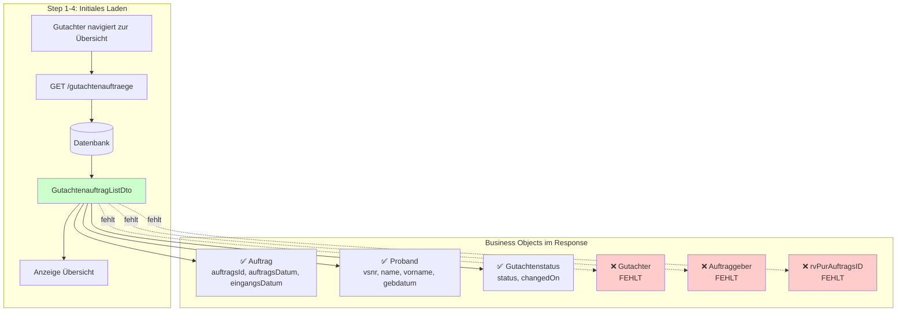
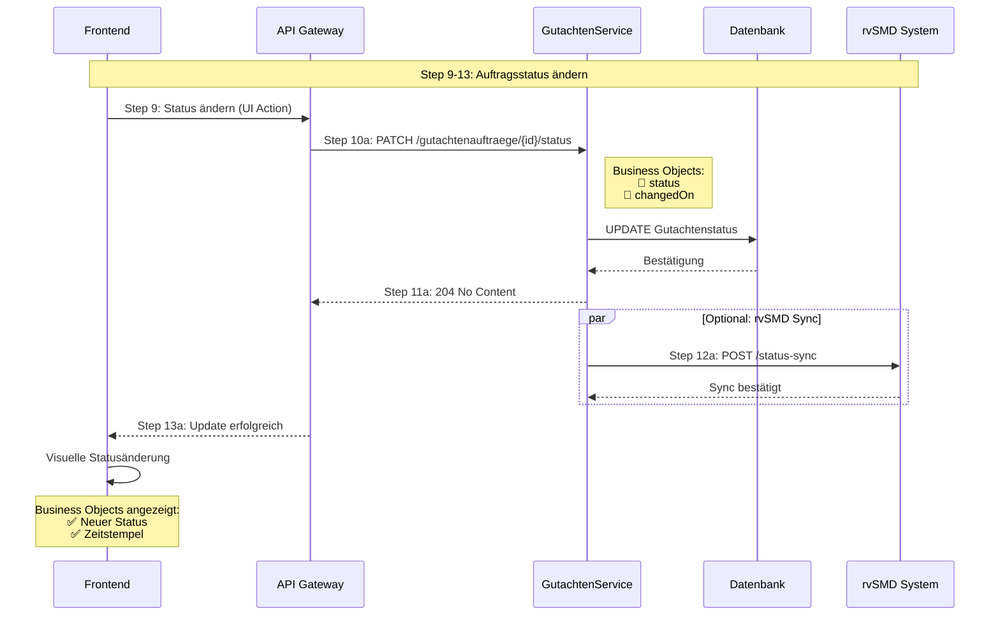
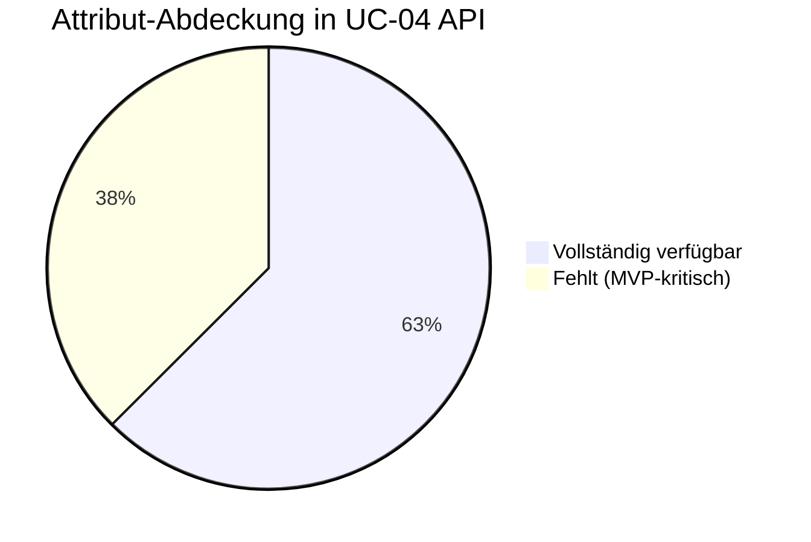
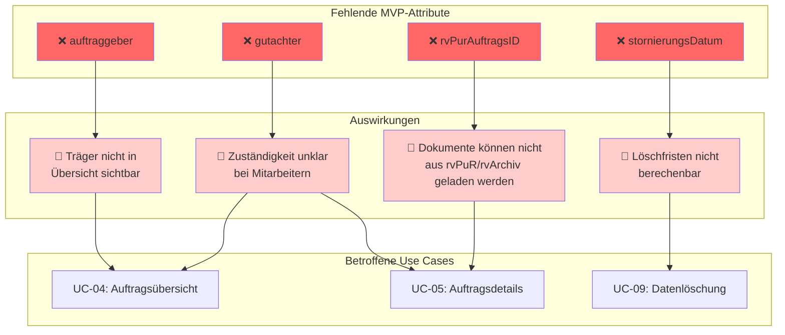
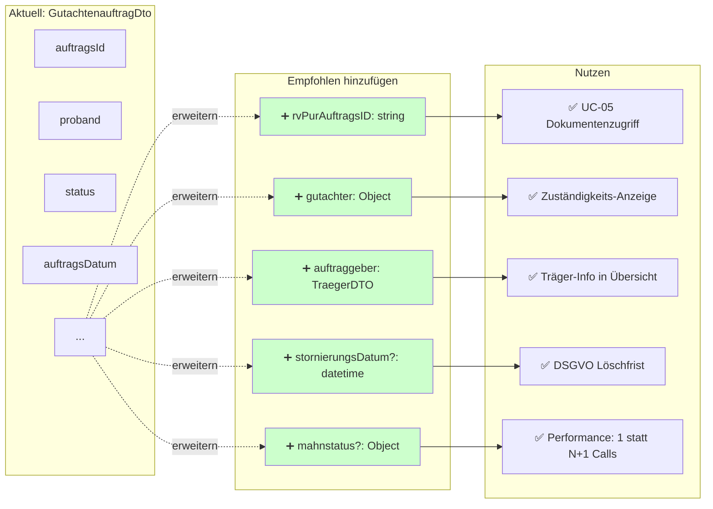
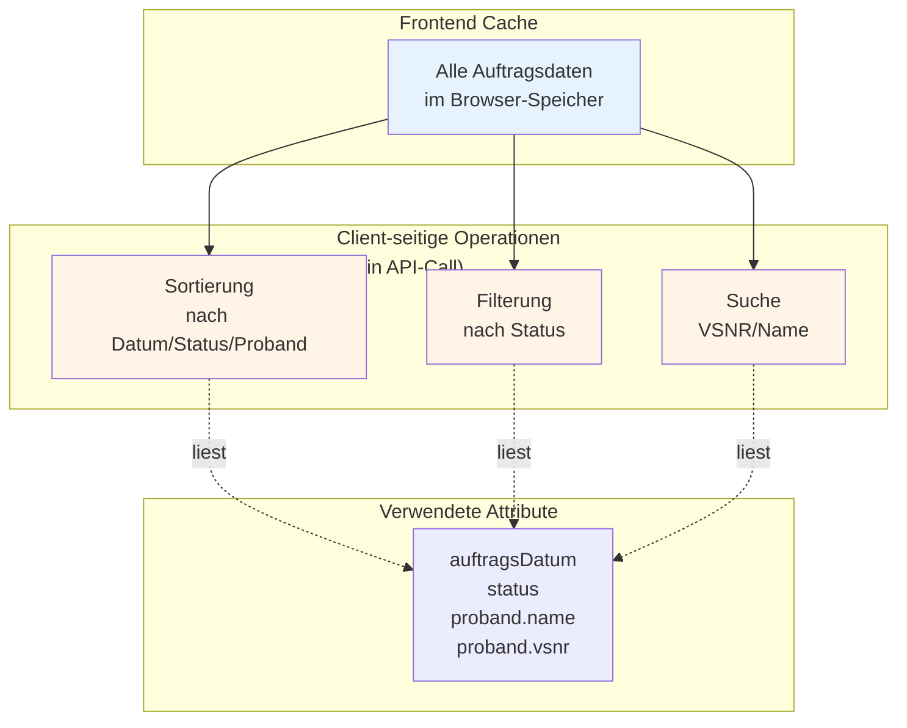

# UC-04: Datenfluss-Rückverfolgbarkeitsmatrix
## Auftragsübersicht und -verwaltung

**Use Case:** UC-04: Auftragsübersicht und -verwaltung  
**Datum:** November 2025  
**Zweck:** Rückverfolgbarkeit der Business Objects und deren Attribute durch alle API-Aufrufe im Sequenzdiagramm

---

## Legende

| Symbol | Bedeutung |
|--------|-----------|
| 🔍 | **Read** - Daten werden gelesen/abgefragt |
| 📝 | **Create** - Daten werden erstellt |
| 🔄 | **Update** - Daten werden aktualisiert |
| ✅ | **Display** - Daten werden dem Benutzer angezeigt |
| ⚠️ | **Validate** - Daten werden validiert/geprüft |
| 🔒 | **Check** - Berechtigungsprüfung |
| - | Nicht beteiligt in diesem Schritt |

---

## Sequenzschritte zu API-Aufrufen Mapping

| Schritt | Aktion | API Aufruf | Methode |
|---------|--------|------------|---------|
| 1 | Zur Auftragsübersicht navigieren | - | Frontend Navigation |
| 2 | Benutzer-authentifizierte Aufträge laden | `GET /gutachtenauftraege?userId={id}` | GET |
| 3 | Alle zugewiesenen Aufträge zurückgeben | Response: `GutachtenauftragListDto` | - |
| 4a/b | Übersicht anzeigen | - | Frontend Rendering |
| 5a | Auto-Refresh Trigger | - | Frontend Timer |
| 6a | Aktualisierte Daten abfragen | `GET /gutachtenauftraege?userId={id}` | GET |
| 7a | Neue/geänderte Aufträge | Response: `GutachtenauftragListDto` | - |
| 8a | Dashboard aktualisieren | - | Frontend Update |
| 5b-7b | Client-seitige Sortierung | - | Frontend Operation |
| 5c-7c | Client-seitiger Filter | - | Frontend Operation |
| 5d-7d | Lokale Suche | - | Frontend Operation |
| 9 | Auftragsstatus ändern (UI) | - | Frontend Action |
| 10a | Status aktualisieren | `PATCH /gutachtenauftraege/{id}/status` | PATCH |
| 11a | Update bestätigt | Response: 204 No Content | - |
| 12a | Status-Sync zu rvSMD | `POST /rvsmd/status-sync` | POST |
| 13a | Visuelle Statusänderung | - | Frontend Update |
| 14a | Mahnung hervorheben | - | Frontend Rendering |
| 15 | Mahndetails anzeigen | - | Frontend Action |
| 16 | Mahnungsinformationen laden | `GET /gutachtenauftraege/{id}/mahnungen` | GET |
| 17 | Mahnstufe + Fristdaten | Response: `MahnungDto[]` | - |
| 18 | Detaillierte Mahninformationen | - | Frontend Display |

---

## Datenfluss-Matrix: Business Objects × API-Schritte

### Auftrag Business Object

| Attribut | Typ | MVP | Step 2: GET Orders | Step 3: Response | Step 4b: Display | Step 6a: Refresh | Step 7a: Response | Step 10a: Update Status | Step 16: GET Warnings | Step 17: Response |
|----------|-----|-----|-------------------|------------------|------------------|------------------|-------------------|------------------------|----------------------|-------------------|
| **auftragsId** | uuid | 1 | 🔍 | ✅ | ✅ | 🔍 | ✅ | 🔍 | 🔍 | - |
| **rvPurAuftragsID** | string | 1 | ❌ | ❌ | ❌ | ❌ | ❌ | - | ❌ | - |
| **proband** | Proband | 1 | 🔍 | ✅ | ✅ | 🔍 | ✅ | - | - | - |
| **gutachter** | Gutachter | 1 | ❌ | ❌ | ❌ | ❌ | ❌ | - | ❌ | - |
| **kennzeichen1** | string | - | 🔍 | ✅ | ✅ | 🔍 | ✅ | - | - | - |
| **kennzeichen2** | string | - | 🔍 | ✅ | ✅ | 🔍 | ✅ | - | - | - |
| **gutachtenstatus** | Gutachtenstatus | 1 | 🔍 | ✅ | ✅ | 🔍 | ✅ | 🔄 | - | - |
| **anhang** | Document[] | 1 | 🔍 | ✅ | - | 🔍 | ✅ | - | - | - |
| **gutachten** | Gutachten | - | 🔍 | ✅ | - | 🔍 | ✅ | - | - | - |
| **auftraggeber** | Träger | 1 | ❌ | ❌ | ❌ | ❌ | ❌ | - | ❌ | - |
| **auftragsDatum** | date | 1 | 🔍 | ✅ | ✅ | 🔍 | ✅ | - | - | - |
| **eingangsDatum** | datetime | 1 | 🔍 | ✅ | ✅ | 🔍 | ✅ | - | - | - |
| **stornierungsDatum** | datetime | 1 | ❌ | ❌ | ❌ | ❌ | ❌ | - | ❌ | - |
| **bereitstellungsDatum** | datetime | - | 🔍 | ✅ | - | 🔍 | ✅ | - | - | - |
| **einbestellDatum** | date | - | 🔍 | ✅ | ✅ | 🔍 | ✅ | - | - | - |
| **dokumente** | Document[] | 1 | 🔍 | ⚠️ | - | 🔍 | ⚠️ | - | - | - |
| **mahnungen** | Mahnung[] | - | ❌ | ❌ | ❌ | ❌ | ❌ | - | 🔍 | ✅ |

**🔴 Kritische Lücken:**
- `rvPurAuftragsID` fehlt in allen Schritten (MVP=1)
- `gutachter` fehlt in allen Schritten (MVP=1)
- `auftraggeber` fehlt in allen Schritten (MVP=1)
- `stornierungsDatum` fehlt in allen Schritten (MVP=1)
- `mahnungen` nur über separaten API-Aufruf verfügbar (nicht in Hauptdaten)

---

### Proband Business Object

| Attribut | Typ | MVP | Step 2: GET Orders | Step 3: Response | Step 4b: Display | Step 6a: Refresh | Step 7a: Response |
|----------|-----|-----|-------------------|------------------|------------------|------------------|-------------------|
| **vsnr** | string | 1 | 🔍 | ✅ | ✅ | 🔍 | ✅ |
| **gebdatum** | date | 1 | 🔍 | ✅ | - | 🔍 | ✅ |
| **name** | string | 1 | 🔍 | ✅ | ✅ | 🔍 | ✅ |
| **vorname** | string | 1 | 🔍 | ✅ | ✅ | 🔍 | ✅ |
| **contacts** | Kontakt[] | - | 🔍 | ✅ | - | 🔍 | ✅ |
| **adresse** | Adresse | - | 🔍 | ✅ | - | 🔍 | ✅ |

**Anmerkung:** Proband-Daten werden als Teil des `GutachtenauftragDto` übertragen via nested `ProbandDto`.

---

### Gutachtenstatus Business Object

| Attribut | Typ | MVP | Step 2: GET Orders | Step 3: Response | Step 4b: Display | Step 10a: Update Status | Step 11a: Confirm |
|----------|-----|-----|-------------------|------------------|------------------|------------------------|-------------------|
| **status** | enum | 1 | 🔍 | ✅ | ✅ | 🔄 | ✅ |
| **changedOn** | timestamp | 1 | 🔍 | ✅ | - | 📝 | ✅ |

**Enum-Werte:** `neu`, `einbestellt`, `in Bearbeitung`, `abgeschlossen`, `storniert`, `Stellungnahme angefordert`

---

### Mahnung Business Object

| Attribut | Typ | MVP | Step 14a: Display Icon | Step 16: GET Warnings | Step 17: Response | Step 18: Display Details |
|----------|-----|-----|----------------------|----------------------|-------------------|-------------------------|
| **gemahntAm** | datetime | - | - | 🔍 | ✅ | ✅ |
| **nummerDerMahnung** | number | - | - | 🔍 | ✅ | ✅ |
| **inhalt** | string | - | - | 🔍 | ✅ | ✅ |

**🔴 Problem:** Mahnungen sind nicht im `GutachtenauftragDto` enthalten, sondern erfordern einen separaten API-Aufruf.

---

### Gutachter Business Object (implizit über Authentication)

| Attribut | Typ | MVP | Step 2: GET Orders (Query Param) | Bemerkung |
|----------|-----|-----|----------------------------------|-----------|
| **userId** | uuid | 1 | 🔒 | Via X-UserId Header/Token |
| **name** | Name | 1 | - | Nicht in Response, nur für Authentifizierung |

**Anmerkung:** Gutachter-Kontext wird via Authentication Header (`X-UserId`, `X-GutachterId`) übertragen, aber Gutachter-Details sind nicht Teil der Auftragsdaten.

---

## API-Endpunkte Übersicht

### 1. Aufträge laden (Initial & Refresh)
```
GET /api/v1/gutachtenauftraege
Headers:
  X-UserId: {userId}
  X-OrgId: {orgId}
  X-GutachterId: {gutachterId}
Query Parameters:
  offset: 0
  limit: 100
Response: GutachtenauftragListDto
```

**Gelieferte Business Objects:**
- ✅ Auftrag (teilweise - siehe kritische Lücken)
- ✅ Proband (vollständig)
- ✅ Gutachtenstatus (vollständig)
- ⚠️ Dokumente (nur Metadaten via `anhaenge`)
- ❌ Mahnungen (nicht enthalten)
- ❌ Gutachter (nicht enthalten)
- ❌ Auftraggeber/Träger (nicht enthalten)

### 2. Status aktualisieren
```
PATCH /api/v1/gutachtenauftraege/{auftragsId}/status
Headers:
  X-UserId: {userId}
  X-OrgId: {orgId}
  X-GutachterId: {gutachterId}
Body: {
  "status": "in Bearbeitung",
  "changedOn": "2025-11-11T14:30:00Z"
}
Response: 204 No Content
```

**Aktualisierte Business Objects:**
- 🔄 Gutachtenstatus.status
- 🔄 Gutachtenstatus.changedOn

### 3. Mahnungen laden
```
GET /api/v1/gutachtenauftraege/{auftragsId}/mahnungen
Headers:
  X-UserId: {userId}
  X-OrgId: {orgId}
  X-GutachterId: {gutachterId}
Response: MahnungDto[]
```

**Gelieferte Business Objects:**
- ✅ Mahnung[] (vollständig)

### 4. Status-Sync zu rvSMD (External)
```
POST /rvsmd/status-sync
Body: {
  "auftragsId": "{id}",
  "status": "in Bearbeitung",
  "timestamp": "2025-11-11T14:30:00Z"
}
```

---

## Datenfluss-Analyse

### Client-seitige Operationen (Kein API-Aufruf)

| Schritt | Operation | Betroffene Attribute |
|---------|-----------|---------------------|
| 5b-7b | Sortierung | `auftragsDatum`, `status`, `proband.name`, `proband.vsnr` |
| 5c-7c | Filterung | `status` |
| 5d-7d | Suche | `proband.vsnr`, `proband.name`, `proband.vorname` |

**Frontend-Cache:** Alle Auftragsdaten werden im Frontend zwischengespeichert für schnelle Client-seitige Operationen.

---

## Kritische Findings

### 1. Fehlende MVP-Attribute in API

| Business Object | Attribut | MVP | Auswirkung auf UC-04 |
|----------------|----------|-----|---------------------|
| Auftrag | rvPurAuftragsID | 1 | ❌ Dokumente aus rvPuR/rvArchiv können nicht zugeordnet werden |
| Auftrag | gutachter | 1 | ❌ Zuständiger Gutachter nicht sichtbar (nur implizit via Auth) |
| Auftrag | auftraggeber | 1 | ❌ Beauftragender Träger nicht in Übersicht sichtbar |
| Auftrag | stornierungsDatum | 1 | ❌ Löschfrist-Berechnung nicht möglich |

### 2. Fragmentierte Daten

**Problem:** Mahnungen sind nicht Teil der Hauptdaten
- Erfordert separaten API-Aufruf für jedes gemahnte Auftrags-Detail
- Performanz-Problem bei vielen gemahnten Aufträgen
- Komplexere Frontend-Logik

**Empfehlung:**
```typescript
// Entweder: Mahnstufe im Hauptobjekt
GutachtenauftragDto {
  ...
  mahnstatus: {
    gemahnt: boolean,
    stufe: number,
    letztesMahndatum: datetime
  }
}

// Oder: Vollständige Mahnungen optional includen
GET /gutachtenauftraege?includeMahnungen=true
```

### 3. Fehlende Gutachter-Referenz

**Problem:** Auftrag enthält keine Gutachter-Informationen
- Bei Mitarbeitern: Welcher Gutachter ist zuständig?
- Bei Admin-Ansicht: Wer bearbeitet den Auftrag?

**Empfehlung:**
```typescript
GutachtenauftragDto {
  ...
  gutachter: {
    userId: uuid,
    name: string,
    efn: string
  }
}
```

---

## Vollständigkeits-Prüfung

### Für UC-04 benötigte Daten

| Anforderung | Business Object | Attribut | Status | Quelle |
|-------------|----------------|----------|--------|---------|
| Aufträge filtern nach Status | Gutachtenstatus | status | ✅ | Step 2-3 |
| Aufträge sortieren nach Datum | Auftrag | auftragsDatum | ✅ | Step 2-3 |
| Proband identifizieren | Proband | vsnr, name, vorname | ✅ | Step 2-3 |
| Mahnung anzeigen | Mahnung | nummerDerMahnung | ⚠️ | Separater Call (Step 16-17) |
| Status ändern | Gutachtenstatus | status, changedOn | ✅ | Step 10a-11a |
| Stornierte Aufträge kennzeichnen | Auftrag | stornierungsDatum | ❌ | Nicht verfügbar |
| Träger anzeigen | Auftrag | auftraggeber | ❌ | Nicht verfügbar |
| Dokumente zuordnen | Auftrag | rvPurAuftragsID | ❌ | Nicht verfügbar |

**Abdeckung:** 5/8 Anforderungen vollständig erfüllt (62.5%)  
**Kritische Lücken:** 3/8 (37.5%)

---

## Empfehlungen

### Sofortmaßnahmen (MVP)

1. **GutachtenauftragDto erweitern:**
   ```typescript
   {
     rvPurAuftragsID: string,  // für Dokumentenzuordnung
     gutachter: {               // für Zuständigkeit
       userId: uuid,
       name: string
     },
     auftraggeber: {            // für Trägerinformation
       ktan: string,
       name: string
     },
     stornierungsDatum?: datetime, // für Löschfrist
     mahnstatus?: {            // für Performance
       gemahnt: boolean,
       stufe: number
     }
   }
   ```

2. **API-Performance optimieren:**
   - Mahnungen als optionales Include: `?includeMahnungen=true`
   - Pagination verbessern für große Datenmengen
   - Caching-Header für Auto-Refresh optimieren

### Mittelfristig

1. **GraphQL-Alternative erwägen:**
   - Flexible Datenabfrage je nach View-Anforderung
   - Reduziert Over-fetching und Under-fetching

2. **Audit-Trail vervollständigen:**
   - Status-History direkt im Auftrag
   - Wer hat Status wann geändert

---

## Visuelle Datenfluss-Diagramme

### Datenfluss-Übersicht: Hauptpfad



### Datenfluss: Status-Update



### Datenfluss: Mahnungen (Fragmentiert)

```mermaid
graph LR
    subgraph "Problem: Separater API-Call"
        UI1[Auftragsübersicht geladen]
        UI2{Mahnung<br/>vorhanden?}
        UI3[Icon anzeigen]
        UI4[User klickt Details]
        API2[GET /gutachtenauftraege/{id}/mahnungen]
        DB2[(Datenbank)]
        RESP2[MahnungDto Array]
        UI5[Details anzeigen]
        
        UI1 --> UI2
        UI2 -->|Ja| UI3
        UI3 --> UI4
        UI4 --> API2
        API2 --> DB2
        DB2 --> RESP2
        RESP2 --> UI5
        
        UI2 -->|Nein| UI6[Keine Mahnung]
    end
    
    subgraph "⚠️ Performance-Problem"
        PERF1[N Aufträge mit Mahnung<br/>= N separate API-Calls]
        PERF2[Langsame Detailansicht]
    end
    
    RESP2 -.-> PERF1
    PERF1 -.-> PERF2
    
    style PERF1 fill:#ffeecc
    style PERF2 fill:#ffcccc
```

### Business Object Vollständigkeit



### Kritische Datenlücken: Auswirkungsanalyse



### Empfohlene API-Erweiterung



### Datenfluss: Client-seitige Operationen



---

## Zusammenfassung

**Dokumentiert:**
- ✅ 23 Sequenzschritte mit API-Mappings
- ✅ 4 Haupt-Business-Objects (Auftrag, Proband, Gutachtenstatus, Mahnung)
- ✅ 3 API-Endpunkte analysiert
- ✅ Client-seitige Operationen identifiziert

**Kritische Findings:**
- 🔴 4 MVP-Attribute fehlen in APIs
- 🔴 Fragmentierte Datenzugriffe (Mahnungen)
- 🔴 Fehlende Gutachter-Referenz

**Nächste Schritte:**
1. ⏳ API-Spezifikation aktualisieren
2. ⏳ Tickets für fehlende Attribute erstellen
3. ⏳ Performance-Tests für Auto-Refresh durchführen
4. ⏳ UC-05 Traceability Matrix erstellen

---

**Letzte Aktualisierung:** November 2025  
**Status:** Vollständig für UC-04  
**Reviewer:** [TBD]
