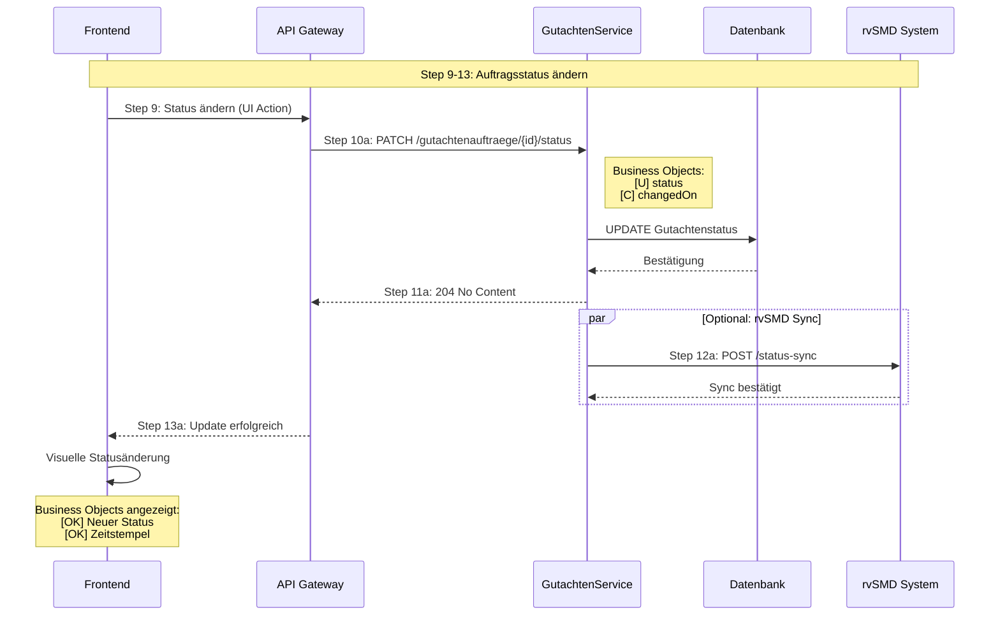

# UC-04: Datenfluss-Rückverfolgbarkeitsmatrix
## Auftragsübersicht und -verwaltung

**Use Case:** UC-04: Auftragsübersicht und -verwaltung  
**Datum:** November 2025  
**Zweck:** Rückverfolgbarkeit der Business Objects und deren Attribute durch alle API-Aufrufe im Sequenzdiagramm

---

## Legende

| Symbol | Bedeutung |
|--------|-----------|
| [R] | **Read** - Daten werden gelesen/abgefragt |
| [C] | **Create** - Daten werden erstellt |
| [U] | **Update** - Daten werden aktualisiert |
| [OK] | **Display** - Daten werden dem Benutzer angezeigt |
| [WARN] | **Validate** - Daten werden validiert/geprüft |
| [AUTH] | **Check** - Berechtigungsprüfung |
| - | Nicht beteiligt in diesem Schritt |

---

## Sequenzschritte zu API-Aufrufen Mapping

| Schritt | Aktion | API Aufruf | Methode |
|---------|--------|------------|---------|
| 1 | Zur Auftragsübersicht navigieren | - | Frontend Navigation |
| 2 | Benutzer-authentifizierte Aufträge laden | `GET /gutachtenauftraege?userId={id}` | GET |
| 3 | Alle zugewiesenen Aufträge zurückgeben | Response: `GutachtenauftragListDto` | - |
| 4a/b | Übersicht anzeigen | - | Frontend Rendering |
| 5a | Auto-Refresh Trigger | - | Frontend Timer |
| 6a | Aktualisierte Daten abfragen | `GET /gutachtenauftraege?userId={id}` | GET |
| 7a | Neue/geänderte Aufträge | Response: `GutachtenauftragListDto` | - |
| 8a | Dashboard aktualisieren | - | Frontend Update |
| 5b-7b | Client-seitige Sortierung | - | Frontend Operation |
| 5c-7c | Client-seitiger Filter | - | Frontend Operation |
| 5d-7d | Lokale Suche | - | Frontend Operation |
| 9 | Auftragsstatus ändern (UI) | - | Frontend Action |
| 10a | Status aktualisieren | `PATCH /gutachtenauftraege/{id}/status` | PATCH |
| 11a | Update bestätigt | Response: 204 No Content | - |
| 12a | Status-Sync zu rvSMD | `POST /rvsmd/status-sync` | POST |
| 13a | Visuelle Statusänderung | - | Frontend Update |
| 14a | Mahnung hervorheben | - | Frontend Rendering |
| 15 | Mahndetails anzeigen | - | Frontend Action |
| 16 | Mahnungsinformationen laden | `GET /gutachtenauftraege/{id}/mahnungen` | GET |
| 17 | Mahnstufe + Fristdaten | Response: `MahnungDto[]` | - |
| 18 | Detaillierte Mahninformationen | - | Frontend Display |

---

## Datenfluss-Matrix: Business Objects × API-Schritte

### Auftrag Business Object

| Attribut | Typ | MVP | Step 2: GET Orders | Step 3: Response | Step 4b: Display | Step 6a: Refresh | Step 7a: Response | Step 10a: Update Status | Step 16: GET Warnings | Step 17: Response |
|----------|-----|-----|-------------------|------------------|------------------|------------------|-------------------|------------------------|----------------------|-------------------|
| **auftragsId** | uuid | 1 | [R] | [OK] | [OK] | [R] | [OK] | [R] | [R] | - |
| **rvPurAuftragsID** | string | ? | [NO] | [NO] | [NO] | [NO] | [NO] | - | [NO] | - |
| **proband** | Proband | 1 | [R] | [OK] | [OK] | [R] | [OK] | - | - | - |
| **gutachter** | Gutachter | 1 | [NO] | [NO] | [NO] | [NO] | [NO] | - | [NO] | - |
| **kennzeichen1** | string | - | [R] | [OK] | [OK] | [R] | [OK] | - | - | - |
| **kennzeichen2** | string | - | [R] | [OK] | [OK] | [R] | [OK] | - | - | - |
| **gutachtenstatus** | Gutachtenstatus | 1 | [R] | [OK] | [OK] | [R] | [OK] | [U] | - | - |
| **anhang** | Document[] | 1 | [R] | [OK] | - | [R] | [OK] | - | - | - |
| **gutachten** | Gutachten | - | [R] | [OK] | - | [R] | [OK] | - | - | - |
| **auftraggeber** | Träger | 1 | [NO] | [NO] | [NO] | [NO] | [NO] | - | [NO] | - |
| **auftragsDatum** | date | 1 | [R] | [OK] | [OK] | [R] | [OK] | - | - | - |
| **eingangsDatum** | datetime | 1 | [R] | [OK] | [OK] | [R] | [OK] | - | - | - |
| **stornierungsDatum** | datetime | 1 | [NO] | [NO] | [NO] | [NO] | [NO] | - | [NO] | - |
| **bereitstellungsDatum** | datetime | - | [R] | [OK] | - | [R] | [OK] | - | - | - |
| **einbestellDatum** | date | - | [R] | [OK] | [OK] | [R] | [OK] | - | - | - |
| **dokumente** | Document[] | 1 | [R] | [WARN] | - | [R] | [WARN] | - | - | - |
| **mahnungen** | Mahnung[] | - | [NO] | [NO] | [NO] | [NO] | [NO] | - | [R] | [OK] |

**[CRIT] Kritische Lücken:**
- `rvPurAuftragsID` fehlt in allen Schritten (MVP optional, nur Backend-Nutzung)
- `gutachter` fehlt in allen Schritten (MVP=1)
- `auftraggeber` fehlt in allen Schritten (MVP=1)
- `stornierungsDatum` fehlt in allen Schritten (MVP optional)
- `mahnungen` nur über separaten API-Aufruf verfügbar (nicht in Hauptdaten)

---

### Proband Business Object

| Attribut | Typ | MVP | Step 2: GET Orders | Step 3: Response | Step 4b: Display | Step 6a: Refresh | Step 7a: Response |
|----------|-----|-----|-------------------|------------------|------------------|------------------|-------------------|
| **vsnr** | string | 1 | [R] | [OK] | [OK] | [R] | [OK] |
| **gebdatum** | date | 1 | [R] | [OK] | - | [R] | [OK] |
| **name** | string | 1 | [R] | [OK] | [OK] | [R] | [OK] |
| **vorname** | string | 1 | [R] | [OK] | [OK] | [R] | [OK] |
| **contacts** | Kontakt[] | - | [R] | [OK] | - | [R] | [OK] |
| **adresse** | Adresse | - | [R] | [OK] | - | [R] | [OK] |

**Anmerkung:** Proband-Daten werden als Teil des `GutachtenauftragDto` übertragen via nested `ProbandDto`.

---

### Gutachtenstatus Business Object

| Attribut | Typ | MVP | Step 2: GET Orders | Step 3: Response | Step 4b: Display | Step 10a: Update Status | Step 11a: Confirm |
|----------|-----|-----|-------------------|------------------|------------------|------------------------|-------------------|
| **status** | enum | 1 | [R] | [OK] | [OK] | [U] | [OK] |
| **changedOn** | timestamp | 1 | [R] | [OK] | - | [C] | [OK] |

**Enum-Werte:** `neu`, `einbestellt`, `in Bearbeitung`, `abgeschlossen`, `storniert`, `Stellungnahme angefordert`

---

### Mahnung Business Object

| Attribut | Typ | MVP | Step 14a: Display Icon | Step 16: GET Warnings | Step 17: Response | Step 18: Display Details |
|----------|-----|-----|----------------------|----------------------|-------------------|-------------------------|
| **gemahntAm** | datetime | - | - | [R] | [OK] | [OK] |
| **nummerDerMahnung** | number | - | - | [R] | [OK] | [OK] |
| **inhalt** | string | - | - | [R] | [OK] | [OK] |

**[CRIT] Problem:** Mahnungen sind nicht im `GutachtenauftragDto` enthalten, sondern erfordern einen separaten API-Aufruf.

---

### Gutachter Business Object (implizit über Authentication)

| Attribut | Typ | MVP | Step 2: GET Orders (Query Param) | Bemerkung |
|----------|-----|-----|----------------------------------|-----------|
| **userId** | uuid | 1 | [AUTH] | Via X-UserId Header/Token |
| **name** | Name | 1 | - | Nicht in Response, nur für Authentifizierung |

**Anmerkung:** Gutachter-Kontext wird via Authentication Header (`X-UserId`, `X-GutachterId`) übertragen, aber Gutachter-Details sind nicht Teil der Auftragsdaten.

---

## API-Endpunkte Übersicht

### 1. Aufträge laden (Initial & Refresh)
```
GET /api/v1/gutachtenauftraege
Headers:
  X-UserId: {userId}
  X-OrgId: {orgId}
  X-GutachterId: {gutachterId}
Query Parameters:
  offset: 0
  limit: 100
Response: GutachtenauftragListDto
```

**Gelieferte Business Objects:**
- [OK] Auftrag (teilweise - siehe kritische Lücken)
- [OK] Proband (vollständig)
- [OK] Gutachtenstatus (vollständig)
- [WARN] Dokumente (nur Metadaten via `anhaenge`)
- [NO] Mahnungen (nicht enthalten)
- [NO] Gutachter (nicht enthalten)
- [NO] Auftraggeber/Träger (nicht enthalten)

### 2. Status aktualisieren
```
PATCH /api/v1/gutachtenauftraege/{auftragsId}/status
Headers:
  X-UserId: {userId}
  X-OrgId: {orgId}
  X-GutachterId: {gutachterId}
Body: {
  "status": "in Bearbeitung",
  "changedOn": "2025-11-11T14:30:00Z"
}
Response: 204 No Content
```

**Aktualisierte Business Objects:**
- [U] Gutachtenstatus.status
- [U] Gutachtenstatus.changedOn

### 3. Mahnungen laden
```
GET /api/v1/gutachtenauftraege/{auftragsId}/mahnungen
Headers:
  X-UserId: {userId}
  X-OrgId: {orgId}
  X-GutachterId: {gutachterId}
Response: MahnungDto[]
```

**Gelieferte Business Objects:**
- [OK] Mahnung[] (vollständig)

### 4. Status-Sync zu rvSMD (External)
```
POST /rvsmd/status-sync
Body: {
  "auftragsId": "{id}",
  "status": "in Bearbeitung",
  "timestamp": "2025-11-11T14:30:00Z"
}
```

---

## Datenfluss-Analyse

### Client-seitige Operationen (Kein API-Aufruf)

| Schritt | Operation | Betroffene Attribute |
|---------|-----------|---------------------|
| 5b-7b | Sortierung | `auftragsDatum`, `status`, `proband.name`, `proband.vsnr` |
| 5c-7c | Filterung | `status` |
| 5d-7d | Suche | `proband.vsnr`, `proband.name`, `proband.vorname` |

**Frontend-Cache:** Alle Auftragsdaten werden im Frontend zwischengespeichert für schnelle Client-seitige Operationen.

---

## Kritische Findings

### 1. Fehlende MVP-Attribute in API

| Business Object | Attribut | MVP | Auswirkung auf UC-04 |
|----------------|----------|-----|---------------------|
| Auftrag | rvPurAuftragsID | ? | [NO] Backend: Dokumente aus rvPuR/rvArchiv können nicht zugeordnet werden (optional) |
| Auftrag | gutachter | 1 | [NO] Zuständiger Gutachter nicht sichtbar (nur implizit via Auth) |
| Auftrag | auftraggeber | 1 | [NO] Beauftragender Träger nicht in Übersicht sichtbar |
| Auftrag | stornierungsDatum | 1 | [NO] Löschfrist-Berechnung nicht möglich |

### 2. Fragmentierte Daten

**Problem:** Mahnungen sind nicht Teil der Hauptdaten
- Erfordert separaten API-Aufruf für jedes gemahnte Auftrags-Detail
- Performanz-Problem bei vielen gemahnten Aufträgen
- Komplexere Frontend-Logik

**Empfehlung:**
```typescript
// Entweder: Mahnstufe im Hauptobjekt
GutachtenauftragDto {
  ...
  mahnstatus: {
    gemahnt: boolean,
    stufe: number,
    letztesMahndatum: datetime
  }
}

// Oder: Vollständige Mahnungen optional includen
GET /gutachtenauftraege?includeMahnungen=true
```

### 3. Fehlende Gutachter-Referenz

**Problem:** Auftrag enthält keine Gutachter-Informationen
- Bei Mitarbeitern: Welcher Gutachter ist zuständig?
- Bei Admin-Ansicht: Wer bearbeitet den Auftrag?

**Empfehlung:**
```typescript
GutachtenauftragDto {
  ...
  gutachter: {
    userId: uuid,
    name: string,
    efn: string
  }
}
```

---

## Vollständigkeits-Prüfung

### Für UC-04 benötigte Daten

| Anforderung | Business Object | Attribut | Status | Quelle |
|-------------|----------------|----------|--------|---------|
| Aufträge filtern nach Status | Gutachtenstatus | status | [OK] | Step 2-3 |
| Aufträge sortieren nach Datum | Auftrag | auftragsDatum | [OK] | Step 2-3 |
| Proband identifizieren | Proband | vsnr, name, vorname | [OK] | Step 2-3 |
| Mahnung anzeigen | Mahnung | nummerDerMahnung | [WARN] | Separater Call (Step 16-17) |
| Status ändern | Gutachtenstatus | status, changedOn | [OK] | Step 10a-11a |
| Stornierte Aufträge kennzeichnen | Auftrag | stornierungsDatum | [NO] | Nicht verfügbar |
| Träger anzeigen | Auftrag | auftraggeber | [NO] | Nicht verfügbar |
| Dokumente zuordnen | Auftrag | rvPurAuftragsID | [NO] | Nicht verfügbar |

**Abdeckung:** 5/8 Anforderungen vollständig erfüllt (62.5%)  
**Kritische Lücken:** 3/8 (37.5%)

---

## Empfehlungen

### Sofortmaßnahmen (MVP)

1. **GutachtenauftragDto erweitern:**
   ```typescript
   {
     rvPurAuftragsID: string,  // für Dokumentenzuordnung
     gutachter: {               // für Zuständigkeit
       userId: uuid,
       name: string
     },
     auftraggeber: {            // für Trägerinformation
       ktan: string,
       name: string
     },
     stornierungsDatum?: datetime, // für Löschfrist
     mahnstatus?: {            // für Performance
       gemahnt: boolean,
       stufe: number
     }
   }
   ```

2. **API-Performance optimieren:**
   - Mahnungen als optionales Include: `?includeMahnungen=true`
   - Pagination verbessern für große Datenmengen
   - Caching-Header für Auto-Refresh optimieren

### Mittelfristig

1. **GraphQL-Alternative erwägen:**
   - Flexible Datenabfrage je nach View-Anforderung
   - Reduziert Over-fetching und Under-fetching

2. **Audit-Trail vervollständigen:**
   - Status-History direkt im Auftrag
   - Wer hat Status wann geändert

---

## Visuelle Datenfluss-Diagramme

### Datenfluss-Übersicht: Hauptpfad

```mermaid
graph TB
    subgraph "Step 1-4: Initiales Laden"
        UI1[Gutachter navigiert zur Übersicht]
        API1[GET /gutachtenauftraege]
        DB1[(Datenbank)]
        RESP1[GutachtenauftragListDto]
        UI2[Anzeige Übersicht]
        
        UI1 --> API1
        API1 --> DB1
        DB1 --> RESP1
        RESP1 --> UI2
    end
    
    subgraph "Business Objects im Response"
        BO1[[OK] Auftrag<br/>auftragsId, auftragsDatum, eingangsDatum]
        BO2[[OK] Proband<br/>vsnr, name, vorname, gebdatum]
        BO3[[OK] Gutachtenstatus<br/>status, changedOn]
        BO4[[NO] Gutachter<br/>FEHLT]
        BO5[[NO] Auftraggeber<br/>FEHLT]
        BO6[[NO] rvPurAuftragsID<br/>FEHLT]
        
        RESP1 --> BO1
        RESP1 --> BO2
        RESP1 --> BO3
        RESP1 -.fehlt.-> BO4
        RESP1 -.fehlt.-> BO5
        RESP1 -.fehlt.-> BO6
    end
    
    style BO4 fill:#ffcccc
    style BO5 fill:#ffcccc
    style BO6 fill:#ffcccc
    style RESP1 fill:#ccffcc
```

### Datenfluss: Status-Update



### Datenfluss: Mahnungen (Fragmentiert)

```mermaid
graph LR
    subgraph "Problem: Separater API-Call"
        UI1[Auftragsübersicht geladen]
        UI2{Mahnung<br/>vorhanden?}
        UI3[Icon anzeigen]
        UI4[User klickt Details]
        API2[GET /gutachtenauftraege/{id}/mahnungen]
        DB2[(Datenbank)]
        RESP2[MahnungDto Array]
        UI5[Details anzeigen]
        
        UI1 --> UI2
        UI2 -->|Ja| UI3
        UI3 --> UI4
        UI4 --> API2
        API2 --> DB2
        DB2 --> RESP2
        RESP2 --> UI5
        
        UI2 -->|Nein| UI6[Keine Mahnung]
    end
    
    subgraph "[WARN] Performance-Problem"
        PERF1[N Aufträge mit Mahnung<br/>= N separate API-Calls]
        PERF2[Langsame Detailansicht]
    end
    
    RESP2 -.-> PERF1
    PERF1 -.-> PERF2
    
    style PERF1 fill:#ffeecc
    style PERF2 fill:#ffcccc
```

### Business Object Vollständigkeit


### Kritische Datenlücken: Auswirkungsanalyse

```mermaid
graph TB
    subgraph "Fehlende MVP-Attribute"
        L1[[NO] rvPurAuftragsID]
        L2[[NO] gutachter]
        L3[[NO] auftraggeber]
        L4[[NO] stornierungsDatum]
    end
    
    subgraph "Auswirkungen"
        I1[[X] Dokumente können nicht<br/>aus rvPuR/rvArchiv geladen werden]
        I2[[X] Zuständigkeit unklar<br/>bei Mitarbeitern]
        I3[[X] Träger nicht in<br/>Übersicht sichtbar]
        I4[[X] Löschfristen nicht<br/>berechenbar]
    end
    
    subgraph "Betroffene Use Cases"
        UC1[UC-04: Auftragsübersicht]
        UC2[UC-05: Auftragsdetails]
        UC3[UC-09: Datenlöschung]
    end
    
    L1 --> I1
    L2 --> I2
    L3 --> I3
    L4 --> I4
    
    I1 --> UC2
    I2 --> UC1
    I2 --> UC2
    I3 --> UC1
    I4 --> UC3
    
    style L1 fill:#ff6666
    style L2 fill:#ff6666
    style L3 fill:#ff6666
    style L4 fill:#ff6666
    style I1 fill:#ffcccc
    style I2 fill:#ffcccc
    style I3 fill:#ffcccc
    style I4 fill:#ffcccc
```

### Empfohlene API-Erweiterung

```mermaid
graph LR
    subgraph "Aktuell: GutachtenauftragDto"
        A1[auftragsId]
        A2[proband]
        A3[status]
        A4[auftragsDatum]
        A5[...]
    end
    
    subgraph "Empfohlen hinzufügen"
        N1[[+] rvPurAuftragsID: string]
        N2[[+] gutachter: Object]
        N3[[+] auftraggeber: TraegerDTO]
        N4[[+] stornierungsDatum?: datetime]
        N5[[+] mahnstatus?: Object]
    end
    
    subgraph "Nutzen"
        B1[[OK] UC-05 Dokumentenzugriff]
        B2[[OK] Zuständigkeits-Anzeige]
        B3[[OK] Träger-Info in Übersicht]
        B4[[OK] DSGVO Löschfrist]
        B5[[OK] Performance: 1 statt N+1 Calls]
    end
    
    A5 -.erweitern.-> N1
    A5 -.erweitern.-> N2
    A5 -.erweitern.-> N3
    A5 -.erweitern.-> N4
    A5 -.erweitern.-> N5
    
    N1 --> B1
    N2 --> B2
    N3 --> B3
    N4 --> B4
    N5 --> B5
    
    style N1 fill:#ccffcc
    style N2 fill:#ccffcc
    style N3 fill:#ccffcc
    style N4 fill:#ccffcc
    style N5 fill:#ccffcc
```

### Datenfluss: Client-seitige Operationen


---

## Zusammenfassung

**Dokumentiert:**
- [OK] 23 Sequenzschritte mit API-Mappings
- [OK] 4 Haupt-Business-Objects (Auftrag, Proband, Gutachtenstatus, Mahnung)
- [OK] 3 API-Endpunkte analysiert
- [OK] Client-seitige Operationen identifiziert

**Kritische Findings:**
- [CRIT] 4 MVP-Attribute fehlen in APIs
- [CRIT] Fragmentierte Datenzugriffe (Mahnungen)
- [CRIT] Fehlende Gutachter-Referenz

**Nächste Schritte:**
1. [TODO] API-Spezifikation aktualisieren
2. [TODO] Tickets für fehlende Attribute erstellen
3. [TODO] Performance-Tests für Auto-Refresh durchführen
4. [TODO] UC-05 Traceability Matrix erstellen

---

**Letzte Aktualisierung:** November 2025  
**Status:** Vollständig für UC-04  
**Reviewer:** [TBD]
