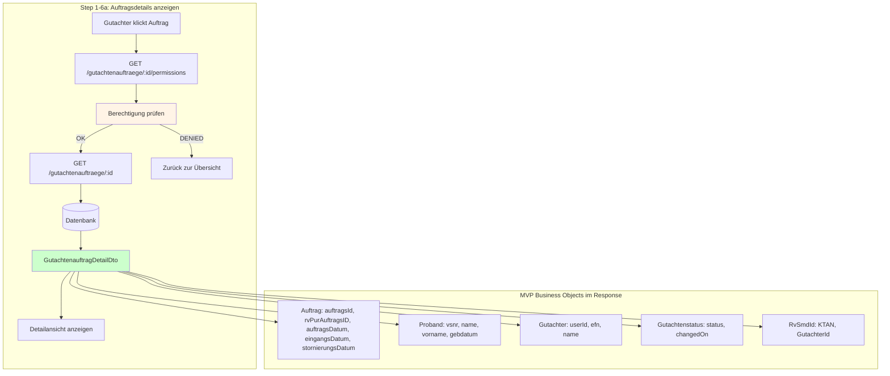
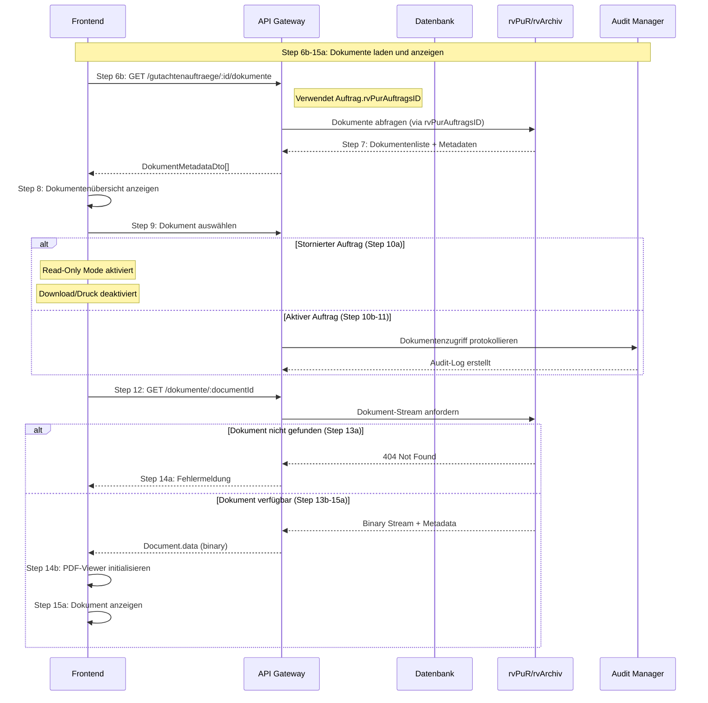
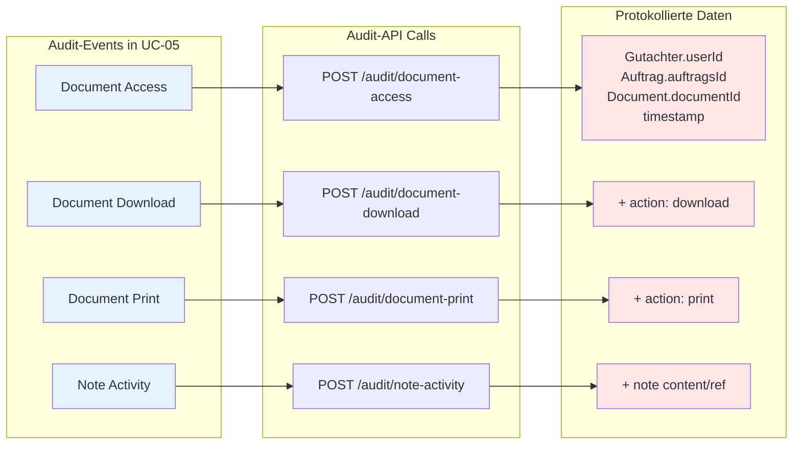
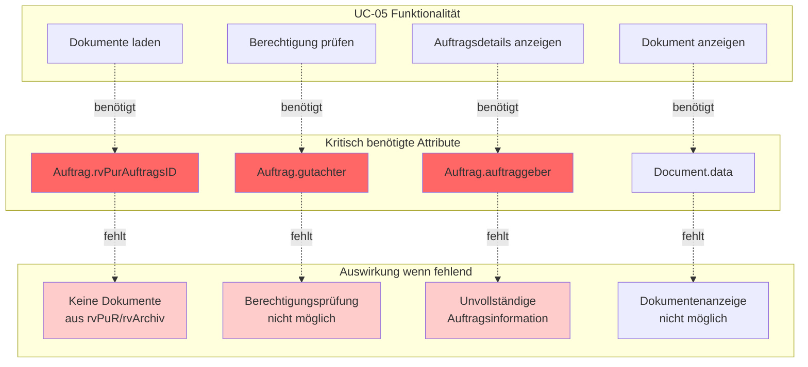

# UC-05: Datenfluss-Rückverfolgbarkeitsmatrix
## Auftragsdetails und Dokumenteneinsicht

**Use Case:** UC-05: Auftragsdetails und Dokumenteneinsicht  
**Datum:** November 2025  
**Zweck:** Rückverfolgbarkeit der MVP Business Objects und deren Attribute durch alle API-Aufrufe im Sequenzdiagramm

---

## Legende

| Symbol | Bedeutung |
|--------|-----------|
| [R] | **Read** - Daten werden gelesen/abgefragt |
| [C] | **Create** - Daten werden erstellt |
| [U] | **Update** - Daten werden aktualisiert |
| [D] | **Delete** - Daten werden gelöscht |
| [OK] | **Display** - Daten werden dem Benutzer angezeigt |
| [WARN] | **Partial** - Daten nur teilweise verfügbar |
| [AUTH] | **Authorization** - Berechtigungsprüfung |
| [AUDIT] | **Audit** - Auditprotokollierung |
| - | Nicht beteiligt in diesem Schritt |

---

## Sequenzschritte zu API-Aufrufen Mapping

| Schritt | Aktion | API Aufruf | Methode | Anmerkung |
|---------|--------|------------|---------|-----------|
| 1 | Auf Auftrag klicken | - | Frontend | Navigation |
| 2 | Auftragsberechtigung prüfen | `GET /gutachtenauftraege/{id}/permissions` | GET | Authorization Check |
| 3 | Berechtigung bestätigt | Response: `PermissionDto` | - | |
| 4a | Berechtigung entzogen | - | Frontend | Error Handling |
| 4b | Erweiterte Infos laden | `GET /gutachtenauftraege/{id}` | GET | Detail View |
| 5 | Auftragsdaten | Response: `GutachtenauftragDetailDto` | - | |
| 6a | Detailansicht anzeigen | - | Frontend | Display |
| 6b | Dokumente abfragen | `GET /gutachtenauftraege/{id}/dokumente` | GET | From rvPuR/rvArchiv |
| 7 | Dokumentenliste | Response: `DokumentDto[]` | - | Metadata |
| 8 | Dokumentenübersicht | - | Frontend | Display |
| 9 | Dokument auswählen | - | Frontend | User Action |
| 10a | Stornierter Auftrag | - | Frontend | Read-Only Mode |
| 10b | Zugriff protokollieren | `POST /audit/document-access` | POST | Audit Log |
| 11 | Audit-Log erstellen | Response: 201 Created | - | |
| 12 | Dokument anfordern | `GET /dokumente/{documentId}` | GET | Binary Stream |
| 13a | Dokument nicht gefunden | Response: 404 Not Found | - | Error |
| 13b | Dokument-Stream | Response: `DocumentStreamDto` | - | Binary + Metadata |
| 14a | Fehlermeldung | - | Frontend | Error Display |
| 14b | PDF-Viewer init | - | Frontend | Viewer Component |
| 15a | Dokument anzeigen | - | Frontend | PDF Display |
| 15b | Download klicken | - | Frontend | User Action |
| 15c | Drucken klicken | - | Frontend | User Action |
| 16a | Watermark hinzufügen | - | Backend | Processing |
| 16b | Druckversion erstellen | - | Backend | Processing |
| 17a | Download starten | Response: Binary with Headers | - | Download |
| 17b | Druckdialog öffnen | - | Frontend | Print Dialog |
| 18a | Download protokollieren | `POST /audit/document-download` | POST | Audit |
| 18b | Druck protokollieren | `POST /audit/document-print` | POST | Audit |
| 19 | Notiz erstellen/bearbeiten | `PUT /dokumente/{documentId}/note` | PUT | Note Management |
| 20 | Notiz speichern | - | Backend | Database Write |
| 21 | Speicherung bestätigt | Response: 204 No Content | - | |
| 22 | Notiz anzeigen | `GET /dokumente/{documentId}/note` | GET | Display |
| 23 | Notizen-Aktivität protokollieren | `POST /audit/note-activity` | POST | Audit |
| 24 | Zurück-Button | - | Frontend | Navigation |
| 25 | Rückkehr zur Übersicht | - | Frontend | Route Change |
| 26 | Dokumentenzugriffe auditieren | - | Backend | Continuous Audit |
| 27 | Schutz vor unbefugtem Zugriff | - | Backend | Security |
| 28 | Session-Timeout überwachen | - | Backend | Session Management |

---

## Datenfluss-Matrix: Business Objects × API-Schritte (MVP)

### Auftrag Business Object

| Attribut | Typ | Kard | Step 2: Check Auth | Step 4b: Load Details | Step 5: Response | Step 6a: Display | Step 6b: Get Docs | Step 22: Display Note |
|----------|-----|------|-------------------|----------------------|------------------|------------------|-------------------|---------------------|
| **auftragsId** | uuid | 1 | [AUTH] | [R] | [OK] | [OK] | [R] | - |
| **rvPurAuftragsID** | string | ? | - | [R] | - | - | [R] | - |
| **proband** | Proband | 1 | - | [R] | [OK] | [OK] | - | - |
| **gutachter** | Gutachter | 1 | [AUTH] | [R] | [OK] | [OK] | - | - |
| **gutachtenstatus** | Gutachtenstatus | + | - | [R] | [OK] | [OK] | - | - |
| **anhang** | Document | * | - | [R] | [OK] | [OK] | [R] | - |
| **auftraggeber** | Träger | 1 | - | [R] | [OK] | [OK] | - | - |
| **auftragsDatum** | date | 1 | - | [R] | [OK] | [OK] | - | - |
| **eingangsDatum** | datetime | 1 | - | [R] | [OK] | [OK] | - | - |
| **stornierungsDatum** | datetime | ? | - | [R] | [OK] | [OK] | - | - |
| **dokumente** | Document | + | - | [R] | [OK] | [OK] | [R] | - |

**Anmerkung:** Alle MVP-Attribute des Auftrags sind in diesem Use Case erforderlich für die Detailansicht.

---

### Proband Business Object

| Attribut | Typ | Kard | Step 4b: Load Details | Step 5: Response | Step 6a: Display |
|----------|-----|------|----------------------|------------------|------------------|
| **vsnr** | string | 1 | [R] | [OK] | [OK] |
| **gebdatum** | date | 1 | [R] | [OK] | [OK] |
| **name** | string | 1 | [R] | [OK] | [OK] |
| **vorname** | string | 1 | [R] | [OK] | [OK] |

**Anmerkung:** Proband-Daten werden als Teil des `GutachtenauftragDetailDto` übertragen.

---

### Gutachter Business Object

| Attribut | Typ | Kard | Step 2: Check Auth | Step 4b: Load Details | Step 5: Response | Step 6a: Display |
|----------|-----|------|-------------------|----------------------|------------------|------------------|
| **userId** | uuid | 1 | [AUTH] | [R] | [OK] | [OK] |
| **efn** | number | 1 | - | [R] | [OK] | [OK] |
| **anrede** | string | 1 | - | [R] | [OK] | [OK] |
| **titel** | string | ? | - | [R] | [OK] | [OK] |
| **nachname** | string | 1 | - | [R] | [OK] | [OK] |
| **vorname** | string | 1 | - | [R] | [OK] | [OK] |

**Anmerkung:** Gutachter-Daten zeigen, wer für den Auftrag zuständig ist. Wichtig für Berechtigungsprüfung und Anzeige.

---

### Document Business Object

| Attribut | Typ | Kard | Step 6b: Get Docs | Step 7: Response | Step 8: Display | Step 12: Request Doc | Step 13b: Stream | Step 15a: View | Step 15b: Download | Step 18a: Audit | Step 19: Update Note | Step 22: Display Note |
|----------|-----|------|-------------------|------------------|-----------------|----------------------|------------------|----------------|-------------------|-----------------|---------------------|----------------------|
| **documentId** | uuid | 1 | [R] | [OK] | [OK] | [R] | [OK] | [OK] | [OK] | [AUDIT] | [R] | [R] |
| **name** | string | 1 | [R] | [OK] | [OK] | - | [OK] | [OK] | [OK] | - | - | - |
| **filename** | string | 1 | [R] | [OK] | [OK] | - | [OK] | - | [OK] | - | - | - |
| **filetype** | string | 1 | [R] | [OK] | [OK] | - | [OK] | [OK] | [OK] | - | - | - |
| **filesize** | int | ? | [R] | [OK] | [OK] | - | [OK] | - | [OK] | - | - | - |
| **data** | binary | 1 | - | - | - | [R] | [OK] | [OK] | [OK] | - | - | - |
| **metadata** | DocumentMetadata | 1 | [R] | [OK] | [OK] | [R] | [OK] | - | - | - | - | - |
| **note** | DocumentNote | ? | - | - | - | - | [OK] | - | - | - | [U] | [OK] |

**Anmerkung:** Dokument-Daten sind zentral für UC-05. Metadaten werden separat vom Binär-Stream geladen für Performance. Notizen sind pro Dokument gespeichert (DocumentNoteDto mit headline und content als base64).

---

### Gutachtenstatus Business Object

| Attribut | Typ | Kard | Step 4b: Load Details | Step 5: Response | Step 6a: Display | Step 10a: Check Storniert |
|----------|-----|------|----------------------|------------------|------------------|--------------------------|
| **status** | enum | 1 | [R] | [OK] | [OK] | [AUTH] |
| **changedOn** | timestamp | 1 | [R] | [OK] | [OK] | - |

**Enum-Werte:** `neu`, `einbestellt`, `in Bearbeitung`, `abgeschlossen`, `storniert`, `Stellungnahme angefordert`

**Anmerkung:** Status `storniert` führt zu eingeschränkter Funktionalität (nur Einsicht, kein Download/Druck).

---

## API-Endpunkte Übersicht

### 1. Berechtigungsprüfung
```
GET /api/v1/gutachtenauftraege/{auftragsId}/permissions
Headers:
  X-UserId: {userId}
  X-GutachterId: {gutachterId}
Response: PermissionDto {
  canView: boolean,
  canEdit: boolean,
  canDownload: boolean
}
```

**Geprüfte Business Objects:**
- [AUTH] Gutachter.userId
- [AUTH] Auftrag.auftragsId
- [AUTH] Auftrag.gutachter (Zuordnung)

---

### 2. Auftragsdetails laden
```
GET /api/v1/gutachtenauftraege/{auftragsId}
Headers:
  X-UserId: {userId}
  X-GutachterId: {gutachterId}
Response: GutachtenauftragDetailDto
```

**Gelieferte Business Objects:**
- [OK] Auftrag (vollständig MVP)
- [OK] Proband (vollständig MVP)
- [OK] Gutachter (vollständig MVP)
- [OK] Gutachtenstatus (vollständig)
- [OK] RvSmdId (Träger-Zuordnung)

**Kritisch fehlend in UC-04 API, jetzt benötigt:**
- rvPurAuftragsID (für Dokumentenzugriff aus rvPuR/rvArchiv)
- gutachter (für Zuständigkeitsanzeige)
- auftraggeber/Träger (für vollständige Auftragsinformation)
- stornierungsDatum (für UI-Logik: Read-Only Mode)

---

### 3. Dokumente laden
```
GET /api/v1/gutachtenauftraege/{auftragsId}/dokumente
Headers:
  X-UserId: {userId}
  X-GutachterId: {gutachterId}
Query Parameters:
  source: rvPuR | rvArchiv | beide (Standard)
Response: DokumentDto[]
```

**Gelieferte Business Objects:**
- [OK] Document.documentId
- [OK] Document.name
- [OK] Document.filename
- [OK] Document.filetype
- [OK] Document.filesize
- [OK] Document.metadata

**Verwendet:** `Auftrag.rvPurAuftragsID` zur Identifikation in rvPuR/rvArchiv

---

### 4. Einzelnes Dokument abrufen
```
GET /api/v1/dokumente/{documentId}
Headers:
  X-UserId: {userId}
  X-GutachterId: {gutachterId}
Response: Binary Stream
Content-Type: application/pdf | image/jpeg | etc.
Content-Disposition: inline | attachment
```

**Gelieferte Business Objects:**
- [OK] Document.data (binary)
- [OK] Document.metadata (in Headers)

---

### 5. Dokumentenzugriff auditieren
```
POST /api/v1/audit/document-access
Headers:
  X-UserId: {userId}
  X-GutachterId: {gutachterId}
Body: {
  "auftragsId": "{auftragsId}",
  "documentId": "{documentId}",
  "action": "view" | "download" | "print",
  "timestamp": "2025-11-11T14:30:00Z"
}
Response: 201 Created
```

**Protokollierte Business Objects:**
- [AUDIT] Gutachter.userId
- [AUDIT] Auftrag.auftragsId
- [AUDIT] Document.documentId

---

### 6. Notiz erstellen/bearbeiten (pro Dokument)
```
GET /api/v1/dokumente/{documentId}/note
PUT /api/v1/dokumente/{documentId}/note
Headers:
  X-UserId: {userId}
  X-GutachterId: {gutachterId}
  X-OrgId: {orgId}
Body (PUT): {
  "headline": "base64-encoded-headline",
  "content": "base64-encoded-content"
}
Response: 
  GET 200 OK - DocumentNoteDto
  PUT 204 No Content
```

**Anmerkung:** Notizen werden pro Dokument gespeichert (siehe `DocumentNoteDto` in OpenAPI). Headline und Content sind base64-kodiert.

---

## Kritische Findings für UC-05

### 1. Backend-Abhängigkeit von rvPurAuftragsID

**Problem:** Backend benötigt `Auftrag.rvPurAuftragsID` für rvPuR/rvArchiv Integration

| Schritt | Benötigt | Auswirkung ohne rvPurAuftragsID |
|---------|----------|--------------------------------|
| 6b | rvPurAuftragsID | Backend kann Dokumente aus rvPuR/rvArchiv nicht laden |
| 7 | rvPurAuftragsID | Leere Dokumentenliste trotz vorhandener Dokumente |
| 12 | rvPurAuftragsID | Dokumentenzugriff schlägt fehl |

**Status:** [WARN] Backend-seitig erforderlich, Frontend nutzt es nicht (MVP optional)

---

### 2. Gutachter-Zuordnung erforderlich

**Problem:** Berechtigungsprüfung (Step 2) benötigt `Auftrag.gutachter`

| Prüfung | Benötigt | Auswirkung |
|---------|----------|------------|
| Step 2 | Auftrag.gutachter === aktueller Gutachter | Berechtigung kann nicht korrekt geprüft werden |
| Step 10b | Gutachter.userId | Audit-Log unvollständig |

**Status:** [CRIT] Sicherheitsrelevant

---

### 3. Stornierungsstatus für UI-Logik

**Problem:** `Auftrag.stornierungsDatum` bestimmt Funktionalität

| Szenario | Benötigt | Auswirkung |
|----------|----------|------------|
| Step 10a | stornierungsDatum !== null | UI muss Read-Only Mode aktivieren |
| Step 15b/c | stornierungsDatum !== null | Download/Druck sollten deaktiviert sein |

**Status:** [WARN] Funktional wichtig, aber workaround möglich über `status === "storniert"`

---

### 4. Dokumentenmetadaten

**Problem:** Document Business Object hat mehrere Attribute

| Attribut | MVP Kard | Verfügbarkeit | Anmerkung |
|----------|----------|---------------|-----------|
| documentId | 1 | [OK] | Primärschlüssel |
| name | 1 | [OK] | Anzeigename |
| filename | 1 | [OK] | Dateiname |
| filetype | 1 | [OK] | MIME-Type |
| filesize | ? | [WARN] | Optional, aber hilfreich für UI |
| data | 1 | [OK] | Binary, nur bei Stream-Request |
| metadata | 1 | [WARN] | Structure unclear |

**Status:** [WARN] Metadata-Struktur muss definiert werden

---

## Vollständigkeits-Prüfung MVP

### Für UC-05 benötigte MVP-Daten

| Anforderung | Business Object | Attribut | Status | Quelle |
|-------------|----------------|----------|--------|---------|
| Auftrag identifizieren | Auftrag | auftragsId | [OK] | Step 2-5 |
| Dokumente aus rvPuR laden (Backend) | Auftrag | rvPurAuftragsID | [WARN] | Step 6b, 12 (Backend only) |
| Berechtigung prüfen | Gutachter | userId | [OK] | Step 2 |
| Berechtigung prüfen | Auftrag | gutachter | [CRIT] | Step 2 |
| Proband anzeigen | Proband | vsnr, name, vorname, gebdatum | [OK] | Step 5-6a |
| Status prüfen (storniert?) | Gutachtenstatus | status | [OK] | Step 5, 10a |
| Löschfrist berechnen | Auftrag | stornierungsDatum | [WARN] | Optional via status |
| Träger anzeigen | Auftrag | auftraggeber (RvSmdId) | [CRIT] | Step 5-6a |
| Dokumente laden | Document | documentId, name, filename, filetype | [OK] | Step 6b-8 |
| Dokument anzeigen | Document | data | [OK] | Step 12-15a |
| Audit-Log | Gutachter | userId | [OK] | Step 10b-11 |
| Audit-Log | Auftrag | auftragsId | [OK] | Step 10b-11 |
| Audit-Log | Document | documentId | [OK] | Step 10b-11, 18a-b |

**Abdeckung:** 9/13 Anforderungen vollständig erfüllt (69.2%)  
**Kritische Lücken:** 2/13 (15.4%) - gutachter, auftraggeber  
**Warnungen:** 2/13 (15.4%) - rvPurAuftragsID (Backend only), stornierungsDatum

---

## Empfehlungen

### Sofortmaßnahmen (Blockiert UC-05)

1. **GutachtenauftragDetailDto MUSS enthalten:**
   ```typescript
   {
     auftragsId: string,           // [OK] vorhanden
     rvPurAuftragsID: string,      // [CRIT] FEHLT - UC-05 blockiert!
     proband: ProbandDto,          // [OK] vorhanden
     gutachter: {                  // [CRIT] FEHLT - Berechtigung!
       userId: uuid,
       efn: string,
       anrede: string,
       titel?: string,
       nachname: string,
       vorname: string
     },
     gutachtenstatus: GutachtenstatusDto[],  // [OK] vorhanden
     auftraggeber: {               // [CRIT] FEHLT - Vollständigkeit!
       KTAN: string,
       name: string
     },
     auftragsDatum: date,          // [OK] vorhanden
     eingangsDatum: datetime,      // [OK] vorhanden
     stornierungsDatum?: datetime, // [WARN] fehlt, aber via status.status workaround
     dokumente: DokumentMetadataDto[]  // separate vom binary stream
   }
   ```

2. **DokumentDto Definition:**
   ```typescript
   // Für Listing (Step 6b-8)
   DokumentMetadataDto {
     documentId: uuid,
     name: string,
     filename: string,
     filetype: string,
     filesize?: number
   }

   // Für Stream (Step 12-15)
   // Binary Response mit Headers:
   // Content-Type: {filetype}
   // Content-Disposition: inline; filename="{filename}"
   // X-Document-Id: {documentId}
   ```

3. **Audit-Endpoints sicherstellen:**
   - `POST /audit/document-access`
   - `POST /audit/document-download`
   - `POST /audit/document-print`
   - `POST /audit/note-activity`

---

### Architektur-Entscheidungen

1. **rvPuR/rvArchiv Integration:**
   - Wie erfolgt der Zugriff? REST API? File System?
   - Authentifizierung zwischen Systemen?
   - Caching-Strategie für Dokumentenmetadaten?

2. **PDF-Viewer:**
   - Client-seitig (z.B. PDF.js)?
   - Server-seitige Konvertierung für andere Formate?
   - Streaming vs. vollständiger Download?

3. **Watermarking:**
   - Wann und wo (Server/Client)?
   - Welche Informationen im Watermark?

4. **Session-Management:**
   - Timeout-Dauer?
   - Automatische Speicherung bei Timeout?
   - Re-Authentication ohne Datenverlust?

---

## Datenfluss-Diagramme

### Hauptfluss: Auftragsdetails laden



### Dokumentenfluss: Laden und Anzeigen



### Audit-Protokollierung



### Kritische Abhängigkeiten



---

## Zusammenfassung

**Dokumentiert:**
- 28 Sequenzschritte mit API-Mappings
- 5 Haupt-MVP-Business-Objects (Auftrag, Proband, Gutachter, Gutachtenstatus, Document)
- 6 API-Endpunkte definiert
- Audit-Protokollierung spezifiziert

**Kritische Findings:**
- [CRIT] Berechtigungsprüfung benötigt Auftrag.gutachter
- [CRIT] Vollständige Auftragsinformation benötigt auftraggeber (RvSmdId)
- [WARN] Backend benötigt rvPurAuftragsID für rvPuR/rvArchiv Integration (optional, Frontend nutzt nicht)
- [WARN] DocumentMetadata-Struktur muss definiert werden

**Architektur-Entscheidungen erforderlich:**
1. Integration mit rvPuR/rvArchiv
2. PDF-Viewer Client/Server-Strategie
3. Watermarking-Implementation
4. Session-Management bei langen Dokumentenansichten

**Nächste Schritte:**
1. [TODO] API-Spezifikation für GutachtenauftragDetailDto erweitern
2. [TODO] rvPuR/rvArchiv Integrations-Design
3. [TODO] DokumentMetadataDto Schema definieren
4. [TODO] Audit-API implementieren
5. [TODO] UC-06 Traceability Matrix erstellen

---

**Letzte Aktualisierung:** November 2025  
**Status:** MVP-Analyse komplett für UC-05  
**Reviewer:** [TBD]
