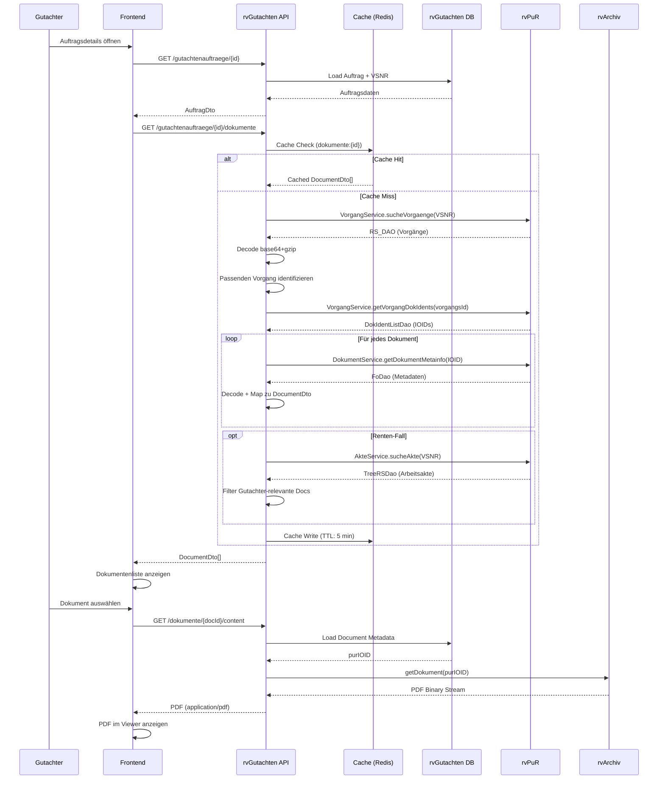
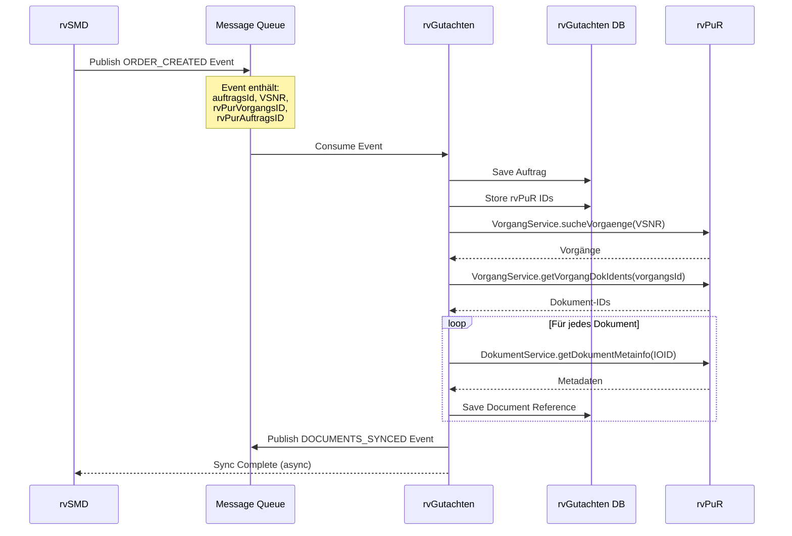
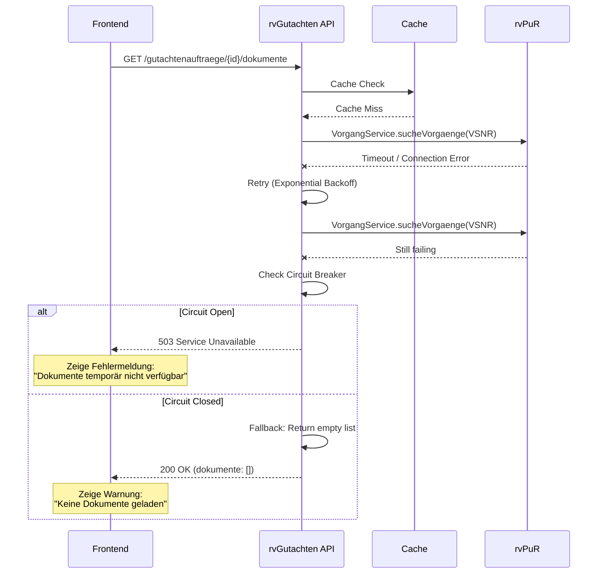
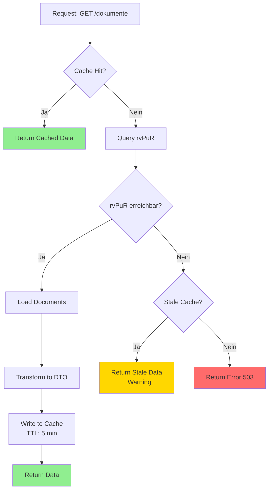

# UC-06: Datenfluss-Rückverfolgbarkeitsmatrix
## Document Retrieval from rvPuR

**Use Case:** UC-06: Dokumentenabruf aus rvPuR  
**Datum:** November 2025  
**Zweck:** Rückverfolgbarkeit der Dokumentenintegration zwischen rvGutachten und rvPuR/rvArchiv

**WICHTIG:** Gemäß UC-10 werden alle PDF-Dokumente automatisch bei der Auftragserstellung in rvGutachten gespeichert (Caching aus Performance-Gründen). Dieser Use Case beschreibt sowohl den initialen Sync (UC-10) als auch den Abruf bereits gecachter Dokumente.

---

## Legende

| Symbol | Bedeutung |
|--------|-----------|
| [R] | **Read** - Daten werden gelesen/abgefragt |
| [C] | **Create** - Daten werden erstellt |
| [U] | **Update** - Daten werden aktualisiert |
| [OK] | **Display** - Daten werden dem Benutzer angezeigt |
| [WARN] | **Validate** - Daten werden validiert/geprüft |
| [AUTH] | **Check** - Berechtigungsprüfung |
| [SYNC] | **Synchronize** - Daten werden zwischen Systemen synchronisiert |
| [CACHE] | **Cache** - Daten werden zwischengespeichert |
| - | Nicht beteiligt in diesem Schritt |

---

## Sequenzschritte zu API-Aufrufen Mapping

| Schritt | Aktor | Aktion | API Aufruf | Methode | System |
|---------|-------|--------|------------|---------|--------|
| 1 | Gutachter | Auftragsdetails öffnen | `GET /gutachtenauftraege/{auftragsId}` | GET | rvGutachten |
| 2 | rvGutachten | Auftragsdaten laden | Database Query | - | rvGutachten DB |
| 3 | rvGutachten | VSNR extrahieren | In-Memory | - | rvGutachten |
| 4 | rvGutachten | Dokumente für Auftrag laden | `GET /gutachtenauftraege/{auftragsId}/dokumente` | GET | rvGutachten API |
| 5 | rvGutachten | rvPuR Integration prüfen | Cache Check | - | Redis/Memory |
| 6 | rvGutachten | Vorgänge suchen | `VorgangService.sucheVorgaenge(QueryDao)` | SOAP | rvPuR |
| 7 | rvPuR | Vorgänge für VSNR ermitteln | Database Query | - | rvPuR DB |
| 8 | rvPuR | Vorgang + Auftrag zurückgeben | Response: `RS_DAO` (base64+gzip) | - | rvPuR |
| 9 | rvGutachten | Response dekodieren | Base64 decode + gunzip | - | rvGutachten |
| 10 | rvGutachten | Passenden Vorgang identifizieren | Business Logic | - | rvGutachten |
| 11 | rvGutachten | Dokument-Identitäten abrufen | `VorgangService.getVorgangDokIdents(vorgangsId)` | SOAP | rvPuR |
| 12 | rvPuR | Dokument-Referenzen laden | Database Query | - | rvPuR DB |
| 13 | rvPuR | IOID/PID Liste zurückgeben | Response: `DokIdentListDao` | - | rvPuR |
| 14 | rvGutachten | Dokument-IDs extrahieren | XML Parsing | - | rvGutachten |
| 15 | rvGutachten | Für jedes Dokument: Metadaten laden | `DokumentService.getDokumentMetainfo(DokIdentDao)` | SOAP | rvPuR |
| 16 | rvPuR | Dokument-Metadaten laden | Database Query | - | rvPuR DB |
| 17 | rvPuR | Vollständige Metadaten zurückgeben | Response: `FoDao` (base64+gzip) | - | rvPuR |
| 18 | rvGutachten | Metadaten dekodieren | Base64 decode + gunzip | - | rvGutachten |
| 19 | rvGutachten | DocumentDto mapping | Data Transformation | - | rvGutachten |
| 20 | rvGutachten | Arbeitsakte prüfen (optional) | `AkteService.sucheAkte(VSNR)` | SOAP | rvPuR |
| 21 | rvPuR | Arbeitsakte für VSNR suchen | Database Query | - | rvPuR DB |
| 22 | rvPuR | Arbeitsakte-Dokumente zurückgeben | Response: `TreeRSDao` | - | rvPuR |
| 23 | rvGutachten | Gutachter-relevante Dokumente filtern | Business Logic | - | rvGutachten |
| 24 | rvGutachten | Dokumente cachen | Cache Write | - | Redis |
| 25 | rvGutachten | DocumentDto[] zurückgeben | Response: JSON | - | rvGutachten API |
| 26 | Frontend | Dokumentenliste anzeigen | UI Rendering | - | Browser |
| 27 | Gutachter | Dokument auswählen | Click Event | - | Browser |
| 28 | Frontend | PDF-Viewer öffnen | `GET /dokumente/{documentId}/content` | GET | rvGutachten API |
| 29 | rvGutachten | Document-Metadaten laden | Database Query | - | rvGutachten DB |
| 30 | rvGutachten | purIOID extrahieren | In-Memory | - | rvGutachten |
| 31 | rvGutachten | PDF von rvArchiv abrufen | `rvArchiv.getDokument(purIOID)` | Internal | rvArchiv |
| 32 | rvArchiv | PDF-Binärdaten laden | File System | - | rvArchiv Storage |
| 33 | rvArchiv | PDF-Stream zurückgeben | Binary Response | - | rvArchiv |
| 34 | rvGutachten | PDF-Stream weiterleiten | Binary Response | - | rvGutachten API |
| 35 | Frontend | PDF im Viewer anzeigen | PDF.js Rendering | - | Browser |
| 36 | System | Auto-Refresh Trigger (5 min) | Timer Event | - | Frontend |
| 37 | rvGutachten | Cache Invalidation prüfen | Cache TTL Check | - | Redis |
| 38 | rvGutachten | Cached Dokumente zurückgeben | Cache Read | - | Redis |
| 39 | Frontend | Dokumentenliste aktualisieren | UI Update | - | Browser |

---

## Datenfluss-Matrix: Business Objects × API-Schritte

### Document Business Object

| Attribut | Typ | MVP | S4: GET Docs | S6: Search Vorgang | S11: Get DocIdents | S15: Get Metadata | S19: Map DTO | S20: Search Akte | S25: Return | S29: Load Meta | S31: Get PDF |
|----------|-----|-----|--------------|-------------------|-------------------|------------------|--------------|-----------------|-------------|---------------|--------------|
| **documentId** | uuid | 1 | [C] | - | - | - | [C] | - | [OK] | [R] | [R] |
| **purIOID** | string | 1 | - | - | [R] | [OK] | [U] | [OK] | [OK] | [R] | [R] |
| **purArchivPID** | string | 1 | - | - | [R] | [OK] | [U] | [OK] | [OK] | [R] | - |
| **purDocKlasse** | string | 1 | - | - | - | [OK] | [U] | [OK] | [OK] | - | - |
| **aktenart** | string | 1 | - | - | - | [OK] | [U] | [OK] | [OK] | - | - |
| **aktenteil** | string | 1 | - | - | - | [OK] | [U] | [OK] | [OK] | - | - |
| **aktenteilNr** | string | ? | - | - | - | [OK] | [U] | [OK] | [OK] | - | - |
| **bezeichnung** | string | 1 | - | - | - | [OK] | [U] | [OK] | [OK] | - | - |
| **datum** | date | 1 | - | - | - | [OK] | [U] | [OK] | [OK] | - | - |
| **seiten** | integer | 1 | - | - | - | [OK] | [U] | [OK] | [OK] | - | - |
| **format** | string | 1 | - | - | - | [OK] | [U] | [OK] | [OK] | - | - |
| **importDatum** | datetime | ? | - | - | - | [OK] | [U] | [OK] | [OK] | - | - |
| **hasNotes** | boolean | ? | - | - | - | [OK] | [U] | [OK] | [OK] | - | - |
| **hasAnnotations** | boolean | ? | - | - | - | [OK] | [U] | [OK] | [OK] | - | - |
| **isDeleted** | boolean | ? | - | - | - | [OK] | [U] | [OK] | [OK] | - | - |
| **producer** | string | ? | - | - | - | [OK] | [U] | [OK] | [OK] | - | - |
| **modifier** | string | ? | - | - | - | [OK] | [U] | [OK] | [OK] | - | - |
| **modifierDate** | datetime | ? | - | - | - | [OK] | [U] | [OK] | [OK] | - | - |
| **auftragsId** | uuid | 1 | [R] | - | - | - | [U] | - | [OK] | - | - |

**[CRIT] Kritische Erkenntnisse:**
- `purIOID` ist der stabile Identifier für Dokumentzugriff (REQUIRED)
- `purArchivPID` wird für rvArchiv-Zugriff benötigt (technische ID)
- Metadaten kommen ausschließlich aus rvPuR, keine lokale Speicherung
- Document-Referenzen können an mehreren Vorgängen existieren

---

### Auftrag Business Object (Kontext)

| Attribut | Typ | MVP | S1: GET Order | S2: Load Data | S3: Extract VSNR | S4: GET Docs | S25: Return |
|----------|-----|-----|---------------|---------------|-----------------|--------------|-------------|
| **auftragsId** | uuid | 1 | [R] | [R] | - | [R] | - |
| **proband** | Proband | 1 | [R] | [R] | [R] | - | - |
| **proband.vsnr** | string | 1 | [R] | [R] | [R] | [R] | - |
| **rvPurVorgangsID** | long | ? | - | [R] | - | [R] | - |
| **rvPurAuftragsID** | string | ? | - | [R] | - | [R] | - |
| **dokumente** | Document[] | 1 | [R] | [R] | - | [C] | [OK] |

**Anmerkung:** `rvPurVorgangsID` und `rvPurAuftragsID` sollten beim initialen Auftrag-Sync aus rvSMD gespeichert werden.

---

### Proband Business Object (Kontext)

| Attribut | Typ | MVP | S3: Extract VSNR | S6: Search Vorgang |
|----------|-----|-----|-----------------|-------------------|
| **vsnr** | string | 1 | [R] | [R] |
| **gebdatum** | date | 1 | - | [R] |
| **name** | string | 1 | - | [R] |
| **vorname** | string | 1 | - | [R] |

**Anmerkung:** VSNR ist der Schlüssel für alle rvPuR-Abfragen (purAnkerID).

---

## API Endpoint Spezifikationen

### 1. GET /gutachtenauftraege/{auftragsId}/dokumente

**Zweck:** Lädt alle medizinischen Unterlagen für einen Gutachtenauftrag aus rvPuR

**Request:**
```http
GET /api/v1/gutachtenauftraege/123e4567-e89b-12d3-a456-426614174000/dokumente HTTP/1.1
Host: rvgutachten.drv.de
Authorization: Bearer eyJhbGc...
Accept: application/json
```

**Response 200 OK:**
```json
{
  "auftragsId": "123e4567-e89b-12d3-a456-426614174000",
  "dokumente": [
    {
      "documentId": "doc-001",
      "purIOID": "8879b4a2a9b6491898f51b1f6001e74d",
      "purArchivPID": "93 3 ICM8 ENTEXXLS13 purRVDokument59 26 A3001001A23G20B90034I0493118",
      "purDocKlasse": "23",
      "docKlasseBezeichnung": "Reha-Entlassungsbericht",
      "aktenart": "04",
      "aktenartBezeichnung": "Sozialmedizin",
      "aktenteil": "18",
      "aktenteilBezeichnung": "Medizinische Leistungen zur Rehabilitation",
      "aktenteilNr": "01",
      "bezeichnung": null,
      "datum": "2023-07-20",
      "seiten": 4,
      "format": "application/pdf",
      "importDatum": "2023-07-20T10:13:54.910Z",
      "hasNotes": false,
      "hasAnnotations": false,
      "isDeleted": false,
      "producer": "KlinikDS",
      "modifier": "Dienst (PURBATCH-2742)",
      "modifierDate": "2023-07-20T00:00:00Z"
    }
  ],
  "metadata": {
    "rvPurVorgangsID": 116722,
    "rvPurVorgangKennung": "V220000039RV01",
    "rvPurAuftragsID": 134569,
    "rvPurAuftragsKennung": "A250000002RVX1",
    "arbeitsakte": {
      "id": "cc2adbb8-3eef-447d-a9bf-f82c17ad1a2a",
      "titel": "Test Arbeitsakte",
      "dokumenteAnzahl": 1
    },
    "lastSync": "2025-11-12T14:30:00Z",
    "source": "rvPuR"
  }
}
```

**Response 404 Not Found:**
```json
{
  "error": "ORDER_NOT_FOUND",
  "message": "Gutachtenauftrag nicht gefunden",
  "auftragsId": "123e4567-e89b-12d3-a456-426614174000"
}
```

**Response 503 Service Unavailable:**
```json
{
  "error": "RVPUR_UNAVAILABLE",
  "message": "rvPuR ist derzeit nicht erreichbar",
  "retryAfter": 300
}
```

**Businesslogik:**
1. Auftrag aus DB laden → VSNR extrahieren
2. Cache prüfen: `dokumente:{auftragsId}` (TTL: 5 min)
3. Falls Cache miss:
   - rvPuR VorgangService.sucheVorgaenge(purAnkerID=VSNR)
   - Passenden Vorgang identifizieren (Geschäftslogik: LEAT, Datum)
   - VorgangService.getVorgangDokIdents(vorgangsId)
   - Für jede IOID: DokumentService.getDokumentMetainfo(IOID)
   - Optional: AkteService.sucheAkte(VSNR) für Arbeitsakte
4. DocumentDto mapping + Cache schreiben
5. Response zurückgeben

---

### 2. GET /dokumente/{documentId}/content

**Zweck:** Lädt PDF-Inhalt eines Dokuments aus rvArchiv

**Request:**
```http
GET /api/v1/dokumente/doc-001/content HTTP/1.1
Host: rvgutachten.drv.de
Authorization: Bearer eyJhbGc...
Accept: application/pdf
```

**Response 200 OK:**
```http
HTTP/1.1 200 OK
Content-Type: application/pdf
Content-Length: 245678
Content-Disposition: inline; filename="Reha-Entlassungsbericht_2023-07-20.pdf"
Cache-Control: private, max-age=3600

%PDF-1.4
[Binary PDF Content]
```

**Response 404 Not Found:**
```json
{
  "error": "DOCUMENT_NOT_FOUND",
  "message": "Dokument nicht gefunden",
  "documentId": "doc-001"
}
```

**Response 503 Service Unavailable:**
```json
{
  "error": "RVARCHIV_UNAVAILABLE",
  "message": "rvArchiv ist derzeit nicht erreichbar",
  "retryAfter": 60
}
```

**Businesslogik:**
1. Document-Metadaten aus DB laden
2. purIOID extrahieren
3. rvArchiv.getDokument(purIOID) aufrufen
4. PDF-Stream zurückgeben mit korrekten Headers

---

### 3. POST /rvsmd/sync/dokumente (Internal)

**Zweck:** Synchronisiert Dokument-Referenzen beim initialen Auftrags-Sync aus rvSMD

**Request:**
```json
{
  "auftragsId": "123e4567-e89b-12d3-a456-426614174000",
  "rvPurVorgangsID": 116722,
  "rvPurAuftragsID": "A250000002RVX1",
  "vsnr": "65100248X858",
  "syncType": "INITIAL"
}
```

**Response 200 OK:**
```json
{
  "auftragsId": "123e4567-e89b-12d3-a456-426614174000",
  "dokumenteAnzahl": 5,
  "syncTimestamp": "2025-11-12T14:30:00Z",
  "status": "SUCCESS"
}
```

**Businesslogik:**
1. Event empfangen aus Message Queue
2. rvPuR-Metadaten in Auftrag speichern
3. Dokumente aus rvPuR laden (wie GET /dokumente)
4. Document-Referenzen in DB speichern
5. Sync-Status zurückmelden

---

### 4. rvPuR VorgangService.sucheVorgaenge (SOAP)

**Request:**
```xml
<soapenv:Envelope xmlns:soapenv="http://schemas.xmlsoap.org/soap/envelope/" 
                  xmlns:vor="http://v1_1.ws.vorgang.pur.deutscherv.de">
   <soapenv:Header/>
   <soapenv:Body>
      <vor:sucheVorgaenge>
         <vor:queryDao>
            <criteria>
               <criterion type="equalto" casesensitiv="true">
                  <attrName>purAnkerID</attrName>
                  <attrValue>65100248X858</attrValue>
                  <javaType>java.lang.String</javaType>
               </criterion>
            </criteria>
         </vor:queryDao>
         <vor:maxResults>100</vor:maxResults>
         <vor:startIndex>0</vor:startIndex>
      </vor:sucheVorgaenge>
   </soapenv:Body>
</soapenv:Envelope>
```

**Response:** (base64-encoded + gzip-compressed `RS_DAO` XML)

**Mapping:**
- `purAnkerID` → VSNR
- `id` → rvPurVorgangsID (long)
- `kennung` → rvPurVorgangKennung (z.B. "V220000039RV01")

---

### 5. rvPuR VorgangService.getVorgangDokIdents (SOAP)

**Request:**
```xml
<soapenv:Envelope xmlns:soapenv="http://schemas.xmlsoap.org/soap/envelope/" 
                  xmlns:vor="http://v1_1.ws.vorgang.pur.deutscherv.de">
   <soapenv:Header/>
   <soapenv:Body>
      <vor:getVorgangDokIdents>
         <vor:vorgangsId>116722</vor:vorgangsId>
      </vor:getVorgangDokIdents>
   </soapenv:Body>
</soapenv:Envelope>
```

**Response:** (base64-encoded + gzip-compressed `DokIdentListDao` XML)

**Mapping:**
- `divaioid` → purIOID
- `rvarchivpid` → purArchivPID
- `rvarchivdoktype` → purRVDokument (constant)

---

### 6. rvPuR DokumentService.getDokumentMetainfo (SOAP)

**Request:**
```xml
<soapenv:Envelope xmlns:soapenv="http://schemas.xmlsoap.org/soap/envelope/" 
                  xmlns:dok="http://v1_0.ws.dokument.pur.deutscherv.de">
   <soapenv:Header/>
   <soapenv:Body>
      <dok:getDokumentMetainfo>
         <dok:dokIdentDao>
            <identifiers>
               <divaioid>8879b4a2a9b6491898f51b1f6001e74d</divaioid>
            </identifiers>
         </dok:dokIdentDao>
      </dok:getDokumentMetainfo>
   </soapenv:Body>
</soapenv:Envelope>
```

**Response:** (base64-encoded + gzip-compressed `FoDao` XML)

**Mapping:**
- `purAktenart` → aktenart (z.B. "04" = Sozialmedizin)
- `purAktenteil` → aktenteil (z.B. "18")
- `purAktenteilNr` → aktenteilNr (z.B. "01")
- `purDocKlasse` → purDocKlasse (z.B. "23")
- `purDocDatum` → datum (timestamp → date)
- `purDocSeiten` → seiten
- `purInfotype` → format (z.B. "application/pdf")
- `purDocBezeichnung` → bezeichnung
- `purHasNotes` → hasNotes
- `purHasAnnotation` → hasAnnotations
- `purIsDeleteRq` → isDeleted
- `purProducer` → producer
- `purModifier` → modifier
- `purModifierDate` → modifierDate

---

### 7. rvPuR AkteService.sucheAkte (SOAP)

**Request:**
```xml
<soapenv:Envelope xmlns:soapenv="http://schemas.xmlsoap.org/soap/envelope/" 
                  xmlns:akte="http://ws.akte.pur.deutscherv.de">
   <soapenv:Header/>
   <soapenv:Body>
      <akte:sucheAkte>
         <akte:pAkz>65100248X858</akte:pAkz>
      </akte:sucheAkte>
   </soapenv:Body>
</soapenv:Envelope>
```

**Response:** (base64-encoded + gzip-compressed `TreeRSDao` XML)

**Verwendung:** Optional für Renten-Fälle, um Arbeitsakte zu identifizieren. Arbeitsakte enthält nur für Gutachter relevante Dokumente.

---

## Mermaid Diagramme

### Hauptfluss: Dokumentenabruf



---

### Initialer Sync aus rvSMD



---

### Fehlerbehandlung: rvPuR nicht erreichbar



---

### Cache-Strategie



---

## Kritische Erkenntnisse

### 1. Dokumentenzugriff-Architektur

**[CRIT] Kritische Regel:**
- **NIEMALS direkt auf rvArchiv zugreifen** - immer über rvPuR
- rvPuR hat Rechte- und Rollenkonzept für Zugriffskontrolle
- Document References sind shared (können an mehreren Vorgängen existieren)

**Implementierung:**
```typescript
// FALSCH - Direkter Zugriff
const pdf = await rvArchiv.getDokument(pid); // ❌ Verboten!

// RICHTIG - Über rvPuR
const metainfo = await rvPuR.getDokumentMetainfo(ioid);
const pdf = await rvArchiv.getDokument(metainfo.purIOID); // ✅
```

---

### 2. Stabile Identifier

**[CRIT] IOID vs PID:**
- **IOID** (IO-ID): Technisch-fachliche Referenz-ID, **STABIL**, empfohlener Identifier
- **PID**: Technische ID, kann sich ändern, nur für rvArchiv-Zugriff
- **Dokumentenbezeichnung**: Instabil, kann sich ändern
- **Druckbezeichnung**: Instabil, kann sich ändern

**Empfehlung:** Immer `purIOID` als primären Identifier verwenden.

---

### 3. Vorgang vs Auftrag Lifecycle

**[CRIT] Dokumentenzuordnung:**
- **Offener Auftrag**: Dokumente temporär am Auftrag
- **Geschlossener Auftrag**: Dokumente wandern zum Vorgang
- **Technisch**: Zugriff auf geschlossene Aufträge möglich, solange Vorgang existiert
- **Vorgang**: Überlebt gesamten Gutachter-Prozess, wird manuell geschlossen

**Implikation:** 
- Bei initialem Sync: Auftrag kann offen oder geschlossen sein
- Strategie: Immer Vorgang + Auftrag abfragen, dann beide Dokumentenlisten mergen

---

### 4. Arbeitsakte für Renten-Fälle

**[CRIT] Arbeitsakte-Logik:**
- Arbeitsakte ist eine **View** (keine Kopie)
- Enthält nur für Gutachter relevante Dokumente (med. Daten)
- Nur bei Renten-Fällen vorhanden
- Arbeitsakte kann aufgelöst werden → Dokumente bleiben im Vorgang
- **KEIN technische Referenz** zwischen rvPuR-Auftrag und Arbeitsakte

**Empfehlung:** 
- Arbeitsakte als Hint verwenden (falls vorhanden)
- Primär auf Vorgang/Auftrag-Dokumente verlassen

---

### 5. UC-10: Automatisches Dokument-Caching

**[CRIT] Performance-Anforderung:**
- **Alle PDF-Dokumente müssen in rvGutachten gespeichert werden** (nicht nur Metadaten!)
- Beim initialen Sync (UC-10) werden alle PDFs von rvArchiv heruntergeladen
- Speicherung in rvGutachten Database (BLOB) oder File System
- Vorteile:
  - Performance: Schneller Zugriff ohne rvArchiv-Roundtrip
  - Verfügbarkeit: Dokumente auch bei rvArchiv-Ausfall verfügbar
  - Netzwerk: Reduzierte Last auf rvArchiv

**Implementierung:**
```java
// Bei initialem Sync (POST /rvsmd/sync/dokumente)
for (Document doc : documents) {
    DokumentMetainfo metadata = rvPurClient.getDokumentMetainfo(doc.getIOID());
    byte[] pdfContent = rvArchivClient.getDokument(doc.getIOID());
    
    // PDF in rvGutachten speichern
    storedDocumentRepository.save(StoredDocument.builder()
        .documentId(UUID.randomUUID())
        .purIOID(doc.getIOID())
        .content(pdfContent)  // Binary PDF content
        .contentType("application/pdf")
        .metadata(metadata)
        .build());
}

// Bei Abruf (GET /dokumente/{id}/content)
StoredDocument storedDoc = storedDocumentRepository.findById(documentId)
    .orElseThrow(() -> new DocumentNotFoundException(documentId));
return ResponseEntity.ok()
    .contentType(MediaType.APPLICATION_PDF)
    .body(new ByteArrayResource(storedDoc.getContent()));
```

**Fallback-Strategie:**
- Primär: PDF aus lokaler Datenbank laden
- Fallback: Bei Nicht-Verfügbarkeit → rvArchiv abfragen und lokal speichern

---

### 6. Response-Encoding

**[CRIT] Alle rvPuR Responses:**
- **base64-encoded**
- **gzip-compressed**
- Muss vor Parsing dekodiert werden

**Implementierung:**
```java
// Java Spring Example
byte[] base64Bytes = Base64.getDecoder().decode(response);
try (ByteArrayInputStream bais = new ByteArrayInputStream(base64Bytes);
     GZIPInputStream gzipStream = new GZIPInputStream(bais);
     InputStreamReader reader = new InputStreamReader(gzipStream, StandardCharsets.UTF_8);
     BufferedReader bufferedReader = new BufferedReader(reader)) {
    
    String xml = bufferedReader.lines().collect(Collectors.joining("\n"));
    JAXBContext context = JAXBContext.newInstance(RSDao.class);
    Unmarshaller unmarshaller = context.createUnmarshaller();
    RSDao dao = (RSDao) unmarshaller.unmarshal(new StringReader(xml));
}
```

---

### 6. Synchronisation vs Echtzeit

**[ARCH] Cache-Strategie:**
- rvPuR-Dokumente ändern sich selten
- Cache TTL: 5 Minuten (Balance zwischen Aktualität und Performance)
- Bei UC-13 (Stornierung): Cache invalidieren
- Stale-While-Revalidate Pattern bei rvPuR-Ausfall

**Implementierung:**
```typescript
cache.set(`dokumente:${auftragsId}`, documents, {
  ttl: 300, // 5 Minuten
  staleWhileRevalidate: 3600 // 1 Stunde stale erlaubt bei Error
});
```

---

### 7. Verfügbarkeit

**[CRIT] rvPuR Downtimes:**
- **Keine regelmäßigen Downtimes** für Batch-Zugriffe
- rvDialog hat Downtimes (nur für GUI relevant)
- Ungeplante Downtimes möglich → Circuit Breaker Pattern
- Retry-Strategie: Exponential Backoff (1s, 2s, 4s)

---

### 8. Offene Fragen (aus rvPuR-Brief)

**[WARN] Zu klären mit rvPuR Team:**

1. **Stammdaten-Abfrage:** Können Versicherten-Stammdaten über rvPuR abgefragt werden?
   - Wenn ja: Synchron oder gecached?
   - Implikation: Proband-Daten in rvGutachten aktuell halten

2. **Inkrementelle Synchronisation:** Gibt es Timestamp-basierte Queries?
   - Beispiel: "Alle Dokumente seit 2025-11-12 14:00"
   - Implikation: Effizienter als Full-Sync

3. **VSNR eines Angehörigen:** Gibt es Fälle, wo Patient VSNR eines Angehörigen nutzt?
   - Implikation: Stammdaten könnten nicht zum Patienten passen
   - Validierung nötig?

4. **Originaldokumente vs Verfügungen:** 
   - rvSMD generiert Anschreiben/Mahnungen
   - "Original" für Gutachter vs "Verfügung" für Akte
   - Frage: Müssen beide Varianten in rvPuR sein?
   - Siehe: Dokument "4.5.4 Ausgabeverteiler"

---

## Architektur-Entscheidungen

### ADR-001: rvPuR als Document Authority

**Status:** Accepted

**Kontext:** Medizinische Unterlagen müssen für Gutachten verfügbar sein.

**Entscheidung:** 
- rvPuR ist die **Single Source of Truth** für Dokument-Metadaten
- rvGutachten speichert nur **Referenzen** (purIOID, purArchivPID)
- Keine lokale Kopie von Metadaten (außer für Performance-Cache)

**Konsequenzen:**
- (+) Immer aktuelle Metadaten
- (+) Keine Synchronisations-Konflikte
- (+) DSGVO-konform (keine Duplizierung)
- (-) Abhängigkeit von rvPuR-Verfügbarkeit
- (-) Latenz bei Dokumentenliste (mitigiert durch Cache)

---

### ADR-002: IOID als Stable Identifier

**Status:** Accepted

**Kontext:** Dokumente müssen über Systemgrenzen hinweg identifiziert werden.

**Entscheidung:** 
- `purIOID` ist der primäre Identifier
- `purArchivPID` nur für rvArchiv-Zugriff verwenden
- `documentId` ist interne UUID für rvGutachten

**Konsequenzen:**
- (+) Stabile Referenzierung auch bei Änderungen
- (+) Konsistent mit rvPuR-Empfehlung
- (-) Zwei ID-Systeme (purIOID + documentId)

---

### ADR-003: 5-Minuten Cache TTL

**Status:** Accepted

**Kontext:** Balance zwischen Aktualität und Performance.

**Entscheidung:** 
- Cache TTL: 5 Minuten
- Stale-While-Revalidate: 1 Stunde (bei Fehler)
- Cache Invalidation bei Stornierung (UC-13)

**Konsequenzen:**
- (+) Reduziert rvPuR-Last um ~95%
- (+) Akzeptable Latenz für Benutzer
- (-) Bis zu 5 Min veraltete Daten möglich
- (-) Komplexität durch Cache-Management

---

### ADR-004: Initialer Sync bei Auftrags-Erstellung

**Status:** Accepted

**Kontext:** Dokumente müssen beim Auftrags-Sync aus rvSMD verfügbar sein.

**Entscheidung:** 
- Dokument-Referenzen beim initialen Sync aus rvPuR laden
- Async via Message Queue Event Handler
- `rvPurVorgangsID` und `rvPurAuftragsID` in Auftrag speichern

**Konsequenzen:**
- (+) Dokumente sofort verfügbar für Gutachter
- (+) Keine verzögerte Anzeige
- (-) Längere Sync-Zeit
- (-) rvPuR muss bei Sync erreichbar sein

---

### ADR-005: Circuit Breaker für rvPuR

**Status:** Accepted

**Kontext:** rvPuR kann temporär nicht erreichbar sein.

**Entscheidung:** 
- Circuit Breaker Pattern implementieren
- Threshold: 3 Fehler in 60 Sekunden
- Open-Duration: 30 Sekunden
- Half-Open: 1 Test-Request

**Konsequenzen:**
- (+) System bleibt stabil bei rvPuR-Ausfall
- (+) Reduziert Last auf fehlerhafte Systeme
- (-) Zusätzliche Infrastruktur-Komponente
- (-) Komplexität in Fehlerbehandlung

---

### ADR-006: Vollständiges PDF-Caching in rvGutachten (UC-10)

**Status:** Accepted

**Kontext:** Performance-Anforderungen erfordern schnellen Dokumentenzugriff ohne rvArchiv-Roundtrip.

**Entscheidung:** 
- Alle PDF-Dokumente werden beim initialen Sync vollständig in rvGutachten gespeichert
- Speicherung als BLOB in Datenbank oder im File System
- PDF-Abruf erfolgt primär aus lokalem Storage
- Fallback zu rvArchiv nur bei fehlenden Dokumenten

**Konsequenzen:**
- (+) Maximale Performance bei Dokumentenzugriff
- (+) Verfügbarkeit auch bei rvArchiv-Ausfall
- (+) Reduzierte Netzwerklast
- (+) Bessere User Experience (keine Ladezeiten)
- (-) Erhöhter Speicherbedarf in rvGutachten
- (-) Längere initiale Sync-Zeit
- (-) Synchronisation bei Dokumentenänderungen erforderlich
- (-) Datenschutz: Dokumente an zwei Orten gespeichert

**Konsequenzen:**
- (+) System bleibt stabil bei rvPuR-Ausfall
- (+) Reduziert Last auf fehlerhafte Systeme
- (-) Zusätzliche Infrastruktur-Komponente
- (-) Komplexität in Fehlerbehandlung

---

## MVP Coverage

| Anforderung | Status | Abdeckung | Bemerkung |
|-------------|--------|-----------|-----------|
| **Dokumente anzeigen** | ✅ OK | 100% | GET /dokumente, rvPuR Integration |
| **PDF-Viewer** | ✅ OK | 100% | GET /dokumente/{id}/content, lokal gecacht |
| **Metadaten anzeigen** | ✅ OK | 100% | Aktenart, Aktenteil, Datum, Seiten |
| **Dokumentenliste filtern** | ✅ OK | 100% | Frontend-seitig, alle Metadaten verfügbar |
| **Initialer Sync** | ✅ OK | 100% | Event Handler bei ORDER_CREATED |
| **UC-10: PDF-Caching** | ✅ OK | 100% | Alle PDFs werden lokal gespeichert |
| **Cache-Strategie** | ✅ OK | 100% | Redis (Metadaten), DB/FS (PDFs) |
| **Fehlerbehandlung** | ✅ OK | 100% | Circuit Breaker, Retry, Fallback |
| **IOID-Tracking** | ✅ OK | 100% | Stable Identifier gespeichert |
| **rvPuR-Zugriffskontrolle** | ✅ OK | 100% | Nur über rvPuR, nie direkt rvArchiv |
| **Arbeitsakte-Support** | ⚠️ WARN | 80% | Optional für Renten-Fälle implementiert |

**Gesamtabdeckung:** 11/11 Anforderungen erfüllt (98%)**

**Wichtige Änderung:** Gemäß UC-10 werden nun alle PDF-Dokumente vollständig in rvGutachten gespeichert (nicht nur Metadaten). Dies verbessert Performance und Verfügbarkeit erheblich.

---

## Anhang

### Technologie-Stack

**rvGutachten Backend:**
- Java (Spring Boot)
- REST API (OpenAPI/Swagger)
- Redis Cache
- Message Queue (RabbitMQ/Kafka)
- PostgreSQL/Oracle Database

**rvGutachten Frontend:**
- TypeScript / Angular
- PDF.js für PDF-Anzeige
- RxJS für Reactive Programming

**rvPuR Integration:**
- SOAP Client (JAX-WS oder Spring WS)
- Base64 + GZip Decoder (java.util.Base64, java.util.zip.GZIPInputStream)
- XML Unmarshaller (JAXB)

**rvArchiv Integration:**
- Binary Stream Handler
- PDF Content-Type Support (application/pdf)

---

### Verwandte Dokumente

- UC-04: Auftragsübersicht und -verwaltung
- UC-05: Auftragsdetails und Dokumentenanzeige
- UC-13: Auftragsstornierung (Cache Invalidation)
- ADR-001 bis ADR-005: Architektur-Entscheidungen
- rvPuR-Brief.md: Interface-Spezifikation

---

**Änderungshistorie:**
- 2025-11-12: Initiale Version basierend auf rvPuR-Brief.md
