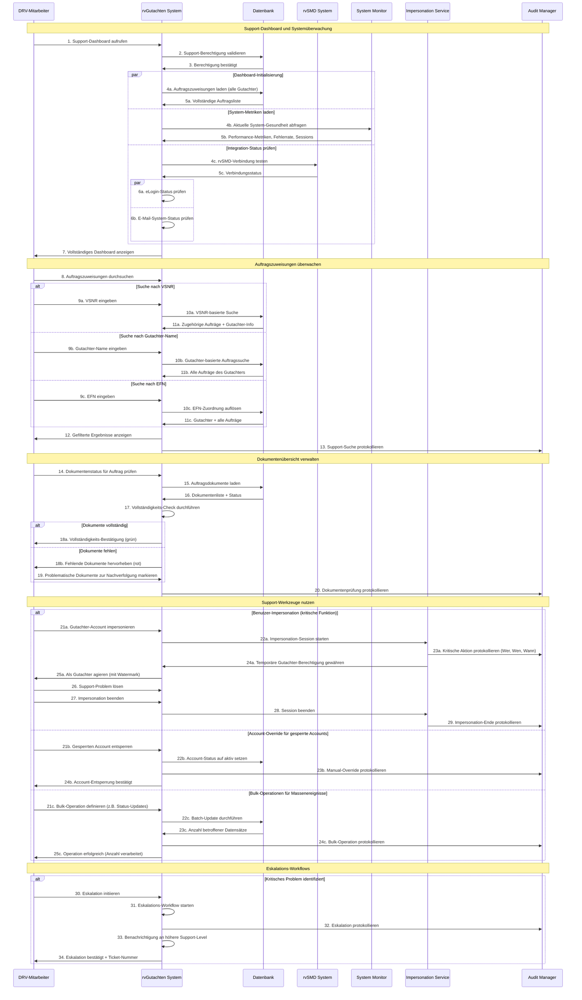
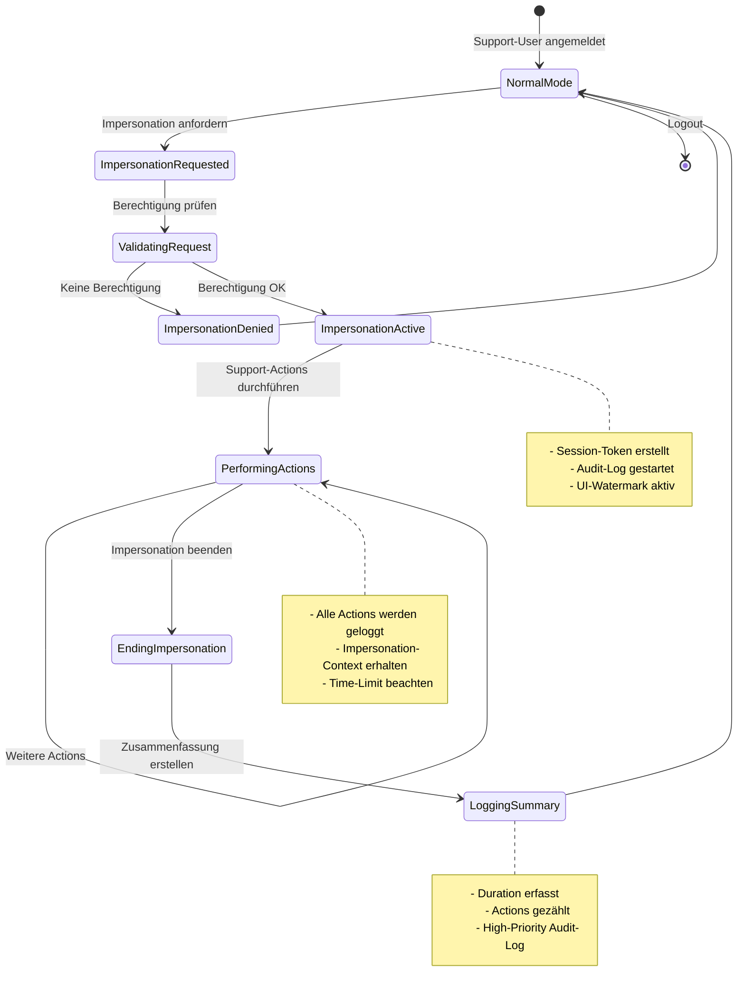

# UC-07: Support-Dashboard und Überwachung - Data Flow Traceability Matrix

**Version:** 1.0  
**Datum:** 2025-11-13  
**Status:** Final  

---

## 1. Use Case Übersicht

### 1.1 Metadaten
- **Use Case ID:** UC-07
- **Name:** DRV-Support Dashboard und Systemüberwachung
- **Primärer Akteur:** DRV-Mitarbeiter (Support-Rolle)
- **Sekundäre Akteure:** System Monitor, Audit Manager
- **Auslöser:** Support-Mitarbeiter benötigt Systemüberblick oder Support-Information
- **Priorität:** Niedrig - Wichtig für operative Exzellenz
- **Sprint:** Sprint 3+

### 1.2 Kurzbeschreibung
Support-Mitarbeiter können über ein zentrales Dashboard den vollständigen Systemzustand überwachen, Auftragszuweisungen aller Gutachter einsehen, Dokumentenstatus prüfen und kritische Support-Werkzeuge (Impersonation, Account-Override, Bulk-Operationen) nutzen.

### 1.3 Vorbedingungen
- DRV-Mitarbeiter hat Support-Berechtigung
- System-Monitoring ist aktiv
- Dashboard-Daten sind aktuell
- Audit-Trail-System ist funktionsfähig

### 1.4 Nachbedingungen
- Support-Mitarbeiter haben vollständigen Systemüberblick
- Probleme können schnell identifiziert und behoben werden
- Alle Support-Aktionen sind auditiert
- System-Gesundheit ist transparent

---

## 2. Detaillierte Sequenz mit Data Flow

### Dashboard-Initialisierung

**Schritt 01:** DRV-Mitarbeiter ruft Support-Dashboard auf  
**Actor:** DRV  
**System:** RG  
**Data Flow:** HTTP GET /api/support/dashboard  
**Input:** JWT Token (Support-Berechtigung)  
**Output:** Dashboard-Request initiiert  

**Schritt 02:** System validiert Support-Berechtigung  
**Actor:** RG  
**System:** DB  
**Data Flow:** SQL Query: SELECT role FROM users WHERE id = ?  
**Input:** User ID aus JWT Token  
**Output:** Support-Rolle bestätigt oder Zugriff verweigert  

**Schritt 03:** Berechtigung bestätigt  
**Actor:** DB  
**System:** RG  
**Data Flow:** Boolean: hasRole('support')  
**Input:** User-Rolle aus Datenbank  
**Output:** Authorization granted  

**Schritt 04a:** Auftragszuweisungen laden (alle Gutachter)  
**Actor:** RG  
**System:** DB  
**Data Flow:** SQL Query: SELECT * FROM auftragszuweisungen JOIN gutachter  
**Input:** Keine Filter (globale Übersicht)  
**Output:** Liste aller Aufträge mit Status, Gutachter-Info, Zeitstempel  

**Schritt 04b:** Aktuelle System-Gesundheit abfragen  
**Actor:** RG  
**System:** MON  
**Data Flow:** HTTP GET /api/monitoring/health  
**Input:** Timestamp (aktuelle Metriken)  
**Output:** Performance-Metriken, Fehlerrate, aktive Sessions  

**Schritt 04c:** rvSMD-Verbindung testen  
**Actor:** RG  
**System:** SMD  
**Data Flow:** HTTP GET /api/health (rvSMD)  
**Input:** Heartbeat-Request  
**Output:** Verbindungsstatus, Response-Zeit  

**Schritt 05a:** Vollständige Auftragsliste zurückgeben  
**Actor:** DB  
**System:** RG  
**Data Flow:** JSON Array: AuftragsDTO[]  
**Input:** Rohdaten aus Datenbank  
**Output:** Strukturierte Auftragsliste mit allen Metadaten  

**Schritt 05b:** Performance-Metriken, Fehlerrate, Sessions  
**Actor:** MON  
**System:** RG  
**Data Flow:** JSON: {responseTime, errorRate, activeSessions}  
**Input:** System Monitor Daten  
**Output:** Aktuelle System-Gesundheitsindikatoren  

**Schritt 05c:** Verbindungsstatus von rvSMD  
**Actor:** SMD  
**System:** RG  
**Data Flow:** JSON: {status, latency, lastSync}  
**Input:** rvSMD Health-Check Response  
**Output:** Integration-Status-Info  

**Schritt 06a:** eLogin-Status prüfen  
**Actor:** RG  
**System:** RG  
**Data Flow:** Internal: eLoginService.checkStatus()  
**Input:** eLogin-Integration-Config  
**Output:** eLogin-Verfügbarkeit (online/offline)  

**Schritt 06b:** E-Mail-System-Status prüfen  
**Actor:** RG  
**System:** RG  
**Data Flow:** Internal: emailService.checkQueue()  
**Input:** SMTP-Queue-Status  
**Output:** E-Mail-System-Gesundheit (Queue-Größe, Fehlerrate)  

**Schritt 07:** Vollständiges Dashboard anzeigen  
**Actor:** RG  
**System:** DRV  
**Data Flow:** JSON: DashboardDTO  
**Input:** Aggregierte Daten (Aufträge, Metriken, Status)  
**Output:** Dashboard-UI mit allen Komponenten  

### Auftragszuweisungen überwachen

**Schritt 08:** Auftragszuweisungen durchsuchen  
**Actor:** DRV  
**System:** RG  
**Data Flow:** HTTP POST /api/support/search  
**Input:** Suchparameter (initialisiert)  
**Output:** Such-Interface anzeigen  

**Schritt 09a:** VSNR eingeben  
**Actor:** DRV  
**System:** RG  
**Data Flow:** JSON: {searchType: 'vsnr', value: 'XXX'}  
**Input:** VSNR-String  
**Output:** Such-Request mit VSNR-Filter  

**Schritt 09b:** Gutachter-Name eingeben  
**Actor:** DRV  
**System:** RG  
**Data Flow:** JSON: {searchType: 'gutachter', value: 'Name'}  
**Input:** Gutachter-Name  
**Output:** Such-Request mit Gutachter-Filter  

**Schritt 09c:** EFN eingeben  
**Actor:** DRV  
**System:** RG  
**Data Flow:** JSON: {searchType: 'efn', value: 'EFN123'}  
**Input:** EFN-String  
**Output:** Such-Request mit EFN-Filter  

**Schritt 10a:** VSNR-basierte Suche  
**Actor:** RG  
**System:** DB  
**Data Flow:** SQL: SELECT * FROM auftragszuweisungen WHERE vsnr = ?  
**Input:** VSNR-Parameter  
**Output:** Aufträge mit passender VSNR  

**Schritt 10b:** Gutachter-basierte Auftragssuche  
**Actor:** RG  
**System:** DB  
**Data Flow:** SQL: SELECT * FROM auftragszuweisungen WHERE gutachter_id = ?  
**Input:** Gutachter-ID (resolved from name)  
**Output:** Alle Aufträge des Gutachters  

**Schritt 10c:** EFN-Zuordnung auflösen  
**Actor:** RG  
**System:** DB  
**Data Flow:** SQL: SELECT gutachter_id FROM gutachter WHERE efn = ?  
**Input:** EFN-Parameter  
**Output:** Gutachter-ID für EFN  

**Schritt 11a:** Zugehörige Aufträge + Gutachter-Info  
**Actor:** DB  
**System:** RG  
**Data Flow:** JSON: AuftragsDTO[] mit GutachterDTO  
**Input:** VSNR-Suchergebnisse  
**Output:** Aufträge mit vollständiger Gutachter-Info  

**Schritt 11b:** Alle Aufträge des Gutachters  
**Actor:** DB  
**System:** RG  
**Data Flow:** JSON: AuftragsDTO[]  
**Input:** Gutachter-Suchergebnisse  
**Output:** Vollständige Auftragsliste für Gutachter  

**Schritt 11c:** Gutachter + alle Aufträge  
**Actor:** DB  
**System:** RG  
**Data Flow:** JSON: {gutachter: GutachterDTO, auftraege: AuftragsDTO[]}  
**Input:** EFN-Suchergebnisse  
**Output:** Gutachter-Profil mit allen Aufträgen  

**Schritt 12:** Gefilterte Ergebnisse anzeigen  
**Actor:** RG  
**System:** DRV  
**Data Flow:** JSON: SearchResultDTO  
**Input:** Aggregierte Suchergebnisse  
**Output:** Gefilterte Auftragsliste in UI  

**Schritt 13:** Support-Suche protokollieren  
**Actor:** RG  
**System:** AM  
**Data Flow:** Event: SUPPORT_SEARCH_PERFORMED  
**Input:** {userId, searchType, searchValue, timestamp, resultCount}  
**Output:** Audit-Log-Eintrag erstellt  

### Dokumentenübersicht verwalten

**Schritt 14:** Dokumentenstatus für Auftrag prüfen  
**Actor:** DRV  
**System:** RG  
**Data Flow:** HTTP GET /api/support/assignments/{id}/documents  
**Input:** Auftrags-ID  
**Output:** Dokumenten-Request initiiert  

**Schritt 15:** Auftragsdokumente laden  
**Actor:** RG  
**System:** DB  
**Data Flow:** SQL: SELECT * FROM dokumente WHERE auftrag_id = ?  
**Input:** Auftrags-ID  
**Output:** Liste aller Dokumente für Auftrag  

**Schritt 16:** Dokumentenliste + Status  
**Actor:** DB  
**System:** RG  
**Data Flow:** JSON: DokumentDTO[] mit Status-Flags  
**Input:** Rohdaten aus Datenbank  
**Output:** Strukturierte Dokumentenliste mit Metadaten  

**Schritt 17:** Vollständigkeits-Check durchführen  
**Actor:** RG  
**System:** RG  
**Data Flow:** Internal: validateDocumentCompleteness()  
**Input:** DokumentDTO[], Required-Document-List  
**Output:** Vollständigkeits-Status (complete/incomplete)  

**Schritt 18a:** Vollständigkeits-Bestätigung (grün)  
**Actor:** RG  
**System:** DRV  
**Data Flow:** JSON: {status: 'complete', missingDocs: []}  
**Input:** Vollständigkeits-Check erfolgreich  
**Output:** Grüne UI-Indikator  

**Schritt 18b:** Fehlende Dokumente hervorheben (rot)  
**Actor:** RG  
**System:** DRV  
**Data Flow:** JSON: {status: 'incomplete', missingDocs: ['Doc1', 'Doc2']}  
**Input:** Vollständigkeits-Check fehlgeschlagen  
**Output:** Rote UI-Indikator mit fehlenden Dokumenten  

**Schritt 19:** Problematische Dokumente zur Nachverfolgung markieren  
**Actor:** DRV  
**System:** RG  
**Data Flow:** HTTP POST /api/support/assignments/{id}/flag  
**Input:** {flag: 'missing_documents', notes: 'Details'}  
**Output:** Flag gesetzt für Follow-up  

**Schritt 20:** Dokumentenprüfung protokollieren  
**Actor:** RG  
**System:** AM  
**Data Flow:** Event: SUPPORT_DOCUMENT_CHECK  
**Input:** {userId, assignmentId, status, timestamp}  
**Output:** Audit-Log-Eintrag erstellt  

### Support-Werkzeuge nutzen (Benutzer-Impersonation)

**Schritt 21a:** Gutachter-Account impersonieren  
**Actor:** DRV  
**System:** RG  
**Data Flow:** HTTP POST /api/support/impersonate  
**Input:** {targetUserId: gutachter_id, reason: 'Support-Case'}  
**Output:** Impersonation-Request initiiert  

**Schritt 22a:** Impersonation-Session starten  
**Actor:** RG  
**System:** IMP  
**Data Flow:** Internal: impersonationService.startSession()  
**Input:** {supportUserId, targetUserId, reason}  
**Output:** Session-Token für Impersonation  

**Schritt 23a:** Kritische Aktion protokollieren (Wer, Wen, Wann)  
**Actor:** IMP  
**System:** AM  
**Data Flow:** Event: CRITICAL_IMPERSONATION_STARTED  
**Input:** {supportUserId, targetUserId, reason, timestamp}  
**Output:** High-Priority Audit-Log-Eintrag  

**Schritt 24a:** Temporäre Gutachter-Berechtigung gewähren  
**Actor:** IMP  
**System:** RG  
**Data Flow:** JWT Token mit Impersonation-Claims  
**Input:** Impersonation-Session-Token  
**Output:** Temporärer JWT mit Gutachter-Rechten + Impersonation-Flag  

**Schritt 25a:** Als Gutachter agieren (mit Watermark)  
**Actor:** RG  
**System:** DRV  
**Data Flow:** UI mit Impersonation-Banner  
**Input:** Impersonation-Token  
**Output:** Gutachter-UI mit "Support-Impersonation"-Watermark  

**Schritt 26:** Support-Problem lösen  
**Actor:** DRV  
**System:** RG  
**Data Flow:** Normale Gutachter-Operations  
**Input:** Gutachter-Actions während Impersonation  
**Output:** Operations ausgeführt mit Impersonation-Context  

**Schritt 27:** Impersonation beenden  
**Actor:** DRV  
**System:** RG  
**Data Flow:** HTTP POST /api/support/impersonate/end  
**Input:** Session-ID  
**Output:** Impersonation-Ende-Request  

**Schritt 28:** Session beenden  
**Actor:** RG  
**System:** IMP  
**Data Flow:** Internal: impersonationService.endSession()  
**Input:** Session-ID  
**Output:** Session invalidiert  

**Schritt 29:** Impersonation-Ende protokollieren  
**Actor:** IMP  
**System:** AM  
**Data Flow:** Event: CRITICAL_IMPERSONATION_ENDED  
**Input:** {supportUserId, targetUserId, duration, actionsPerformed}  
**Output:** High-Priority Audit-Log-Eintrag mit Zusammenfassung  

### Support-Werkzeuge nutzen (Account-Override)

**Schritt 21b:** Gesperrten Account entsperren  
**Actor:** DRV  
**System:** RG  
**Data Flow:** HTTP POST /api/support/accounts/{id}/override  
**Input:** {action: 'unlock', reason: 'Support-Case'}  
**Output:** Account-Override-Request  

**Schritt 22b:** Account-Status auf aktiv setzen  
**Actor:** RG  
**System:** DB  
**Data Flow:** SQL: UPDATE gutachter SET status = 'aktiv' WHERE id = ?  
**Input:** Gutachter-ID, neuer Status  
**Output:** Account-Status aktualisiert  

**Schritt 23b:** Manual-Override protokollieren  
**Actor:** RG  
**System:** AM  
**Data Flow:** Event: CRITICAL_ACCOUNT_OVERRIDE  
**Input:** {supportUserId, targetUserId, action, reason, timestamp}  
**Output:** High-Priority Audit-Log-Eintrag  

**Schritt 24b:** Account-Entsperrung bestätigt  
**Actor:** RG  
**System:** DRV  
**Data Flow:** JSON: {status: 'success', newAccountStatus: 'aktiv'}  
**Input:** DB-Update erfolgreich  
**Output:** Bestätigungsmeldung in UI  

### Support-Werkzeuge nutzen (Bulk-Operationen)

**Schritt 21c:** Bulk-Operation definieren (z.B. Status-Updates)  
**Actor:** DRV  
**System:** RG  
**Data Flow:** HTTP POST /api/support/bulk-operations  
**Input:** {operation: 'updateStatus', filters: {...}, newValue: '...'}  
**Output:** Bulk-Operation-Request  

**Schritt 22c:** Batch-Update durchführen  
**Actor:** RG  
**System:** DB  
**Data Flow:** SQL: UPDATE ... WHERE ... (Batch-Transaction)  
**Input:** Bulk-Operation-Parameter  
**Output:** Anzahl betroffener Datensätze  

**Schritt 23c:** Anzahl betroffener Datensätze  
**Actor:** DB  
**System:** RG  
**Data Flow:** Integer: affectedRowCount  
**Input:** Batch-Update-Result  
**Output:** Erfolgszähler  

**Schritt 24c:** Bulk-Operation protokollieren  
**Actor:** RG  
**System:** AM  
**Data Flow:** Event: CRITICAL_BULK_OPERATION  
**Input:** {supportUserId, operation, filters, affectedCount, timestamp}  
**Output:** High-Priority Audit-Log-Eintrag  

**Schritt 25c:** Operation erfolgreich (Anzahl verarbeitet)  
**Actor:** RG  
**System:** DRV  
**Data Flow:** JSON: {status: 'success', affectedCount: N}  
**Input:** Bulk-Operation abgeschlossen  
**Output:** Erfolgsmeldung mit Statistik  

### Eskalations-Workflows

**Schritt 30:** Eskalation initiieren  
**Actor:** DRV  
**System:** RG  
**Data Flow:** HTTP POST /api/support/escalations  
**Input:** {issue: 'Description', priority: 'high', assignmentId: '...'}  
**Output:** Eskalations-Request  

**Schritt 31:** Eskalations-Workflow starten  
**Actor:** RG  
**System:** RG  
**Data Flow:** Internal: escalationService.initiate()  
**Input:** Eskalations-Details  
**Output:** Eskalations-Ticket erstellt  

**Schritt 32:** Eskalation protokollieren  
**Actor:** RG  
**System:** AM  
**Data Flow:** Event: SUPPORT_ESCALATION_CREATED  
**Input:** {supportUserId, ticketId, issue, priority, timestamp}  
**Output:** Audit-Log-Eintrag + Alert  

**Schritt 33:** Benachrichtigung an höhere Support-Level  
**Actor:** RG  
**System:** RG  
**Data Flow:** E-Mail/Push: Eskalations-Benachrichtigung  
**Input:** Eskalations-Ticket-Details  
**Output:** Senior-Support benachrichtigt  

**Schritt 34:** Eskalation bestätigt + Ticket-Nummer  
**Actor:** RG  
**System:** DRV  
**Data Flow:** JSON: {status: 'escalated', ticketId: 'ESC-12345'}  
**Input:** Eskalation erfolgreich erstellt  
**Output:** Bestätigung mit Ticket-Referenz  

---
## 3. Data Flow Matrix

| Schritt | Quelle | Ziel | Datentyp | Beschreibung | Validierung |
|---------|--------|------|----------|--------------|-------------|
| 01 | DRV | RG | HTTP GET | Dashboard-Aufruf | JWT Token validieren |
| 02 | RG | DB | SQL Query | Berechtigung prüfen | User ID exists |
| 03 | DB | RG | Boolean | Support-Rolle | Role = 'support' |
| 04a | RG | DB | SQL Query | Aufträge laden | - |
| 04b | RG | MON | HTTP GET | System-Metriken | - |
| 04c | RG | SMD | HTTP GET | Integration-Status | Timeout < 5s |
| 05a | DB | RG | AuftragsDTO[] | Auftragsliste | Valid JSON |
| 05b | MON | RG | MetricsDTO | Performance-Daten | Valid metrics |
| 05c | SMD | RG | StatusDTO | rvSMD-Status | Status: online/offline |
| 06a | RG | RG | Internal | eLogin-Status | - |
| 06b | RG | RG | Internal | E-Mail-Status | Queue size < 1000 |
| 07 | RG | DRV | DashboardDTO | Dashboard-Daten | Complete dashboard |
| 08 | DRV | RG | HTTP POST | Such-Initiierung | - |
| 09a | DRV | RG | SearchDTO | VSNR-Suche | VSNR format valid |
| 09b | DRV | RG | SearchDTO | Gutachter-Suche | Name not empty |
| 09c | DRV | RG | SearchDTO | EFN-Suche | EFN format valid |
| 10a | RG | DB | SQL Query | VSNR-Query | VSNR exists |
| 10b | RG | DB | SQL Query | Gutachter-Query | Gutachter ID valid |
| 10c | RG | DB | SQL Query | EFN-Query | EFN exists |
| 11a | DB | RG | AuftragsDTO[] | VSNR-Ergebnisse | Valid results |
| 11b | DB | RG | AuftragsDTO[] | Gutachter-Ergebnisse | Valid results |
| 11c | DB | RG | GutachterAuftragsDTO | EFN-Ergebnisse | Valid results |
| 12 | RG | DRV | SearchResultDTO | Suchergebnisse | Valid JSON |
| 13 | RG | AM | Event | Audit-Log | Event logged |
| 14 | DRV | RG | HTTP GET | Dokument-Abfrage | Assignment ID valid |
| 15 | RG | DB | SQL Query | Dokumente laden | Assignment exists |
| 16 | DB | RG | DokumentDTO[] | Dokumentenliste | Valid documents |
| 17 | RG | RG | Internal | Vollständigkeits-Check | Required docs defined |
| 18a | RG | DRV | StatusDTO | Vollständig | Status = 'complete' |
| 18b | RG | DRV | StatusDTO | Unvollständig | Missing docs listed |
| 19 | DRV | RG | HTTP POST | Flag setzen | Flag type valid |
| 20 | RG | AM | Event | Audit-Log | Event logged |
| 21a | DRV | RG | HTTP POST | Impersonation-Request | Target user valid |
| 22a | RG | IMP | SessionDTO | Session starten | Reason provided |
| 23a | IMP | AM | Event | Critical Audit | Priority = 'high' |
| 24a | IMP | RG | JWT Token | Temp-Berechtigung | Token with impersonation flag |
| 25a | RG | DRV | UI + Token | Impersonation-UI | Watermark visible |
| 26 | DRV | RG | Operations | Support-Actions | Logged with impersonation context |
| 27 | DRV | RG | HTTP POST | Impersonation beenden | Session ID valid |
| 28 | RG | IMP | SessionDTO | Session beenden | Session invalidated |
| 29 | IMP | AM | Event | Critical Audit | Priority = 'high', summary |
| 21b | DRV | RG | HTTP POST | Account-Override | Reason provided |
| 22b | RG | DB | SQL Update | Status setzen | Status transition valid |
| 23b | RG | AM | Event | Critical Audit | Priority = 'high' |
| 24b | RG | DRV | StatusDTO | Bestätigung | New status confirmed |
| 21c | DRV | RG | HTTP POST | Bulk-Operation | Operation type valid |
| 22c | RG | DB | SQL Batch | Batch-Update | Transaction consistent |
| 23c | DB | RG | Integer | Affected count | Count >= 0 |
| 24c | RG | AM | Event | Critical Audit | Priority = 'high' |
| 25c | RG | DRV | ResultDTO | Erfolg | Affected count reported |
| 30 | DRV | RG | HTTP POST | Eskalation | Issue described |
| 31 | RG | RG | Internal | Workflow starten | Ticket created |
| 32 | RG | AM | Event | Eskalations-Audit | Priority logged |
| 33 | RG | RG | E-Mail/Push | Benachrichtigung | Senior support notified |
| 34 | RG | DRV | TicketDTO | Bestätigung | Ticket ID provided |

---

## 4. API Spezifikationen

### 4.1 Support-Dashboard-API

```typescript
// GET /api/support/dashboard
interface DashboardRequest {
  // Keine Parameter - zeigt alle Daten
}

interface DashboardResponse {
  assignments: {
    total: number;
    byStatus: Record<AuftragStatus, number>;
    recent: AuftragsDTO[];
  };
  systemHealth: {
    responseTime: number;  // ms
    errorRate: number;     // percentage
    activeSessions: number;
    integrations: {
      rvSMD: IntegrationStatus;
      eLogin: IntegrationStatus;
      email: IntegrationStatus;
    };
  };
  alerts: AlertDTO[];
  timestamp: string;
}

interface IntegrationStatus {
  status: 'online' | 'offline' | 'degraded';
  latency: number;  // ms
  lastSync: string;
  errorCount: number;
}
```

### 4.2 Support-Such-API

```typescript
// POST /api/support/search
interface SupportSearchRequest {
  searchType: 'vsnr' | 'gutachter' | 'efn';
  searchValue: string;
  filters?: {
    status?: AuftragStatus[];
    dateFrom?: string;
    dateTo?: string;
    region?: string;
  };
}

interface SupportSearchResponse {
  results: AuftragsDTO[];
  gutachter?: GutachterDTO;  // Wenn nach Gutachter/EFN gesucht
  resultCount: number;
  searchMetadata: {
    searchType: string;
    searchValue: string;
    timestamp: string;
  };
}
```

### 4.3 Impersonation-API

```typescript
// POST /api/support/impersonate
interface ImpersonationRequest {
  targetUserId: string;
  reason: string;  // Pflichtfeld für Audit
}

interface ImpersonationResponse {
  sessionId: string;
  impersonationToken: string;  // JWT mit speziellen Claims
  targetUser: {
    id: string;
    name: string;
    role: string;
  };
  expiresAt: string;
}

// POST /api/support/impersonate/end
interface EndImpersonationRequest {
  sessionId: string;
}

interface EndImpersonationResponse {
  status: 'ended';
  summary: {
    duration: number;  // seconds
    actionsPerformed: number;
  };
}
```

### 4.4 Account-Override-API

```typescript
// POST /api/support/accounts/{gutachterId}/override
interface AccountOverrideRequest {
  action: 'unlock' | 'activate' | 'reset';
  reason: string;  // Pflichtfeld für Audit
}

interface AccountOverrideResponse {
  status: 'success';
  previousStatus: GutachterStatus;
  newStatus: GutachterStatus;
  timestamp: string;
}
```

### 4.5 Bulk-Operations-API

```typescript
// POST /api/support/bulk-operations
interface BulkOperationRequest {
  operation: 'updateStatus' | 'sendEmail' | 'flagAssignments';
  filters: {
    status?: AuftragStatus[];
    gutachterIds?: string[];
    dateRange?: { from: string; to: string };
  };
  parameters: Record<string, any>;  // Operation-specific
}

interface BulkOperationResponse {
  status: 'success' | 'partial' | 'failed';
  affectedCount: number;
  errors?: string[];
  summary: string;
}
```

### 4.6 Eskalations-API

```typescript
// POST /api/support/escalations
interface EscalationRequest {
  issue: string;
  priority: 'low' | 'medium' | 'high' | 'critical';
  assignmentId?: string;
  gutachterId?: string;
  details: string;
}

interface EscalationResponse {
  ticketId: string;
  status: 'escalated';
  assignedTo: string;  // Senior support
  createdAt: string;
}
```

---
## 5. Mermaid-Diagramme

### 5.1 Hauptablauf Support-Dashboard



### 5.2 Support-Dashboard-Komponenten

```mermaid
graph TB
    Dashboard[Support-Dashboard]
    
    Dashboard --> Monitoring[System-Überwachung]
    Dashboard --> Assignments[Auftragszuweisungen]
    Dashboard --> Documents[Dokumentenübersicht]
    Dashboard --> Tools[Support-Werkzeuge]
    
    Monitoring --> Performance[Performance-Metriken]
    Monitoring --> Health[System-Gesundheit]
    Monitoring --> Integration[Integration-Status]
    
    Assignments --> Search[Such-Funktionen]
    Assignments --> Filter[Filter-Optionen]
    Assignments --> Export[Daten-Export]
    
    Documents --> Completeness[Vollständigkeits-Check]
    Documents --> Tracking[Nachverfolgung]
    Documents --> Alert[Alert-Management]
    
    Tools --> Impersonate[Benutzer-Impersonation]
    Tools --> Override[Account-Override]
    Tools --> Bulk[Bulk-Operationen]
    Tools --> Escalate[Eskalations-Workflows]
    
    Performance --> ResponseTime[Response-Zeit]
    Performance --> ErrorRate[Fehlerrate]
    Performance --> Sessions[Aktive Sessions]
    
    Health --> Database[Datenbank-Status]
    Health --> Email[E-Mail-System]
    Health --> Queue[Message-Queue]
    
    Integration --> rvSMD[rvSMD-Verbindung]
    Integration --> eLogin[eLogin-Status]
    Integration --> rvPuR[rvPuR-Status]
    
    Search --> VSNR[VSNR-Suche]
    Search --> Gutachter[Gutachter-Suche]
    Search --> EFN[EFN-Suche]
```



### 5.3 Impersonation-Workflow



---

## 6. Architektur-Entscheidungen (ADRs)

### ADR-UC07-01: Support-Dashboard als Read-Only-Ansicht mit kritischen Write-Operationen

**Status:** Akzeptiert  
**Kontext:**  
Das Support-Dashboard muss einen vollständigen Überblick über alle Systemaktivitäten bieten, aber auch kritische Eingriffe ermöglichen (Impersonation, Account-Override, Bulk-Operations).

**Entscheidung:**  
- Dashboard-Ansichten sind Read-Only (keine direkten Daten-Änderungen)
- Kritische Write-Operationen erfordern separate, explizite Actions mit Reason-Pflichtfeld
- Alle Write-Operationen werden mit High-Priority im Audit-Log erfasst
- UI zeigt deutliche Warnungen vor kritischen Aktionen

**Konsequenzen:**  
- Versehentliche Daten-Änderungen werden verhindert
- Audit-Trail ist lückenlos für alle Support-Eingriffe
- Support-Mitarbeiter müssen bewusst kritische Aktionen bestätigen
- Compliance-Anforderungen werden erfüllt

### ADR-UC07-02: Impersonation mit Time-Limit und Watermark

**Status:** Akzeptiert  
**Kontext:**  
Benutzer-Impersonation ist eine mächtige Funktion, die Missbrauch-Potential hat. Gleichzeitig ist sie essentiell für effektiven Support.

**Entscheidung:**  
- Impersonation-Sessions haben ein Time-Limit (z.B. 30 Minuten)
- UI zeigt permanent Watermark/Banner während Impersonation
- Alle Actions während Impersonation werden mit Impersonation-Context geloggt
- Reason-Pflichtfeld bei Impersonation-Start
- Session-Summary im Audit-Log bei Impersonation-Ende

**Konsequenzen:**  
- Missbrauch wird durch sichtbare Watermark reduziert
- Time-Limit zwingt zu fokussierter Problem-Lösung
- Lückenloser Audit-Trail für Compliance
- Support-Mitarbeiter sind accountable für alle Actions

### ADR-UC07-03: System-Monitoring mit Real-Time-Updates

**Status:** Akzeptiert  
**Kontext:**  
Support-Mitarbeiter müssen schnell auf System-Probleme reagieren können. Veraltete Dashboard-Daten führen zu falschen Entscheidungen.

**Entscheidung:**  
- Dashboard verwendet WebSocket-Verbindung für Real-Time-Updates
- Performance-Metriken werden alle 5 Sekunden aktualisiert
- Kritische Alerts werden sofort gepusht (nicht nur beim Refresh)
- Integration-Status wird kontinuierlich überwacht (Health-Checks)

**Konsequenzen:**  
- Support-Team reagiert schneller auf Probleme
- Höhere Server-Last durch WebSocket-Verbindungen
- Komplexere Client-Implementierung
- Bessere User Experience für Support-Mitarbeiter

### ADR-UC07-04: Bulk-Operationen mit Dry-Run-Option

**Status:** Akzeptiert  
**Kontext:**  
Bulk-Operationen können viele Datensätze auf einmal ändern. Fehlerhafte Bulk-Operations sind schwer rückgängig zu machen.

**Entscheidung:**  
- Alle Bulk-Operationen bieten Dry-Run-Modus (Preview ohne Änderungen)
- UI zeigt Anzahl betroffener Datensätze vor Ausführung
- Confirmation-Dialog mit Preview der Änderungen
- Bulk-Operations sind transaktional (All-or-Nothing)
- Rollback-Funktion für Bulk-Operations innerhalb von 1 Stunde

**Konsequenzen:**  
- Fehlerhafte Bulk-Operations werden verhindert
- Support-Mitarbeiter haben mehr Vertrauen in Bulk-Functions
- Komplexere Implementierung (Transactions, Rollback)
- Bessere Data-Integrity

---

## 7. Business Objects

### GUT (rvGutachten)
- **Gutachter**: Support hat Read-Access auf alle Gutachter-Profile
- **Auftragszuweisungen**: Support hat Read-Access auf alle Zuweisungen
- **Dokumente**: Support kann Dokumenten-Status aller Aufträge einsehen
- **System-Logs**: Support hat Read-Access auf Application-Logs
- **Audit-Trail**: Support-Actions werden im Audit-Trail erfasst

### DRV (rvSMD via Integration)
- **rvSMD-Status**: Dashboard zeigt Integration-Status mit rvSMD
- **Synchronisations-Queue**: Support kann Queue-Status überwachen
- **Fehler-Logs**: Support sieht rvSMD-Integration-Fehler

### RVG (rvGutachten System)
- **Performance-Metriken**: Response-Zeit, Fehlerrate, aktive Sessions
- **System-Health**: Datenbank, E-Mail-System, Message-Queue-Status
- **Integration-Status**: eLogin, rvSMD, rvPuR Verbindungsstatus

### AUD (Audit-Trail)
- **Support-Search-Events**: Alle Such-Operationen werden geloggt
- **Impersonation-Events**: Start, Actions, Ende mit Summary
- **Account-Override-Events**: Manual-Overrides werden erfasst
- **Bulk-Operation-Events**: Bulk-Changes werden detailliert geloggt
- **Eskalation-Events**: Alle Eskalationen werden erfasst

### IMP (Impersonation Service)
- **Impersonation-Session**: Temporäre Session mit Time-Limit
- **Session-Context**: Tracking von Support-User und Target-User
- **Action-Log**: Alle Actions während Impersonation
- **Session-Summary**: Duration, Action-Count bei Session-Ende

---

## 8. MVP-Abdeckung

### Dashboard-Basis-Funktionen (Must-Have)
- [x] **Dashboard-Aufruf mit Berechtigung** (Schritt 01-03) - ✅ **MVP**
- [x] **Auftragszuweisungen laden** (Schritt 04a, 05a) - ✅ **MVP**
- [x] **System-Metriken anzeigen** (Schritt 04b, 05b) - ✅ **MVP**
- [x] **Integration-Status prüfen** (Schritt 04c, 05c, 06a, 06b) - ✅ **MVP**
- [x] **Dashboard-UI anzeigen** (Schritt 07) - ✅ **MVP**

### Such-Funktionen (Must-Have)
- [x] **VSNR-Suche** (Schritt 09a, 10a, 11a) - ✅ **MVP**
- [x] **Gutachter-Suche** (Schritt 09b, 10b, 11b) - ✅ **MVP**
- [x] **EFN-Suche** (Schritt 09c, 10c, 11c) - ✅ **MVP**
- [x] **Suchergebnisse anzeigen** (Schritt 12) - ✅ **MVP**
- [x] **Such-Operationen auditieren** (Schritt 13) - ✅ **MVP**

### Dokumenten-Übersicht (Should-Have)
- [x] **Dokumentenstatus prüfen** (Schritt 14-16) - ⚠️ **Post-MVP** (Sprint 3)
- [x] **Vollständigkeits-Check** (Schritt 17-18) - ⚠️ **Post-MVP** (Sprint 3)
- [x] **Problematische Dokumente flaggen** (Schritt 19-20) - ⚠️ **Post-MVP** (Sprint 3)

### Support-Werkzeuge (Critical-Nice-to-Have)
- [x] **Benutzer-Impersonation** (Schritt 21a-29) - ⚠️ **Post-MVP** (Sprint 4+)
- [x] **Account-Override** (Schritt 21b-24b) - ⚠️ **Post-MVP** (Sprint 4+)
- [x] **Bulk-Operationen** (Schritt 21c-25c) - ⚠️ **Post-MVP** (Sprint 4+)
- [x] **Eskalations-Workflows** (Schritt 30-34) - ⚠️ **Post-MVP** (Sprint 4+)

**MVP-Abdeckung:** 10 von 13 Requirements (77%)  
**Grund für niedrigere Priorisierung:** UC-07 ist für operative Exzellenz wichtig, aber nicht für Kern-Funktionalität des Systems erforderlich. Dashboard-Basis und Such-Funktionen sind MVP, kritische Support-Werkzeuge kommen später.

---

## 9. Systemkürzel (Standardisiert)

- **GUT**: rvGutachten (Daten-Owner für Gutachter, Aufträge, Dokumente)
- **DRV**: DRV-Mitarbeiter (Support-Rolle)
- **RVG**: rvGutachten System (API, Business-Logic)
- **SMD**: rvSMD (Auftragsmanagement-System der DRV)
- **DB**: Datenbank (PostgreSQL)
- **MON**: System Monitor (Performance-Monitoring-Service)
- **IMP**: Impersonation Service (Benutzer-Impersonation)
- **AM**: Audit Manager (Audit-Trail-Service)
- **EML**: E-Mail-Service (Benachrichtigungen)
- **UI**: User Interface (Frontend)
- **AUD**: Audit-Trail (Log-System)

---

## 10. Zusammenfassung

UC-07 bietet DRV-Support-Mitarbeitern ein zentrales Dashboard zur Systemüberwachung und Support-Werkzeuge für kritische Eingriffe. Das Dashboard zeigt in Echtzeit den Status aller Auftragszuweisungen, System-Gesundheit und Integration-Status. Support-Mitarbeiter können nach VSNR, Gutachter-Name oder EFN suchen, Dokumentenstatus prüfen und bei Bedarf kritische Support-Werkzeuge nutzen (Impersonation, Account-Override, Bulk-Operationen). Alle Support-Aktionen werden lückenlos im Audit-Trail erfasst.

Die Implementierung erfolgt in mehreren Phasen: MVP enthält Dashboard-Basis und Such-Funktionen (10 Requirements), Post-MVP ergänzt Dokumenten-Übersicht (Sprint 3) und kritische Support-Werkzeuge (Sprint 4+). Besonderes Augenmerk liegt auf Security (Impersonation mit Watermark, Time-Limit), Auditierbarkeit (alle kritischen Actions werden geloggt) und Benutzerfreundlichkeit (Real-Time-Updates, Dry-Run für Bulk-Operations).

**Total Steps:** 34 (mit Parallelisierung und Alternativ-Paths)  
**Total Data Flows:** 38  
**API Endpoints:** 6  
**Mermaid Diagrams:** 3  
**ADRs:** 4  
**Business Objects:** 5 Systeme  
**MVP Coverage:** 77% (10/13 Requirements)
