# UC-10: Datenfluss-Rückverfolgbarkeitsmatrix
## Automatisches PDF-Caching (rvPuR → rvGutachten → Gutachter)

**Use Case:** UC-10: Automatisches Dokument-Caching und Dokumentenzugriff  
**Datum:** Januar 2026  
**Zweck:** Rückverfolgbarkeit des kompletten Dokumenten-Workflows von Auftragserstellung bis Gutachter-Zugriff

**WICHTIG:** Dies ist ein automatisierter Background-Prozess der sicherstellt, dass alle relevanten PDF-Dokumente lokal in rvGutachten gecacht werden für schnellen Zugriff ohne Abhängigkeit von rvArchiv.

---

## Legende

| Symbol | Bedeutung |
|--------|-----------|
| [R] | **Read** - Daten werden gelesen/abgefragt |
| [C] | **Create** - Daten werden erstellt |
| [U] | **Update** - Daten werden aktualisiert |
| [OK] | **Display** - Daten werden dem Benutzer angezeigt |
| [WARN] | **Validate** - Daten werden validiert/geprüft |
| [FILTER] | **Filter** - Daten werden gefiltert |
| [SYNC] | **Synchronize** - Daten werden zwischen Systemen synchronisiert |
| [CACHE] | **Cache** - Daten werden lokal gecacht |
| [STREAM] | **Stream** - Daten werden gestreamt |
| - | Nicht beteiligt in diesem Schritt |

---

## Sequenzschritte zu API-Aufrufen Mapping

| Schritt | Phase | Aktor | Aktion | API Aufruf | Methode | System |
|---------|-------|-------|--------|------------|---------|--------|
| **PHASE 1: Auftragserstellung & Sync-Trigger** |
| 1 | 1 | rvSMD | Neuer Gutachtenauftrag erstellt | Message Queue Publish | EVENT | Message Queue |
| 2 | 1 | Background Worker | Event konsumieren | Message Queue Consume | - | Background Worker |
| **PHASE 2: Metadaten-Abruf von rvPuR** |
| 3 | 2 | Background Worker | Liste aller Dokument-IOIDs abrufen | `getVorgangDokIdents(auftragsId)` | SOAP | rvPuR |
| 4 | 2 | rvPuR | Liste der Dokument-IOIDs zurückgeben | SOAP Response | - | rvPuR |
| 5 | 2 | Background Worker | Metadaten für jedes Dokument abrufen (Loop) | `getDokumentMetainfo(IOID)` | SOAP | rvPuR |
| 6 | 2 | rvPuR | Metadaten mit Dokument-Referenzen zurückgeben | SOAP Response | - | rvPuR |
| 7 | 2 | Background Worker | Irrelevante Dokumente filtern | Filter Logic | - | Background Worker |
| 8 | 2 | Background Worker | Dokument-Metadaten in DB speichern | `INSERT INTO documents` | SQL | rvGutachten DB |
| **PHASE 3: Dokument-Download, Extraktion & Filterung (UC-10 Core!)** |
| 9 | 3 | Background Worker | PDF von rvArchiv herunterladen (pro Teil) | `getDokument(link)` | HTTP/SOAP | rvArchiv |
| 10 | 3 | rvArchiv | PDF Binary zurückgeben (base64+gzip) | Binary Response | - | rvArchiv |
| 11 | 3 | Background Worker | PDF lokal speichern (BLOB/FileSystem) | `INSERT INTO stored_documents` | SQL/FS | rvGutachten DB/FS |
| 12 | 3 | Background Worker | Auftragsstatus aktualisieren | `UPDATE auftraege SET lastSync=...` | SQL | rvGutachten DB |
| 13 | 3 | Background Worker | Sync-Completion Event publishen | Message Queue Publish | EVENT | Message Queue |
| **PHASE 4: Gutachter-Zugriff (lokales PDF)** |
| 14 | 4 | Gutachter | Dokumentenliste abrufen | `GET /auftraege/{id}/dokumente` | GET | rvGutachten API |
| 15 | 4 | REST API | Dokument-Metadaten aus DB laden | `SELECT FROM documents` | SQL | rvGutachten DB |
| 16 | 4 | rvGutachten DB | Metadaten-Liste zurückgeben | Query Result | - | rvGutachten DB |
| 17 | 4 | REST API | JSON-Response mit Metadaten senden | JSON Response | - | REST API |
| 18 | 4 | Gutachter | PDF-Inhalt abrufen (Click) | `GET /dokumente/{id}/content` | GET | rvGutachten API |
| 19 | 4 | REST API | PDF aus lokalem Storage laden | `SELECT FROM stored_documents` | SQL/FS | rvGutachten DB/FS |
| 20a | 4 | rvGutachten DB | PDF Binary zurückgeben (Cache Hit) | Query Result | - | rvGutachten DB/FS |
| 21a | 4 | REST API | PDF an Gutachter streamen (200 OK) | Stream PDF | - | REST API |
| 20b | 4 | REST API | PDF nicht lokal → rvArchiv Fallback | `getDokument(IOID)` | HTTP/SOAP | rvArchiv |
| 21b | 4 | rvArchiv | PDF Binary zurückgeben | Binary Response | - | rvArchiv |
| 22b | 4 | REST API | PDF für zukünftige Anfragen speichern | `INSERT INTO stored_documents` | SQL/FS | rvGutachten DB/FS |
| 23b | 4 | REST API | PDF an Gutachter streamen (200 OK) | Stream PDF | - | REST API |
| **PHASE 5: Cache-Aktualisierung (bei Bedarf)** |
| 24 | 5 | Message Queue | Dokument-Update Event | Message Queue Publish | EVENT | Message Queue |
| 25 | 5 | Background Worker | Aktualisierte Metadaten abrufen | `getDokumentMetainfo(IOID)` | SOAP | rvPuR |
| 26 | 5 | rvPuR | Aktualisierte Metadaten zurückgeben | SOAP Response | - | rvPuR |
| 27 | 5 | Background Worker | Relevante Dokumente filtern | Filter Logic | - | Background Worker |
| 28 | 5 | Background Worker | Aktualisiertes PDF herunterladen | `getDokument(link)` | HTTP/SOAP | rvArchiv |
| 29 | 5 | rvArchiv | PDF Binary zurückgeben | Binary Response | - | rvArchiv |
| 30 | 5 | Background Worker | PDF aktualisieren/einfügen | `UPDATE/INSERT stored_documents` | SQL/FS | rvGutachten DB/FS |

---

## Datenfluss-Matrix: Business Objects × Prozessschritte

### Auftrag (Gutachtenauftrag) Business Object

| Attribut | Typ | MVP | S1: Event | S2: Consume | S8: Meta Save | S12: Update | S14: API Call | S17: Response |
|----------|-----|-----|-----------|-------------|---------------|-------------|---------------|---------------|
| **auftragsId** | uuid | 1 | [C] | [R] | [R] | [R] | [R] | [OK] |
| **vsnr** | string | 1 | [C] | [R] | - | - | - | - |
| **rvPurVorgangsID** | string | 1 | [C] | [R] | - | - | - | - |
| **status** | enum | 1 | [C] | - | - | [U] | [R] | [OK] |
| **lastSync** | datetime | 1 | - | - | - | [U] | [R] | [OK] |
| **syncStatus** | enum | 1 | - | - | - | [U] | [R] | [OK] |
| **documentCount** | int | 1 | - | - | - | [U] | [R] | [OK] |
| **createdAt** | datetime | 1 | [C] | - | - | - | [R] | [OK] |

### Document (Dokument-Metadaten) Business Object

| Attribut | Typ | MVP | S5: Meta Req | S6: Meta Resp | S7: Filter | S8: Save | S15: DB Query | S16: Result | S17: JSON |
|----------|-----|-----|-------------|---------------|------------|----------|---------------|-------------|-----------|
| **documentId** | uuid | 1 | - | - | - | [C] | [R] | [R] | [OK] |
| **auftragsId** | uuid | 1 | - | - | - | [C] | [R] | [R] | [OK] |
| **purIOID** | string | 1 | [C] | [OK] | [R] | [C] | [R] | [R] | [OK] |
| **docKlasse** | string | 1 | - | [OK] | [FILTER] | [C] | [R] | [R] | [OK] |
| **docKlasseBezeichnung** | string | 1 | - | [OK] | - | [C] | [R] | [R] | [OK] |
| **datum** | date | 1 | - | [OK] | - | [C] | [R] | [R] | [OK] |
| **status** | enum | 1 | - | [OK] | [FILTER] | [C] | [R] | [R] | [OK] |
| **relevanzKennzeichen** | boolean | 1 | - | [OK] | [FILTER] | [C] | [R] | [R] | [OK] |
| **documentLinks** | array | 1 | - | [OK] | - | [C] | [R] | [R] | - |
| **partCount** | int | 1 | - | [OK] | - | [C] | [R] | [R] | [OK] |
| **totalSize** | long | 1 | - | - | - | - | [R] | [R] | [OK] |
| **createdAt** | datetime | 1 | - | - | - | [C] | [R] | [R] | [OK] |

### StoredDocument (Gecachtes PDF) Business Object

| Attribut | Typ | MVP | S9: Download | S10: Receive | S11: Store | S19: Query | S20a: Hit | S21a: Stream | S22b: Store |
|----------|-----|-----|-------------|--------------|------------|------------|-----------|--------------|-------------|
| **storedDocId** | uuid | 1 | - | - | [C] | [R] | [R] | [STREAM] | [C] |
| **documentId** | uuid | 1 | - | - | [C] | [R] | [R] | - | [C] |
| **purIOID** | string | 1 | [R] | - | [C] | [R] | [R] | - | [C] |
| **partNumber** | int | 1 | [R] | - | [C] | [R] | [R] | - | [C] |
| **content** | blob | 1 | - | [C] | [C] | - | [R] | [STREAM] | [C] |
| **contentType** | string | 1 | - | - | [C] | [R] | [R] | [OK] | [C] |
| **size** | long | 1 | - | [C] | [C] | [R] | [R] | [OK] | [C] |
| **hash** | string | 1 | - | [C] | [C] | [R] | [R] | - | [C] |
| **storedAt** | datetime | 1 | - | - | [C] | [R] | [R] | - | [C] |
| **lastAccessed** | datetime | ? | - | - | - | - | [U] | [U] | - |
| **accessCount** | int | ? | - | - | - | - | [U] | [U] | - |

**[CRIT] Kritische Erkenntnisse:**

1. **Dreigliedrige Dokumentenstruktur:**
   - **Auftrag** → hat viele → **Dokumente** (Metadaten)
   - **Dokument** → hat viele → **StoredDocuments** (PDF-Teile)
   - IOID ist der Primärschlüssel für die Verknüpfung zwischen Systemen

2. **Zweistufige Filterung:**
   - **Phase 2 (S7)**: Metadaten-basierte Filterung VOR dem Download
   - Verhindert unnötige Downloads von irrelevanten Dokumenten
   - Filter-Kriterien: docKlasse, status, relevanzKennzeichen

3. **Mehrteilige Dokumente:**
   - Große PDFs können in mehrere Teile (Parts) aufgeteilt sein
   - Jeder Teil wird separat heruntergeladen (Loop in S9-10)
   - Alle Teile werden als separate StoredDocuments gespeichert (S11)

4. **Cache-First Strategie mit Fallback:**
   ```
   Gutachter Request (S18)
        ↓
   Lokaler Cache Check (S19)
        ↓
   ├─ Cache Hit (S20a) → Stream direkt (S21a) ✓ SCHNELL
   └─ Cache Miss (S20b) → rvArchiv Fallback → Cache für später (S22b) → Stream (S23b)
   ```

5. **Performance-Charakteristik:**
   - **Cache Hit**: ~50-200ms (nur DB/FS Zugriff)
   - **Cache Miss**: ~500-2000ms (rvArchiv Netzwerk + Speichern)
   - **Ziel**: >95% Cache Hit Rate nach initialer Sync

6. **Asynchrone Event-basierte Architektur:**
   - Message Queue entkoppelt rvSMD von rvGutachten
   - Background Worker verarbeitet synchron (keine UI-Blockierung)
   - Optional: DOCUMENT_UPDATED Events für Cache-Refresh (S24-30)

---

## API-Spezifikationen

### 1. rvPuR SOAP: getVorgangDokIdents

**Zweck:** Alle Dokument-IOIDs für einen Auftrag abrufen

**Request:**
```xml
<soapenv:Envelope xmlns:soapenv="http://schemas.xmlsoap.org/soap/envelope/"
                  xmlns:pur="http://drv.de/rvpur/dokument/v1">
   <soapenv:Body>
      <pur:getVorgangDokIdents>
         <auftragsId>550e8400-e29b-41d4-a716-446655440000</auftragsId>
      </pur:getVorgangDokIdents>
   </soapenv:Body>
</soapenv:Envelope>
```

**Response:**
```xml
<soapenv:Envelope xmlns:soapenv="http://schemas.xmlsoap.org/soap/envelope/">
   <soapenv:Body>
      <pur:getVorgangDokIdentsResponse>
         <ioids>
            <ioid>IOID-2026-001-ABC123</ioid>
            <ioid>IOID-2026-001-DEF456</ioid>
            <ioid>IOID-2026-001-GHI789</ioid>
         </ioids>
      </pur:getVorgangDokIdentsResponse>
   </soapenv:Body>
</soapenv:Envelope>
```

---

### 2. rvPuR SOAP: getDokumentMetainfo

**Zweck:** Metadaten und Download-Links für ein Dokument abrufen

**Request:**
```xml
<soapenv:Envelope xmlns:soapenv="http://schemas.xmlsoap.org/soap/envelope/"
                  xmlns:pur="http://drv.de/rvpur/dokument/v1">
   <soapenv:Body>
      <pur:getDokumentMetainfo>
         <ioid>IOID-2026-001-ABC123</ioid>
      </pur:getDokumentMetainfo>
   </soapenv:Body>
</soapenv:Envelope>
```

**Response:**
```xml
<soapenv:Envelope xmlns:soapenv="http://schemas.xmlsoap.org/soap/envelope/">
   <soapenv:Body>
      <pur:getDokumentMetainfoResponse>
         <metainfo>
            <ioid>IOID-2026-001-ABC123</ioid>
            <docKlasse>MEDIZINISCHER_BERICHT</docKlasse>
            <docKlasseBezeichnung>Medizinischer Bericht</docKlasseBezeichnung>
            <datum>2026-01-05</datum>
            <status>FINALIZED</status>
            <relevanzKennzeichen>true</relevanzKennzeichen>
            <documentLinks>
               <link>
                  <partNumber>1</partNumber>
                  <url>https://rvarchiv.drv.de/dokumente/IOID-2026-001-ABC123/part1</url>
                  <size>2048576</size>
               </link>
               <link>
                  <partNumber>2</partNumber>
                  <url>https://rvarchiv.drv.de/dokumente/IOID-2026-001-ABC123/part2</url>
                  <size>1536000</size>
               </link>
            </documentLinks>
         </metainfo>
      </pur:getDokumentMetainfoResponse>
   </soapenv:Body>
</soapenv:Envelope>
```

---

### 3. rvArchiv HTTP/SOAP: getDokument

**Zweck:** PDF Binary von rvArchiv herunterladen

**Request:**
```http
GET https://rvarchiv.drv.de/dokumente/IOID-2026-001-ABC123/part1
Authorization: Bearer <token>
Accept: application/pdf
```

**Response (Success):**
```http
HTTP/1.1 200 OK
Content-Type: application/pdf
Content-Length: 2048576
Content-Encoding: gzip

<binary PDF data, base64 encoded + gzipped>
```

**Alternative SOAP Request:**
```xml
<soapenv:Envelope xmlns:soapenv="http://schemas.xmlsoap.org/soap/envelope/"
                  xmlns:arch="http://drv.de/rvarchiv/dokument/v1">
   <soapenv:Body>
      <arch:getDokument>
         <ioid>IOID-2026-001-ABC123</ioid>
         <partNumber>1</partNumber>
      </arch:getDokument>
   </soapenv:Body>
</soapenv:Envelope>
```

---

### 4. POST /api/v1/gutachtenauftraege (via Message Queue)

**Zweck:** Neuer Auftrag erstellt (Event von rvSMD)

**Message Queue Event:**
```json
{
  "eventType": "ORDER_CREATED",
  "eventId": "evt-2026-001-xyz",
  "timestamp": "2026-01-08T10:30:00Z",
  "payload": {
    "auftragsId": "550e8400-e29b-41d4-a716-446655440000",
    "vsnr": "12345678901",
    "rvPurVorgangsID": "VG-2026-001-12345",
    "gutachterId": "gut-2025-123456",
    "beauftragungsDatum": "2026-01-08",
    "status": "NEU"
  }
}
```

---

### 5. GET /api/v1/auftraege/{id}/dokumente

**Zweck:** Dokumentenliste für einen Auftrag abrufen

**Request:**
```http
GET /api/v1/auftraege/550e8400-e29b-41d4-a716-446655440000/dokumente
Authorization: Bearer <jwt_token>
Accept: application/json
```

**Response 200 OK:**
```json
{
  "auftragsId": "550e8400-e29b-41d4-a716-446655440000",
  "documentCount": 3,
  "documents": [
    {
      "documentId": "doc-001-uuid",
      "purIOID": "IOID-2026-001-ABC123",
      "docKlasse": "MEDIZINISCHER_BERICHT",
      "docKlasseBezeichnung": "Medizinischer Bericht",
      "datum": "2026-01-05",
      "status": "FINALIZED",
      "partCount": 2,
      "totalSize": 3584576,
      "cached": true,
      "createdAt": "2026-01-08T10:32:15Z"
    },
    {
      "documentId": "doc-002-uuid",
      "purIOID": "IOID-2026-001-DEF456",
      "docKlasse": "LABORBEFUND",
      "docKlasseBezeichnung": "Laborbefund",
      "datum": "2026-01-06",
      "status": "FINALIZED",
      "partCount": 1,
      "totalSize": 512000,
      "cached": true,
      "createdAt": "2026-01-08T10:32:18Z"
    }
  ],
  "syncStatus": "COMPLETED",
  "lastSync": "2026-01-08T10:35:00Z"
}
```

---

### 6. GET /api/v1/dokumente/{id}/content

**Zweck:** PDF-Inhalt abrufen (primär von lokalem Cache)

**Request:**
```http
GET /api/v1/dokumente/doc-001-uuid/content
Authorization: Bearer <jwt_token>
Accept: application/pdf
```

**Response 200 OK (Cache Hit):**
```http
HTTP/1.1 200 OK
Content-Type: application/pdf
Content-Length: 2048576
Content-Disposition: inline; filename="Medizinischer_Bericht_2026-01-05.pdf"
X-Cache-Status: HIT
X-Response-Time: 85ms

<binary PDF stream>
```

**Response 200 OK (Cache Miss):**
```http
HTTP/1.1 200 OK
Content-Type: application/pdf
Content-Length: 2048576
Content-Disposition: inline; filename="Medizinischer_Bericht_2026-01-05.pdf"
X-Cache-Status: MISS
X-Response-Time: 1520ms

<binary PDF stream from rvArchiv fallback>
```

**Response 404 Not Found:**
```json
{
  "error": "DOCUMENT_NOT_FOUND",
  "message": "Dokument mit ID doc-001-uuid nicht gefunden",
  "timestamp": "2026-01-08T11:00:00Z"
}
```

---

## Message Queue Events

### ORDER_CREATED Event (S1)

**Trigger:** Neuer Gutachtenauftrag in rvSMD erstellt  
**Publisher:** rvSMD  
**Consumer:** rvGutachten Background Worker  
**Topic/Queue:** `gutachten.auftrag.created`

```json
{
  "eventType": "ORDER_CREATED",
  "eventId": "evt-2026-001-xyz",
  "timestamp": "2026-01-08T10:30:00Z",
  "source": "rvSMD",
  "version": "1.0",
  "payload": {
    "auftragsId": "550e8400-e29b-41d4-a716-446655440000",
    "vsnr": "12345678901",
    "rvPurVorgangsID": "VG-2026-001-12345",
    "gutachterId": "gut-2025-123456",
    "beauftragungsDatum": "2026-01-08",
    "status": "NEU"
  }
}
```

---

### SYNC_COMPLETED Event (S13)

**Trigger:** Dokument-Sync erfolgreich abgeschlossen  
**Publisher:** rvGutachten Background Worker  
**Consumer:** Monitoring/Logging Services  
**Topic/Queue:** `gutachten.sync.completed`

```json
{
  "eventType": "SYNC_COMPLETED",
  "eventId": "evt-2026-002-abc",
  "timestamp": "2026-01-08T10:35:00Z",
  "source": "rvGutachten.BackgroundWorker",
  "version": "1.0",
  "payload": {
    "auftragsId": "550e8400-e29b-41d4-a716-446655440000",
    "documentsProcessed": 3,
    "documentsFiltered": 1,
    "documentsCached": 3,
    "totalPdfSize": 5120000,
    "totalParts": 5,
    "duration": 4500,
    "status": "SUCCESS"
  }
}
```

---

### DOCUMENT_UPDATED Event (S24)

**Trigger:** Dokument in rvPuR aktualisiert  
**Publisher:** rvPuR (optional)  
**Consumer:** rvGutachten Background Worker  
**Topic/Queue:** `gutachten.dokument.updated`

```json
{
  "eventType": "DOCUMENT_UPDATED",
  "eventId": "evt-2026-003-def",
  "timestamp": "2026-01-08T14:00:00Z",
  "source": "rvPuR",
  "version": "1.0",
  "payload": {
    "ioid": "IOID-2026-001-ABC123",
    "auftragsId": "550e8400-e29b-41d4-a716-446655440000",
    "changeType": "METADATA_UPDATE",
    "previousStatus": "DRAFT",
    "newStatus": "FINALIZED"
  }
}
```

---

## Mermaid-Diagramme

### 1. Kompletter UC-10 Workflow (30 Schritte)


---

### 2. Dokument-Filterlogik Flussdiagramm


---

### 3. Cache-Hit vs Cache-Miss Performance

```mermaid
sequenceDiagram
    participant GUT as Gutachter
    participant API as REST API
    participant CACHE as Local Cache<br/>(DB/FS)
    participant ARC as rvArchiv

    Note over GUT,ARC: Scenario A: Cache Hit (Fast Path)
    
    GUT->>API: GET /dokumente/{id}/content
    API->>CACHE: Query PDF
    CACHE-->>API: PDF Found ✓
    API-->>GUT: Stream PDF (85ms)
    Note right of GUT: ⚡ Schnell!<br/>50-200ms

    Note over GUT,ARC: Scenario B: Cache Miss (Slow Path)
    
    GUT->>API: GET /dokumente/{id}/content
    API->>CACHE: Query PDF
    CACHE-->>API: PDF Not Found ✗
    API->>ARC: Fetch from rvArchiv
    ARC-->>API: PDF Binary
    API->>CACHE: Store for future
    API-->>GUT: Stream PDF (1520ms)
    Note right of GUT: 🐌 Langsam<br/>500-2000ms
```



---

## Architecture Decision Records (ADRs)

### ADR-006: Vollständiges PDF-Caching in rvGutachten

**Status:** Accepted  
**Kontext:** Gutachter benötigen schnellen Zugriff auf Auftragsdokumente. rvArchiv ist manchmal langsam oder nicht verfügbar.

**Entscheidung:**  
- Alle relevanten PDF-Dokumente werden vollständig in rvGutachten gecacht (DB BLOB oder File System)
- Caching erfolgt automatisch bei Auftragserstellung via Background Worker
- Filterung irrelevanter Dokumente bereits in Phase 2 (Metadaten-Ebene)
- Cache-First Strategie mit rvArchiv als Fallback

**Konsequenzen:**
- ➕ **Performance:** 50-200ms statt 500-2000ms (Faktor 10x schneller)
- ➕ **Verfügbarkeit:** Unabhängig von rvArchiv-Verfügbarkeit
- ➕ **Reduzierte Last:** Weniger rvArchiv-Aufrufe durch Cache
- ➕ **Bessere UX:** Konsistente, schnelle Ladezeiten
- ➖ **Speicherbedarf:** ~100-500 MB pro Auftrag (nach Filterung)
- ➖ **Sync-Komplexität:** Dokument-Updates müssen nachgezogen werden
- ➖ **DSGVO:** Längere Datenhaltung erfordert klare Löschkonzepte

**Mitigation:**
- Automatische Löschung nach Auftragsabschluss (siehe UC-09)
- Filterung reduziert Speicherbedarf um ~60-70%
- Optional: DOCUMENT_UPDATED Events für Cache-Refresh
- Monitoring: Cache Hit Rate (Ziel: >95%)

---

### ADR-007: Metadaten-basierte Filterung vor Download

**Status:** Accepted  
**Kontext:** Nicht alle Dokumente in rvPuR sind für Gutachter relevant. Download aller Dokumente verschwendet Speicher und Bandbreite.

**Entscheidung:**  
- Filterung erfolgt in Phase 2 (Schritt 7) basierend auf Metadaten
- Filter-Kriterien: docKlasse, status, relevanzKennzeichen, Größe
- Nur gefilterte Dokumente werden von rvArchiv heruntergeladen

**Konsequenzen:**
- ➕ **Reduzierter Speicherbedarf:** ~60-70% weniger gecachte Daten
- ➕ **Schnellere Sync:** Weniger Downloads erforderlich
- ➕ **Geringere Netzwerklast:** Nur relevante PDFs werden übertragen
- ➖ **Komplexität:** Filter-Kriterien müssen definiert und gepflegt werden
- ➖ **Risiko:** Zu aggressive Filterung könnte wichtige Dokumente ausschließen

**Filter-Kriterien (Initial MVP):**
```java
boolean isRelevant = 
    docKlasse.equals("MEDIZINISCHER_BERICHT") 
    && status.equals("FINALIZED")
    && relevanzKennzeichen == true
    && size < 50_000_000; // Max 50 MB
```

---

### ADR-008: Background Worker Pattern für Sync

**Status:** Accepted  
**Kontext:** Dokument-Download und Caching kann mehrere Minuten dauern. UI darf nicht blockieren.

**Entscheidung:**  
- Message Queue entkoppelt rvSMD-Events von rvGutachten-Verarbeitung
- Dedizierter Background Worker verarbeitet ORDER_CREATED Events
- Asynchrone Verarbeitung mit Status-Tracking im Auftrag

**Konsequenzen:**
- ➕ **Keine UI-Blockierung:** Gutachter kann sofort weiterarbeiten
- ➕ **Skalierbarkeit:** Mehrere Worker können parallel arbeiten
- ➕ **Fehlertoleranz:** Retry-Logik bei fehlgeschlagenen Downloads
- ➕ **Monitoring:** Klare Trennung zwischen Event-Empfang und Verarbeitung
- ➖ **Komplexität:** Zusätzliche Infrastruktur (Message Queue, Worker)
- ➖ **Eventual Consistency:** Dokumente sind nicht sofort verfügbar

**Status-Lifecycle:**
```
ORDER_CREATED (S1)
    ↓
SYNC_STARTED (S2)
    ↓
METADATA_FETCHED (S8)
    ↓
PDFS_CACHED (S11)
    ↓
SYNC_COMPLETED (S13)
```

---

### ADR-009: Cache-First mit rvArchiv Fallback

**Status:** Accepted  
**Kontext:** Was passiert, wenn ein PDF trotz Caching nicht lokal verfügbar ist?

**Entscheidung:**  
- Primär: Lokaler Cache (Schritte 20a → 21a)
- Fallback: rvArchiv Download (Schritte 20b → 21b → 22b → 23b)
- Nach Fallback: PDF für zukünftige Requests cachen (22b)

**Konsequenzen:**
- ➕ **Robustheit:** System funktioniert auch bei Cache-Fehlern
- ➕ **Selbstheilend:** Fehlende PDFs werden nachgeladen und gecacht
- ➕ **Keine Datenverluste:** Gutachter erhält immer Zugriff
- ➖ **Inkonsistente Performance:** Erster Request langsam, nachfolgende schnell
- ➖ **Zusätzliche Abhängigkeit:** rvArchiv muss verfügbar sein

**Monitoring:**
- Cache Hit Rate (Ziel: >95%)
- Fallback-Häufigkeit (sollte selten sein)
- Alert bei Cache Hit Rate <90%

---

## Performance-Anforderungen

| Operation | Target | Max | Begründung |
|-----------|--------|-----|------------|
| **ORDER_CREATED Event Processing** | < 5s | 10s | Event-Empfang bis Sync-Start |
| **getVorgangDokIdents** | < 500ms | 1s | SOAP-Call zu rvPuR |
| **getDokumentMetainfo** | < 300ms | 500ms | Pro Dokument, kann mehrfach aufgerufen werden |
| **Filter-Logik** | < 50ms | 100ms | Pro Dokument, reine CPU-Operation |
| **getDokument (rvArchiv)** | < 1s | 3s | Pro PDF-Teil, abhängig von Größe |
| **PDF Storage (DB/FS)** | < 500ms | 1s | Pro PDF-Teil |
| **Kompletter Sync** | < 2min | 5min | 3-5 Dokumente mit je 2-3 Teilen |
| **GET /dokumente (Metadata)** | < 200ms | 500ms | Nur Metadaten, keine PDFs |
| **GET /content (Cache Hit)** | < 200ms | 500ms | PDF aus lokalem Cache |
| **GET /content (Cache Miss)** | < 2s | 5s | Inkl. rvArchiv Fallback + Caching |

**Performance-Ziele:**
- **Cache Hit Rate:** >95% nach initialer Sync
- **Sync Success Rate:** >99% (inkl. Retries)
- **Parallel Workers:** 3-5 für ~20 Aufträge/Stunde
- **Storage Growth:** ~10-20 GB/Monat (nach Filterung)

---

## DSGVO & Datenschutz

### Datenhaltung

| Datentyp | Speicherort | Retention | Löschung |
|----------|-------------|-----------|----------|
| **Auftragsdaten** | rvGutachten DB | Bis Auftragsabschluss + 90 Tage | UC-09 |
| **Dokument-Metadaten** | rvGutachten DB | Bis Auftragsabschluss + 90 Tage | UC-09 |
| **PDF-Inhalte (Cache)** | DB BLOB oder File System | Bis Auftragsabschluss + 90 Tage | UC-09 |
| **Sync-Logs** | Logging System | 30 Tage | Automatisch |
| **Access-Logs** | Audit Log | 1 Jahr | Compliance-Anforderung |

### Verschlüsselung

- **At Rest:** PDFs in DB verschlüsselt (AES-256)
- **In Transit:** TLS 1.3 für alle API-Calls
- **Access Control:** JWT-basierte Authentifizierung + RBAC

### Audit Trail

Folgende Ereignisse werden geloggt:
- Dokument-Sync gestartet/abgeschlossen (S2, S13)
- PDF heruntergeladen von rvArchiv (S9)
- PDF lokal gespeichert (S11)
- Gutachter-Zugriff auf PDF (S18, S21a/23b)
- Dokument gelöscht (UC-09)

---

## MVP-Abdeckung

| Anforderung | Abgedeckt | Bemerkung |
|-------------|-----------|-----------|
| Automatisches PDF-Caching | ✅ | Phase 1-3 (S1-S13) |
| Event-basierte Synchronisation | ✅ | Message Queue + Background Worker |
| Metadaten-Abruf von rvPuR | ✅ | SOAP Integration (S3-S8) |
| PDF-Download von rvArchiv | ✅ | HTTP/SOAP (S9-S11) |
| Dokument-Filterung | ✅ | Phase 2 (S7) |
| Mehrteilige Dokumente | ✅ | Loop in S9-S11 |
| Lokaler Cache-Storage | ✅ | DB BLOB oder File System (S11) |
| Gutachter-Zugriff via REST API | ✅ | Phase 4 (S14-S21a) |
| Cache-First mit Fallback | ✅ | S19-S23b |
| Cache-Aktualisierung | ✅ | Phase 5 (S24-S30) - Optional |
| Performance-Optimierung | ✅ | Cache Hit <200ms, Ziel >95% |
| DSGVO-Compliance | ✅ | Verschlüsselung + Löschung nach 90 Tagen |

**Status:** 12/12 MVP-Anforderungen erfüllt ✅

---

## Testing-Strategie

### Unit Tests

```java
@Test
public void testDocumentFiltering_ShouldFilterIrrelevant() {
    DokumentMetainfo relevant = createMetainfo("MEDIZINISCHER_BERICHT", "FINALIZED", true);
    DokumentMetainfo irrelevant = createMetainfo("DRAFT_NOTES", "DRAFT", false);
    
    assertTrue(documentSyncService.isRelevantDocument(relevant));
    assertFalse(documentSyncService.isRelevantDocument(irrelevant));
}

@Test
public void testPdfCaching_MultiPartDocument() {
    List<DocumentLink> links = Arrays.asList(
        new DocumentLink(1, "url1", 2048576),
        new DocumentLink(2, "url2", 1536000)
    );
    
    documentSyncService.cachePdfParts("IOID-001", links);
    
    verify(pdfStorageService, times(2)).storePdf(any());
}
```

### Integration Tests

```java
@Test
@Transactional
public void testFullSyncWorkflow() {
    // Arrange
    UUID auftragsId = UUID.randomUUID();
    when(rvPurClient.getVorgangDokIdents(auftragsId))
        .thenReturn(Arrays.asList("IOID-001", "IOID-002"));
    
    // Act
    documentSyncService.syncDocumentsWithPdfCaching(auftragsId, "12345678901");
    
    // Assert
    List<Document> documents = documentRepository.findByAuftragsId(auftragsId);
    assertEquals(2, documents.size());
    
    List<StoredDocument> pdfs = pdfStorageService.findByDocumentId(documents.get(0).getId());
    assertTrue(pdfs.size() > 0);
}
```

### Performance Tests

```java
@Test
public void testCacheHitPerformance() {
    UUID documentId = setupCachedPdf();
    
    long startTime = System.currentTimeMillis();
    ResponseEntity<Resource> response = documentController.getDocumentContent(documentId);
    long duration = System.currentTimeMillis() - startTime;
    
    assertEquals(200, response.getStatusCodeValue());
    assertTrue(duration < 200, "Cache Hit should be <200ms, was: " + duration + "ms");
}
```

---

## Monitoring & Observability

### Key Metrics

| Metric | Typ | Threshold | Alert |
|--------|-----|-----------|-------|
| `sync_duration_seconds` | Histogram | p95 < 120s | >180s |
| `cache_hit_rate` | Gauge | >0.95 | <0.90 |
| `pdf_download_errors` | Counter | <5/hour | >10/hour |
| `storage_size_bytes` | Gauge | <100GB | >150GB |
| `document_filter_rate` | Gauge | 0.60-0.70 | <0.50 or >0.80 |
| `sync_queue_depth` | Gauge | <10 | >50 |

### Dashboards

**Sync-Performance Dashboard:**
- Sync Duration (p50, p95, p99)
- Documents Processed per Hour
- Filter Efficiency (% filtered)
- Error Rate

**Cache-Performance Dashboard:**
- Cache Hit Rate (%)
- Response Time (Cache Hit vs Miss)
- Storage Usage (GB)
- Top Accessed Documents

---

## Quellverweise

**User Stories:**
- US-BD.01: Digitale Beauftragung (Auslöser für UC-10)
- US-AM.02: Auftragsdetails einsehen (Gutachter-Perspektive)
- US-AM.03: Auftragsunterlagen einsehen (Gutachter-Perspektive)

**Verwandte Use Cases:**
- UC-04: Auftragsübersicht und -verwaltung (zeigt Dokumentenanzahl)
- UC-05: Auftragsdetails und Dokumenteneinsicht (nutzt gecachte PDFs)
- UC-09: Datenaufbewahrung und DSGVO-Löschung (löscht Cache)

**Architektur:**
- `/docs/architecture/domain-model.drawio` (Document, StoredDocument Entities)
- `/docs/brownfield-architecture/integration-strategy.md` (rvPuR, rvArchiv Integration)

**Externe Systeme:**
- **rvSMD:** Sendet ORDER_CREATED Events
- **rvPuR:** Dokumenten-Metadaten SOAP Service
- **rvArchiv:** PDF-Storage Backend

---

**Dokument-Ende**
