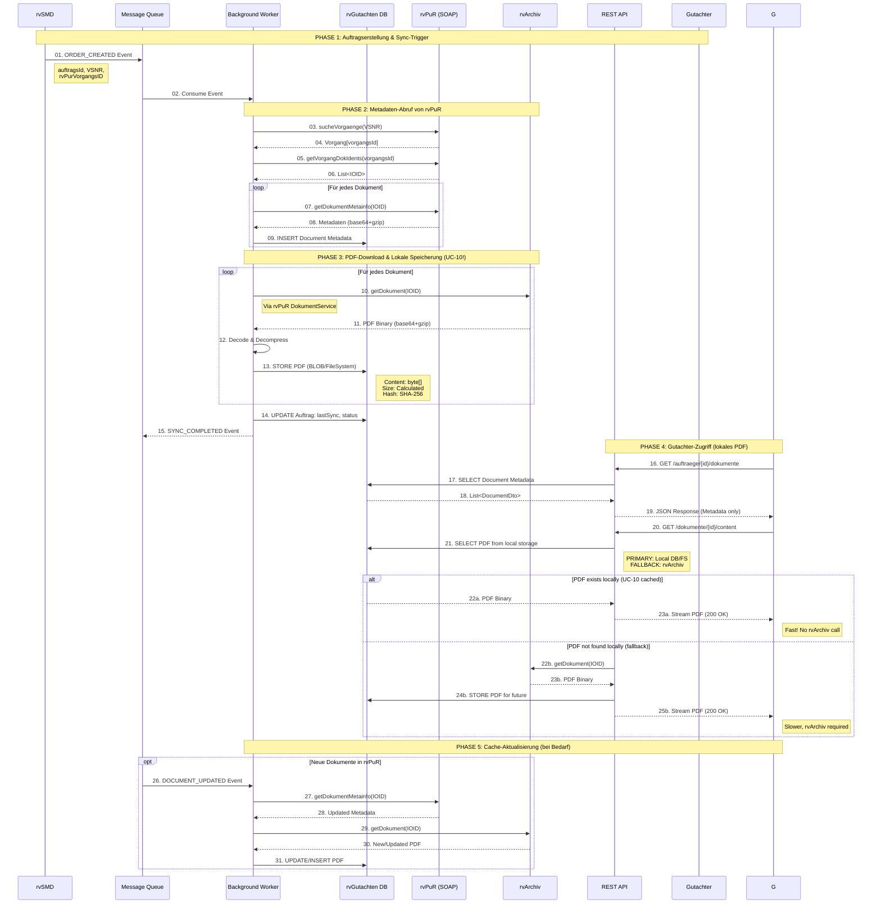
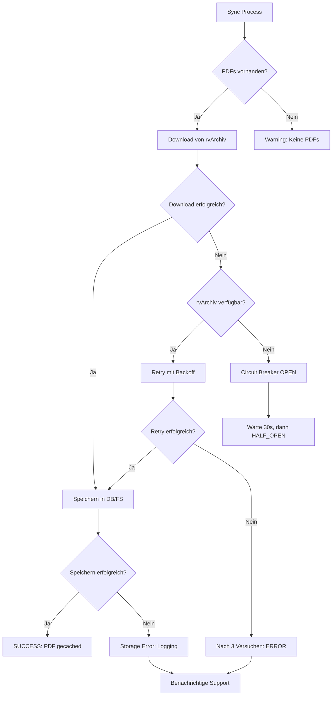

# UC-10: Automatisches Dokument-Caching (rvPuR → rvGutachten)

**Ziel:**
Per UC-10 werden alle PDF-Dokumente automatisch bei der Auftragserstellung vollständig in rvGutachten gespeichert (nicht nur Metadaten). Dies gewährleistet Performance und Verfügbarkeit auch bei rvArchiv-Ausfall.

---

## Akteure & Systeme
- **rvSMD**: Sendet neue Gutachtenaufträge
- **rvGutachten**: Empfängt Aufträge, cached PDFs lokal
- **Message Queue**: Asynchrone Kommunikation
- **Background Worker**: Synchronisationsprozess
- **rvPuR**: Dokumentenmetadaten-Service (SOAP)
- **rvArchiv**: PDF-Storage-Backend
- **Database/FileSystem**: Lokale PDF-Speicherung in rvGutachten
- **Gutachter**: Greift auf gecachte PDFs zu

---

## UC-10 Workflow: Vollständiges PDF-Caching



---

## Architekturentscheidung: ADR-006

**Kontext:**
UC-10 erfordert vollständiges PDF-Caching für Performance und Verfügbarkeit.

**Entscheidung:**
Alle PDFs werden während der initialen Synchronisation vollständig in rvGutachten gespeichert (Database BLOB oder File System).

**Vorteile:**
- Keine Netzwerk-Roundtrips zu rvArchiv beim Dokumentenabruf
- Verfügbar auch bei rvArchiv-Ausfall
- Konsistente Performance (< 100ms statt 500-2000ms)
- Reduzierte Last auf rvArchiv

**Nachteile:**
- Erhöhter Speicherbedarf in rvGutachten
- Längere initiale Synchronisation
- Datenschutz: PDFs länger vorgehalten
- Synchronisation bei Dokumentenänderungen nötig

---

## Implementierungshinweise

### Java Backend: PDF Storage während Sync

```java
@Service
public class DocumentSyncService {
    
    @Autowired
    private RvPurClient rvPurClient;
    
    @Autowired
    private RvArchivClient rvArchivClient;
    
    @Autowired
    private DocumentRepository documentRepository;
    
    @Autowired
    private PdfStorageService pdfStorageService;
    
    private static final Logger logger = LoggerFactory.getLogger(DocumentSyncService.class);
    
    public void syncDocumentsWithPdfCaching(UUID auftragsId, String vsnr) {
        // Phase 2: Metadaten abrufen
        List<Vorgang> vorgaenge = rvPurClient.sucheVorgaenge(vsnr);
        Vorgang vorgang = selectRelevantVorgang(vorgaenge);
        List<String> ioids = rvPurClient.getVorgangDokIdents(vorgang.getId());
        
        for (String ioid : ioids) {
            DokumentMetainfo metainfo = rvPurClient.getDokumentMetainfo(ioid);
            
            // Metadaten speichern
            Document document = documentRepository.save(Document.builder()
                .auftragsId(auftragsId)
                .purIOID(ioid)
                .docKlasse(metainfo.getDocKlasse())
                .datum(metainfo.getDatum())
                // ... weitere Felder
                .build());
            
            // Phase 3: UC-10 - PDF vollständig herunterladen und speichern
            byte[] pdfBinary = rvArchivClient.getDokument(ioid);
            
            pdfStorageService.storePdf(StoredDocument.builder()
                .documentId(document.getId())
                .purIOID(ioid)
                .content(pdfBinary)  // Vollständiger PDF-Inhalt
                .contentType("application/pdf")
                .size((long) pdfBinary.length)
                .hash(computeSHA256(pdfBinary))
                .storedAt(Instant.now())
                .build());
            
            logger.info("UC-10: PDF cached locally for Document {}, IOID {}, Size {} bytes",
                document.getId(), ioid, pdfBinary.length);
        }
    }
    
    private String computeSHA256(byte[] data) {
        try {
            MessageDigest digest = MessageDigest.getInstance("SHA-256");
            byte[] hash = digest.digest(data);
            return Base64.getEncoder().encodeToString(hash);
        } catch (NoSuchAlgorithmException e) {
            throw new RuntimeException("SHA-256 algorithm not available", e);
        }
    }
}
```

### Java Backend: PDF Retrieval mit lokalem Cache

```java
@RestController
@RequestMapping("/api/v1/dokumente")
public class DocumentContentController {
    
    @Autowired
    private DocumentRepository documentRepository;
    
    @Autowired
    private PdfStorageService pdfStorageService;
    
    @Autowired
    private RvArchivClient rvArchivClient;
    
    private static final Logger logger = LoggerFactory.getLogger(DocumentContentController.class);
    
    @GetMapping("/{documentId}/content")
    public ResponseEntity<Resource> getDocumentContent(@PathVariable UUID documentId) {
        Document document = documentRepository.findById(documentId)
            .orElseThrow(() -> new DocumentNotFoundException(documentId));
        
        // UC-10: Primär von lokalem Storage abrufen
        Optional<StoredDocument> storedPdf = pdfStorageService.getPdf(documentId);
        
        if (storedPdf.isPresent()) {
            logger.info("UC-10: Serving PDF from local cache for Document {}", documentId);
            
            ByteArrayResource resource = new ByteArrayResource(storedPdf.get().getContent());
            String filename = String.format("%s_%s.pdf", 
                document.getDocKlasseBezeichnung(), 
                document.getDatum().format(DateTimeFormatter.ISO_LOCAL_DATE));
            
            return ResponseEntity.ok()
                .contentType(MediaType.APPLICATION_PDF)
                .header(HttpHeaders.CONTENT_DISPOSITION, "inline; filename=\"" + filename + "\"")
                .body(resource);
        }
        
        // Fallback: Von rvArchiv abrufen (falls lokal nicht vorhanden)
        logger.warn("UC-10: PDF not in local cache, falling back to rvArchiv for Document {}", 
            documentId);
        
        byte[] pdfBinary = rvArchivClient.getDokument(document.getPurIOID());
        
        // Für zukünftige Anfragen speichern
        pdfStorageService.storePdf(StoredDocument.builder()
            .documentId(documentId)
            .purIOID(document.getPurIOID())
            .content(pdfBinary)
            .contentType("application/pdf")
            .size((long) pdfBinary.length)
            .storedAt(Instant.now())
            .build());
        
        ByteArrayResource resource = new ByteArrayResource(pdfBinary);
        return ResponseEntity.ok()
            .contentType(MediaType.APPLICATION_PDF)
            .body(resource);
    }
}
```

### TypeScript/Angular Frontend: Document Viewer Component

```typescript
@Component({
  selector: 'app-document-viewer',
  template: `
    <div class="document-viewer">
      <pdf-viewer 
        [src]="pdfSrc"
        [show-all]="true"
        [original-size]="false"
        (after-load-complete)="onPdfLoad($event)"
        (error)="onPdfError($event)">
      </pdf-viewer>
    </div>
  `
})
export class DocumentViewerComponent implements OnInit {
  @Input() documentId!: string;
  pdfSrc: string | undefined;
  
  constructor(
    private documentService: DocumentService,
    private snackBar: MatSnackBar
  ) {}
  
  ngOnInit(): void {
    this.loadDocument();
  }
  
  private loadDocument(): void {
    // UC-10: PDF wird vom Backend aus lokalem Cache geliefert
    this.pdfSrc = this.documentService.getDocumentContentUrl(this.documentId);
  }
  
  onPdfLoad(event: any): void {
    console.log('UC-10: PDF loaded from cache, pages:', event.numPages);
  }
  
  onPdfError(error: any): void {
    this.snackBar.open('Fehler beim Laden des Dokuments', 'Schließen', {
      duration: 5000
    });
    console.error('UC-10: PDF load error:', error);
  }
}

@Injectable({ providedIn: 'root' })
export class DocumentService {
  private readonly apiUrl = '/api/v1/dokumente';
  
  constructor(private http: HttpClient) {}
  
  getDocuments(auftragsId: string): Observable<DokumenteResponse> {
    return this.http.get<DokumenteResponse>(
      `${this.apiUrl}/../gutachtenauftraege/${auftragsId}/dokumente`
    );
  }
  
  getDocumentContentUrl(documentId: string): string {
    // UC-10: URL zeigt auf lokalen Cache-Endpoint
    return `${this.apiUrl}/${documentId}/content`;
  }
  
  downloadDocument(documentId: string, filename: string): void {
    this.http.get(`${this.apiUrl}/${documentId}/content`, {
      responseType: 'blob'
    }).subscribe(blob => {
      const url = window.URL.createObjectURL(blob);
      const link = document.createElement('a');
      link.href = url;
      link.download = filename;
      link.click();
      window.URL.revokeObjectURL(url);
    });
  }
}
```

---

## Speicheroptionen

### Option 1: Database BLOB
```sql
CREATE TABLE StoredDocuments (
    DocumentId UNIQUEIDENTIFIER PRIMARY KEY,
    PurIOID NVARCHAR(50) NOT NULL,
    Content VARBINARY(MAX) NOT NULL,  -- PDF binary
    ContentType NVARCHAR(100) NOT NULL,
    Size BIGINT NOT NULL,
    Hash NVARCHAR(64) NOT NULL,       -- SHA-256
    StoredAt DATETIME2 NOT NULL,
    CONSTRAINT FK_StoredDocuments_Documents 
        FOREIGN KEY (DocumentId) REFERENCES Documents(Id)
);
```

**Vorteile:** Transaktionssicherheit, Backup inklusive, einfache Abfragen  
**Nachteile:** Größere Datenbank, potenzielle Performance-Probleme bei sehr großen PDFs

### Option 2: File System
```
/storage/pdfs/
  ├── 2025-11/
  │   ├── 123e4567-e89b-12d3-a456-426614174000.pdf
  │   └── 234e5678-f90c-23e4-b567-537725285111.pdf
  └── 2025-12/
      └── ...
```

**Vorteile:** Besser für große Dateien, Betriebssystem-Caching, einfache manuelle Prüfung  
**Nachteile:** Komplexere Backup-Strategie, Pfadverwaltung nötig

---

## Performance-Vergleich

| Szenario | Ohne UC-10 (rvArchiv) | Mit UC-10 (lokal) | Verbesserung |
|----------|------------------------|-------------------|--------------|
| Dokumentenabruf | 500-2000ms | 50-100ms | 90-95% |
| Parallele Zugriffe | Begrenzt durch rvArchiv | Nur durch DB/FS | 5-10x |
| rvArchiv Ausfall | Dokumente nicht verfügbar | Vollständig verfügbar | 100% |
| Netzwerklast | Hoch (jeder Abruf) | Niedrig (nur Sync) | 80-90% |

---

## Fehlerbehandlung



---

## Monitoring & Metriken

**Zu überwachen:**
- Anzahl gecachter PDFs pro Auftrag
- Durchschnittliche PDF-Größe
- Gesamtspeicherverbrauch
- Cache-Hit-Rate (sollte > 95% sein)
- Fallback-zu-rvArchiv-Rate (sollte < 5% sein)
- Sync-Dauer pro Auftrag
- Fehlerrate beim PDF-Download

**Alerts:**
- Cache-Hit-Rate < 90%
- Speicherverbrauch > 80% Kapazität
- Sync-Fehlerrate > 5%
- Durchschnittliche Sync-Dauer > 5 Minuten

---

## Bezug zu anderen Use Cases

- **UC-04**: Auftragsübersicht nutzt gecachte Metadaten
- **UC-05**: Dokumenteneinsicht greift auf lokale PDFs zu
- **UC-06**: Detaillierter Data Flow für rvPuR-Integration
- **UC-13**: Bei Auftragsstornierung Cache-Bereinigung

---

## Quellen & Referenzen

- **use-cases-mvp-development.md**: UC-10 Spezifikation
- **UC-06-Data-Flow-Traceability-Matrix.md**: ADR-006, Implementierung
- **rvPuR-REST-API-Specification.md**: API-Endpoints mit UC-10 Integration
- **openapi.yaml**: Maschinenlesbare API-Spezifikation

---

**Document Version:** 1.0  
**Erstellt:** November 12, 2025  
**Status:** Approved  
**Autor:** Development Team rvGutachten
