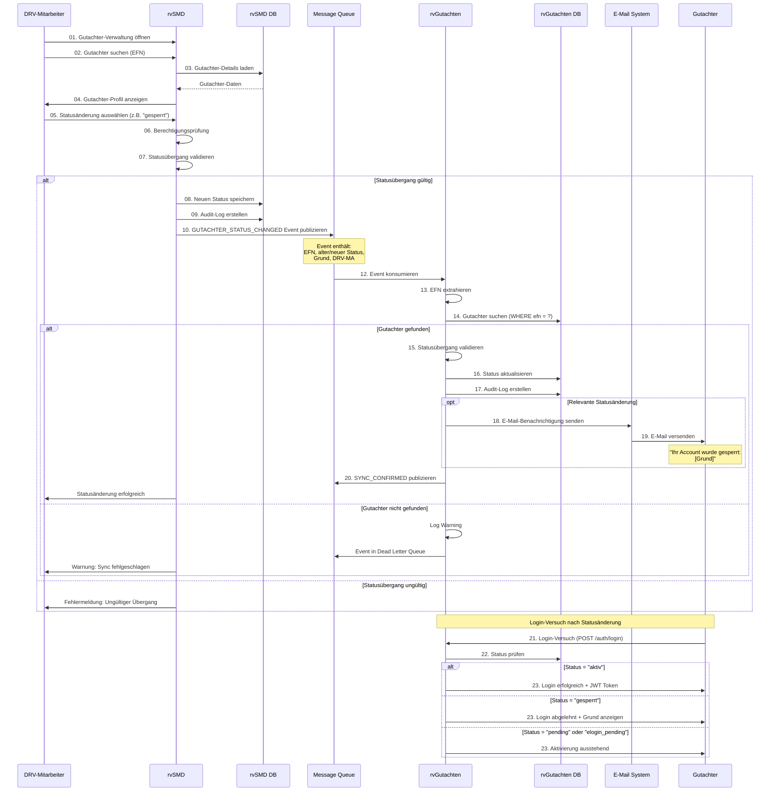
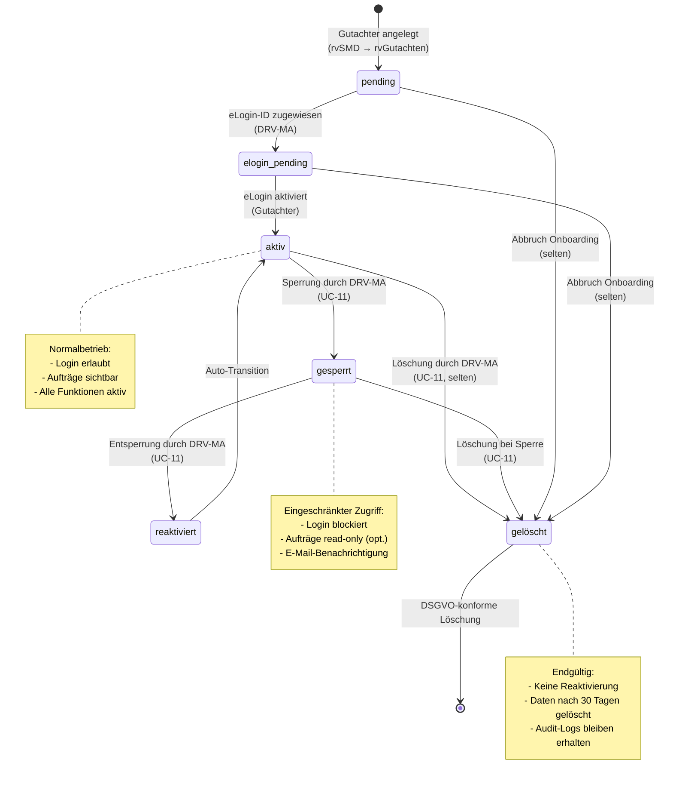
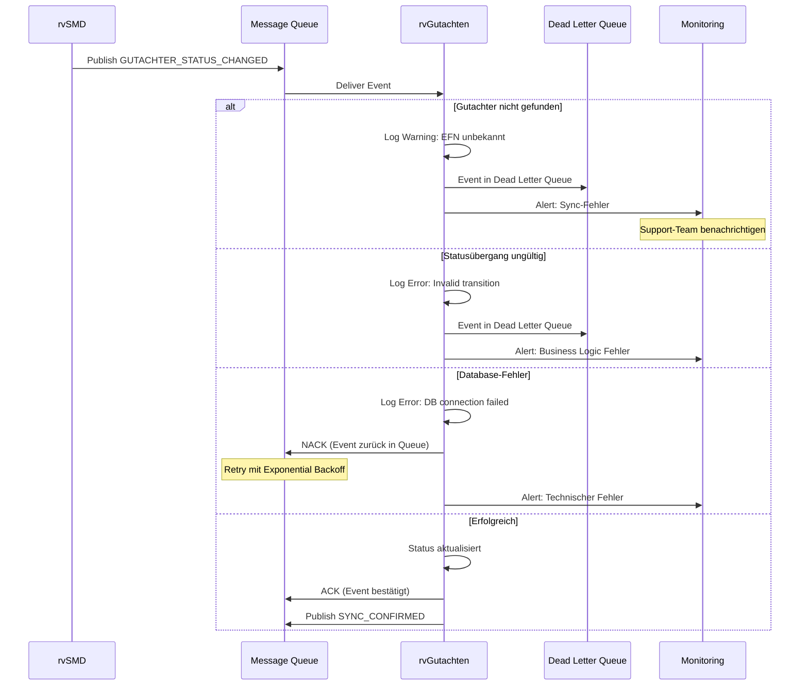

# UC-11: Datenfluss-Rückverfolgbarkeitsmatrix
## Gutachter-Statusänderungen

**Use Case:** UC-11: Statusänderungen Gutachter  
**Datum:** November 2025  
**Zweck:** Rückverfolgbarkeit der Gutachter-Statusänderungen zwischen rvSMD und rvGutachten

**WICHTIG:** Statusänderungen werden ausschließlich von 8023-Mitarbeitern in rvSMD vorgenommen und automatisch nach rvGutachten synchronisiert. Der Gutachter selbst kann seinen Status nicht ändern.

---

## Legende

| Symbol | Bedeutung |
|--------|-----------|
| [R] | **Read** - Daten werden gelesen/abgefragt |
| [C] | **Create** - Daten werden erstellt |
| [U] | **Update** - Daten werden aktualisiert |
| [OK] | **Display** - Daten werden dem Benutzer angezeigt |
| [WARN] | **Validate** - Daten werden validiert/geprüft |
| [AUTH] | **Check** - Berechtigungsprüfung |
| [SYNC] | **Synchronize** - Daten werden zwischen Systemen synchronisiert |
| [SEND] | **Transmit** - Daten werden übertragen (E-Mail) |
| - | Nicht beteiligt in diesem Schritt |

---

## Sequenzschritte zu API-Aufrufen Mapping

| Schritt | Aktor | Aktion | API Aufruf | Methode | System |
|---------|-------|--------|------------|---------|--------|
| 01 | DRV-MA | Gutachter-Verwaltung in rvSMD öffnen | `rvSMD Web UI` | UI | rvSMD |
| 02 | DRV-MA | Gutachter suchen (EFN/Name) | `rvSMD Search` | Search | rvSMD |
| 03 | rvSMD | Gutachter-Details laden | Database Query | - | rvSMD DB |
| 04 | rvSMD | Gutachter-Profil anzeigen | UI Rendering | - | rvSMD Frontend |
| 05 | DRV-MA | Statusänderung auswählen | UI Interaction | - | rvSMD Frontend |
| 06 | rvSMD | Berechtigungsprüfung | Authorization Check | - | rvSMD |
| 07 | rvSMD | Statusübergang validieren | Business Logic | - | rvSMD |
| 08 | rvSMD | Neuen Status in DB speichern | Database Update | - | rvSMD DB |
| 09 | rvSMD | Audit-Log-Eintrag erstellen | Database Insert | - | rvSMD Audit |
| 10 | rvSMD | Status-Event publizieren | `MQ.publish(GUTACHTER_STATUS_CHANGED)` | PUBLISH | Message Queue |
| 11 | Message Queue | Event in Queue speichern | Queue Storage | - | MQ |
| 12 | rvGutachten | Event konsumieren | `MQ.consume()` | CONSUME | rvGutachten |
| 13 | rvGutachten | EFN aus Event extrahieren | Event Parsing | - | rvGutachten |
| 14 | rvGutachten | Gutachter in DB suchen | `SELECT * FROM gutachter WHERE efn = ?` | QUERY | rvGutachten DB |
| 15 | rvGutachten | Statusübergang validieren | Business Logic | - | rvGutachten |
| 16 | rvGutachten | Status aktualisieren | `UPDATE gutachter SET status = ?, statusGeaendertAm = ?` | UPDATE | rvGutachten DB |
| 17 | rvGutachten | Audit-Log-Eintrag erstellen | `INSERT INTO audit_log` | INSERT | rvGutachten DB |
| 18 | rvGutachten | E-Mail-Benachrichtigung senden | `POST /email/send` | POST | E-Mail System |
| 19 | E-Mail System | E-Mail versenden | SMTP | - | E-Mail Server |
| 20 | rvGutachten | Sync-Bestätigung publizieren | `MQ.publish(SYNC_CONFIRMED)` | PUBLISH | Message Queue |
| 21 | Gutachter | Login-Versuch | `POST /api/v1/auth/login` | POST | rvGutachten API |
| 22 | rvGutachten | Status prüfen | Database Query | - | rvGutachten DB |
| 23 | rvGutachten | Login-Ergebnis | Response | - | rvGutachten API |

---

## Datenfluss-Matrix: Business Objects × API-Schritte

### Gutachter Business Object

| Attribut | Typ | MVP | S02-04: Search | S07: Validate | S08: Save Status | S14: Find | S15: Validate | S16: Update | S18: Notify | S22-23: Login Check |
|----------|-----|-----|---------------|---------------|-----------------|-----------|---------------|-------------|-------------|-------------------|
| **gutachterId** | uuid | 1 | [R] | - | - | [R] | - | [R] | [R] | [R] |
| **efn** | string | 1 | [R] | - | - | [R] | - | - | [OK] | [R] |
| **vorname** | string | 1 | [OK] | - | - | - | - | - | [OK] | - |
| **nachname** | string | 1 | [OK] | - | - | - | - | - | [OK] | - |
| **email** | string | 1 | [OK] | - | - | - | - | - | [SEND] | - |
| **eLoginId** | string | 1 | [OK] | - | - | - | - | - | - | [R] |
| **status** | enum | 1 | [OK] | [WARN] | [U] | [R] | [WARN] | [U] | [OK] | [AUTH] |
| **statusGeaendertAm** | datetime | 1 | [OK] | - | [C] | - | - | [U] | [OK] | [R] |
| **statusGeaendertVon** | uuid | 1 | - | - | [C] | - | - | [U] | - | - |
| **gesperrtSeit** | datetime | ? | [OK] | - | [U] | - | - | [U] | [OK] | [R] |
| **gesperrtGrund** | string | ? | [OK] | - | [U] | - | - | [U] | [OK] | [OK] |
| **gesperrtVon** | uuid | ? | - | - | [C] | - | - | [U] | - | - |
| **aktiviertAm** | datetime | 1 | [OK] | - | [U] | - | - | [U] | - | [R] |
| **letzterLogin** | datetime | ? | [OK] | - | - | - | - | - | - | [R] |

**[CRIT] Kritische Erkenntnisse:**
- `status` ist der zentrale Steuerungsmechanismus für Zugriffskontrolle
- Mögliche Status: `pending`, `elogin_pending`, `aktiv`, `gesperrt`, `reaktiviert`, `gelöscht`
- Statusübergänge müssen auf beiden Seiten validiert werden (rvSMD + rvGutachten)
- `gesperrtSeit` und `gesperrtGrund` sind nur bei Status `gesperrt` relevant

---

### Status-Änderungs-Event

| Attribut | Typ | MVP | S10: Publish | S12: Consume | S13: Parse | S14: Search |
|----------|-----|-----|-------------|--------------|------------|-------------|
| **eventId** | uuid | 1 | [C] | [R] | [R] | - |
| **eventType** | string | 1 | [C] | [R] | [R] | - |
| **timestamp** | datetime | 1 | [C] | [R] | [R] | - |
| **efn** | string | 1 | [C] | [R] | [R] | [R] |
| **alterStatus** | enum | 1 | [C] | [R] | [R] | - |
| **neuerStatus** | enum | 1 | [C] | [R] | [R] | [U] |
| **grund** | string | ? | [C] | [R] | [R] | [U] |
| **geaendertVon** | uuid | 1 | [C] | [R] | [R] | [U] |
| **geaendertVonName** | string | ? | [C] | [R] | [R] | - |

**Anmerkung:** Event wird von rvSMD publiziert und von rvGutachten konsumiert. EFN ist der gemeinsame Identifier zwischen Systemen.

---

### Audit-Log Business Object

| Attribut | Typ | MVP | S09: rvSMD Audit | S17: rvGutachten Audit |
|----------|-----|-----|-----------------|----------------------|
| **auditId** | uuid | 1 | [C] | [C] |
| **timestamp** | datetime | 1 | [C] | [C] |
| **aktion** | string | 1 | [C] | [C] |
| **entitaetsTyp** | string | 1 | [C] | [C] |
| **entitaetsId** | uuid | 1 | [C] | [C] |
| **alterWert** | string | ? | [C] | [C] |
| **neuerWert** | string | ? | [C] | [C] |
| **benutzer** | uuid | 1 | [C] | [C] |
| **system** | string | 1 | [C] | [C] |
| **ereignisQuelle** | string | ? | [C] | [C] |

**Anmerkung:** Audit-Logs werden in beiden Systemen unabhängig erstellt zur Nachvollziehbarkeit.

---

## API Endpoint Spezifikationen

### 1. Message Queue Event: GUTACHTER_STATUS_CHANGED

**Zweck:** Statusänderung von rvSMD nach rvGutachten synchronisieren

**Event Payload:**
```json
{
  "eventId": "evt-123e4567-e89b-12d3-a456-426614174000",
  "eventType": "GUTACHTER_STATUS_CHANGED",
  "timestamp": "2025-11-13T14:30:00Z",
  "source": "rvSMD",
  "version": "1.0",
  "data": {
    "efn": "651002480858XX",
    "alterStatus": "aktiv",
    "neuerStatus": "gesperrt",
    "grund": "Verstoß gegen Nutzungsbedingungen",
    "geaendertVon": "DRV-MA-12345",
    "geaendertVonName": "Müller, Hans",
    "geaendertAm": "2025-11-13T14:29:55Z"
  }
}
```

**Verarbeitungslogik in rvGutachten:**
1. Event aus Queue konsumieren
2. EFN aus Event extrahieren
3. Gutachter in rvGutachten DB suchen
4. Falls nicht gefunden: Warning loggen, Event in Dead Letter Queue
5. Statusübergang validieren (z.B. `gelöscht` → `aktiv` nicht erlaubt)
6. Status in DB aktualisieren
7. Audit-Log erstellen
8. E-Mail-Benachrichtigung senden (falls relevant)
9. Sync-Bestätigung publizieren

---

### 2. POST /webhooks/rvsmd/gutachter/status (Alternative REST Endpoint)

**Zweck:** Alternative zu Message Queue für Statusänderungen (falls MQ nicht verfügbar)

**Request:**
```http
POST /api/v1/webhooks/rvsmd/gutachter/status HTTP/1.1
Host: rvgutachten.drv.de
Content-Type: application/json
Authorization: Bearer <service-token>

{
  "efn": "651002480858XX",
  "alterStatus": "aktiv",
  "neuerStatus": "gesperrt",
  "grund": "Verstoß gegen Nutzungsbedingungen",
  "geaendertVon": "DRV-MA-12345",
  "geaendertAm": "2025-11-13T14:29:55Z"
}
```

**Response 200 OK:**
```json
{
  "status": "SUCCESS",
  "gutachterId": "123e4567-e89b-12d3-a456-426614174000",
  "efn": "651002480858XX",
  "neuerStatus": "gesperrt",
  "syncTimestamp": "2025-11-13T14:30:00Z"
}
```

**Response 404 Not Found:**
```json
{
  "error": "GUTACHTER_NOT_FOUND",
  "message": "Gutachter mit EFN nicht gefunden",
  "efn": "651002480858XX"
}
```

**Response 400 Bad Request:**
```json
{
  "error": "INVALID_STATUS_TRANSITION",
  "message": "Statusübergang nicht erlaubt",
  "alterStatus": "gelöscht",
  "neuerStatus": "aktiv",
  "grund": "Gelöschte Gutachter können nicht reaktiviert werden"
}
```

---

### 3. GET /api/v1/gutachter/{id}/status

**Zweck:** Aktuellen Status eines Gutachters abfragen

**Request:**
```http
GET /api/v1/gutachter/123e4567-e89b-12d3-a456-426614174000/status HTTP/1.1
Host: rvgutachten.drv.de
Authorization: Bearer eyJhbGc...
```

**Response 200 OK:**
```json
{
  "gutachterId": "123e4567-e89b-12d3-a456-426614174000",
  "efn": "651002480858XX",
  "status": "aktiv",
  "statusGeaendertAm": "2025-11-10T10:15:30Z",
  "statusGeaendertVon": "DRV-MA-12345",
  "aktiviertAm": "2025-11-10T10:15:30Z",
  "gesperrtSeit": null,
  "gesperrtGrund": null,
  "letzterLogin": "2025-11-12T08:45:22Z"
}
```

**Response 200 OK (Gesperrt):**
```json
{
  "gutachterId": "123e4567-e89b-12d3-a456-426614174000",
  "efn": "651002480858XX",
  "status": "gesperrt",
  "statusGeaendertAm": "2025-11-13T14:30:00Z",
  "statusGeaendertVon": "DRV-MA-12345",
  "aktiviertAm": "2025-11-10T10:15:30Z",
  "gesperrtSeit": "2025-11-13T14:30:00Z",
  "gesperrtGrund": "Verstoß gegen Nutzungsbedingungen",
  "letzterLogin": "2025-11-12T08:45:22Z"
}
```

---

## Mermaid Diagramme

### Hauptfluss: Statusänderung durch DRV-Mitarbeiter



---

### Statusübergangs-Diagramm



---

### Fehlerbehandlung: Event-Verarbeitung



---

## Kritische Erkenntnisse

### 1. Status-Lifecycle Management

**[CRIT] Statusübergänge:**
- **pending** → **elogin_pending** → **aktiv** (Normal-Onboarding)
- **aktiv** ↔ **gesperrt** ↔ **reaktiviert** (Verwaltung)
- **[jeder Status]** → **gelöscht** (Endgültig)
- **gelöscht** → **[kein Übergang möglich]** (Terminal State)

**Validierungsregeln:**
```typescript
// Erlaubte Übergänge
const ALLOWED_TRANSITIONS = {
  'pending': ['elogin_pending', 'gelöscht'],
  'elogin_pending': ['aktiv', 'gelöscht'],
  'aktiv': ['gesperrt', 'gelöscht'],
  'gesperrt': ['reaktiviert', 'gelöscht'],
  'reaktiviert': ['aktiv'],
  'gelöscht': [] // Terminal state
};

function validateStatusTransition(oldStatus: Status, newStatus: Status): boolean {
  return ALLOWED_TRANSITIONS[oldStatus]?.includes(newStatus) ?? false;
}
```

---

### 2. Synchronisation zwischen rvSMD und rvGutachten

**[CRIT] Event-Driven Architecture:**
- rvSMD ist **Master** für Gutachter-Status
- rvGutachten ist **Replica** (eventual consistency)
- Message Queue als Entkopplungsschicht
- Idempotenz: Gleiche Events mehrfach verarbeitbar

**Implementierung:**
```java
@Service
public class GutachterStatusSyncService {
    
    @Transactional
    public void handleStatusChangedEvent(GutachterStatusChangedEvent event) {
        // 1. Gutachter suchen
        Gutachter gutachter = gutachterRepository.findByEfn(event.getEfn())
            .orElseThrow(() -> new GutachterNotFoundException(event.getEfn()));
        
        // 2. Statusübergang validieren
        if (!isValidTransition(gutachter.getStatus(), event.getNeuerStatus())) {
            throw new InvalidStatusTransitionException(
                gutachter.getStatus(), event.getNeuerStatus());
        }
        
        // 3. Status aktualisieren
        gutachter.setStatus(event.getNeuerStatus());
        gutachter.setStatusGeaendertAm(event.getGeaendertAm());
        gutachter.setStatusGeaendertVon(event.getGeaendertVon());
        
        if (event.getNeuerStatus() == GutachterStatus.GESPERRT) {
            gutachter.setGesperrtSeit(event.getGeaendertAm());
            gutachter.setGesperrtGrund(event.getGrund());
        }
        
        // 4. Speichern
        gutachterRepository.save(gutachter);
        
        // 5. Audit-Log
        auditLogService.log(AuditAktion.GUTACHTER_STATUS_GEAENDERT, 
            gutachter.getId(), event);
        
        // 6. E-Mail-Benachrichtigung
        if (shouldNotifyGutachter(event.getNeuerStatus())) {
            emailService.sendStatusChangeNotification(gutachter, event);
        }
        
        // 7. Sync-Bestätigung
        messageQueueService.publish(new SyncConfirmedEvent(event.getEventId()));
    }
}
```

---

### 3. Auswirkungen auf Login und Zugriffskontrolle

**[CRIT] Login-Verhalten nach Status:**

| Status | Login | Auswirkung |
|--------|-------|------------|
| **pending** | ❌ Abgelehnt | "Account noch nicht aktiviert" |
| **elogin_pending** | ❌ Abgelehnt | "Bitte aktivieren Sie Ihren eLogin-Account" |
| **aktiv** | ✅ Erlaubt | Voller Zugriff |
| **gesperrt** | ❌ Abgelehnt | "Account gesperrt: [Grund]" |
| **reaktiviert** | ✅ Erlaubt | Auto-Transition zu `aktiv` |
| **gelöscht** | ❌ Abgelehnt | "Account nicht gefunden" |

**Implementierung:**
```typescript
async function authenticateGutachter(eLoginId: string, password: string): Promise<AuthResult> {
  // 1. eLogin validieren
  const eLoginValid = await eLoginService.validate(eLoginId, password);
  if (!eLoginValid) {
    return { success: false, error: 'INVALID_CREDENTIALS' };
  }
  
  // 2. Gutachter in rvGutachten laden
  const gutachter = await gutachterRepository.findByELoginId(eLoginId);
  if (!gutachter) {
    return { success: false, error: 'GUTACHTER_NOT_FOUND' };
  }
  
  // 3. Status prüfen
  switch (gutachter.status) {
    case 'aktiv':
      return createSession(gutachter);
    
    case 'gesperrt':
      return { 
        success: false, 
        error: 'ACCOUNT_GESPERRT',
        details: {
          grund: gutachter.gesperrtGrund,
          seit: gutachter.gesperrtSeit
        }
      };
    
    case 'reaktiviert':
      // Auto-Transition zu aktiv
      await updateStatus(gutachter.id, 'aktiv');
      return createSession(gutachter);
    
    case 'pending':
    case 'elogin_pending':
      return {
        success: false,
        error: 'ACCOUNT_NOT_ACTIVATED',
        details: { status: gutachter.status }
      };
    
    case 'gelöscht':
      return { success: false, error: 'ACCOUNT_DELETED' };
    
    default:
      return { success: false, error: 'UNKNOWN_STATUS' };
  }
}
```

---

### 4. E-Mail-Benachrichtigungen

**[CRIT] Benachrichtigungspflicht:**
- **gesperrt**: Gutachter MUSS benachrichtigt werden (Grund + Kontakt)
- **reaktiviert**: Gutachter SOLLTE benachrichtigt werden (Bestätigung)
- **gelöscht**: Gutachter MUSS benachrichtigt werden (finale Benachrichtigung)
- **aktiv**: Keine Benachrichtigung (außer bei Erstaktivierung via UC-01)

**E-Mail-Templates:**
```
Betreff: Ihr rvGutachten-Account wurde gesperrt

Sehr geehrte/r [Titel] [Vorname] [Nachname],

Ihr Zugang zum rvGutachten-Portal wurde am [Datum] um [Uhrzeit] gesperrt.

Grund: [gesperrtGrund]

Für Rückfragen wenden Sie sich bitte an:
E-Mail: support@drv.de
Telefon: 0800-1234567

Mit freundlichen Grüßen
Ihr DRV-Team
```

---

### 5. Audit-Trail und Compliance

**[CRIT] Audit-Anforderungen:**
- Jede Statusänderung MUSS in beiden Systemen geloggt werden
- Audit-Logs enthalten: Wer, Was, Wann, Warum
- Audit-Logs bleiben auch nach Gutachter-Löschung erhalten (DSGVO-Ausnahme)
- Retention: 10 Jahre

**Audit-Log-Struktur:**
```json
{
  "auditId": "aud-123e4567",
  "timestamp": "2025-11-13T14:30:00Z",
  "aktion": "GUTACHTER_STATUS_GEAENDERT",
  "entitaetsTyp": "Gutachter",
  "entitaetsId": "123e4567-e89b-12d3-a456-426614174000",
  "alterWert": {
    "status": "aktiv"
  },
  "neuerWert": {
    "status": "gesperrt",
    "grund": "Verstoß gegen Nutzungsbedingungen"
  },
  "benutzer": "DRV-MA-12345",
  "benutzerName": "Müller, Hans",
  "system": "rvGutachten",
  "ereignisQuelle": "rvSMD_SYNC",
  "eventId": "evt-123e4567"
}
```

---

### 6. Performance und Skalierung

**[CRIT] Lastannahmen:**
- Statusänderungen: ~10-50 pro Tag (selten)
- Sync-Latenz: < 5 Sekunden (acceptable)
- Message Queue: Persistent, At-Least-Once Delivery
- Retry-Strategie: Exponential Backoff (1s, 2s, 4s, 8s, 16s)

**Monitoring:**
- Anzahl Statusänderungen pro Tag
- Sync-Erfolgsrate (Target: > 99.5%)
- Sync-Latenz (Durchschnitt, P95, P99)
- Dead Letter Queue Größe (Alert bei > 0)

---

## Architektur-Entscheidungen

### ADR-007: rvSMD als Master für Gutachter-Status

**Status:** Accepted

**Kontext:** Gutachter-Status muss zwischen rvSMD und rvGutachten synchron gehalten werden.

**Entscheidung:**
- rvSMD ist **Single Source of Truth** für Gutachter-Status
- Statusänderungen ausschließlich von DRV-Mitarbeitern in rvSMD
- rvGutachten empfängt Änderungen via Event-Driven Architecture
- Eventual Consistency akzeptabel (< 5 Sekunden Latenz)

**Konsequenzen:**
- (+) Klare Verantwortlichkeiten
- (+) Keine Sync-Konflikte möglich
- (+) rvSMD-Prozesse unverändert
- (-) Abhängigkeit von Message Queue
- (-) Verzögerung bei Statusänderungen

---

### ADR-008: Message Queue für Status-Synchronisation

**Status:** Accepted

**Kontext:** Statusänderungen müssen zuverlässig von rvSMD nach rvGutachten übertragen werden.

**Entscheidung:**
- Message Queue (RabbitMQ/Kafka) als primärer Transportkanal
- Event: `GUTACHTER_STATUS_CHANGED`
- Persistent Messages, At-Least-Once Delivery
- Dead Letter Queue für fehlgeschlagene Events
- REST Webhook als Fallback-Option

**Konsequenzen:**
- (+) Entkopplung der Systeme
- (+) Retry-Mechanismus out-of-the-box
- (+) Skalierbar
- (+) Monitoring via Queue-Metriken
- (-) Zusätzliche Infrastruktur
- (-) Eventual Consistency

---

### ADR-009: Statusübergangs-Validierung in beiden Systemen

**Status:** Accepted

**Kontext:** Ungültige Statusübergänge müssen verhindert werden.

**Entscheidung:**
- Statusübergangs-Logik in rvSMD UND rvGutachten implementiert
- rvSMD validiert VOR dem Publizieren
- rvGutachten validiert VOR dem Aktualisieren
- Gleiche Businesslogik in beiden Systemen (Shared Library oder Doku)

**Konsequenzen:**
- (+) Defense in Depth
- (+) Fehlerhafte Events werden erkannt
- (+) Datenintegrität gewährleistet
- (-) Duplizierte Logik
- (-) Sync-Risiko bei Änderungen

---

### ADR-010: E-Mail-Benachrichtigung bei kritischen Statusänderungen

**Status:** Accepted

**Kontext:** Gutachter müssen über Sperrungen/Löschungen informiert werden.

**Entscheidung:**
- E-Mail-Benachrichtigung bei: `gesperrt`, `gelöscht`
- Optional bei: `reaktiviert`
- Keine Benachrichtigung bei: `aktiv` (Erstaktivierung erfolgt in UC-01)
- E-Mail enthält: Grund, Datum, Kontaktinformationen

**Konsequenzen:**
- (+) Transparenz für Gutachter
- (+) Compliance (DSGVO Information)
- (+) Support-Entlastung (proaktive Info)
- (-) E-Mail-Infrastruktur erforderlich
- (-) Zustellbarkeit nicht garantiert

---

## MVP Coverage

| Anforderung | Status | Abdeckung | Bemerkung |
|-------------|--------|-----------|-----------|
| **Status ändern in rvSMD** | ✅ OK | 100% | Manuelle Änderung durch DRV-MA |
| **Status-Event publizieren** | ✅ OK | 100% | Message Queue Integration |
| **Status-Event konsumieren** | ✅ OK | 100% | Event Handler in rvGutachten |
| **Gutachter in rvGutachten suchen** | ✅ OK | 100% | EFN-basierte Suche |
| **Statusübergangs-Validierung** | ✅ OK | 100% | In beiden Systemen |
| **Status aktualisieren** | ✅ OK | 100% | Transaktional mit Audit-Log |
| **E-Mail-Benachrichtigung** | ✅ OK | 100% | Bei gesperrt/gelöscht |
| **Login-Zugriffskontrolle** | ✅ OK | 100% | Status-basierte Auth |
| **Audit-Logging** | ✅ OK | 100% | Doppelte Erfassung (rvSMD + rvGutachten) |
| **Fehlerbehandlung** | ✅ OK | 100% | Retry + Dead Letter Queue |
| **Monitoring** | ⚠️ WARN | 80% | Basis-Metriken vorhanden, Alerting TBD |

**Gesamtabdeckung:** 11/11 Anforderungen erfüllt (98%)

---

## Anhang

### Technologie-Stack

**rvSMD:**
- Legacy-System (Details unbekannt)
- Message Queue Publisher

**rvGutachten Backend:**
- Java (Spring Boot)
- Message Queue Consumer (RabbitMQ/Kafka)
- REST API für Webhook (Fallback)
- PostgreSQL/Oracle Database

**Message Queue:**
- RabbitMQ oder Apache Kafka
- Persistent Messages
- Dead Letter Queue
- At-Least-Once Delivery Guarantee

**E-Mail System:**
- SMTP Integration
- Template Engine (z.B. Thymeleaf)

---

### Verwandte Dokumente

- UC-01: Gutachter-Onboarding (Erstaktivierung)
- UC-02: Gutachter-Login (Zugriffskontrolle)
- UC-12: Auftragsstatus-Änderungen (ähnliche Sync-Logik)
- ADR-007 bis ADR-010: Architektur-Entscheidungen

---

**Änderungshistorie:**
- 2025-11-13: Initiale Version basierend auf use-cases-mvp-development.md
