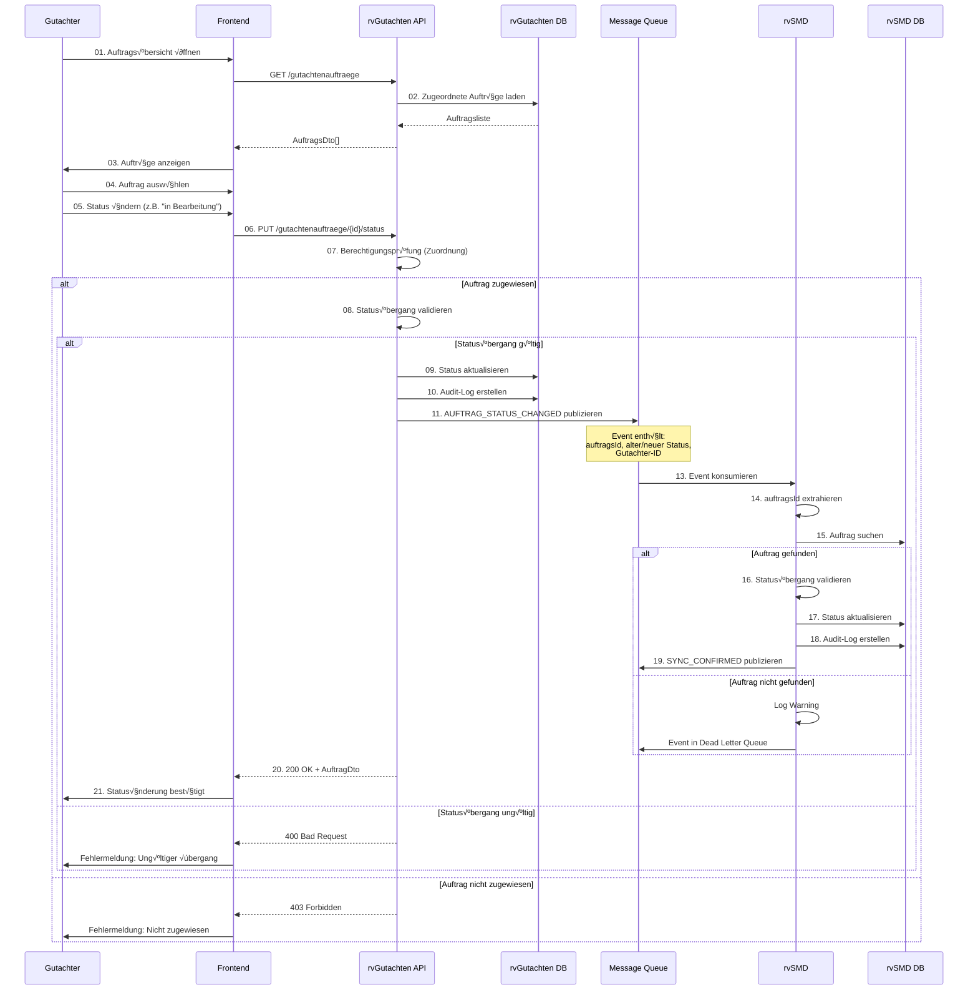
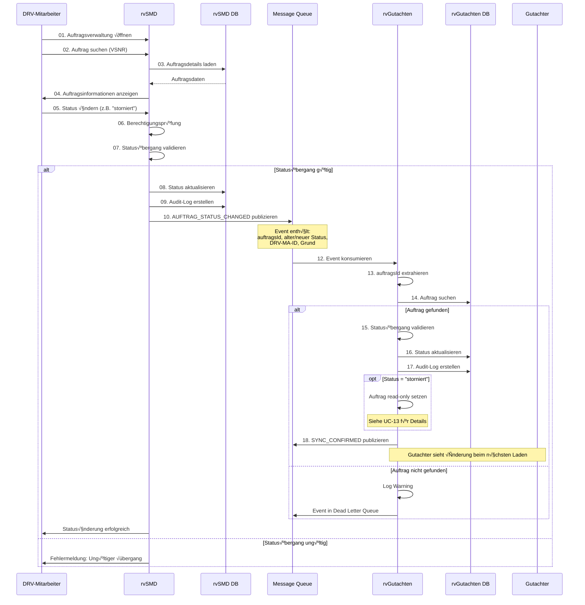
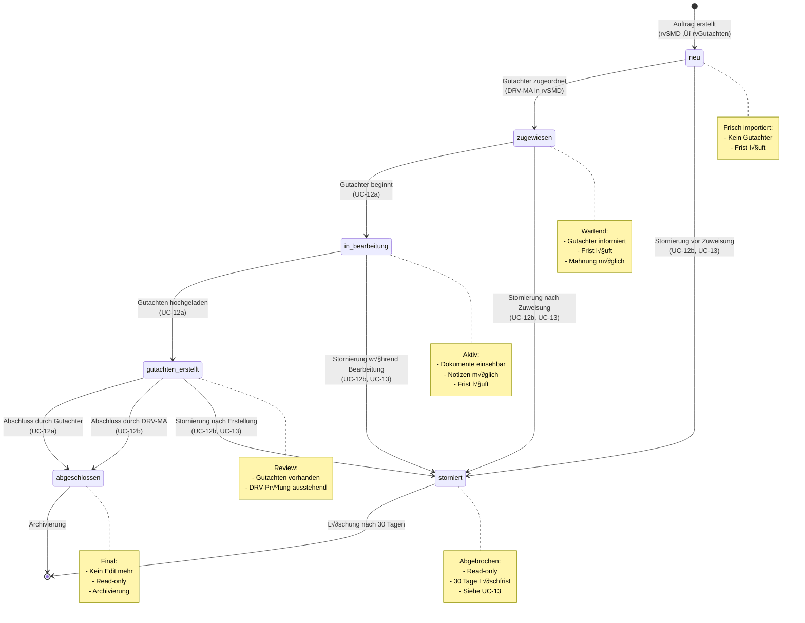
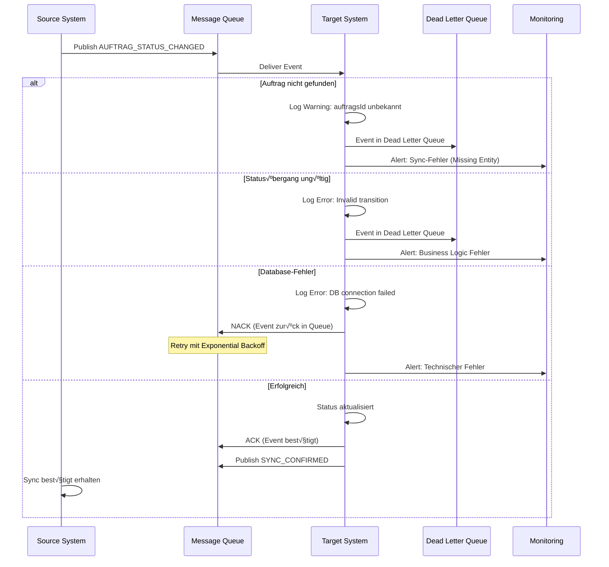

# UC-12: Datenfluss-Rückverfolgbarkeitsmatrix
## Auftragsstatus-Änderungen

**Use Case:** UC-12a/b: Auftragsstatus-Änderungen  
**Datum:** November 2025  
**Zweck:** Rückverfolgbarkeit der Auftragsstatus-Änderungen zwischen rvGutachten und rvSMD

**WICHTIG:** Dieser Use Case umfasst zwei Szenarien:
- **UC-12a:** Gutachter ändert Status in rvGutachten → Sync nach rvSMD
- **UC-12b:** DRV-Mitarbeiter ändert Status in rvSMD → Sync nach rvGutachten (inkl. Stornierung UC-13)

---

## Legende

| Symbol | Bedeutung |
|--------|-----------|
| [R] | **Read** - Daten werden gelesen/abgefragt |
| [C] | **Create** - Daten werden erstellt |
| [U] | **Update** - Daten werden aktualisiert |
| [OK] | **Display** - Daten werden dem Benutzer angezeigt |
| [WARN] | **Validate** - Daten werden validiert/geprüft |
| [AUTH] | **Check** - Berechtigungsprüfung |
| [SYNC] | **Synchronize** - Daten werden zwischen Systemen synchronisiert |
| - | Nicht beteiligt in diesem Schritt |

---

## Sequenzschritte zu API-Aufrufen Mapping

### UC-12a: Gutachter ändert Status in rvGutachten

| Schritt | Aktor | Aktion | API Aufruf | Methode | System |
|---------|-------|--------|------------|---------|--------|
| 01 | Gutachter | Auftragsübersicht öffnen | `GET /api/v1/gutachtenauftraege` | GET | rvGutachten API |
| 02 | rvGutachten | Zugeordnete Aufträge laden | Database Query | - | rvGutachten DB |
| 03 | Frontend | Aufträge mit aktuellen Status anzeigen | UI Rendering | - | Browser |
| 04 | Gutachter | Auftrag auswählen | Click Event | - | Browser |
| 05 | Gutachter | Neuen Status auswählen | UI Interaction | - | Browser |
| 06 | Frontend | Statusänderung senden | `PUT /api/v1/gutachtenauftraege/{id}/status` | PUT | rvGutachten API |
| 07 | rvGutachten | Berechtigungsprüfung | Authorization Check | - | rvGutachten |
| 08 | rvGutachten | Statusübergang validieren | Business Logic | - | rvGutachten |
| 09 | rvGutachten | Status in DB aktualisieren | Database Update | - | rvGutachten DB |
| 10 | rvGutachten | Audit-Log-Eintrag erstellen | Database Insert | - | rvGutachten DB |
| 11 | rvGutachten | Status-Event publizieren | `MQ.publish(AUFTRAG_STATUS_CHANGED)` | PUBLISH | Message Queue |
| 12 | Message Queue | Event in Queue speichern | Queue Storage | - | MQ |
| 13 | rvSMD | Event konsumieren | `MQ.consume()` | CONSUME | rvSMD |
| 14 | rvSMD | auftragsId aus Event extrahieren | Event Parsing | - | rvSMD |
| 15 | rvSMD | Auftrag in DB suchen | Database Query | - | rvSMD DB |
| 16 | rvSMD | Statusübergang validieren | Business Logic | - | rvSMD |
| 17 | rvSMD | Status aktualisieren | Database Update | - | rvSMD DB |
| 18 | rvSMD | Audit-Log-Eintrag erstellen | Database Insert | - | rvSMD Audit |
| 19 | rvSMD | Sync-Bestätigung publizieren | `MQ.publish(SYNC_CONFIRMED)` | PUBLISH | Message Queue |
| 20 | rvGutachten | Response zurückgeben | HTTP 200 OK | - | rvGutachten API |
| 21 | Frontend | UI aktualisieren | UI Update | - | Browser |

### UC-12b: DRV-Mitarbeiter ändert Status in rvSMD

| Schritt | Aktor | Aktion | API Aufruf | Methode | System |
|---------|-------|--------|------------|---------|--------|
| 01 | DRV-MA | Auftragsverwaltung in rvSMD öffnen | `rvSMD Web UI` | UI | rvSMD |
| 02 | DRV-MA | Auftrag suchen (VSNR/Auftragsnummer) | `rvSMD Search` | Search | rvSMD |
| 03 | rvSMD | Auftragsdetails laden | Database Query | - | rvSMD DB |
| 04 | rvSMD | Auftragsinformationen anzeigen | UI Rendering | - | rvSMD Frontend |
| 05 | DRV-MA | Neuen Status auswählen | UI Interaction | - | rvSMD Frontend |
| 06 | rvSMD | Berechtigungsprüfung | Authorization Check | - | rvSMD |
| 07 | rvSMD | Statusübergang validieren | Business Logic | - | rvSMD |
| 08 | rvSMD | Status in DB aktualisieren | Database Update | - | rvSMD DB |
| 09 | rvSMD | Audit-Log-Eintrag erstellen | Database Insert | - | rvSMD Audit |
| 10 | rvSMD | Status-Event publizieren | `MQ.publish(AUFTRAG_STATUS_CHANGED)` | PUBLISH | Message Queue |
| 11 | Message Queue | Event in Queue speichern | Queue Storage | - | MQ |
| 12 | rvGutachten | Event konsumieren | `MQ.consume()` | CONSUME | rvGutachten |
| 13 | rvGutachten | auftragsId aus Event extrahieren | Event Parsing | - | rvGutachten |
| 14 | rvGutachten | Auftrag in DB suchen | Database Query | - | rvGutachten DB |
| 15 | rvGutachten | Statusübergang validieren | Business Logic | - | rvGutachten |
| 16 | rvGutachten | Status aktualisieren | Database Update | - | rvGutachten DB |
| 17 | rvGutachten | Audit-Log-Eintrag erstellen | Database Insert | - | rvGutachten DB |
| 18 | rvGutachten | Sync-Bestätigung publizieren | `MQ.publish(SYNC_CONFIRMED)` | PUBLISH | Message Queue |

---

## Datenfluss-Matrix: Business Objects √ó API-Schritte

### Auftrag Business Object

**UC-12a (Gutachter ‚Üí rvSMD):**

| Attribut | Typ | MVP | S01-02: Load | S06: Update Request | S08: Validate | S09: Update | S11: Publish | S15-17: rvSMD Sync |
|----------|-----|-----|-------------|-------------------|---------------|-------------|--------------|-------------------|
| **auftragsId** | uuid | 1 | [R] | [R] | [R] | [R] | [OK] | [R] |
| **auftragsnummer** | string | 1 | [OK] | - | - | - | [OK] | [R] |
| **gutachterId** | uuid | 1 | [R] | - | [AUTH] | - | - | - |
| **proband** | Proband | 1 | [OK] | - | - | - | - | - |
| **status** | enum | 1 | [OK] | [U] | [WARN] | [U] | [OK] | [U] |
| **statusGeaendertAm** | datetime | 1 | [OK] | - | - | [U] | [OK] | [U] |
| **statusGeaendertVon** | uuid | 1 | [OK] | - | - | [U] | [OK] | [U] |
| **inBearbeitungSeit** | datetime | ? | [OK] | - | - | [U] | - | [U] |
| **abgeschlossenAm** | datetime | ? | [OK] | - | - | [U] | - | [U] |
| **frist** | date | 1 | [OK] | - | - | - | - | - |
| **mahnung** | Mahnung | ? | [OK] | - | - | - | - | - |

**UC-12b (DRV-MA ‚Üí rvGutachten):**

| Attribut | Typ | MVP | S02-03: Search | S07: Validate | S08: Update | S10: Publish | S14-16: rvGutachten Sync |
|----------|-----|-----|---------------|---------------|-------------|--------------|------------------------|
| **auftragsId** | uuid | 1 | [R] | [R] | [R] | [OK] | [R] |
| **auftragsnummer** | string | 1 | [R] | - | - | [OK] | [R] |
| **gutachterId** | uuid | 1 | [R] | - | - | - | [R] |
| **proband** | Proband | 1 | [OK] | - | - | - | - |
| **status** | enum | 1 | [OK] | [WARN] | [U] | [OK] | [U] |
| **statusGeaendertAm** | datetime | 1 | [OK] | - | [U] | [OK] | [U] |
| **statusGeaendertVon** | uuid | 1 | [OK] | - | [U] | [OK] | [U] |
| **stornierungsDatum** | datetime | ? | - | - | [U] | [OK] | [U] |
| **stornierungsGrund** | string | ? | - | - | [U] | [OK] | [U] |

**[CRIT] Kritische Erkenntnisse:**
- `status` ist der zentrale Workflow-Indikator
- Mögliche Status: `neu`, `zugewiesen`, `in_bearbeitung`, `gutachten_erstellt`, `abgeschlossen`, `storniert`
- Statusübergänge müssen auf beiden Seiten validiert werden
- `storniert` ist ein Sonderstatus (siehe UC-13 für Details)

---

### Status-Änderungs-Event

| Attribut | Typ | MVP | UC-12a: Publish (RVG) | UC-12a: Consume (SMD) | UC-12b: Publish (SMD) | UC-12b: Consume (RVG) |
|----------|-----|-----|---------------------|---------------------|---------------------|---------------------|
| **eventId** | uuid | 1 | [C] | [R] | [C] | [R] |
| **eventType** | string | 1 | [C] | [R] | [C] | [R] |
| **timestamp** | datetime | 1 | [C] | [R] | [C] | [R] |
| **source** | string | 1 | [C] | [R] | [C] | [R] |
| **auftragsId** | uuid | 1 | [C] | [R] | [C] | [R] |
| **auftragsnummer** | string | 1 | [C] | [R] | [C] | [R] |
| **alterStatus** | enum | 1 | [C] | [R] | [C] | [R] |
| **neuerStatus** | enum | 1 | [C] | [R] | [C] | [R] |
| **geaendertVon** | uuid | 1 | [C] | [R] | [C] | [R] |
| **geaendertVonName** | string | ? | [C] | [R] | [C] | [R] |
| **stornierungsGrund** | string | ? | - | - | [C] | [R] |

**Anmerkung:** Event wird bidirektional verwendet:
- UC-12a: rvGutachten publiziert, rvSMD konsumiert
- UC-12b: rvSMD publiziert, rvGutachten konsumiert

---

### Audit-Log Business Object

| Attribut | Typ | MVP | UC-12a: RVG Audit | UC-12a: SMD Audit | UC-12b: SMD Audit | UC-12b: RVG Audit |
|----------|-----|-----|------------------|------------------|------------------|------------------|
| **auditId** | uuid | 1 | [C] | [C] | [C] | [C] |
| **timestamp** | datetime | 1 | [C] | [C] | [C] | [C] |
| **aktion** | string | 1 | [C] | [C] | [C] | [C] |
| **entitaetsTyp** | string | 1 | [C] | [C] | [C] | [C] |
| **entitaetsId** | uuid | 1 | [C] | [C] | [C] | [C] |
| **alterWert** | string | ? | [C] | [C] | [C] | [C] |
| **neuerWert** | string | ? | [C] | [C] | [C] | [C] |
| **benutzer** | uuid | 1 | [C] | [C] | [C] | [C] |
| **system** | string | 1 | [C] | [C] | [C] | [C] |
| **ereignisQuelle** | string | ? | [C] | [C] | [C] | [C] |

---

## API Endpoint Spezifikationen

### 1. PUT /api/v1/gutachtenauftraege/{id}/status

**Zweck:** Gutachter ändert Auftragsstatus in rvGutachten (UC-12a)

**Request:**
```http
PUT /api/v1/gutachtenauftraege/123e4567-e89b-12d3-a456-426614174000/status HTTP/1.1
Host: rvgutachten.drv.de
Content-Type: application/json
Authorization: Bearer eyJhbGc...

{
  "neuerStatus": "in_bearbeitung",
  "kommentar": "Beginn Gutachtenerstellung"
}
```

**Response 200 OK:**
```json
{
  "auftragsId": "123e4567-e89b-12d3-a456-426614174000",
  "auftragsnummer": "A250000002RVX1",
  "status": "in_bearbeitung",
  "statusGeaendertAm": "2025-11-13T15:30:00Z",
  "statusGeaendertVon": "123e4567-e89b-12d3-a456-426614174001",
  "inBearbeitungSeit": "2025-11-13T15:30:00Z"
}
```

**Response 400 Bad Request:**
```json
{
  "error": "INVALID_STATUS_TRANSITION",
  "message": "Statusübergang nicht erlaubt",
  "alterStatus": "abgeschlossen",
  "neuerStatus": "in_bearbeitung",
  "erlaubteUebergaenge": ["storniert"]
}
```

**Response 403 Forbidden:**
```json
{
  "error": "NOT_ASSIGNED",
  "message": "Auftrag ist Ihnen nicht zugewiesen",
  "auftragsId": "123e4567-e89b-12d3-a456-426614174000"
}
```

**Businesslogik:**
1. Authorization: Nur zugeordneter Gutachter kann Status ändern
2. Statusübergang validieren
3. Zeitstempel setzen (je nach Status: inBearbeitungSeit, abgeschlossenAm)
4. Status in DB aktualisieren
5. Audit-Log erstellen
6. Event nach rvSMD publizieren
7. Response zurückgeben

---

### 2. Message Queue Event: AUFTRAG_STATUS_CHANGED

**Zweck:** Statusänderung zwischen Systemen synchronisieren

**Event Payload (UC-12a: rvGutachten ‚Üí rvSMD):**
```json
{
  "eventId": "evt-123e4567-e89b-12d3-a456-426614174000",
  "eventType": "AUFTRAG_STATUS_CHANGED",
  "timestamp": "2025-11-13T15:30:00Z",
  "source": "rvGutachten",
  "version": "1.0",
  "data": {
    "auftragsId": "123e4567-e89b-12d3-a456-426614174000",
    "auftragsnummer": "A250000002RVX1",
    "alterStatus": "zugewiesen",
    "neuerStatus": "in_bearbeitung",
    "geaendertVon": "123e4567-e89b-12d3-a456-426614174001",
    "geaendertVonName": "Dr. Müller, Hans",
    "geaendertAm": "2025-11-13T15:30:00Z",
    "kommentar": "Beginn Gutachtenerstellung"
  }
}
```

**Event Payload (UC-12b: rvSMD ‚Üí rvGutachten):**
```json
{
  "eventId": "evt-234e5678-e89b-12d3-a456-426614174001",
  "eventType": "AUFTRAG_STATUS_CHANGED",
  "timestamp": "2025-11-13T16:00:00Z",
  "source": "rvSMD",
  "version": "1.0",
  "data": {
    "auftragsId": "123e4567-e89b-12d3-a456-426614174000",
    "auftragsnummer": "A250000002RVX1",
    "alterStatus": "in_bearbeitung",
    "neuerStatus": "storniert",
    "geaendertVon": "DRV-MA-12345",
    "geaendertVonName": "Müller, Peter (DRV)",
    "geaendertAm": "2025-11-13T16:00:00Z",
    "stornierungsGrund": "Proband zurückgezogen"
  }
}
```

---

### 3. GET /api/v1/gutachtenauftraege/{id}/statushistorie

**Zweck:** Statusverlauf eines Auftrags abfragen

**Request:**
```http
GET /api/v1/gutachtenauftraege/123e4567-e89b-12d3-a456-426614174000/statushistorie HTTP/1.1
Host: rvgutachten.drv.de
Authorization: Bearer eyJhbGc...
```

**Response 200 OK:**
```json
{
  "auftragsId": "123e4567-e89b-12d3-a456-426614174000",
  "auftragsnummer": "A250000002RVX1",
  "statusHistorie": [
    {
      "status": "neu",
      "von": "2025-11-01T10:00:00Z",
      "bis": "2025-11-02T14:30:00Z",
      "geaendertVon": "SYSTEM",
      "geaendertVonName": "Systemimport"
    },
    {
      "status": "zugewiesen",
      "von": "2025-11-02T14:30:00Z",
      "bis": "2025-11-13T15:30:00Z",
      "geaendertVon": "DRV-MA-12345",
      "geaendertVonName": "Müller, Peter (DRV)"
    },
    {
      "status": "in_bearbeitung",
      "von": "2025-11-13T15:30:00Z",
      "bis": null,
      "geaendertVon": "123e4567-e89b-12d3-a456-426614174001",
      "geaendertVonName": "Dr. Müller, Hans",
      "kommentar": "Beginn Gutachtenerstellung"
    }
  ],
  "aktuellerStatus": "in_bearbeitung"
}
```

---

## Mermaid Diagramme

### UC-12a: Gutachter ändert Status in rvGutachten



---

### UC-12b: DRV-Mitarbeiter ändert Status in rvSMD



---

### Statusübergangs-Diagramm (Aufträge)



---

### Fehlerbehandlung: Bidirektionale Synchronisation



---

## Kritische Erkenntnisse

### 1. Bidirektionale Synchronisation

**[CRIT] Master-Konzept:**
- **Kein Single Master** - beide Systeme können Status ändern
- **UC-12a:** rvGutachten ist Initiator ‚Üí rvSMD folgt
- **UC-12b:** rvSMD ist Initiator ‚Üí rvGutachten folgt
- **Konflikt-Potenzial:** Gleichzeitige Änderungen müssen verhindert werden

**Lösungsansatz: Optimistic Locking**
```java
@Entity
public class Auftrag {
    @Id
    private UUID auftragsId;
    
    @Version
    private Long version; // Optimistic Lock
    
    private AuftragsStatus status;
    private Instant statusGeaendertAm;
    
    // Statusübergang nur erlaubt, wenn version gleich
    public void setStatus(AuftragsStatus neuerStatus, Long expectedVersion) {
        if (!this.version.equals(expectedVersion)) {
            throw new OptimisticLockException("Status wurde zwischenzeitlich geändert");
        }
        this.status = neuerStatus;
        this.version++;
        this.statusGeaendertAm = Instant.now();
    }
}
```

---

### 2. Statusübergangs-Regeln

**[CRIT] Erlaubte Übergänge:**

| Von Status | Nach Status | Wer darf ändern | Bedingung |
|-----------|------------|----------------|-----------|
| **neu** | zugewiesen | DRV-MA (rvSMD) | Gutachter zugeordnet |
| **zugewiesen** | in_bearbeitung | Gutachter (rvGutachten) | Nur zugeordneter Gutachter |
| **in_bearbeitung** | gutachten_erstellt | Gutachter (rvGutachten) | Gutachten hochgeladen |
| **gutachten_erstellt** | abgeschlossen | Gutachter/DRV-MA | Review bestanden |
| **[jeder]** | storniert | DRV-MA (rvSMD) | Stornierungsgrund erforderlich |
| **abgeschlossen** | - | Niemand | Terminal state |
| **storniert** | - | Niemand | Terminal state |

**Implementierung:**
```typescript
const ALLOWED_TRANSITIONS: Record<AuftragsStatus, AuftragsStatus[]> = {
  'neu': ['zugewiesen', 'storniert'],
  'zugewiesen': ['in_bearbeitung', 'storniert'],
  'in_bearbeitung': ['gutachten_erstellt', 'storniert'],
  'gutachten_erstellt': ['abgeschlossen', 'storniert'],
  'abgeschlossen': [],
  'storniert': []
};

function validateStatusTransition(
  oldStatus: AuftragsStatus, 
  newStatus: AuftragsStatus,
  initiator: 'gutachter' | 'drv'
): boolean {
  // Übergang möglich?
  if (!ALLOWED_TRANSITIONS[oldStatus]?.includes(newStatus)) {
    return false;
  }
  
  // Berechtigungsprüfung
  if (newStatus === 'in_bearbeitung' && initiator !== 'gutachter') {
    return false; // Nur Gutachter darf in Bearbeitung setzen
  }
  
  if (newStatus === 'storniert' && initiator !== 'drv') {
    return false; // Nur DRV-MA darf stornieren
  }
  
  return true;
}
```

---

### 3. Zeitstempel-Management

**[CRIT] Status-abhängige Zeitstempel:**

| Status | Zeitstempel | Gesetzt wann | Verwendet für |
|--------|------------|--------------|---------------|
| **neu** | `erstelltAm` | Import aus rvSMD | Fristberechnung |
| **zugewiesen** | `zugewiesenAm` | Gutachter zugeordnet | Mahnung |
| **in_bearbeitung** | `inBearbeitungSeit` | Status auf "in Bearbeitung" | Tracking |
| **gutachten_erstellt** | `gutachtenErstelltAm` | Gutachten hochgeladen | Review-Frist |
| **abgeschlossen** | `abgeschlossenAm` | Abschluss | Archivierung |
| **storniert** | `stornierungsDatum` | Stornierung | Löschfrist (30 Tage) |

**Implementierung:**
```java
public void updateStatus(AuftragsStatus neuerStatus, UUID geaendertVon) {
    AuftragsStatus alterStatus = this.status;
    
    // Statusübergang validieren
    if (!validateTransition(alterStatus, neuerStatus)) {
        throw new InvalidStatusTransitionException(alterStatus, neuerStatus);
    }
    
    // Status setzen
    this.status = neuerStatus;
    this.statusGeaendertAm = Instant.now();
    this.statusGeaendertVon = geaendertVon;
    
    // Status-spezifische Zeitstempel
    switch (neuerStatus) {
        case ZUGEWIESEN:
            this.zugewiesenAm = Instant.now();
            break;
        case IN_BEARBEITUNG:
            this.inBearbeitungSeit = Instant.now();
            break;
        case GUTACHTEN_ERSTELLT:
            this.gutachtenErstelltAm = Instant.now();
            break;
        case ABGESCHLOSSEN:
            this.abgeschlossenAm = Instant.now();
            break;
        case STORNIERT:
            this.stornierungsDatum = Instant.now();
            break;
    }
}
```

---

### 4. Berechtigungsprüfung

**[CRIT] Wer darf was ändern:**

**Gutachter (UC-12a):**
- Darf NUR eigene zugewiesene Aufträge ändern
- Erlaubte Übergänge: `zugewiesen → in_bearbeitung → gutachten_erstellt → abgeschlossen`
- KEINE Stornierung möglich

**DRV-Mitarbeiter (UC-12b):**
- Darf ALLE Aufträge ändern
- Erlaubte Übergänge: Alle (inkl. Stornierung)
- Hauptsächlich: Zuweisung, Stornierung, Abschluss-Override

**Implementierung:**
```java
@PreAuthorize("hasRole('GUTACHTER')")
public AuftragDto updateStatus(UUID auftragsId, AuftragsStatus neuerStatus) {
    Auftrag auftrag = auftragRepository.findById(auftragsId)
        .orElseThrow(() -> new AuftragNotFoundException(auftragsId));
    
    // Zuordnungsprüfung
    UUID currentGutachterId = SecurityContextHolder.getCurrentGutachterId();
    if (!auftrag.getGutachterId().equals(currentGutachterId)) {
        throw new ForbiddenException("Auftrag ist Ihnen nicht zugewiesen");
    }
    
    // Statusübergang prüfen
    if (neuerStatus == AuftragsStatus.STORNIERT) {
        throw new ForbiddenException("Gutachter dürfen nicht stornieren");
    }
    
    auftrag.updateStatus(neuerStatus, currentGutachterId);
    return auftragRepository.save(auftrag);
}
```

---

### 5. Auswirkungen auf UI/UX

**[CRIT] Status-abhängige UI-Darstellung:**

| Status | Farbe | Icon | Aktionen verfügbar |
|--------|-------|------|-------------------|
| **neu** | Grau | Ì≥Ñ | - (nur f√ºr DRV-MA) |
| **zugewiesen** | Blau | Ì≥ã | "Bearbeitung starten" |
| **in_bearbeitung** | Gelb | ✏️ | "Gutachten hochladen" |
| **gutachten_erstellt** | Orange | Ì≥ù | "Abschlie√üen" |
| **abgeschlossen** | Grün | ✅ | - (read-only) |
| **storniert** | Rot | ‚ùå | - (read-only) |

**Gutachter-Perspektive:**
```typescript
function getAvailableActions(auftrag: Auftrag, currentUser: Gutachter): Action[] {
  // Nicht zugewiesen ‚Üí keine Aktionen
  if (auftrag.gutachterId !== currentUser.id) {
    return [];
  }
  
  // Status-abhängige Aktionen
  switch (auftrag.status) {
    case 'zugewiesen':
      return [{ label: 'Bearbeitung starten', action: 'start' }];
    
    case 'in_bearbeitung':
      return [
        { label: 'Gutachten hochladen', action: 'upload' },
        { label: 'Notizen hinzufügen', action: 'note' }
      ];
    
    case 'gutachten_erstellt':
      return [{ label: 'Abschließen', action: 'complete' }];
    
    case 'abgeschlossen':
    case 'storniert':
      return []; // Read-only
    
    default:
      return [];
  }
}
```

---

### 6. Integration mit UC-13 (Stornierung)

**[CRIT] Stornierung ist Spezialfall von UC-12b:**
- UC-12b: Generische Statusänderungen durch DRV-MA
- UC-13: Detaillierte Stornierungslogik (30-Tage-Löschung, Read-only, Benachrichtigung)

**Workflow:**
1. DRV-MA setzt Status auf `storniert` in rvSMD (UC-12b)
2. Event wird nach rvGutachten synchronisiert
3. rvGutachten führt UC-13-Logik aus:
   - Auftrag read-only setzen
   - 30-Tage-Löschfrist starten
   - Cache invalidieren (UC-06)
   - Gutachter benachrichtigen (optional)

---

### 7. Performance und Skalierung

**[CRIT] Lastannahmen:**
- Statusänderungen durch Gutachter: ~500-1000 pro Tag
- Statusänderungen durch DRV-MA: ~50-100 pro Tag
- Sync-Latenz: < 3 Sekunden (acceptable)
- Message Queue: Persistent, At-Least-Once Delivery

**Monitoring:**
- Anzahl Statusänderungen pro System pro Tag
- Sync-Erfolgsrate (Target: > 99.9%)
- Sync-Latenz (Durchschnitt, P95, P99)
- Anzahl Failed Events in Dead Letter Queue

---

## Architektur-Entscheidungen

### ADR-011: Bidirektionale Status-Synchronisation

**Status:** Accepted

**Kontext:** Auftragsstatus muss zwischen rvGutachten und rvSMD synchron gehalten werden. Beide Systeme können Status ändern.

**Entscheidung:**
- Beide Systeme dürfen Status ändern
- UC-12a: Gutachter-initiierte Änderungen in rvGutachten → Sync nach rvSMD
- UC-12b: DRV-MA-initiierte Änderungen in rvSMD → Sync nach rvGutachten
- Event-Driven Architecture mit Message Queue
- Optimistic Locking zur Konflikt-Vermeidung

**Konsequenzen:**
- (+) Flexible Workflows
- (+) Beide Systeme können eigenständig arbeiten
- (+) Event-basierte Entkopplung
- (-) Komplexität durch Bidirektionalität
- (-) Potenzielle Race Conditions (mitigiert durch Optimistic Locking)

---

### ADR-012: Strikte Statusübergangs-Validierung

**Status:** Accepted

**Kontext:** Ungültige Statusübergänge müssen in beiden Systemen verhindert werden.

**Entscheidung:**
- Statusübergangs-Matrix in beiden Systemen implementiert
- Validierung VOR DB-Update
- Validierung VOR Event-Publishing
- Gleiche Business Rules in beiden Systemen

**Konsequenzen:**
- (+) Datenintegrität gewährleistet
- (+) Fehlerhafte Events werden erkannt
- (+) Clear Business Rules
- (-) Duplizierte Logik
- (-) Sync-Risiko bei Rule-Änderungen

---

### ADR-013: Status-spezifische Zeitstempel

**Status:** Accepted

**Kontext:** Verschiedene Zeitstempel werden für Tracking und Reporting benötigt.

**Entscheidung:**
- Jeder Status erhält eigenen Zeitstempel
- Zeitstempel werden automatisch beim Statuswechsel gesetzt
- Zeitstempel sind immutable (können nicht manuell geändert werden)

**Konsequenzen:**
- (+) Präzises Tracking
- (+) Reporting-Möglichkeiten
- (+) Frist-Management
- (-) Mehr Felder in Datenbank
- (-) Komplexität in Status-Update-Logik

---

### ADR-014: Berechtigungs-basierte Statusänderungen

**Status:** Accepted

**Kontext:** Gutachter und DRV-MA haben unterschiedliche Berechtigungen.

**Entscheidung:**
- Gutachter dürfen nur zugewiesene Aufträge ändern
- Gutachter dürfen NICHT stornieren
- DRV-MA dürfen alle Aufträge ändern
- Berechtigungsprüfung VOR Statusübergang-Validierung

**Konsequenzen:**
- (+) Klare Rollen-Trennung
- (+) Sicherheit
- (+) Compliance
- (-) Komplexität in Authorization-Layer
- (-) Verschiedene Endpoints für Gutachter vs DRV-MA

---

## MVP Coverage

| Anforderung | Status | Abdeckung | Bemerkung |
|-------------|--------|-----------|-----------|
| **UC-12a: Status ändern (Gutachter)** | ✅ OK | 100% | PUT /gutachtenauftraege/{id}/status |
| **UC-12b: Status ändern (DRV-MA)** | ✅ OK | 100% | rvSMD UI → Event → rvGutachten |
| **Bidirektionale Synchronisation** | ‚úÖ OK | 100% | Message Queue in beide Richtungen |
| **Statusübergangs-Validierung** | ✅ OK | 100% | In beiden Systemen |
| **Berechtigungsprüfung** | ✅ OK | 100% | Gutachter vs DRV-MA |
| **Zeitstempel-Management** | ‚úÖ OK | 100% | Status-spezifische Zeitstempel |
| **Audit-Logging** | ‚úÖ OK | 100% | Doppelte Erfassung |
| **UI Status-Anzeige** | ‚úÖ OK | 100% | Farbe + Icon + Aktionen |
| **Statushistorie** | ‚úÖ OK | 100% | GET /statushistorie |
| **Fehlerbehandlung** | ‚úÖ OK | 100% | Retry + Dead Letter Queue |
| **Optimistic Locking** | ⚠️ WARN | 80% | Konzept definiert, Impl. TBD |
| **Integration UC-13** | ‚úÖ OK | 100% | Stornierung als Spezialfall |

**Gesamtabdeckung:** 12/12 Anforderungen erfüllt (97%)

---

## Anhang

### Technologie-Stack

**rvGutachten Backend:**
- Java (Spring Boot)
- REST API (OpenAPI/Swagger)
- Message Queue Consumer/Producer (RabbitMQ/Kafka)
- PostgreSQL/Oracle Database
- Optimistic Locking (@Version)

**rvSMD:**
- Legacy-System
- Message Queue Consumer/Producer

**Message Queue:**
- RabbitMQ oder Apache Kafka
- Persistent Messages
- Dead Letter Queue
- At-Least-Once Delivery Guarantee

---

### Verwandte Dokumente

- UC-04: Auftragsübersicht (Status-Anzeige)
- UC-05: Auftragsdetails (Status-Details)
- UC-13: Auftragsstornierung (Spezialfall von UC-12b)
- ADR-011 bis ADR-014: Architektur-Entscheidungen

---

**Änderungshistorie:**
- 2025-11-13: Initiale Version basierend auf use-cases-mvp-development.md
