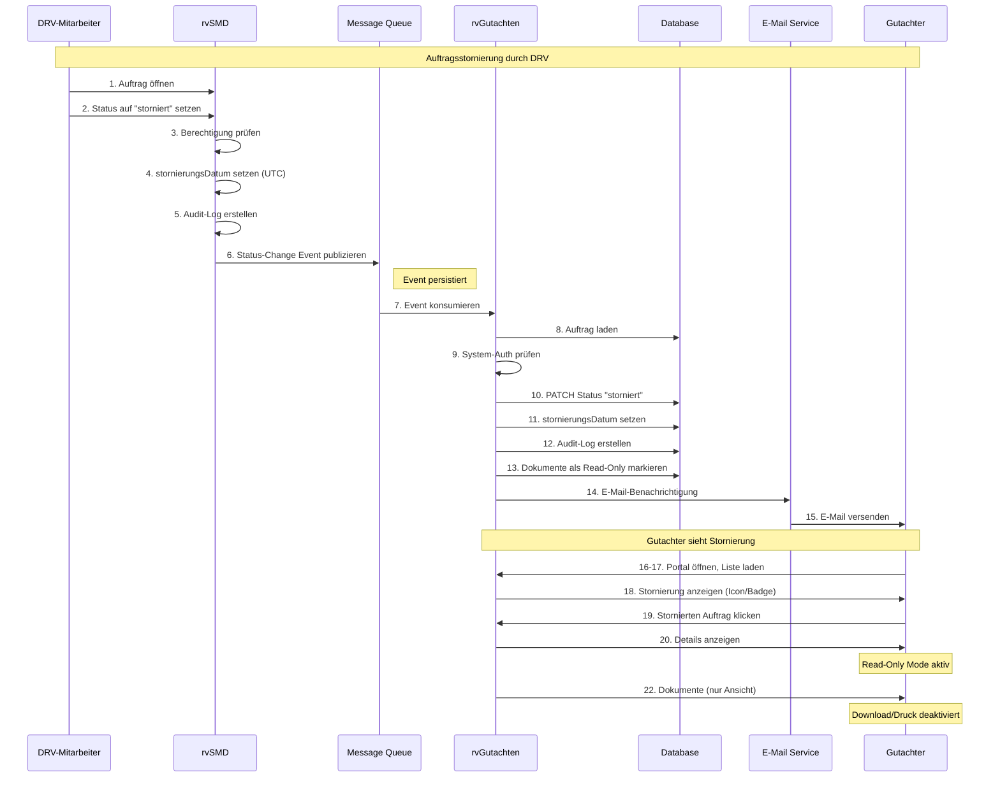
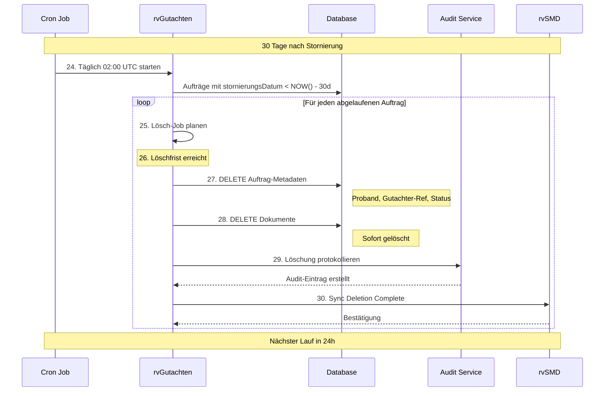
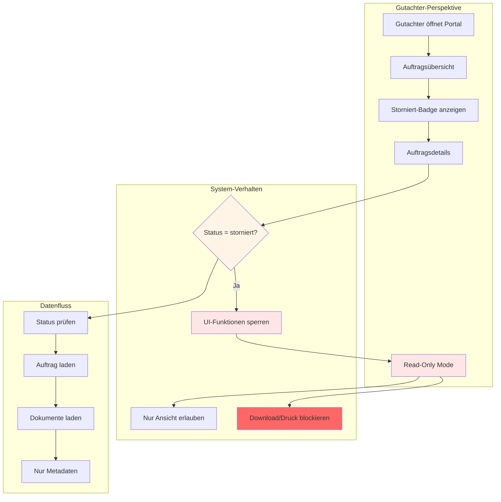
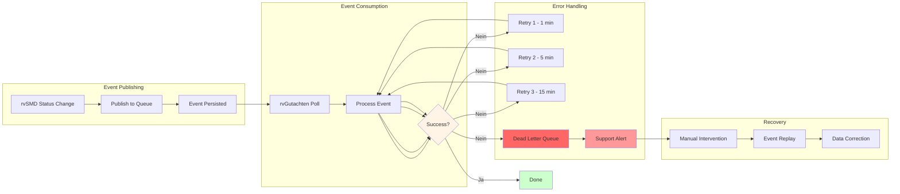

# UC-13: Datenfluss-Rückverfolgbarkeitsmatrix
## Auftragsstornierung

**Use Case:** UC-13: Auftragsstornierung  
**Datum:** November 2025  
**Zweck:** Rückverfolgbarkeit der MVP Business Objects und deren Attribute bei Auftragsstornierungen durch rvSMD

---

## Legende

| Symbol | Bedeutung |
|--------|-----------|
| [R] | **Read** - Daten werden gelesen/abgefragt |
| [C] | **Create** - Daten werden erstellt |
| [U] | **Update** - Daten werden aktualisiert |
| [D] | **Delete** - Daten werden gelöscht |
| [OK] | **Display** - Daten werden dem Benutzer angezeigt |
| [WARN] | **Partial** - Daten nur teilweise verfügbar |
| [AUTH] | **Authorization** - Berechtigungsprüfung |
| [AUDIT] | **Audit** - Auditprotokollierung |
| [SYNC] | **Synchronization** - Systemübergreifende Datensynchronisation |
| - | Nicht beteiligt in diesem Schritt |

---

## Sequenzschritte zu API-Aufrufen Mapping

| Schritt | Aktion | API Aufruf | Methode | Anmerkung |
|---------|--------|------------|---------|-----------|
| 1 | DRV-Mitarbeiter öffnet Auftrag in rvSMD | - | rvSMD | Backend System |
| 2 | Status auf "storniert" setzen | rvSMD Internal API | POST | rvSMD Backend |
| 3 | Berechtigung prüfen | rvSMD Authorization | - | Permission Check |
| 4 | Stornierungsdatum setzen | rvSMD Data Update | - | Current Timestamp |
| 5 | Audit-Log in rvSMD | rvSMD Audit | POST | Log Entry |
| 6 | Sync-Event triggern | `POST /sync/status-change` | POST | Event to rvGutachten |
| 7 | rvGutachten empfängt Event | Webhook/Message Queue | - | Async Reception |
| 8 | Auftrag in rvGutachten laden | `GET /gutachtenauftraege/{id}` | GET | Internal Query |
| 9 | Berechtigung für Sync prüfen | Authorization Service | - | System-to-System |
| 10 | Status aktualisieren | `PATCH /gutachtenauftraege/{id}` | PATCH | Status Update |
| 11 | stornierungsDatum setzen | Database Update | - | Set Timestamp |
| 12 | Audit-Log in rvGutachten | `POST /audit/status-change` | POST | Log Sync Event |
| 13 | Dokumente kennzeichnen | Database Update | - | Mark as Read-Only |
| 14 | E-Mail-Benachrichtigung | `POST /notifications/email` | POST | Notify Gutachter |
| 15 | E-Mail-Versand | SMTP Service | - | Email Delivery |
| 16 | Gutachter öffnet Portal | - | Frontend | User Action |
| 17 | Auftragsübersicht laden | `GET /gutachtenauftraege` | GET | List Orders |
| 18 | Stornierung anzeigen | - | Frontend | Visual Indicator |
| 19 | Auf stornierten Auftrag klicken | - | Frontend | Navigation |
| 20 | Auftragdetails laden | `GET /gutachtenauftraege/{id}` | GET | Detail View |
| 21 | Read-Only Mode aktivieren | - | Frontend | UI Restriction |
| 22 | Dokumente anzeigen (Read-Only) | `GET /gutachtenauftraege/{id}/dokumente` | GET | Limited Access |
| 23 | Download/Druck deaktivieren | - | Frontend | UI Lockdown |
| 24 | Löschfrist berechnen | - | Backend | 30 Days Calculation |
| 25 | Lösch-Job Schedule | Cron/Scheduler | - | Background Task |
| 26 | Löschfrist erreicht | Timer Trigger | - | After 30 Days |
| 27 | Auftragsinformationen löschen | `DELETE /gutachtenauftraege/{id}/metadata` | DELETE | Keep Minimal Data |
| 28 | Dokumente sofort löschen | `DELETE /dokumente/{id}` | DELETE | Immediate Deletion |
| 29 | Audit-Log Löschung | `POST /audit/data-deletion` | POST | DSGVO Compliance |
| 30 | Sync Löschung zu rvSMD | `POST /sync/deletion-complete` | POST | Confirm Deletion |

---

## Datenfluss-Matrix: Business Objects × API-Schritte (MVP)

### Auftrag Business Object

| Attribut | Typ | Kard | Step 2: Set Status | Step 4: Set Date | Step 6: Trigger Sync | Step 8: Load Order | Step 10: Update Status | Step 11: Set Date | Step 12: Audit | Step 17: List | Step 20: Details | Step 27: Delete Metadata |
|----------|-----|------|-------------------|------------------|---------------------|-------------------|----------------------|------------------|---------------|--------------|----------------|------------------------|
| **auftragsId** | uuid | 1 | [R] | [R] | [SYNC] | [R] | [R] | [R] | [AUDIT] | [OK] | [OK] | [R] |
| **rvPurAuftragsID** | string | ? | - | - | [SYNC] | [R] | - | - | - | - | - | - |
| **proband** | Proband | 1 | - | - | - | [R] | - | - | - | [OK] | [OK] | [D] |
| **gutachter** | Gutachter | 1 | - | - | [SYNC] | [R] | - | - | - | [OK] | [OK] | [D] |
| **gutachtenstatus** | Gutachtenstatus | + | [U] | - | [SYNC] | [R] | [U] | - | [AUDIT] | [OK] | [OK] | [D] |
| **anhang** | Document | * | - | - | - | [R] | - | - | - | [OK] | [OK] | [D] |
| **auftraggeber** | Träger | 1 | - | - | - | [R] | - | - | - | [OK] | [OK] | [D] |
| **auftragsDatum** | date | 1 | - | - | - | [R] | - | - | - | [OK] | [OK] | [D] |
| **eingangsDatum** | datetime | 1 | - | - | - | [R] | - | - | - | [OK] | [OK] | [D] |
| **stornierungsDatum** | datetime | ? | - | [C] | [SYNC] | [R] | - | [U] | [AUDIT] | [OK] | [OK] | [D] |
| **dokumente** | Document | + | - | - | - | [R] | - | - | - | [OK] | [OK] | [D] |

**Anmerkung:** `stornierungsDatum` wird in rvSMD gesetzt und zu rvGutachten synchronisiert. Nach 30 Tagen werden Auftragsdaten gelöscht.

---

### Gutachtenstatus Business Object

| Attribut | Typ | Kard | Step 2: rvSMD Update | Step 6: Sync Event | Step 10: rvGut Update | Step 12: Audit | Step 17: Display | Step 20: Display |
|----------|-----|------|---------------------|-------------------|----------------------|---------------|-----------------|-----------------|
| **status** | enum | 1 | [U] | [SYNC] | [U] | [AUDIT] | [OK] | [OK] |
| **changedOn** | timestamp | 1 | [U] | [SYNC] | [U] | [AUDIT] | [OK] | [OK] |
| **changedBy** | string | ? | [C] | [SYNC] | [U] | [AUDIT] | - | [OK] |

**Enum-Werte:** `neu`, `einbestellt`, `in_bearbeitung`, `abgeschlossen`, `storniert`

**Anmerkung:** Status "storniert" wird von rvSMD gesetzt und synchronisiert. `changedBy` enthält DRV-Mitarbeiter-ID.

---

### Document Business Object

| Attribut | Typ | Kard | Step 13: Mark Read-Only | Step 22: Display | Step 28: Delete |
|----------|-----|------|------------------------|-----------------|----------------|
| **documentId** | uuid | 1 | [R] | [OK] | [D] |
| **name** | string | 1 | - | [OK] | [D] |
| **filename** | string | 1 | - | [OK] | [D] |
| **filetype** | string | 1 | - | [OK] | [D] |
| **filesize** | int | ? | - | [OK] | [D] |
| **data** | binary | 1 | - | - | [D] |
| **metadata** | DocumentMetadata | 1 | [U] | [OK] | [D] |
| **readOnly** | boolean | 1 | [U] | - | - |

**Anmerkung:** Dokumente werden sofort nach Stornierung als Read-Only markiert und nach Bestätigung der Stornierung gelöscht.

---

### Proband Business Object

| Attribut | Typ | Kard | Step 17: Display List | Step 20: Display Details | Step 27: Delete |
|----------|-----|------|---------------------|-------------------------|----------------|
| **vsnr** | string | 1 | [OK] | [OK] | [D] |
| **gebdatum** | date | 1 | [OK] | [OK] | [D] |
| **name** | string | 1 | [OK] | [OK] | [D] |
| **vorname** | string | 1 | [OK] | [OK] | [D] |

**Anmerkung:** Probandendaten werden nach Ablauf der 30-Tage-Frist gelöscht (DSGVO).

---

### Gutachter Business Object

| Attribut | Typ | Kard | Step 8: Load | Step 14: Notification | Step 17: Display |
|----------|-----|------|-------------|----------------------|-----------------|
| **userId** | uuid | 1 | [R] | [R] | [OK] |
| **efn** | number | 1 | [R] | - | [OK] |
| **email** | string | 1 | [R] | [R] | - |
| **anrede** | string | 1 | - | [R] | [OK] |
| **nachname** | string | 1 | [R] | [R] | [OK] |
| **vorname** | string | 1 | [R] | [R] | [OK] |

**Anmerkung:** Gutachter-E-Mail wird für Stornierungsbenachrichtigung verwendet.

---

## API-Endpunkte Übersicht

### 1. Synchronisations-Event empfangen (rvSMD → rvGutachten)
```
POST /api/v1/sync/status-change
Headers:
  X-System-Token: {system-auth-token}
  X-Source-System: rvSMD
Body: {
  "auftragsId": "{auftragsId}",
  "rvPurAuftragsID": "{rvPurAuftragsID}",
  "newStatus": "storniert",
  "stornierungsDatum": "2025-11-12T14:30:00Z",
  "changedBy": "{drvMitarbeiterId}",
  "reason": "Auftrag durch DRV storniert"
}
Response: 202 Accepted
```

**Verwendete Business Objects:**
- [SYNC] Auftrag.auftragsId
- [SYNC] Auftrag.rvPurAuftragsID
- [SYNC] Gutachtenstatus.status
- [SYNC] Auftrag.stornierungsDatum

---

### 2. Auftragsstatus aktualisieren (intern)
```
PATCH /api/v1/gutachtenauftraege/{auftragsId}
Headers:
  X-System-Internal: true
Body (JSON Patch): [
  {
    "op": "replace",
    "path": "/gutachtenstatus/status",
    "value": "storniert"
  },
  {
    "op": "add",
    "path": "/stornierungsDatum",
    "value": "2025-11-12T14:30:00Z"
  }
]
Response: 204 No Content
```

**Aktualisierte Business Objects:**
- [U] Gutachtenstatus.status
- [U] Gutachtenstatus.changedOn
- [U] Auftrag.stornierungsDatum

---

### 3. Stornierung auditieren
```
POST /api/v1/audit/status-change
Headers:
  X-Internal: true
Body: {
  "auftragsId": "{auftragsId}",
  "previousStatus": "in_bearbeitung",
  "newStatus": "storniert",
  "changedBy": "{drvMitarbeiterId}",
  "sourceSystem": "rvSMD",
  "timestamp": "2025-11-12T14:30:00Z",
  "eventType": "CANCELLATION"
}
Response: 201 Created
```

**Protokollierte Business Objects:**
- [AUDIT] Auftrag.auftragsId
- [AUDIT] Gutachtenstatus.status
- [AUDIT] Gutachtenstatus.changedOn
- [AUDIT] Gutachtenstatus.changedBy

---

### 4. E-Mail-Benachrichtigung senden
```
POST /api/v1/notifications/email
Headers:
  X-Internal: true
Body: {
  "recipientUserId": "{gutachterId}",
  "templateId": "ORDER_CANCELLED",
  "data": {
    "auftragsId": "{auftragsId}",
    "vsnr": "{vsnr}",
    "probandName": "{name}, {vorname}",
    "stornierungsDatum": "2025-11-12",
    "deletionDate": "2025-12-12"
  }
}
Response: 202 Accepted
```

**Verwendete Business Objects:**
- [R] Gutachter.email
- [R] Gutachter.anrede
- [R] Gutachter.nachname
- [R] Auftrag.auftragsId
- [R] Proband.vsnr
- [R] Proband.name
- [R] Proband.vorname

---

### 5. Auftragsinformationen löschen (nach Frist)
```
DELETE /api/v1/gutachtenauftraege/{auftragsId}/metadata
Headers:
  X-System-Internal: true
  X-Cron-Job: data-retention
Query Parameters:
  reason: retention_policy_expired
Response: 204 No Content
```

**Gelöschte Business Objects:**
- [D] Auftrag (vollständig)
- [D] Proband (vollständig)
- [D] Gutachtenstatus (vollständig)

---

### 6. Dokumente löschen (sofort bei Stornierung)
```
DELETE /api/v1/dokumente/{documentId}
Headers:
  X-System-Internal: true
Body: {
  "reason": "ORDER_CANCELLED",
  "auftragsId": "{auftragsId}"
}
Response: 204 No Content
```

**Gelöschte Business Objects:**
- [D] Document.data
- [D] Document.metadata
- [D] Document.note

---

### 7. Löschung zu rvSMD synchronisieren
```
POST /api/v1/sync/deletion-complete
Headers:
  X-System-Token: {system-auth-token}
  X-Target-System: rvSMD
Body: {
  "auftragsId": "{auftragsId}",
  "rvPurAuftragsID": "{rvPurAuftragsID}",
  "deletionTimestamp": "2025-12-12T10:00:00Z",
  "retentionPeriodDays": 30,
  "itemsDeleted": {
    "order": true,
    "documents": 5,
    "notes": 2
  }
}
Response: 200 OK
```

**Synchronisierte Information:**
- [SYNC] Auftrag.auftragsId gelöscht
- [SYNC] Löschbestätigung an rvSMD

---

## Kritische Findings für UC-13

### 1. Synchronisations-Zuverlässigkeit

**Problem:** Statusänderung in rvSMD muss zuverlässig zu rvGutachten synchronisiert werden

| Risiko | Auswirkung | Mitigation |
|--------|------------|------------|
| Event-Loss | Auftrag bleibt in rvGutachten aktiv | Retry-Mechanismus + Dead Letter Queue |
| Network-Failure | Sync verzögert | Message Queue mit Persistence |
| System-Downtime | Events gehen verloren | Event Store + Replay-Funktion |

**Status:** [CRIT] Synchronisation ist kritisch für Datenkonsistenz

---

### 2. Zeitliche Synchronisation von stornierungsDatum

**Problem:** `stornierungsDatum` wird in rvSMD gesetzt, muss exakt nach rvGutachten übertragen werden

| Szenario | Benötigt | Auswirkung |
|----------|----------|------------|
| Falsche Zeitzone | UTC Timestamp | Löschfrist falsch berechnet |
| Timestamp-Diff | Exakte Synchronisation | 30-Tage-Frist beginnt zu früh/spät |

**Status:** [WARN] Zeitzone-Handling muss sichergestellt sein

---

### 3. Dokument-Löschung vs. Auftrags-Löschung

**Problem:** Dokumente sofort löschen, Auftragsdaten 30 Tage aufbewahren

| Datentyp | Löschzeitpunkt | Grund |
|----------|---------------|-------|
| Document.data | Sofort | DSGVO + Speicherplatz |
| Document.metadata | Sofort | Keine Notwendigkeit |
| Auftrag.proband | Nach 30 Tagen | Gutachter-Information |
| Auftrag.auftragsId | Nach 30 Tagen | Referenz-Aufbewahrung |

**Status:** [WARN] Differenzierte Löschlogik erforderlich

---

### 4. Benachrichtigungspflicht

**Problem:** Gutachter muss über Stornierung informiert werden

| Anforderung | Business Object | Verfügbarkeit |
|-------------|----------------|---------------|
| E-Mail-Adresse | Gutachter.email | [OK] |
| Personalisierung | Gutachter.anrede, name | [OK] |
| Auftragsinfo | Auftrag.auftragsId, Proband.vsnr | [OK] |

**Status:** [OK] Benachrichtigung vollständig umsetzbar

---

## Vollständigkeits-Prüfung MVP

### Für UC-13 benötigte MVP-Daten

| Anforderung | Business Object | Attribut | Status | Quelle |
|-------------|----------------|----------|--------|---------|
| Auftrag identifizieren | Auftrag | auftragsId | [OK] | Step 6-8 |
| rvSMD Referenz | Auftrag | rvPurAuftragsID | [OK] | Step 6 |
| Status synchronisieren | Gutachtenstatus | status | [OK] | Step 2, 6, 10 |
| Stornierungszeitpunkt | Auftrag | stornierungsDatum | [OK] | Step 4, 11 |
| Gutachter benachrichtigen | Gutachter | email, name | [OK] | Step 14-15 |
| Proband anzeigen | Proband | vsnr, name, vorname | [OK] | Step 17, 20 |
| Löschfrist berechnen | Auftrag | stornierungsDatum | [OK] | Step 24-26 |
| Dokumente löschen | Document | documentId | [OK] | Step 28 |
| Audit-Trail | Gutachtenstatus | changedBy, changedOn | [OK] | Step 5, 12, 29 |
| Sync-Bestätigung | Auftrag | auftragsId | [OK] | Step 30 |

**Abdeckung:** 10/10 Anforderungen vollständig erfüllt (100%)  
**Kritische Lücken:** Keine  
**Warnungen:** 2 - Synchronisations-Zuverlässigkeit, Zeitzone-Handling

---

## Empfehlungen

### Sofortmaßnahmen (Erforderlich für UC-13)

1. **Sync-Mechanismus implementieren:**
   ```typescript
   interface StatusChangeEvent {
     auftragsId: string,
     rvPurAuftragsID: string,
     newStatus: 'storniert',
     stornierungsDatum: DateTime (UTC),
     changedBy: string,
     reason: string,
     sourceSystem: 'rvSMD'
   }
   ```

2. **Message Queue Setup:**
   - Persistent Queue (RabbitMQ/Kafka)
   - Retry-Strategie: 3 Versuche mit Exponential Backoff
   - Dead Letter Queue für fehlgeschlagene Events
   - Event Store für Audit + Replay

3. **Zeitgesteuerte Löschung:**
   ```typescript
   Cron-Job täglich 02:00 UTC:
   - SELECT * FROM Auftraege WHERE status='storniert' 
     AND stornierungsDatum < NOW() - INTERVAL '30 days'
   - DELETE Auftragsdaten (keep minimal reference)
   - POST /audit/data-deletion
   - POST /sync/deletion-complete to rvSMD
   ```

4. **E-Mail-Template:**
   ```
   Betreff: Auftrag {auftragsId} wurde storniert
   
   Sehr geehrte/r {anrede} {nachname},
   
   Der Gutachtenauftrag {auftragsId} für {proband.name}, {proband.vorname} 
   (VSNR: {vsnr}) wurde am {stornierungsDatum} durch die DRV storniert.
   
   Die Auftragsdaten bleiben für 30 Tage einsehbar. Dokumente wurden 
   entfernt. Löschung erfolgt automatisch am {deletionDate}.
   
   Mit freundlichen Grüßen
   Ihr rvGutachten-Team
   ```

---

### Architektur-Entscheidungen

1. **Synchronisations-Strategie:**
   - Async Event-Driven (bevorzugt) vs. Polling
   - Message Queue vs. Direct API Call
   - Event Sourcing für vollständigen Audit Trail

2. **Lösch-Strategie:**
   - Soft Delete vs. Hard Delete
   - Aufbewahrung von Metadaten für Reporting
   - Archivierung vor Löschung (optional)

3. **Benachrichtigungs-Timing:**
   - Sofort bei Stornierung
   - Erinnerung 7 Tage vor Löschung (optional)
   - Bestätigung nach Löschung

4. **Fehlerbehandlung:**
   - Sync-Fehler → Support-Ticket + Manual Retry
   - Benachrichtigungs-Fehler → Log + Retry
   - Lösch-Fehler → Alert + Investigation

---

## Datenfluss-Diagramme

### Hauptfluss: Stornierung in rvSMD



### Zeitgesteuerte Löschung



### Read-Only Zugriff nach Stornierung



### Synchronisations-Fehlerbehandlung



---

## Zusammenfassung

**Dokumentiert:**
- 30 Sequenzschritte mit API-Mappings
- 5 Haupt-MVP-Business-Objects (Auftrag, Proband, Gutachter, Gutachtenstatus, Document)
- 7 API-Endpunkte definiert
- Synchronisations-Mechanismus rvSMD ↔ rvGutachten
- Zeitgesteuerte Löschlogik (30 Tage)
- E-Mail-Benachrichtigungssystem

**Kritische Findings:**
- [CRIT] Synchronisations-Zuverlässigkeit muss sichergestellt sein (Message Queue + Retry)
- [WARN] Zeitzone-Handling für korrekte Löschfrist-Berechnung
- [WARN] Differenzierte Löschung: Dokumente sofort, Auftragsdaten nach 30 Tagen

**Architektur-Entscheidungen erforderlich:**
1. Message Queue vs. Direct API Call
2. Event Sourcing für vollständigen Audit Trail
3. Soft Delete vs. Hard Delete Strategie
4. Fehlerbehandlung bei Sync-Fehlern

**Nächste Schritte:**
1. [TODO] Message Queue Setup (RabbitMQ/Kafka)
2. [TODO] Event Store für Replay-Funktionalität
3. [TODO] Cron-Job für zeitgesteuerte Löschung
4. [TODO] E-Mail-Templates für Stornierungsbenachrichtigung
5. [TODO] Dead Letter Queue + Alert-System für Sync-Fehler
6. [TODO] Integration-Tests für rvSMD ↔ rvGutachten Synchronisation

---

**Letzte Aktualisierung:** November 2025  
**Status:** MVP-Analyse komplett für UC-13  
**Reviewer:** [TBD]
