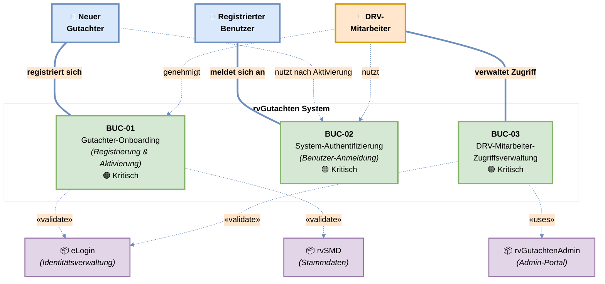
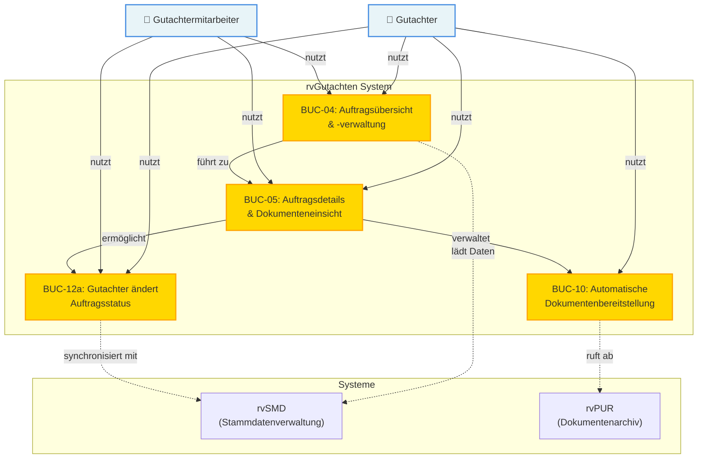
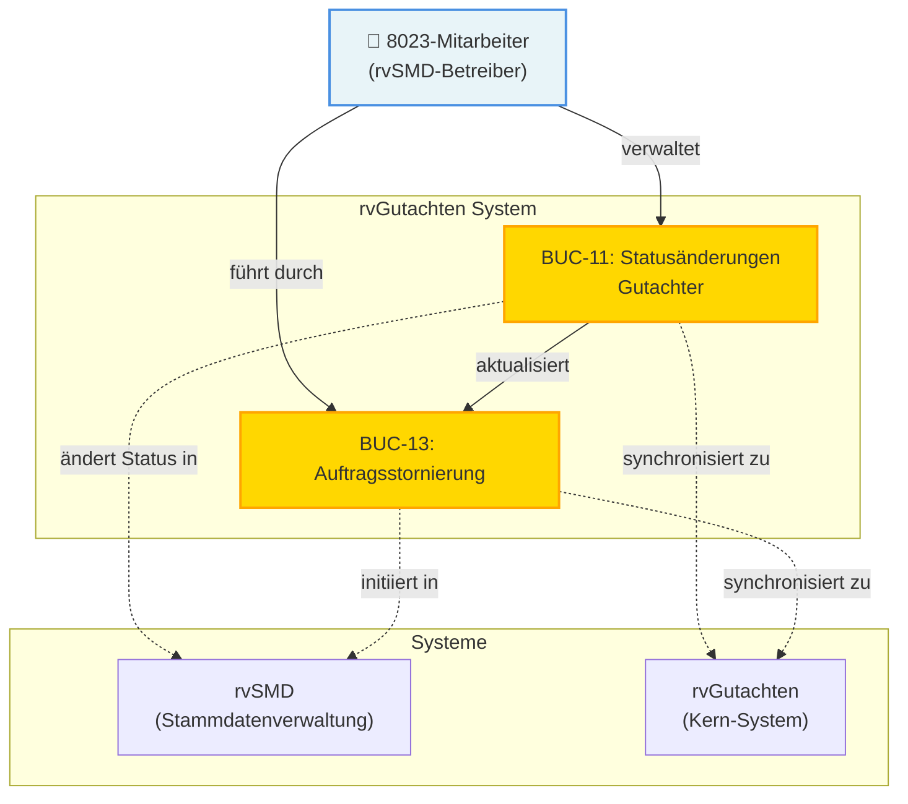
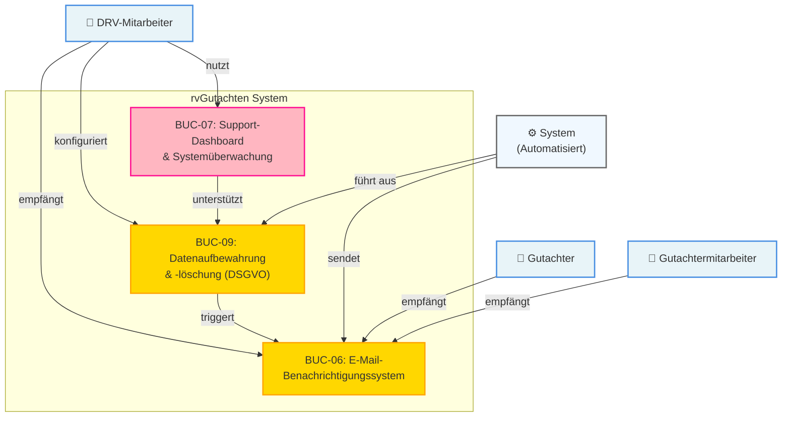
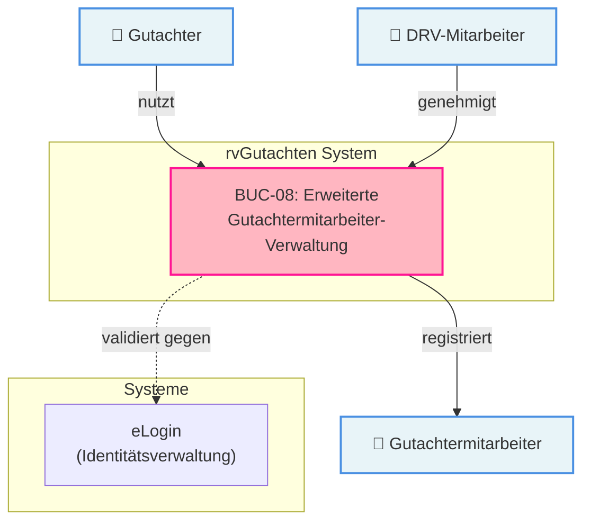

# QARvGut - UML Anwendungsfall-Diagramme (Deutsch)

**Dokumentversion:** 1.0  
**Projekt:** QARvGut Enhanced User Management  
**Erstellt:** 5. Januar 2026  
**Typ:** UML Use Case Diagrams  

---

## Übersicht

Dieses Dokument präsentiert UML-Anwendungsfall-Diagramme, organisiert nach Funktionsbereichen. Jedes Diagramm zeigt die relevanten Akteure, Anwendungsfälle und deren Beziehungen innerhalb einer Systemgrenze.

---

## 1. Benutzer-Verwaltung & Onboarding

### Mermaid-Diagramm (für Markdown-Vorschau)

### Draw.io-Diagramm

📎 **Vollständiges UML-Diagramm:** [UML-01-Benutzer-Verwaltung-Onboarding.drawio](UML-01-Benutzer-Verwaltung-Onboarding.drawio)

> 💡 **Hinweis:** Das Draw.io-Diagramm kann mit [diagrams.net](https://app.diagrams.net/) oder der VS Code Draw.io-Extension geöffnet und bearbeitet werden.

### Beschreibung: Benutzer-Verwaltung & Onboarding

**Primäre Akteure:**
- **Neuer Gutachter:** Registriert sich im System
- **Registrierter Benutzer:** Meldet sich an
- **DRV-Mitarbeiter:** Genehmigt neue Registrierungen

**Anwendungsfälle:**
- **BUC-01** (Kritisch 🟢): Neuer Gutachter durchläuft Registrierungs- und Aktivierungsprozess mit DRV-Genehmigung
- **BUC-02** (Kritisch 🟢): Jeder registrierte Benutzer authentifiziert sich

**Systemintegration:**
- eLogin validiert Gutachter-Identität
- rvSMD prüft Stammdaten
- rvGutachtenAdmin unterstützt Admin-Funktionen

---

## 2. Auftrags-Verwaltung - Gutachter-Perspektive

### Beschreibung: Auftrags-Verwaltung - Gutachter-Perspektive

**Primäre Akteure:**
- **Gutachter:** Verwaltet Aufträge und Dokumente
- **Gutachtermitarbeiter:** Unterstützt Gutachter bei der Auftragsbearbeitung

**Anwendungsfälle:**
- **BUC-04** (Hoch 🟡): Zeigt Übersicht aller zugewiesenen Aufträge
- **BUC-05** (Hoch 🟡): Zeigt Auftragsdetails und verwaltet Dokumente
- **BUC-10** (Hoch 🟡): Automatische Bereitstellung von Dokumenten beim Auftrag
- **BUC-12a** (Mittel 🟡): Änderung des Auftragsstatus durch Gutachter

**Use Case Abhängigkeiten:**
- BUC-04 → BUC-05: Auftragsdetails werden von der Übersicht aus aufgerufen
- BUC-05 → BUC-10: Dokumente sind innerhalb der Auftragsdetails verfügbar
- BUC-05 → BUC-12a: Statusänderung erfolgt im Detail-View

---

## 3. Auftrags-Verwaltung - DRV-Perspektive

### Beschreibung: Auftrags-Verwaltung - DRV-Perspektive

**Primäre Akteure:**
- **8023-Mitarbeiter:** Führt Statusänderungen in rvSMD durch, die mit rvGutachten synchronisiert werden

**Anwendungsfälle:**
- **BUC-11** (Mittel 🟡): Ändert Gutachter-Status (aktiv, gesperrt, reaktiviert, gelöscht)
- **BUC-13** (Mittel 🟡): Storniert Aufträge mit automatischer Synchronisation

**System-Integrationen:**
- Statusänderungen in rvSMD werden automatisch zu rvGutachten synchronisiert
- Bidirektionale Datensynchronisation zwischen Systemen

---

## 4. Support & Betriebsüberwachung

### Beschreibung: Support & Betriebsüberwachung

**Primäre Akteure:**
- **DRV-Mitarbeiter:** Überwacht System und konfiguriert Richtlinien
- **System (Automatisiert):** Führt Benachrichtigungen und Löschungen durch

**Sekundäre Akteure:**
- **Gutachter & Gutachtermitarbeiter:** Empfangen Benachrichtigungen

**Anwendungsfälle:**
- **BUC-06** (Mittel 🟡): Automatische E-Mail-Benachrichtigungen bei Ereignissen
- **BUC-07** (Niedrig 🔴): DRV-Support-Dashboard mit Systemübersicht und Auftragsverwaltung
- **BUC-09** (Mittel 🟡): Automatische Datenlöschung gemäß DSGVO und Richtlinien

**Automatisierungsprozesse:**
- BUC-06 wird automatisch bei Statusänderungen, neuen Aufträgen usw. ausgelöst
- BUC-09 läuft nach zeitbasierten Triggern

---

## 5. Erweiterte Funktionalität - Mitarbeiter-Verwaltung

### Beschreibung: Erweiterte Funktionalität - Mitarbeiter-Verwaltung

**Primäre Akteure:**
- **Gutachter:** Registriert Mitarbeiter in seinem Praxisteam
- **DRV-Mitarbeiter:** Genehmigt Mitarbeiter-Registrierungen

**Betroffene Akteure:**
- **Gutachtermitarbeiter:** Werden durch diesen Prozess aktiviert

**Anwendungsfälle:**
- **BUC-08** (Niedrig 🔴): Erlaubt Gutachtern, Mitarbeiter zu registrieren und zu verwalten

**Systemintegration:**
- eLogin validiert Mitarbeiter-Identität
- DRV-Genehmigung erforderlich für Aktivierung

---

## 6. Komplette System-Übersicht

```mermaid
graph TB
    subgraph RG["rvGutachten System"]
        direction TB
        
        subgraph Critical["🟢 KRITISCHE ANWENDUNGSFÄLLE"]
            BUC01["BUC-01: Gutachter-<br/>Onboarding"]
            BUC02["BUC-02: System-<br/>Authentifizierung"]
            BUC03["BUC-03: DRV-Mitarbeiter-<br/>Zugriffsverwaltung"]
        end
        
        subgraph HighMed["🟡 HOHE/MITTLERE PRIORITÄT"]
            BUC04["BUC-04: Auftrags-<br/>übersicht"]
            BUC05["BUC-05: Auftrags-<br/>details"]
            BUC06["BUC-06: E-Mail-<br/>Benachrichtigungen"]
            BUC09["BUC-09: Daten-<br/>aufbewahrung"]
            BUC10["BUC-10: Auto-<br/>Dokumente"]
            BUC11["BUC-11: Gutachter-<br/>Status"]
            BUC12["BUC-12a: Auftrags-<br/>status"]
            BUC13["BUC-13: Auftrags-<br/>stornierung"]
        end
        
        subgraph Low["🔴 NIEDRIGE PRIORITÄT"]
            BUC07["BUC-07: Support-<br/>Dashboard"]
            BUC08["BUC-08: Mitarbeiter-<br/>Verwaltung"]
        end
    end
    
    %% Menschliche Akteure
    NG["👤 Neuer Gutachter"]
    RB["👤 Registrierter<br/>Benutzer"]
    GA["👤 Gutachter"]
    GM["👤 Gutachter-<br/>mitarbeiter"]
    DM["👤 DRV-<br/>Mitarbeiter"]
    SM["👤 8023-<br/>Mitarbeiter"]
    
    %% System-Akteure
    SYS["⚙️ System<br/>(Automatisiert)"]
    
    %% Beziehungen
    NG -->|primary| BUC01
    RB -->|primary| BUC02
    DM -->|primary| BUC03
    
    GA -->|primary| BUC04
    GA -->|primary| BUC05
    GA -->|primary| BUC08
    GA -->|primary| BUC12
    
    GM -->|primary| BUC04
    GM -->|primary| BUC05
    GM -->|primary| BUC12
    
    SYS -->|primary| BUC06
    SYS -->|primary| BUC09
    SYS -->|primary| BUC10
    
    DM -->|primary| BUC07
    SM -->|primary| BUC11
    SM -->|primary| BUC13
    
    style BUC01 fill:#90EE90,stroke:#228B22,stroke-width:2px
    style BUC02 fill:#90EE90,stroke:#228B22,stroke-width:2px
    style BUC03 fill:#90EE90,stroke:#228B22,stroke-width:2px
    
    style BUC04 fill:#FFD700,stroke:#FFA500,stroke-width:2px
    style BUC05 fill:#FFD700,stroke:#FFA500,stroke-width:2px
    style BUC06 fill:#FFD700,stroke:#FFA500,stroke-width:2px
    style BUC09 fill:#FFD700,stroke:#FFA500,stroke-width:2px
    style BUC10 fill:#FFD700,stroke:#FFA500,stroke-width:2px
    style BUC11 fill:#FFD700,stroke:#FFA500,stroke-width:2px
    style BUC12 fill:#FFD700,stroke:#FFA500,stroke-width:2px
    style BUC13 fill:#FFD700,stroke:#FFA500,stroke-width:2px
    
    style BUC07 fill:#FFB6C1,stroke:#FF1493,stroke-width:2px
    style BUC08 fill:#FFB6C1,stroke:#FF1493,stroke-width:2px
    
    style NG fill:#E8F4F8,stroke:#4A90E2,stroke-width:2px
    style RB fill:#E8F4F8,stroke:#4A90E2,stroke-width:2px
    style GA fill:#E8F4F8,stroke:#4A90E2,stroke-width:2px
    style GM fill:#E8F4F8,stroke:#4A90E2,stroke-width:2px
    style DM fill:#E8F4F8,stroke:#4A90E2,stroke-width:2px
    style SM fill:#E8F4F8,stroke:#4A90E2,stroke-width:2px
    style SYS fill:#F0F8FF,stroke:#696969,stroke-width:2px
```

---

## Legende

### Farben nach Priorität

| Farbe | Priorität | Bedeutung |
|---|---|---|
| 🟢 Grün | Kritisch | Must-Have für MVP - Blocker für andere Features |
| 🟡 Gold | Hoch/Mittel | Wichtig für Kernfunktionalität oder Betrieb |
| 🔴 Rosa | Niedrig | Erweiterte Features, später in Sprint entwickeln |

### Symbol-Erklärung

| Symbol | Bedeutung |
|---|---|
| 👤 | Menschlicher Akteur (Benutzerrolle) |
| ⚙️ | System-Akteur (Automatisiert) |
| → | Nutzt/Führt aus (Primary Actor) |
| -.-> | Systemintegration/Abhängigkeit |

---

## Implementierungs-Roadmap basierend auf Diagrammen

### Phase 1: Fundament (Critical - Sprint 1)
1. BUC-01: Gutachter-Onboarding
2. BUC-02: System-Authentifizierung
3. BUC-03: DRV-Mitarbeiter-Zugriffsverwaltung

### Phase 2: Kernfunktionalität (High - Sprint 2)
1. BUC-04: Auftragsübersicht
2. BUC-05: Auftragsdetails & Dokumenteneinsicht
3. BUC-10: Automatische Dokumentenbereitstellung
4. BUC-12a: Auftragsstatus-Änderung

### Phase 3: Integration & Betrieb (Medium - Sprint 3)
1. BUC-11: Gutachter-Statusänderungen
2. BUC-13: Auftragsstornierung
3. BUC-06: E-Mail-Benachrichtigungen
4. BUC-09: DSGVO-Datenverwaltung

### Phase 4: Support & Erweiterung (Low - Sprint 4+)
1. BUC-07: Support-Dashboard
2. BUC-08: Mitarbeiter-Verwaltung

---

## Notizen für den Kunden

Diese UML-Anwendungsfall-Diagramme bieten:
- ✅ Klare Visualisierung aller Akteure und deren Aufgaben
- ✅ Verständlichkeit für nicht-technische Stakeholder
- ✅ Priorisierung zur Implementierungsplanung
- ✅ Systemintegrationspunkte
- ✅ Deutsche Beschriftung für Kundenverständnis

Die Diagramme können als Basis für:
- Requirements Engineering
- Testing-Strategie (Testfälle pro Use Case)
- User Training & Dokumentation
- Systemarchitektur-Planung

verwendet werden.

---

**Dokumentkontrolle:**
- Version 1.0 - Initialisierung
- Erstellt: 5. Januar 2026
- Betreuer: Product Owner Sarah
- Nächste Überprüfung: Bei neuen Anwendungsfällen
