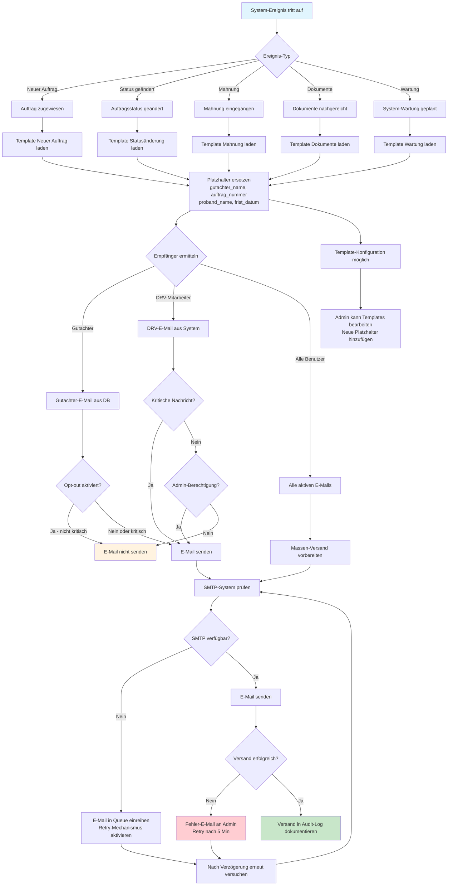

```mermaid
flowchart TD
    A[System-Ereignis tritt auf] --> B{Ereignis-Typ}
    
    %% Verschiedene Trigger
    B -->|Neuer Auftrag| C[Auftrag zugewiesen]
    B -->|Status geändert| D[Auftragsstatus geändert]
    B -->|Mahnung| E[Mahnung eingegangen]
    B -->|Dokumente| F[Dokumente nachgereicht]
    B -->|Wartung| G[System-Wartung geplant]
    
    %% E-Mail Generierung
    C --> H[Template Neuer Auftrag laden]
    D --> I[Template Statusänderung laden]
    E --> J[Template Mahnung laden]
    F --> K[Template Dokumente laden]
    G --> L[Template Wartung laden]
    
    %% Platzhalter ersetzen
    H --> M[Platzhalter ersetzen<br/>gutachter_name, auftrag_nummer<br/>proband_name, frist_datum]
    I --> M
    J --> M
    K --> M
    L --> M
    
    %% Empfänger bestimmen
    M --> N{Empfänger ermitteln}
    N -->|Gutachter| O[Gutachter-E-Mail aus DB]
    N -->|DRV-Mitarbeiter| P[DRV-E-Mail aus System]
    N -->|Alle Benutzer| Q[Alle aktiven E-Mails]
    
    %% Opt-out prüfen
    O --> R{Opt-out aktiviert?}
    P --> S{Kritische Nachricht?}
    Q --> T[Massen-Versand vorbereiten]
    
    R -->|Ja - nicht kritisch| U[E-Mail nicht senden]
    R -->|Nein oder kritisch| V[E-Mail senden]
    S -->|Ja| V
    S -->|Nein| W{Admin-Berechtigung?}
    W -->|Ja| V
    W -->|Nein| U
    
    %% E-Mail Versand
    V --> X[SMTP-System prüfen]
    T --> X
    X --> Y{SMTP verfügbar?}
    Y -->|Nein| Z[E-Mail in Queue einreihen<br/>Retry-Mechanismus aktivieren]
    Y -->|Ja| AA[E-Mail senden]
    
    %% Versand-Ergebnis
    AA --> BB{Versand erfolgreich?}
    BB -->|Nein| CC[Fehler-E-Mail an Admin<br/>Retry nach 5 Min]
    BB -->|Ja| DD[Versand in Audit-Log dokumentieren]
    
    %% Retry-Mechanismus
    Z --> EE[Nach Verzögerung erneut versuchen]
    EE --> X
    CC --> EE
    
    %% Admin-Konfiguration
    M --> FF[Template-Konfiguration möglich]
    FF --> GG[Admin kann Templates bearbeiten<br/>Neue Platzhalter hinzufügen]
    
    style A fill:#e1f5fe
    style DD fill:#c8e6c9
    style U fill:#fff3e0
    style CC fill:#ffcdd2
```
