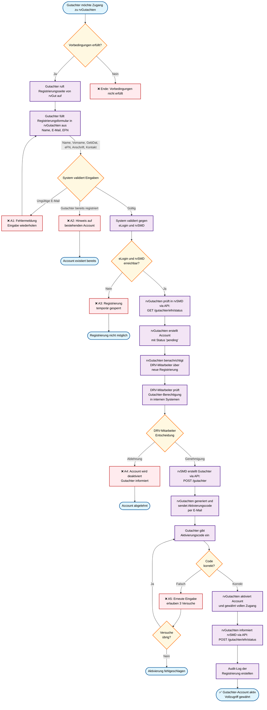

```mermaid
flowchart TD
    Start([Gutachter möchte Zugang zu rvGutachten]) --> CheckPrereq{Vorbedingungen erfüllt?}
    
    CheckPrereq -->|Ja| RegPage[Gutachter ruft Registrierungsseite von rvGut auf]
    CheckPrereq -->|Nein| PrereqError[❌ Ende: Vorbedingungen nicht erfüllt]
    
    RegPage --> FillForm[Gutachter füllt Registrierungsformular in rvGutachten aus<br/>Name, E-Mail, EFN]
    
    FillForm --> |Name, Vorname, GebDat, eFN, Anschrift, Kontakt| ValidateInput{System validiert Eingaben}
    ValidateInput -->|Ungültige E-Mail| A1[❌ A1: Fehlermeldung<br/>Eingabe wiederholen]
    ValidateInput -->|Gutachter bereits registriert| A2[❌ A2: Hinweis auf<br/>bestehenden Account]
    ValidateInput -->|Gültig| ExternalValidation[System validiert gegen<br/>eLogin und rvSMD]
    
    A1 --> FillForm
    A2 --> End1([Account existiert bereits])
    
    ExternalValidation --> ExternalCheck{eLogin und rvSMD<br/>erreichbar?}
    ExternalCheck -->|Nein| A3[❌ A3: Registrierung<br/>temporär gesperrt]
    ExternalCheck -->|Ja| CheckExisting[rvGutachten prüft in rvSMD via API:<br/>GET /gutachter/efn/status]
    
    A3 --> End2([Registrierung nicht möglich])
    
    CheckExisting --> CreateAccount[rvGutachten erstellt Account<br/>mit Status 'pending']
    CreateAccount --> NotifyDRV[rvGutachten benachrichtigt<br/>DRV-Mitarbeiter über<br/>neue Registrierung]
    
    NotifyDRV --> DRVCheck[DRV-Mitarbeiter prüft<br/>Gutachter-Berechtigung<br/>in internen Systemen]
    
    DRVCheck --> DRVDecision{DRV-Mitarbeiter<br/>Entscheidung}
    DRVDecision -->|Ablehnung| A4[❌ A4: Account wird deaktiviert<br/>Gutachter informiert]
    DRVDecision -->|Genehmigung| CreateInSMD[rvSMD erstellt Gutachter via API:<br/>POST /gutachter]
    
    A4 --> End3([Account abgelehnt])
    
    CreateInSMD --> GenerateCode[rvGutachten generiert und<br/>sendet Aktivierungscode<br/>per E-Mail]
    GenerateCode --> EnterCode[Gutachter gibt<br/>Aktivierungscode ein]
    
    EnterCode --> ValidateCode{Code<br/>korrekt?}
    ValidateCode -->|Falsch| A5[❌ A5: Erneute Eingabe<br/>erlauben 3 Versuche]
    ValidateCode -->|Korrekt| ActivateAccount[rvGutachten aktiviert Account<br/>und gewährt vollen Zugang]
    
    A5 --> RetryCheck{Versuche<br/>übrig?}
    RetryCheck -->|Ja| EnterCode
    RetryCheck -->|Nein| End4([Aktivierung fehlgeschlagen])
    
    ActivateAccount --> UpdateSMD[rvGutachten informiert rvSMD via API:<br/>POST /gutachter/efn/status]
    UpdateSMD --> CreateAudit[Audit-Log der<br/>Registrierung erstellen]
    CreateAudit --> Success([✅ Gutachter-Account aktiv<br/>Vollzugriff gewährt])
    
    %% Styling
    classDef startEnd fill:#e1f5fe,stroke:#01579b,stroke-width:2px,color:#000
    classDef process fill:#f3e5f5,stroke:#4a148c,stroke-width:2px,color:#000
    classDef decision fill:#fff8e1,stroke:#ff6f00,stroke-width:2px,color:#000
    classDef error fill:#ffebee,stroke:#c62828,stroke-width:2px,color:#000
    classDef success fill:#e8f5e8,stroke:#2e7d32,stroke-width:2px,color:#000
    
    class Start,End1,End2,End3,End4,Success startEnd
    class RegPage,FillForm,ExternalValidation,CheckExisting,CreateAccount,NotifyDRV,DRVCheck,CreateInSMD,GenerateCode,EnterCode,ActivateAccount,UpdateSMD,CreateAudit process
    class CheckPrereq,ValidateInput,ExternalCheck,DRVDecision,ValidateCode,RetryCheck decision
    class PrereqError,A1,A2,A3,A4,A5 error
```