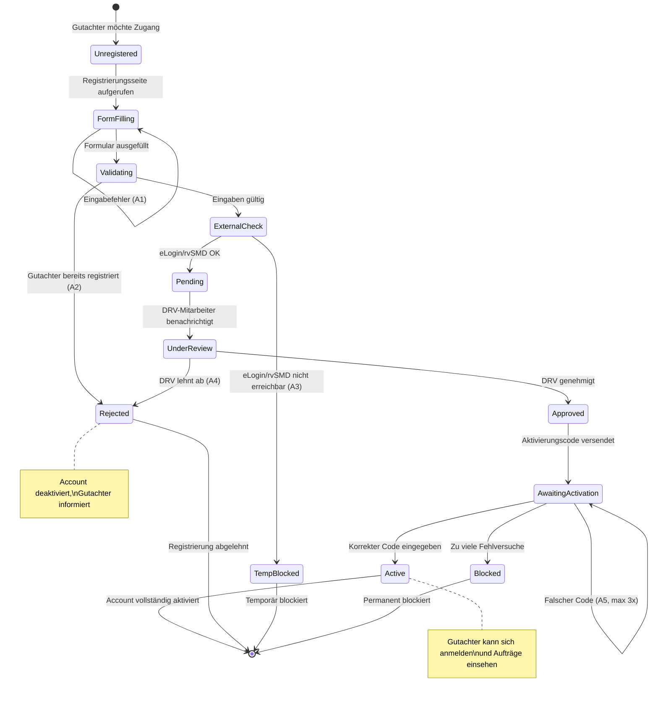

```mermaid
stateDiagram-v2
    [*] --> Unregistered : Gutachter möchte Zugang
    
    Unregistered --> FormFilling : Registrierungsseite aufgerufen
    
    FormFilling --> Validating : Formular ausgefüllt
    FormFilling --> FormFilling : Eingabefehler (A1)
    
    Validating --> ExternalCheck : Eingaben gültig
    Validating --> Rejected : Gutachter bereits registriert (A2)
    
    ExternalCheck --> Pending : eLogin/rvSMD OK
    ExternalCheck --> TempBlocked : eLogin/rvSMD nicht erreichbar (A3)
    
    Pending --> UnderReview : DRV-Mitarbeiter benachrichtigt
    
    UnderReview --> Approved : DRV genehmigt
    UnderReview --> Rejected : DRV lehnt ab (A4)
    
    Approved --> AwaitingActivation : Aktivierungscode versendet
    
    AwaitingActivation --> Active : Korrekter Code eingegeben
    AwaitingActivation --> AwaitingActivation : Falscher Code (A5, max 3x)
    AwaitingActivation --> Blocked : Zu viele Fehlversuche
    
    Active --> [*] : Account vollständig aktiviert
    
    Rejected --> [*] : Registrierung abgelehnt
    TempBlocked --> [*] : Temporär blockiert
    Blocked --> [*] : Permanent blockiert
    
    note right of Active : Gutachter kann sich anmelden\nund Aufträge einsehen
    note right of Rejected : Account deaktiviert,\nGutachter informiert
```