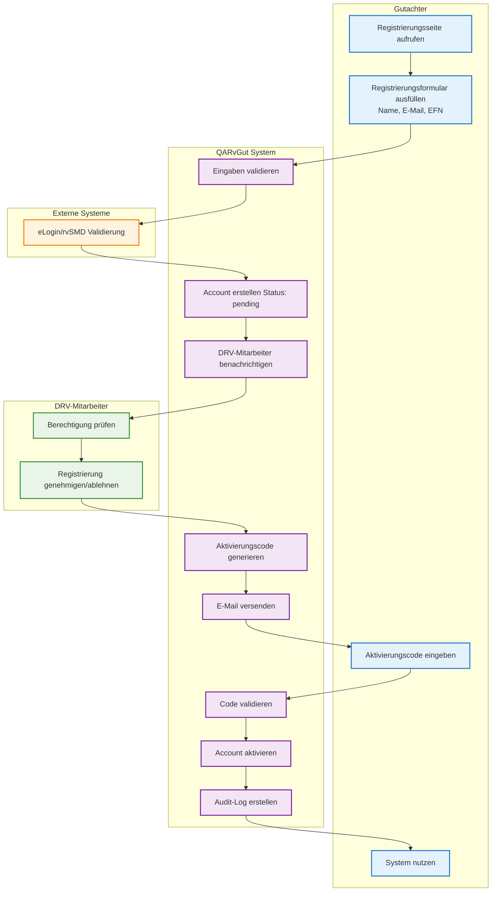

```mermaid
flowchart TB
    subgraph "Gutachter"
        G1[Registrierungsseite aufrufen]
        G2[Registrierungsformular ausfüllen<br/>Name, E-Mail, EFN]
        G3[Aktivierungscode eingeben]
        G4[System nutzen]
    end
    
    subgraph "QARvGut System"
        S1[Eingaben validieren]
        S2[Account erstellen Status: pending]
        S3[DRV-Mitarbeiter benachrichtigen]
        S4[Aktivierungscode generieren]
        S5[E-Mail versenden]
        S6[Code validieren]
        S7[Account aktivieren]
        S8[Audit-Log erstellen]
    end
    
    subgraph "Externe Systeme"
        E1[eLogin/rvSMD Validierung]
    end
    
    subgraph "DRV-Mitarbeiter"
        D1[Berechtigung prüfen]
        D2[Registrierung genehmigen/ablehnen]
    end
    
    %% Flow connections
    G1 --> G2
    G2 --> S1
    S1 --> E1
    E1 --> S2
    S2 --> S3
    S3 --> D1
    D1 --> D2
    D2 --> S4
    S4 --> S5
    S5 --> G3
    G3 --> S6
    S6 --> S7
    S7 --> S8
    S8 --> G4
    
    %% Styling for swimlanes
    classDef gutachter fill:#e3f2fd,stroke:#1976d2,stroke-width:2px
    classDef system fill:#f3e5f5,stroke:#7b1fa2,stroke-width:2px
    classDef external fill:#fff3e0,stroke:#f57c00,stroke-width:2px
    classDef drv fill:#e8f5e8,stroke:#388e3c,stroke-width:2px
    
    class G1,G2,G3,G4 gutachter
    class S1,S2,S3,S4,S5,S6,S7,S8 system
    class E1 external
    class D1,D2 drv
```