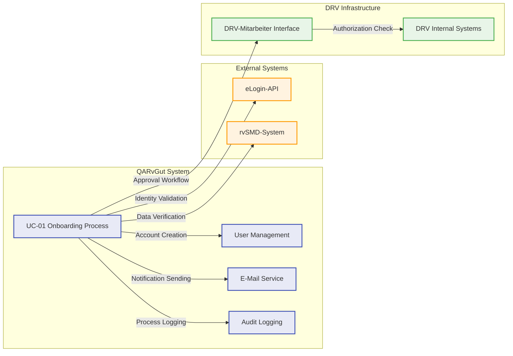

```mermaid
graph LR
    subgraph "QARvGut System"
        UC01[UC-01 Onboarding Process]
        UserMgmt[User Management]
        EmailSvc[E-Mail Service]
        AuditLog[Audit Logging]
    end
    
    subgraph "External Systems"
        eLogin[eLogin-API]
        rvSMD[rvSMD-System]
    end
    
    subgraph "DRV Infrastructure"
        DRVSys[DRV Internal Systems]
        DRVAdmin[DRV-Mitarbeiter Interface]
    end
    
    UC01 -->|Account Creation| UserMgmt
    UC01 -->|Notification Sending| EmailSvc
    UC01 -->|Process Logging| AuditLog
    UC01 -->|Identity Validation| eLogin
    UC01 -->|Data Verification| rvSMD
    UC01 -->|Approval Workflow| DRVAdmin
    
    DRVAdmin -->|Authorization Check| DRVSys
    
    %% Styling
    classDef qarvgut fill:#e8eaf6,stroke:#3f51b5,stroke-width:2px
    classDef external fill:#fff3e0,stroke:#ff9800,stroke-width:2px
    classDef drv fill:#e8f5e8,stroke:#4caf50,stroke-width:2px
    
    class UC01,UserMgmt,EmailSvc,AuditLog qarvgut
    class eLogin,rvSMD external
    class DRVSys,DRVAdmin drv
```