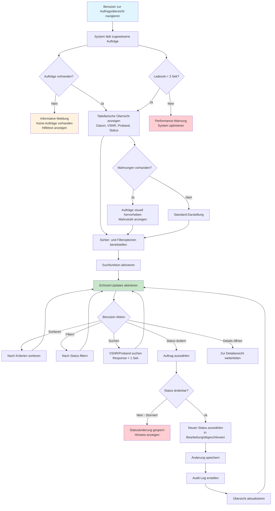

```mermaid
flowchart TD
    A[Benutzer zur Auftragsübersicht navigieren] --> B[System lädt zugewiesene Aufträge]
    B --> C{Aufträge vorhanden?}
    C -->|Nein| D[Informative Meldung<br/>Keine Aufträge vorhanden<br/>Hilfetext anzeigen]
    C -->|Ja| E[Tabellarische Übersicht anzeigen<br/>Datum, VSNR, Proband, Status]
    E --> F[Sortier- und Filteroptionen bereitstellen]
    F --> G[Suchfunktion aktivieren]
    G --> H[Echtzeit-Updates aktivieren]
    
    %% Benutzer-Aktionen
    H --> I{Benutzer-Aktion}
    I -->|Sortieren| J[Nach Kriterien sortieren]
    I -->|Filtern| K[Nach Status filtern]
    I -->|Suchen| L[VSNR/Proband suchen<br/>Response < 1 Sek]
    I -->|Status ändern| M[Auftrag auswählen]
    I -->|Details öffnen| N[Zur Detailansicht weiterleiten]
    
    %% Status ändern
    M --> O{Status änderbar?}
    O -->|Nein - Storniert| P[Statusänderung gesperrt<br/>Hinweis anzeigen]
    O -->|Ja| Q[Neuen Status auswählen<br/>in Bearbeitung/abgeschlossen]
    Q --> R[Änderung speichern]
    R --> S[Audit-Log erstellen]
    S --> T[Übersicht aktualisieren]
    
    %% Mahnungen
    E --> U{Mahnungen vorhanden?}
    U -->|Ja| V[Aufträge visuell hervorheben<br/>Mahnstufe anzeigen]
    U -->|Nein| W[Standard-Darstellung]
    
    %% Performance-Überwachung
    B --> X{Ladezeit < 3 Sek?}
    X -->|Nein| Y[Performance-Warnung<br/>System optimieren]
    X -->|Ja| E
    
    J --> H
    K --> H
    L --> H
    T --> H
    V --> F
    W --> F
    
    style A fill:#e1f5fe
    style H fill:#c8e6c9
    style D fill:#fff3e0
    style P fill:#ffcdd2
    style Y fill:#ffcdd2
```
