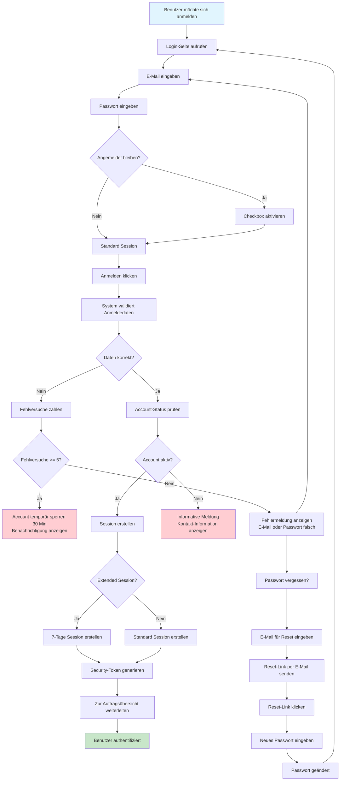

```mermaid
flowchart TD
    A[Benutzer möchte sich anmelden] --> B[Login-Seite aufrufen]
    B --> C[E-Mail eingeben]
    C --> D[Passwort eingeben]
    D --> E{Angemeldet bleiben?}
    E -->|Ja| F[Checkbox aktivieren]
    E -->|Nein| G[Standard Session]
    F --> G
    G --> H[Anmelden klicken]
    H --> I[System validiert Anmeldedaten]
    I --> J{Daten korrekt?}
    J -->|Nein| K[Fehlversuche zählen]
    K --> L{Fehlversuche >= 5?}
    L -->|Ja| M[Account temporär sperren 30 Min<br/>Benachrichtigung anzeigen]
    L -->|Nein| N[Fehlermeldung anzeigen<br/>E-Mail oder Passwort falsch]
    N --> C
    J -->|Ja| O[Account-Status prüfen]
    O --> P{Account aktiv?}
    P -->|Nein| Q[Informative Meldung<br/>Kontakt-Information anzeigen]
    P -->|Ja| R[Session erstellen]
    R --> S{Extended Session?}
    S -->|Ja| T[7-Tage Session erstellen]
    S -->|Nein| U[Standard Session erstellen]
    T --> V[Security-Token generieren]
    U --> V
    V --> W[Zur Auftragsübersicht weiterleiten]
    W --> X[Benutzer authentifiziert]
    
    %% Passwort vergessen Flow
    N --> Y[Passwort vergessen?]
    Y --> Z[E-Mail für Reset eingeben]
    Z --> AA[Reset-Link per E-Mail senden]
    AA --> BB[Reset-Link klicken]
    BB --> CC[Neues Passwort eingeben]
    CC --> DD[Passwort geändert]
    DD --> B
    
    style A fill:#e1f5fe
    style X fill:#c8e6c9
    style M fill:#ffcdd2
    style Q fill:#ffcdd2

```