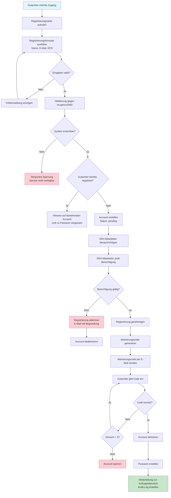

```mermaid
flowchart TD
    A[Gutachter möchte Zugang] --> B[Registrierungsseite aufrufen]
    B --> C[Registrierungsformular ausfüllen<br/>Name, E-Mail, EFN]
    C --> D{Eingaben valid?}
    D -->|Nein| E[Fehlermeldung anzeigen]
    E --> C
    D -->|Ja| F[Validierung gegen eLogin/rvSMD]
    F --> G{System erreichbar?}
    G -->|Nein| H[Temporäre Sperrung<br/>Service nicht verfügbar]
    G -->|Ja| I{Gutachter bereits registriert?}
    I -->|Ja| J[Hinweis auf bestehenden Account<br/>Link zu Passwort vergessen]
    I -->|Nein| K[Account erstellen<br/>Status: pending]
    K --> L[DRV-Mitarbeiter benachrichtigen]
    L --> M[DRV-Mitarbeiter prüft Berechtigung]
    M --> N{Berechtigung gültig?}
    N -->|Nein| O[Registrierung ablehnen<br/>E-Mail mit Begründung]
    O --> P[Account deaktivieren]
    N -->|Ja| Q[Registrierung genehmigen]
    Q --> R[Aktivierungscode generieren]
    R --> S[Aktivierungscode per E-Mail senden]
    S --> T[Gutachter gibt Code ein]
    T --> U{Code korrekt?}
    U -->|Nein| V{Versuch < 3?}
    V -->|Ja| T
    V -->|Nein| W[Account sperren]
    U -->|Ja| X[Account aktivieren]
    X --> Y[Passwort erstellen]
    Y --> Z[Weiterleitung zur Auftragsübersicht<br/>Audit-Log erstellen]
    
    style A fill:#e1f5fe
    style Z fill:#c8e6c9
    style H fill:#ffcdd2
    style O fill:#ffcdd2
    style W fill:#ffcdd2

```    