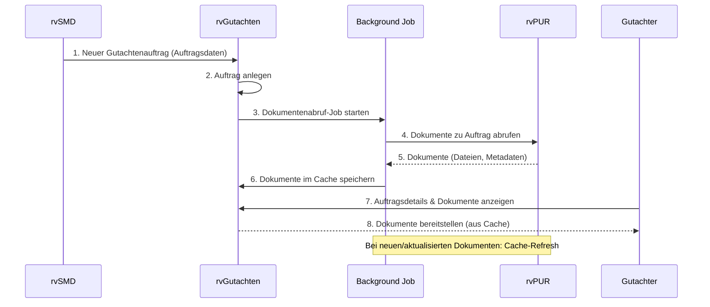

# UC-06: Automatischer Dokumentenabruf aus rvPUR bei neuem Gutachtenauftrag

**Ziel:**
Beim Eintreffen eines neuen Gutachtenauftrags werden alle relevanten Dokumente automatisch aus dem zentralen Dokumentenarchiv (rvPUR) geladen und im System rvGutachten zwischengespeichert (gecached), um eine schnelle und zuverlässige Bearbeitung durch den Gutachter zu ermöglichen.

---

## Akteure & Systeme
- **rvSMD**: Auftraggeber, erstellt neuen Gutachtenauftrag
- **rvGutachten**: Zielsystem für Gutachter und Dokumentenbearbeitung
- **rvPUR**: Zentrales Dokumentenarchiv
- **Gutachter**: Nutzer, der die Dokumente einsehen und bearbeiten muss
- **(optional) Event/Job Service**: Hintergrundprozess für asynchronen Abruf

---

## Ablaufbeschreibung
1. Ein neuer Gutachtenauftrag wird in rvSMD erstellt und an rvGutachten übermittelt.
2. rvGutachten legt den Auftrag an und stößt einen Hintergrundprozess an.
3. Der Hintergrundprozess fragt alle relevanten Dokumente zum Auftrag aus rvPUR ab.
4. Die Dokumente werden in rvGutachten zwischengespeichert (Cache/temporärer Speicher).
5. Der Gutachter kann die Dokumente direkt in rvGutachten einsehen und bearbeiten.
6. (Optional) Bei Änderungen oder neuen Dokumenten im Auftrag wird der Cache aktualisiert.

---

## Sequenzdiagramm

---

## Hinweise & Varianten
- **Fehlerfall:** Falls rvPUR nicht erreichbar ist, wird der Abruf wiederholt oder der Gutachter erhält einen Hinweis.
- **Sicherheit:** Zugriffsrechte werden bei jedem Abruf geprüft.
- **Performance:** Dokumente werden nur bei Bedarf oder nach Ablauf eines Caching-Intervalls erneut geladen.
- **Erweiterung:** Auch nachträgliche Dokumente können automatisch nachgeladen werden (Event-Trigger oder periodischer Job).

---

**Letzte Aktualisierung:** 23. Oktober 2025
