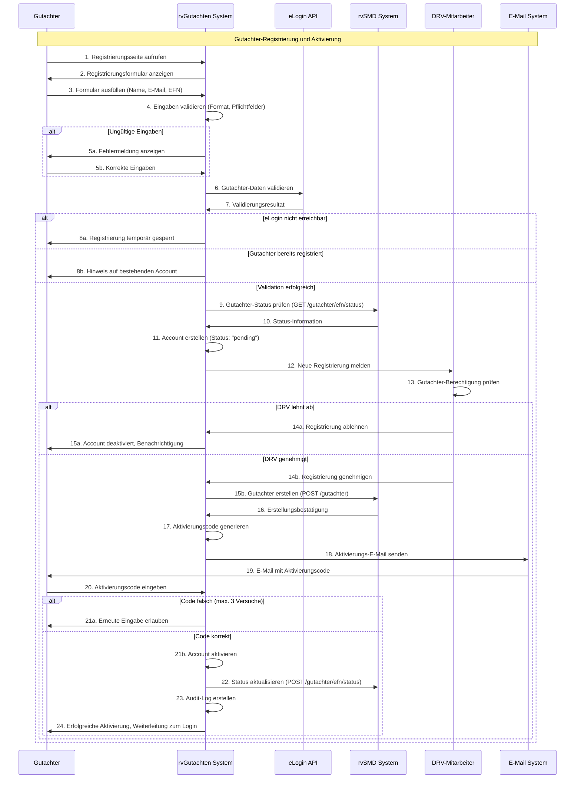
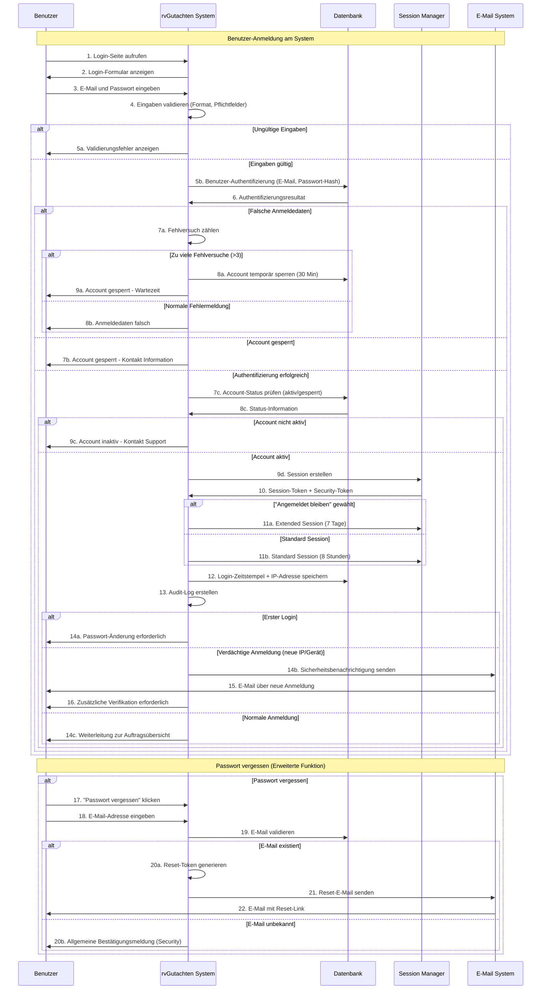
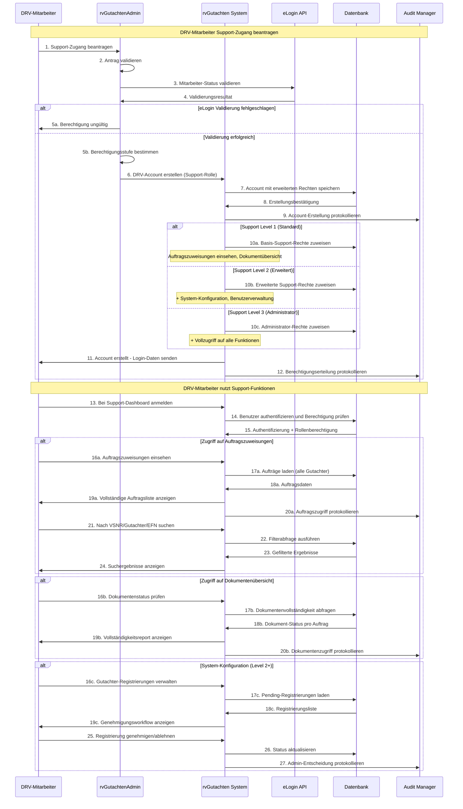
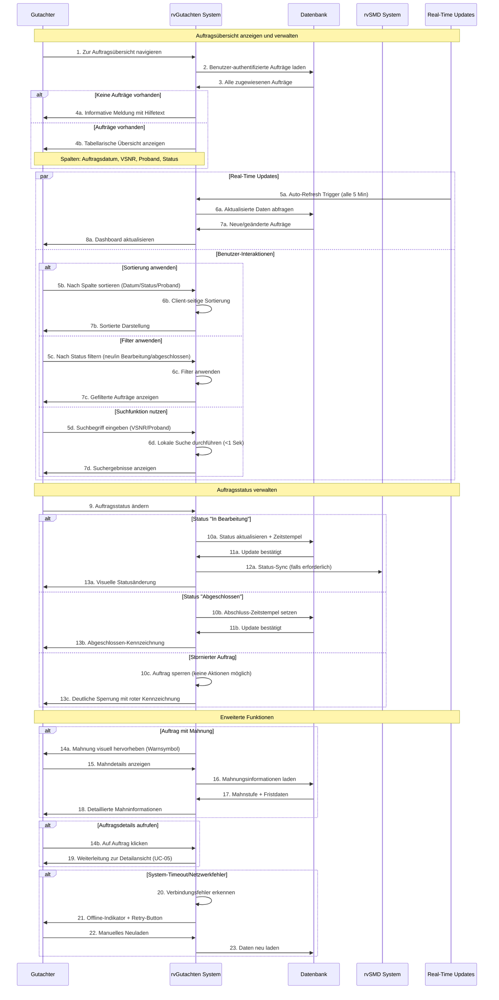
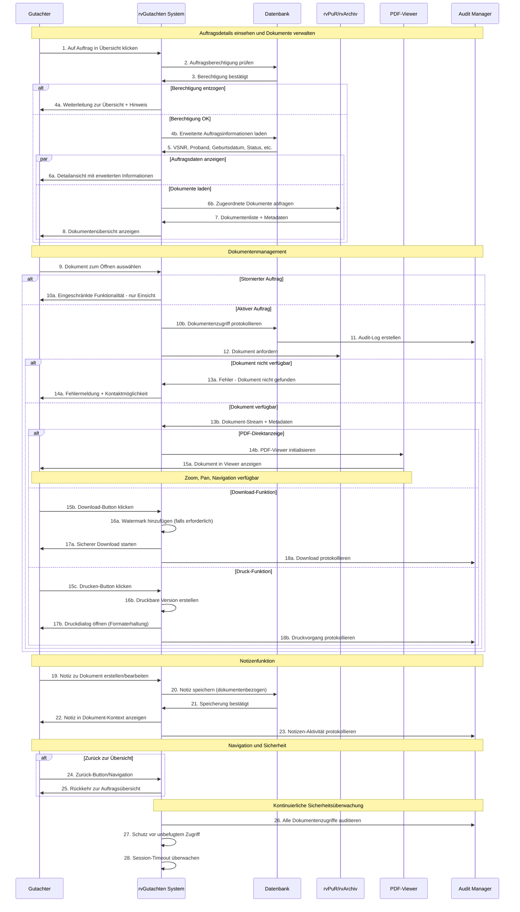
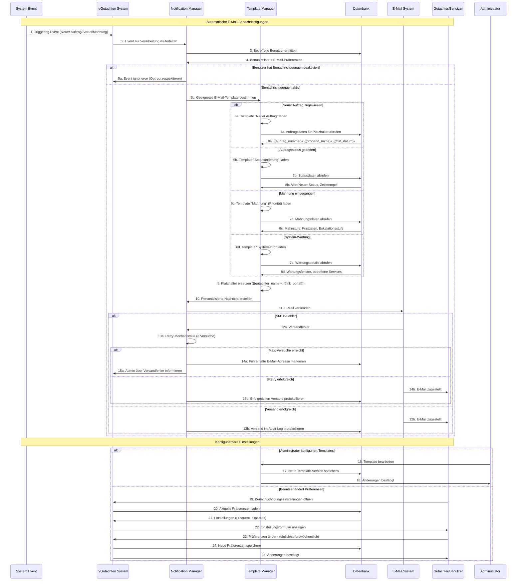
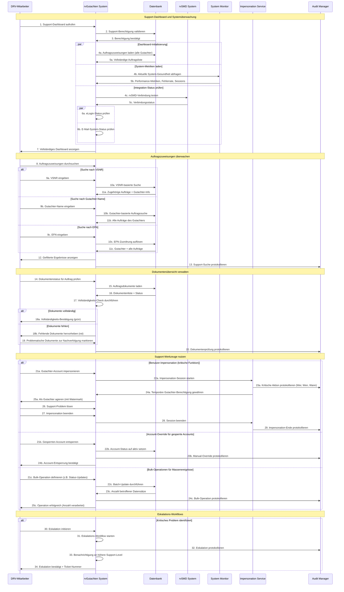
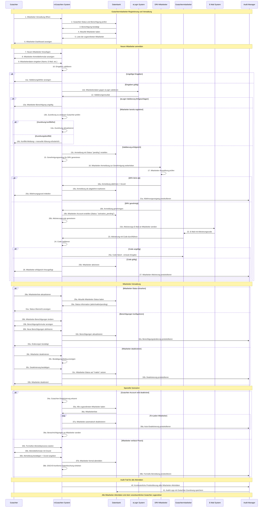
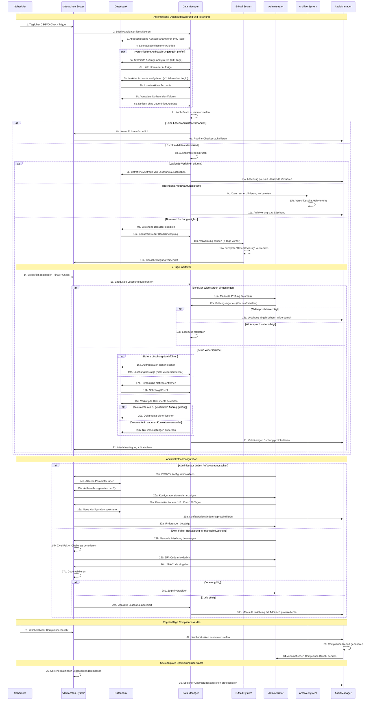

# QARvGut MVP - Nummerierte Sequenzdiagramme

**Dokument Version:** 1.0
**Projekt:** QARvGut Enhanced User Management
**Erstellt:** 21. Oktober 2025
**Zweck:** Detaillierte Sequenzdiagramme mit nummerierten Schritten für alle MVP Use Cases

---
 QARvGut Use Cases - Kurze Zusammenfassung

  🔴 Kritische Use Cases (Sprint 1)

  UC-01: Gutachter-Onboarding-Prozess
  - Admin-verwaltete Registrierung (beginnt mit rvSMD!)
  - DRV-Admin trägt Gutachter in rvSMD ein → eLogin-Account → Aktivierung per Brief
  - Integration: eLogin, rvSMD, E-Mail-System
  - Priorität: Kritisch (Blocker für alle anderen Features)

  UC-02: System-Authentifizierung
  - Login mit E-Mail/Passwort, Session-Management
  - Brute-Force-Schutz, Passwort-Reset-Funktionalität
  - Priorität: Kritisch (Grundlage für alle authentifizierten Features)

  UC-03: DRV-Mitarbeiter-Zugriffsverwaltung
  - Support-Zugang für DRV-Mitarbeiter über rvGutachtenAdmin
  - Erweiterte Berechtigungen für Administration und Support
  - Priorität: Kritisch (Notwendig für Betrieb)

  🟡 Hohe Priorität (Sprint 2)

  UC-04: Auftragsübersicht und -verwaltung
  - Tabellarische Auftragsanzeige mit Sortierung/Filterung
  - Echtzeitaktualisierung, Status-Management
  - Performance: < 3s Ladezeit für 500 Aufträge

  UC-05: Auftragsdetails und Dokumenteneinsicht
  - Detailansicht mit PDF-Viewer, Download, Druck
  - Notizen-Funktionalität, Audit-Trail
  - Sicherheit: Watermarking, Berechtigung

  🔵 Mittlere Priorität (Sprint 3)

  UC-06: E-Mail-Benachrichtigungssystem
  - Automatische Benachrichtigungen (neue Aufträge, Status, Mahnungen)
  - Konfigurierbare Templates mit Platzhaltern
  - SMTP-Integration mit Retry-Mechanismus

  UC-09: Datenaufbewahrung und Löschung (DSGVO)
  - Automatische Löschung nach definierten Regeln
  - Aufbewahrungszeiten: Abgeschlossen (90 Tage), Storniert (30 Tage)
  - Sichere, nicht-wiederherstellbare Löschung

  🔴 Niedrige Priorität (Sprint 3+)

  UC-07: Support-Dashboard und Überwachung
  - Auftragszuweisungen überwachen, Dokumentenübersicht
  - System-Gesundheit, Performance-Metriken
  - Support-Tools: Impersonation, Bulk-Operationen

  UC-08: Gutachtermitarbeiter-Verwaltung
  - Registrierung durch Gutachter → DRV-Genehmigung → Code-Aktivierung
  - Berechtigungen pro Mitarbeiter, Audit-Trail
  - Automatische Deaktivierung bei Gutachter-Sperrung

  Technische Integration

  - eLogin: Authentifizierung und Identitätsprüfung
  - rvSMD: Gutachter-Stammdaten und EFN-Verwaltung
  - E-Mail: Benachrichtigungen und Aktivierungscodes
  - DSGVO: Automatische Löschung und Compliance
  - 
## UC-01: Gutachter-Onboarding-Prozess

---

## UC-02: System-Authentifizierung

---

## UC-03: DRV-Mitarbeiter-Zugriffsverwaltung

---

## UC-04: Auftragsübersicht und -verwaltung

---

## UC-05: Auftragsdetails und Dokumenteneinsicht

---

## UC-06: E-Mail-Benachrichtigungssystem

---

## UC-07: Support-Dashboard und Überwachung

---

## UC-08: Erweiterte Gutachtermitarbeiter-Verwaltung

---

## UC-09: DSGVO-Datenaufbewahrung und -löschung

---

# Zusammenfassung

## Übersicht der nummerierten Sequenzdiagramme

Diese Markdown-Datei enthält alle 9 Use Case Sequenzdiagramme für das QARvGut MVP mit vollständig nummerierten Schritten:

### **🚨 Kritische Use Cases (Sprint 1)**
1. **UC-01**: Gutachter-Onboarding-Prozess (24 Schritte)
2. **UC-02**: System-Authentifizierung (22 Schritte + Passwort-Reset)
3. **UC-03**: DRV-Mitarbeiter-Zugriffsverwaltung (27 Schritte)

### **🟡 Hohe Priorität (Sprint 2)**
4. **UC-04**: Auftragsübersicht und -verwaltung (23 Schritte)
5. **UC-05**: Auftragsdetails und Dokumenteneinsicht (28 Schritte)

### **🔵 Mittlere Priorität (Sprint 3)**
6. **UC-06**: E-Mail-Benachrichtigungssystem (25 Schritte)
7. **UC-09**: DSGVO-Datenaufbewahrung und -löschung (36 Schritte)

### **🔴 Niedrige Priorität (Sprint 3+)**
8. **UC-07**: Support-Dashboard und Überwachung (34 Schritte)
9. **UC-08**: Erweiterte Gutachtermitarbeiter-Verwaltung (41 Schritte)

## Technische Details

**Externe Systemintegrationen:**
- eLogin API für Authentifizierung
- rvSMD System für Gutachter-Registry
- rvPuR/rvArchiv für Dokumentenverwaltung
- SMTP für E-Mail-Kommunikation

**Sicherheits- und Compliance-Features:**
- Vollständige Audit-Trail-Protokollierung
- DSGVO-konforme Datenverarbeitung
- Berechtigungsbasierte Zugriffskontrolle
- Sichere Session-Verwaltung

Die nummerierten Schritte ermöglichen eine eindeutige Referenzierung für die technische Implementierung und Testfallentwicklung.