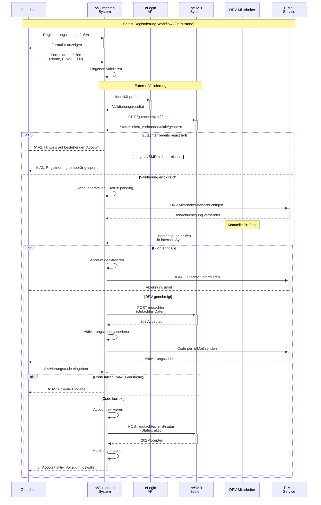
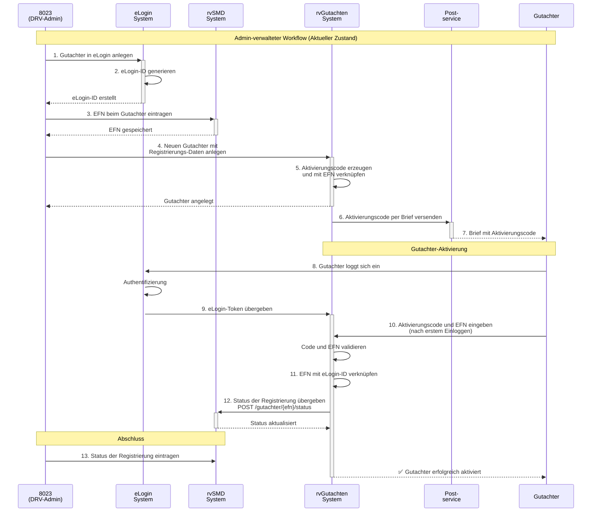
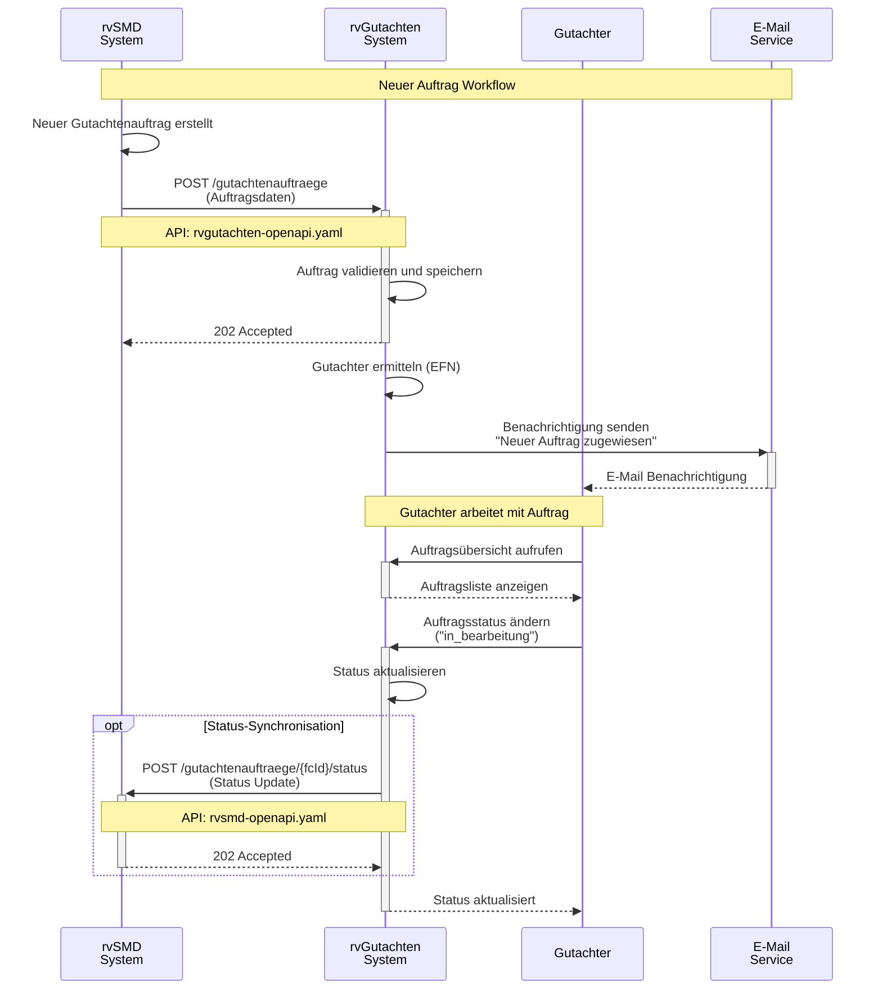
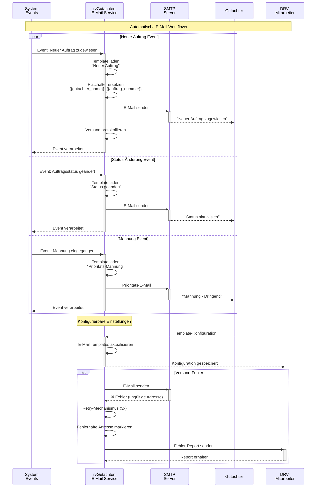
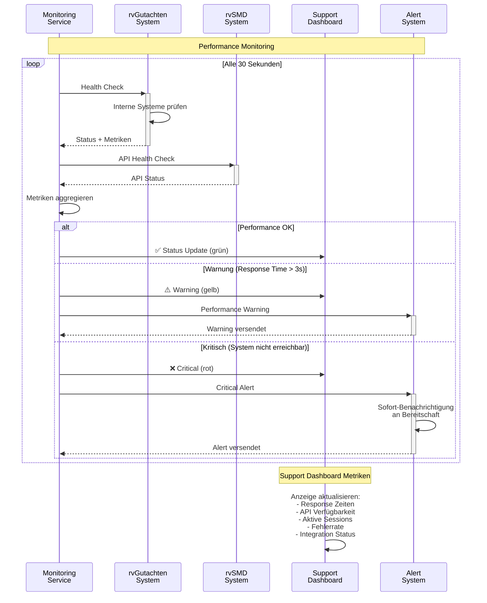

# QARvGut System-Integration Sequenzdiagramme

**Dokument Version:** 1.0  
**Projekt:** QARvGut Enhanced User Management  
**Typ:** System-Integration Dokumentation  
**Erstellt:** 16. Oktober 2025  

---

## Übersicht

Diese Dokumentation zeigt die System-Integration zwischen rvGutachten, rvSMD und externen Systemen durch detaillierte Sequenzdiagramme.

## API-Integration Patterns

### Bidirektionale Kommunikation:
- **rvGutachten → rvSMD**: `rvsmd-openapi.yaml` (von rvSMD bereitgestellt)
- **rvSMD → rvGutachten**: `rvgutachten-openapi.yaml` (von rvGutachten bereitgestellt)

---

## UC-01a: Selbst-Registrierung Workflow

**Basierend auf**: UC-01.md (Modernisierter Ansatz)



---

## UC-01b: Admin-verwalteter Workflow

**Basierend auf**: UC-01_sequence.md (Aktueller Zustand)



---

## UC-04: Auftragsverwaltung Integration

**Neue Aufträge von rvSMD zu rvGutachten**



---

## UC-06: E-Mail-Benachrichtigungssystem

**Event-driven Notification Workflow**



---

## Error Handling Patterns

**Typische Fehlerbehandlung bei API-Integration**

```mermaid
sequenceDiagram
    participant RVG as rvGutachten
    participant RVS as rvSMD<br/>API
    participant RETRY as Retry<br/>Service
    participant LOG as Error<br/>Logging
    participant ADMIN as System<br/>Admin
    
    Note over RVG,ADMIN: API-Fehlerbehandlung Patterns
    
    RVG->>+RVS: POST /gutachter/{efn}/status
    
    alt Erfolgreiche Antwort
        RVS-->>-RVG: 202 Accepted
        RVG->>LOG: Success Log schreiben
    else Temporärer Fehler (5xx)
        RVS-->>RVG: 503 Service Unavailable
        RVG->>+RETRY: In Retry-Queue einreihen
        RETRY->>RETRY: Exponential Backoff<br/>(1s, 2s, 4s, 8s)
        
        loop Max 3 Versuche
            RETRY->>+RVS: Retry Request
            alt Erfolg
                RVS-->>-RETRY: 202 Accepted
                RETRY-->>RVG: ✅ Erfolg nach Retry
            else Weiterhin Fehler
                RVS-->>-RETRY: 503 Service Unavailable
                RETRY->>RETRY: Nächster Versuch warten
            end
        end
        
        opt Alle Versuche fehlgeschlagen
            RETRY->>LOG: ❌ Permanent Error Log
            RETRY->>+ADMIN: Alert: API nicht erreichbar
            ADMIN-->>-RETRY: Alert empfangen
        end
        
        RETRY-->>-RVG: Final Status
    else Client Fehler (4xx)
        RVS-->>-RVG: 400 Bad Request
        RVG->>LOG: ❌ Client Error (keine Retry)
        RVG->>+ADMIN: Sofortiger Alert<br/>Daten-Validierungsfehler
        ADMIN-->>-RVG: Alert empfangen
    end
```

---

## Performance und Monitoring

**System-Performance Überwachung**



---

## Datenfluss Übersicht

**Zusammenfassung der System-Integrationen**

| Integration | API Endpoint | Zweck | Fehlerbehandlung |
|-------------|--------------|-------|------------------|
| **rvGutachten → rvSMD** | `POST /gutachter/{efn}/status` | Status-Updates | Retry mit Backoff |
| **rvGutachten → rvSMD** | `POST /gutachtenauftraege/{fcId}/gutachten/eingang` | Gutachten-Eingang | Retry mit Backoff |
| **rvSMD → rvGutachten** | `POST /gutachter` | Gutachter erstellen | Validierung + Alert |
| **rvSMD → rvGutachten** | `GET /gutachter/{efn}/status` | Status abfragen | Cache + Timeout |
| **rvSMD → rvGutachten** | `POST /gutachtenauftraege` | Neue Aufträge | Queue + Retry |

---

## Implementierung Empfehlungen

### 1. **API Client Konfiguration**
```yaml
retry:
  max_attempts: 3
  backoff: exponential
  initial_delay: 1s
  max_delay: 30s

timeout:
  connect: 5s
  read: 30s
  
circuit_breaker:
  failure_threshold: 5
  recovery_timeout: 60s
```

### 2. **Monitoring Alerts**
- Response Time > 3s → Warning
- Error Rate > 5% → Warning  
- API Unavailable → Critical
- Circuit Breaker Open → Critical

### 3. **Audit Logging**
- Alle API Calls protokollieren
- Request/Response IDs für Tracing
- Performance Metriken sammeln
- Fehler mit Context loggen

---

**Dokumentation erstellt:** 16. Oktober 2025  
**Nächste Überprüfung:** Bei API-Änderungen oder System-Updates
