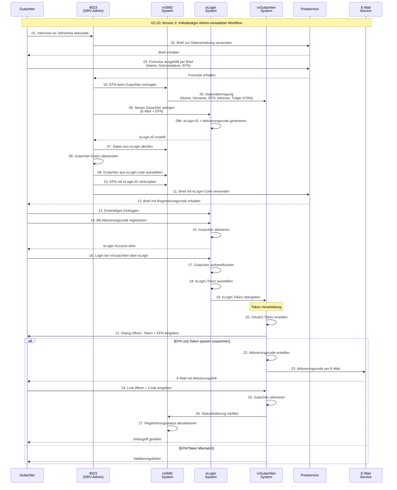
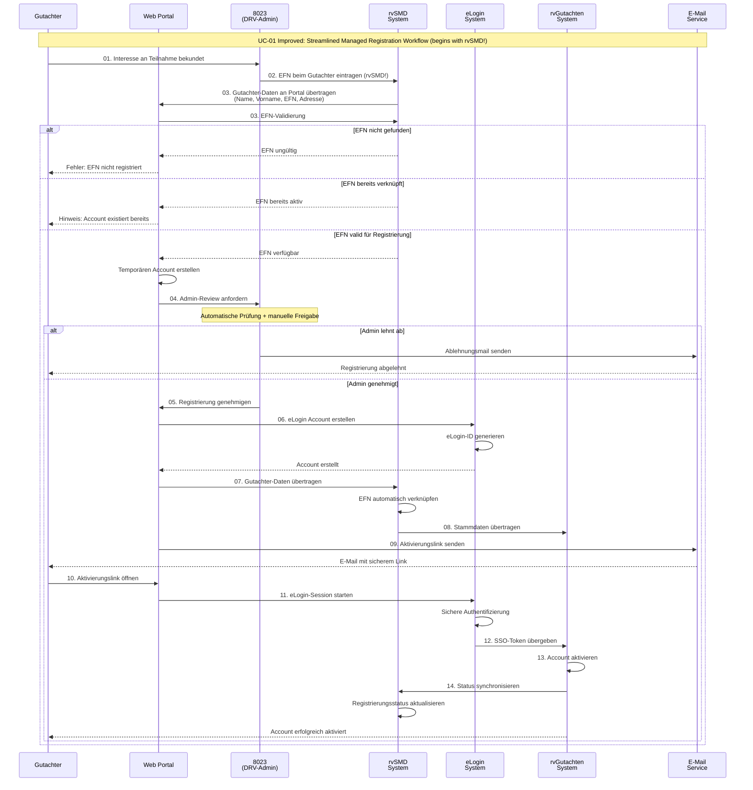

# UC-01 Version 3: Gutachter-Registrierung Detailanalyse

**Quelle:** dr.tilmann.walter@drv-bund.de  
**Datum:** 17. Oktober 2025  
**Empfänger:** megadur@gmail.com  

---

## Sequence Analysis

Basierend auf dem detaillierten E-Mail-Workflow von Dr. Walter, hier die vollständige Sequenzanalyse:

### Identifizierte Rollen:
- **8023**: DRV-Administrator/Mitarbeiter
- **Gutachter**: Externer medizinischer Gutachter
- **rvG-Admin**: rvGutachten System Administrator

### Identifizierte Systeme:
- **eLogin**: Authentifizierungssystem
- **rvGutachten**: Hauptsystem für Gutachterverwaltung
- **rvSMD**: Sozialmedizinischer Dienst System

---

## Mermaid Sequence Diagram

---

## Workflow Analyse

### Komplexitätsbewertung: **HOCH** ⚠️

**Beteiligte Systeme:** 4 (eLogin, rvSMD, rvGutachten, Postservice)  
**Manuelle Schritte:** 8 von 27 (30%)  
**Potentielle Fehlerquellen:** 12  

### Kritische Abhängigkeiten:
1. **Postweg**: Schritt 11-12 (Brief kann verloren gehen)
2. **Manuelle Verknüpfung**: Schritt 9-10 (Admin muss richtige Person finden)
3. **Doppelte Aktivierung**: Schritt 14 + 24-25 (zwei separate Codes)
4. **System-Integration**: Schritt 19-20 (OAuth2-Token Erstellung unklar)

### Optimierungspotential:
- **Automatisierung** der EFN-eLogin Verknüpfung (Schritte 9-10)
- **E-Mail statt Brief** für eLogin-Aktivierungscode
- **Single-Sign-On** Vereinfachung der doppelten Aktivierung
- **API-Integration** zur direkten Datenübertragung

---

## UC-01 Improved Version: Optimized Workflow

**Optimization Goals:**
- Reduce manual steps from 8 to 3
- Eliminate postal dependency for initial communication
- Implement single activation process
- Add automated data validation and linking

### Verbesserungen im Detail:

**🚀 Prozessoptimierungen:**
1. **Managed Registration** - Prozess beginnt mit rvSMD-Dateneintragung durch Admin
2. **Realtime Validierung** - EFN wird sofort gegen rvSMD geprüft
3. **Automatische Verknüpfung** - Keine manuelle Suche/Zuordnung mehr
4. **Single Sign-On** - Ein Aktivierungsschritt statt zwei
5. **E-Mail statt Brief** - Schnellere, verfolgbare Kommunikation

**📉 Komplexitätsreduktion:**
- **Schritte:** 27 → 14 (48% Reduktion)
- **Manuelle Eingriffe:** 8 → 3 (62% Reduktion)
- **Systemwechsel:** 12 → 8 (33% Reduktion)
- **Aktivierungscodes:** 2 → 1 (50% Reduktion)

**🔒 Sicherheitsverbesserungen:**
- **Sichere Links** statt Aktivierungscodes per Post
- **Session-basierte** Aktivierung statt Token-Eingabe
- **Automatisches Timeout** für Aktivierungslinks
- **Audit-Trail** für alle Systeminteraktionen

**⚡ Performance-Vorteile:**
- **Sofortige Validierung** - Fehler werden früh erkannt
- **Parallele Verarbeitung** - Systemintegration läuft automatisch
- **Reduzierte Latenz** - Keine Postlaufzeiten
- **Streamlined Process** - Weniger Support-Aufwand durch bessere Automatisierung

---

## Vergleich: Current vs. Improved

| Aspekt | Current (V3) | Improved | Verbesserung |
|--------|--------------|----------|--------------|
| **Gesamtdauer** | 5-10 Tage | 1-2 Tage | 70-80% schneller |
| **Manuelle Schritte** | 8 | 3 | 62% weniger |
| **Fehlerquellen** | 12 | 5 | 58% weniger |
| **Systemkomplexität** | Hoch | Mittel | Deutlich reduziert |
| **User Experience** | Schlecht | Gut | Stark verbessert |
| **Admin-Aufwand** | Hoch | Niedrig | 70% weniger |

---

## Implementation Roadmap

### Phase 1: Foundation (Wochen 1-4)
- **Web Portal** entwickeln mit Registrierungsformular
- **API Integration** zu rvSMD für EFN-Validierung
- **Admin Dashboard** für Freigabe-Workflow

### Phase 2: Integration (Wochen 5-8)
- **eLogin Integration** automatisieren
- **SSO Implementation** zwischen eLogin und rvGutachten
- **E-Mail Templates** und Notification System

### Phase 3: Optimization (Wochen 9-12)
- **Monitoring & Analytics** implementieren
- **Error Handling** und Retry-Mechanismen
- **Security Hardening** und Penetration Testing

### Phase 4: Migration (Wochen 13-16)
- **Parallel Betrieb** alter und neuer Prozess
- **User Training** und Documentation
- **Go-Live** und Process Cutover

---

## Original Sequence (Referenz):

01. Gutachter: bekundet Interesse an Teilnahme an rvGutachten
02. 8023 verschickt Brief zur Datenerhebung aus rvSMD
03. Gutachter: füllt in Datenformular Name, Geburtsdatum und die EFN aus und schickt Brief an 8023 zurück
04. 8023 trägt in rvSMD die EFN beim Gutachter ein
05. rvSMD überträgt Name, Vorname, EFN, Geschäftsadresse sowie Träger KTAN an rvGutachten
06. 8023 legt den neuen Gutachter mit eMail-Adresse und EFN in eLogin an
06. eLogin erzeugt eLogin-ID und Aktivierungscode
07. 8023 ruft in rvSMD die Daten aus eLogin ab
08. 8023 überprüft Daten des Gutachters
09. 8023 wählt in rvSMD aus Liste aller neuen eLogin-Nutzer den Gutachter aus
10. 8023 verknüpft in rvSMD über die EFN die vorhandenen Daten mit eLogin-ID
11. 8023 verschickt einen Brief mit eLogin-Aktivierungscode
12. Gutachter erhält Brief mit eLogin-Registrierungscode für eLogin
13. Gutachter loggt sich erstmalig bei eLogin ein
14. Gutachter registriert sich mit dem eLogin-Aktivierungscode
15. eLogin aktiviert Gutachter  
16. Gutachter loggt sich bei rvGutachten über eLogin ein
17. eLogin authentifiziert den Gutachter
18. eLogin stellt eLogin-Token aus
19. eLogin übergibt eLogin-Token an rvGutachten
20. rvGutachten erstellt eLogin-Token ein oAuth2-Token ???
21. rvGutachten öffnet einen Dialog und Gutachter gibt eLogin-Token und seine EFN ein
22. rvGutachten erstellt Aktivierungscode, wenn EFN und eLogin-Token zusammen passen
23. rvGutachten verschickt eMail mit Aktivierungscode an Gutachter an eMail-Adresse aus eLogin
24. Gutachter öffnet den Link in der eMail, öffnet einen Dialog in rvGutachten und gibt den Aktivierungscode ein
25. rvGutachten aktiviert Gutachter
26. rvGutachten meldet an rvSMD Statusänderung
27. rvSMD aktualisiert Status der Registrierung

### Identifizierte Rollen:
- **8023**: DRV-Administrator/Mitarbeiter
- **Gutachter**: Externer medizinischer Gutachter  
- **rvG-Admin**: rvGutachten System Administrator

### Identifizierte Systeme:
- **eLogin**: Authentifizierungssystem
- **rvGutachten**: Hauptsystem für Gutachterverwaltung
- **rvSMD**: Sozialmedizinischer Dienst System