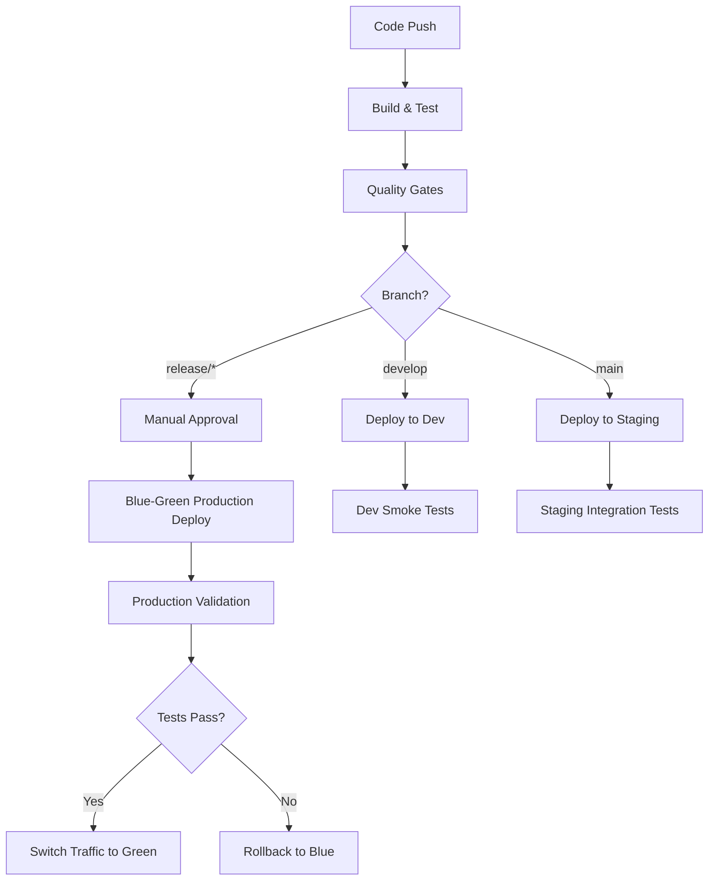

# QARvGut Comprehensive Deployment Strategy - Brownfield Enhancement

**Document Version:** 1.0  
**Project:** QARvGut Enhanced User Management  
**Type:** Brownfield Enhancement  
**Created:** August 11, 2025

---

## Executive Summary

This document defines the complete CI/CD pipeline and deployment strategy for safely deploying Enhanced User Management features to the existing QARvGut production environment. The strategy emphasizes **zero downtime**, **rollback capability**, and **comprehensive validation** at each deployment stage.

**Key Requirements:**
- ✅ **Zero Production Downtime** - Blue-green deployment strategy
- ✅ **Automated Quality Gates** - Comprehensive testing before deployment
- ✅ **Rollback Capability** - Immediate rollback within 5 minutes
- ✅ **Infrastructure as Code** - All environments defined in version control
- ✅ **Environment Parity** - Dev/Staging/Production consistency

---

## Current Infrastructure Assessment

### ✅ **Existing Technology Stack**

| Category | Technology | Version | Deployment Status |
|----------|------------|---------|-------------------|
| Frontend | Angular | 19 | Development only |
| Backend | ASP.NET Core | 9.0 | Development only |
| Database | SQL Server LocalDB | Latest | Local development |
| Authentication | ASP.NET Identity + OpenIDConnect | Latest | Development configured |
| Build Tools | Angular CLI + .NET CLI | Latest | Local build only |

### ❌ **Missing Infrastructure Components**

| Component | Priority | Impact | Implementation Timeline |
|-----------|----------|---------|------------------------|
| CI/CD Pipeline | **CRITICAL** | Cannot deploy safely | 2 days |
| Cloud Infrastructure | **CRITICAL** | No production environment | 2 days |
| Environment Configuration | **HIGH** | Manual deployment risk | 1 day |
| Database Migration Pipeline | **HIGH** | Schema deployment risk | 1 day |
| Monitoring & Alerting | **MEDIUM** | Limited visibility | 1 day |
| SSL/TLS Configuration | **MEDIUM** | Security requirement | 0.5 days |

---

## Comprehensive Deployment Architecture

### 1. Cloud Infrastructure Strategy

#### **Target Platform: Microsoft Azure**

**Why Azure:**
- ✅ Native .NET Core support with Azure App Service
- ✅ Integrated SQL Database with automated backups
- ✅ Angular SPA hosting via Azure Storage Static Websites
- ✅ Azure Active Directory integration ready
- ✅ Cost-effective for small to medium applications

#### **Infrastructure Components**

```yaml
Azure Resource Groups:
├── rg-qarvgut-dev/
│   ├── app-qarvgut-dev (App Service)
│   ├── sql-qarvgut-dev (SQL Database)
│   ├── sa-qarvgut-dev (Storage Account)
│   └── kv-qarvgut-dev (Key Vault)
├── rg-qarvgut-staging/
│   ├── app-qarvgut-staging (App Service)
│   ├── sql-qarvgut-staging (SQL Database)
│   ├── sa-qarvgut-staging (Storage Account)
│   └── kv-qarvgut-staging (Key Vault)
└── rg-qarvgut-prod/
    ├── app-qarvgut-prod (App Service)
    ├── app-qarvgut-prod-blue (App Service - Blue/Green)
    ├── sql-qarvgut-prod (SQL Database)
    ├── sa-qarvgut-prod (Storage Account)
    ├── kv-qarvgut-prod (Key Vault)
    └── appgw-qarvgut-prod (Application Gateway)
```

#### **Environment Specifications**

| Environment | App Service SKU | SQL Database Tier | Storage Account | Estimated Cost/Month |
|-------------|-----------------|-------------------|-----------------|---------------------|
| Development | B1 Basic | Basic (5 DTU) | Standard LRS | $50 USD |
| Staging | S1 Standard | Standard (S0) | Standard LRS | $120 USD |
| Production | P1V3 Premium | Standard (S1) | Premium GRS | $400 USD |

### 2. CI/CD Pipeline Strategy

#### **Pipeline Platform: GitHub Actions**

**Why GitHub Actions:**
- ✅ Native integration with existing GitHub repository
- ✅ Comprehensive .NET Core and Node.js support
- ✅ Azure deployment actions available
- ✅ Secret management integration
- ✅ Matrix build support for multiple environments

#### **Pipeline Architecture**

```
GitHub Actions Workflow:
├── Trigger: Push to main/develop, Pull Request
├── Stage 1: Build & Test (Parallel)
│   ├── Backend Build & Unit Tests (.NET Core)
│   ├── Frontend Build & Unit Tests (Angular)
│   └── Integration Tests (E2E with Playwright)
├── Stage 2: Security & Quality Gates
│   ├── Code Coverage Validation (90% backend, 80% frontend)
│   ├── Security Scanning (CodeQL)
│   ├── Dependency Vulnerability Scanning
│   └── Static Code Analysis
├── Stage 3: Deployment (Conditional)
│   ├── Development: Auto-deploy on develop branch
│   ├── Staging: Auto-deploy on main branch
│   └── Production: Manual approval required
└── Stage 4: Post-Deployment Validation
    ├── Health Check Tests
    ├── Regression Test Suite
    └── Performance Baseline Validation
```

#### **Deployment Pipeline Flow**



### 3. Database Migration Strategy

#### **Migration Pipeline Architecture**

```
Database Migration Strategy:
├── Schema Versioning: Entity Framework Core Migrations
├── Development: Automatic migration on application startup
├── Staging: Pre-deployment migration with rollback SQL
├── Production: Manual migration approval with backup
└── Rollback: Automated revert to previous schema version
```

#### **Migration Execution Process**

**Pre-Deployment:**
```bash
# Generate migration scripts
dotnet ef migrations script --from LastMigration --to NewMigration --output migration.sql

# Backup production database
az sql db export --server prod-server --database QARvGut --storage-uri backup-uri

# Validate migration on staging copy
dotnet ef database update --connection-string "$(StagingConnectionString)"
```

**Production Migration:**
```bash
# 1. Put application in maintenance mode
# 2. Execute migration with timeout protection
sqlcmd -S prod-server -d QARvGut -i migration.sql -t 300

# 3. Validate schema integrity
dotnet ef migrations has-pending-model-changes --connection-string "$(ProdConnectionString)"

# 4. Remove maintenance mode
```

**Rollback Strategy:**
```bash
# Automated rollback within 5 minutes
dotnet ef migrations script --from NewMigration --to LastMigration --output rollback.sql
sqlcmd -S prod-server -d QARvGut -i rollback.sql -t 120
```

### 4. Blue-Green Deployment Strategy

#### **Blue-Green Architecture**

```
Production Environment:
├── Blue Environment (Current Production)
│   ├── app-qarvgut-prod-blue (App Service)
│   ├── SQL Database (Shared - with migration strategy)
│   └── Storage Account (Shared)
├── Green Environment (New Deployment)
│   ├── app-qarvgut-prod-green (App Service)
│   ├── SQL Database (Shared - with migration strategy)
│   └── Storage Account (Shared)
└── Application Gateway
    ├── Routes 100% traffic to Blue (current)
    ├── Health probes both environments
    └── Instant failover capability
```

#### **Deployment Process**

**Phase 1: Preparation**
1. ✅ Deploy Enhanced User Management to Green environment
2. ✅ Run database migration (affects both Blue and Green)
3. ✅ Execute comprehensive test suite on Green
4. ✅ Validate Green environment health

**Phase 2: Traffic Switch**
1. ✅ Route 10% traffic to Green environment
2. ✅ Monitor error rates and performance metrics
3. ✅ Gradually increase traffic: 10% → 25% → 50% → 100%
4. ✅ Complete switch after successful validation

**Phase 3: Cleanup**
1. ✅ Keep Blue environment for 24 hours (immediate rollback)
2. ✅ Monitor production metrics for 24 hours
3. ✅ Decommission Blue environment after validation

---

## Implementation Timeline

### 📋 **Phase 1: Infrastructure Setup (Days 1-2)**

#### **Day 1: Azure Infrastructure Creation**

**Morning (4 hours):**
- ✅ Create Azure Resource Groups (Dev, Staging, Production)
- ✅ Deploy App Services with proper SKUs
- ✅ Create SQL Databases with appropriate tiers
- ✅ Configure Storage Accounts for Angular hosting
- ✅ Set up Key Vaults for secret management

**Afternoon (4 hours):**
- ✅ Configure Application Gateway for Blue-Green deployments
- ✅ Set up networking and security groups
- ✅ Configure SSL certificates (Let's Encrypt automation)
- ✅ Validate connectivity between all components

#### **Day 2: CI/CD Pipeline Creation**

**Morning (4 hours):**
- ✅ Create GitHub Actions workflow files
- ✅ Configure build matrices for .NET Core and Angular
- ✅ Set up automated testing integration
- ✅ Configure Azure deployment actions

**Afternoon (4 hours):**
- ✅ Configure environment secrets and variables
- ✅ Set up deployment approval processes
- ✅ Test pipeline execution end-to-end
- ✅ Validate Blue-Green deployment mechanism

### 📋 **Phase 2: Environment Configuration (Day 3)**

#### **Configuration Management**

**Morning (4 hours):**
- ✅ Update `appsettings.json` files for each environment
- ✅ Configure connection strings in Azure Key Vault
- ✅ Set up environment-specific SMTP configurations
- ✅ Configure OpenIDConnect certificates

**Afternoon (4 hours):**
- ✅ Test database connectivity from each environment
- ✅ Validate authentication flows in each environment
- ✅ Configure monitoring and alerting rules
- ✅ Set up log aggregation (Azure Monitor)

### 📋 **Phase 3: Validation and Testing (Day 4)**

#### **End-to-End Validation**

**Morning (4 hours):**
- ✅ Deploy current codebase to all environments
- ✅ Execute comprehensive test suites
- ✅ Validate Blue-Green deployment process
- ✅ Test rollback procedures

**Afternoon (4 hours):**
- ✅ Performance testing with production-like data
- ✅ Security validation and penetration testing
- ✅ Documentation and runbook creation
- ✅ Team training on deployment procedures

---

## Configuration Management

### 1. Environment-Specific Configuration

#### **appsettings.{Environment}.json Structure**

```json
{
  "ConnectionStrings": {
    "DefaultConnection": "Server=#{SqlServerName}#;Database=#{DatabaseName}#;Authentication=Active Directory MSI;Encrypt=true;"
  },
  "Azure": {
    "KeyVault": {
      "Name": "#{KeyVaultName}#"
    },
    "Storage": {
      "AccountName": "#{StorageAccountName}#"
    }
  },
  "SmtpConfig": {
    "Host": "#{SmtpHost}#",
    "Port": 587,
    "UseSSL": true,
    "Name": "QARvGut System",
    "Username": "#{SmtpUsername}#",
    "EmailAddress": "#{SmtpEmailAddress}#",
    "Password": "#{SmtpPassword}#"
  },
  "OIDC": {
    "Certificates": {
      "Path": "#{CertificatePath}#",
      "Password": "#{CertificatePassword}#"
    }
  },
  "ApplicationInsights": {
    "ConnectionString": "#{ApplicationInsightsConnectionString}#"
  }
}
```

#### **Environment Variable Mapping**

| Variable | Development | Staging | Production |
|----------|-------------|---------|------------|
| SqlServerName | qarvgut-dev.database.windows.net | qarvgut-staging.database.windows.net | qarvgut-prod.database.windows.net |
| DatabaseName | QARvGut | QARvGut | QARvGut |
| KeyVaultName | kv-qarvgut-dev | kv-qarvgut-staging | kv-qarvgut-prod |
| StorageAccountName | saqarvgutdev | saqarvgutstaging | saqarvgutprod |

### 2. Secret Management Strategy

#### **Azure Key Vault Integration**

```csharp
// Enhanced Program.cs configuration
public static WebApplication CreateApp(string[] args)
{
    var builder = WebApplication.CreateBuilder(args);
    
    // Add Azure Key Vault configuration
    builder.Configuration.AddAzureKeyVault(
        new Uri($"https://{builder.Configuration["Azure:KeyVault:Name"]}.vault.azure.net/"),
        new DefaultAzureCredential()
    );
    
    // Rest of configuration...
    return builder.Build();
}
```

#### **Secret Rotation Strategy**

```
Secret Rotation Schedule:
├── Database Passwords: 90 days
├── SMTP Credentials: 180 days  
├── SSL Certificates: 365 days (Let's Encrypt auto-renewal)
├── API Keys: 180 days
└── Service Principal Secrets: 365 days
```

---

## Monitoring and Alerting Strategy

### 1. Application Monitoring

#### **Azure Application Insights Configuration**

```json
{
  "ApplicationInsights": {
    "ConnectionString": "InstrumentationKey=#{InstrumentationKey}#;IngestionEndpoint=#{IngestionEndpoint}#",
    "EnableAdaptiveSampling": false,
    "EnablePerformanceCounters": true,
    "EnableDependencyTracking": true
  }
}
```

#### **Custom Metrics and KPIs**

```csharp
// Enhanced User Management Metrics
public class UserManagementMetrics
{
    private readonly ILogger<UserManagementMetrics> _logger;
    
    public void TrackBulkOperationDuration(string operationType, TimeSpan duration)
    {
        _logger.LogMetric("BulkOperation.Duration", duration.TotalMilliseconds, 
            ("OperationType", operationType));
    }
    
    public void TrackUserSearchPerformance(int resultCount, TimeSpan duration)
    {
        _logger.LogMetric("UserSearch.Performance", duration.TotalMilliseconds,
            ("ResultCount", resultCount.ToString()));
    }
}
```

### 2. Infrastructure Monitoring

#### **Azure Monitor Alerts**

```yaml
Alert Rules:
├── Application Performance
│   ├── Response Time > 3 seconds (Warning)
│   ├── Response Time > 5 seconds (Critical)
│   ├── Error Rate > 1% (Warning)
│   └── Error Rate > 5% (Critical)
├── Infrastructure Health
│   ├── App Service CPU > 80% (Warning)
│   ├── App Service Memory > 85% (Warning)
│   ├── SQL Database DTU > 90% (Critical)
│   └── Storage Account Throttling (Warning)
└── Business Metrics
    ├── User Registration Failures > 10/hour (Warning)
    ├── Bulk Import Failures > 5/hour (Warning)
    └── Authentication Failures > 50/hour (Critical)
```

#### **Log Aggregation Strategy**

```
Log Aggregation:
├── Application Logs: Azure Monitor Logs
├── IIS Logs: Log Analytics
├── SQL Server Logs: SQL Insights
├── Security Logs: Microsoft Defender for Cloud
└── Custom Business Logs: Application Insights Custom Events
```

---

## Security and Compliance

### 1. Security Configuration

#### **SSL/TLS Configuration**

```yaml
SSL Strategy:
├── Certificate Management: Azure Key Vault
├── Automation: Let's Encrypt with auto-renewal
├── TLS Version: 1.2 minimum
├── Cipher Suites: Modern compatibility
└── HSTS: Enabled with 1-year max-age
```

#### **Network Security**

```
Network Security:
├── Application Gateway: WAF enabled
├── App Service: HTTPS only, client certificates
├── SQL Database: Firewall rules, Private Link
├── Storage Account: Private endpoints, HTTPS only
└── Key Vault: Network access restrictions
```

### 2. Data Protection

#### **Backup Strategy**

```yaml
Backup Configuration:
├── SQL Database:
│   ├── Point-in-time restore: 7 days
│   ├── Long-term retention: Monthly (12 months)
│   └── Geo-redundant backups: Enabled
├── Application Files:
│   ├── App Service backup: Daily
│   └── Storage Account: GRS replication
└── Configuration:
    ├── Key Vault: Soft delete enabled
    └── ARM Templates: Version controlled
```

---

## Disaster Recovery Plan

### 1. Recovery Objectives

| Component | RTO (Recovery Time) | RPO (Recovery Point) | Strategy |
|-----------|-------------------|---------------------|----------|
| Application | 15 minutes | 5 minutes | Blue-Green deployment |
| Database | 30 minutes | 15 minutes | Point-in-time restore |
| Configuration | 10 minutes | Real-time | Azure Key Vault |
| Static Assets | 5 minutes | Real-time | CDN with origin failover |

### 2. Disaster Recovery Procedures

#### **Application Failure Recovery**

```bash
# Immediate rollback procedure (< 5 minutes)
1. Switch Application Gateway routing to Blue environment
2. Validate application functionality
3. Monitor error rates and performance
4. Investigate Green environment issues
```

#### **Database Disaster Recovery**

```bash
# Database corruption recovery (< 30 minutes)
1. Identify last known good transaction log backup
2. Restore database to point-in-time before corruption
3. Validate data integrity
4. Update application configuration if needed
5. Resume normal operations
```

#### **Complete Region Failure**

```bash
# Regional disaster recovery (< 2 hours)
1. Activate secondary Azure region resources
2. Restore database from geo-redundant backup
3. Update DNS records to secondary region
4. Validate application functionality in secondary region
5. Monitor performance and error rates
```

---

## Cost Optimization Strategy

### 1. Resource Optimization

#### **Auto-scaling Configuration**

```yaml
Auto-scaling Rules:
├── App Service:
│   ├── Scale Out: CPU > 70% for 5 minutes
│   ├── Scale In: CPU < 30% for 10 minutes
│   ├── Max Instances: 10
│   └── Min Instances: 2
├── SQL Database:
│   ├── Auto-scale: Enabled
│   ├── Max DTU: 100
│   └── Min DTU: 20
└── Storage Account:
│   ├── Access Tier: Hot for active data
│   ├── Lifecycle Policy: Cool after 30 days
│   └── Archive after 90 days
```

### 2. Cost Monitoring

#### **Budget Alerts**

```yaml
Budget Configuration:
├── Development: $100/month (Warning at 80%)
├── Staging: $200/month (Warning at 80%)
├── Production: $600/month (Warning at 80%, Critical at 95%)
└── Total Project: $900/month (Warning at 85%)
```

#### **Cost Optimization Actions**

```
Monthly Cost Review:
├── Review resource utilization metrics
├── Identify unused or over-provisioned resources  
├── Evaluate opportunities for reserved capacity
├── Assess storage access patterns for tier optimization
└── Review third-party service costs
```

---

## Implementation Checklist

### 📋 **Pre-Implementation Requirements**

- [ ] **Azure Subscription:** Valid subscription with appropriate permissions
- [ ] **GitHub Repository:** Admin access for Actions configuration
- [ ] **Domain Name:** SSL certificate and DNS management access
- [ ] **Team Access:** Developer and operations team Azure access
- [ ] **Backup Strategy:** Existing data backup procedures documented

### 📋 **Infrastructure Setup Checklist**

#### **Day 1: Azure Resources**
- [ ] Create Resource Groups (Dev, Staging, Production)
- [ ] Deploy App Services with correct SKU sizing
- [ ] Create SQL Databases with proper tiers
- [ ] Configure Storage Accounts for static content
- [ ] Set up Key Vaults for secret management
- [ ] Configure Application Gateway for load balancing
- [ ] Set up networking and security groups
- [ ] Configure SSL certificates and custom domains

#### **Day 2: CI/CD Pipeline**
- [ ] Create GitHub Actions workflow files
- [ ] Configure build and test matrices
- [ ] Set up deployment to each environment
- [ ] Configure approval gates for production
- [ ] Test full pipeline execution
- [ ] Validate Blue-Green deployment mechanism
- [ ] Configure secret management integration
- [ ] Set up monitoring and alerting rules

#### **Day 3: Configuration Management**
- [ ] Update appsettings files for all environments
- [ ] Configure connection strings in Key Vault
- [ ] Set up environment-specific configurations
- [ ] Test database connectivity from all environments
- [ ] Validate authentication flows
- [ ] Configure SMTP and email services
- [ ] Set up Application Insights monitoring
- [ ] Test log aggregation and alerting

#### **Day 4: Validation and Testing**
- [ ] Deploy current application to all environments
- [ ] Execute full regression test suite
- [ ] Perform Blue-Green deployment test
- [ ] Test rollback procedures
- [ ] Conduct performance testing
- [ ] Security and penetration testing
- [ ] Create deployment runbooks
- [ ] Train team on new procedures

### 📋 **Post-Implementation Validation**

- [ ] **Health Checks:** All environments responding correctly
- [ ] **Security Validation:** SSL, authentication, and authorization working
- [ ] **Performance Baseline:** Response times meet requirements
- [ ] **Monitoring Active:** All alerts and metrics collecting data
- [ ] **Backup Verification:** Automated backups completing successfully
- [ ] **Team Training:** All team members comfortable with new procedures
- [ ] **Documentation Updated:** Runbooks and procedures documented
- [ ] **Rollback Tested:** Emergency procedures validated and documented

---

## Success Metrics

### 1. Deployment Reliability

| Metric | Target | Measurement |
|--------|---------|-------------|
| Deployment Success Rate | >95% | Successful deployments / Total deployments |
| Rollback Time | <5 minutes | Time from issue detection to rollback completion |
| Zero-Downtime Deployments | 100% | Blue-Green deployments with zero service interruption |
| Failed Deployment Recovery | <15 minutes | Time from deployment failure to service restoration |

### 2. Infrastructure Performance

| Metric | Target | Measurement |
|--------|---------|-------------|
| Application Response Time | <3 seconds | 95th percentile response time |
| Database Query Performance | <500ms | Average query execution time |
| SSL Certificate Renewal | 100% automated | Automatic renewal success rate |
| Resource Utilization | 60-80% | Average CPU and memory utilization |

### 3. Operational Excellence

| Metric | Target | Measurement |
|--------|---------|-------------|
| Mean Time to Detection (MTTD) | <5 minutes | Time from issue occurrence to alert |
| Mean Time to Resolution (MTTR) | <30 minutes | Time from alert to issue resolution |
| Planned Maintenance Window | <2 hours/month | Scheduled maintenance time |
| Security Patch Deployment | <24 hours | Time from patch release to production deployment |

---

## Conclusion

This comprehensive deployment strategy provides a robust, scalable, and secure foundation for deploying Enhanced User Management features to production. The strategy emphasizes:

✅ **Safety First:** Blue-Green deployments ensure zero downtime  
✅ **Quality Assurance:** Comprehensive testing at every stage  
✅ **Rapid Recovery:** 5-minute rollback capability  
✅ **Cost Optimization:** Right-sized resources with auto-scaling  
✅ **Security:** Defense-in-depth approach with monitoring  
✅ **Operability:** Comprehensive monitoring and alerting  

**Next Steps:**
1. Review and approve this deployment strategy
2. Begin Azure infrastructure setup (Day 1)
3. Implement CI/CD pipeline (Day 2)
4. Configure environments and testing (Days 3-4)
5. Execute first Enhanced User Management deployment

This strategy resolves **Critical Blocking Issue #2** and provides the foundation for safe, reliable deployments of brownfield enhancements to production.
