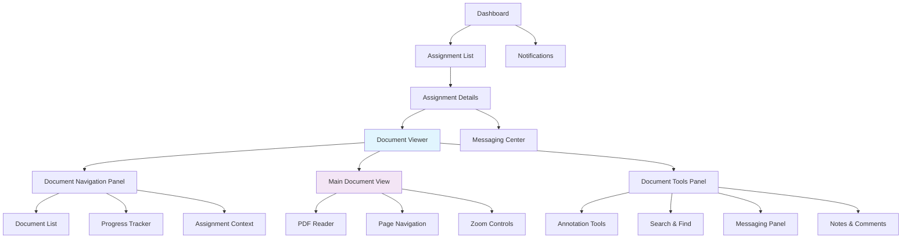
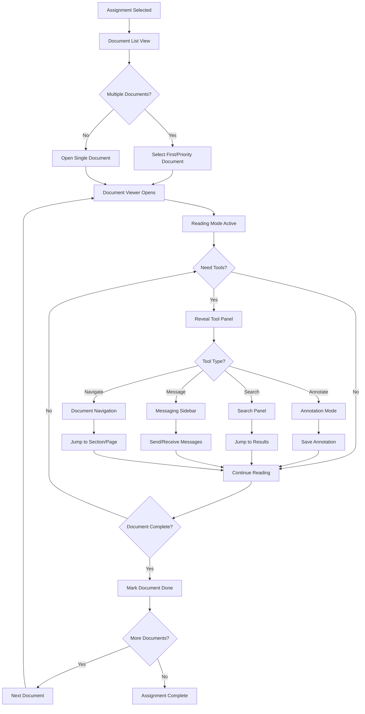
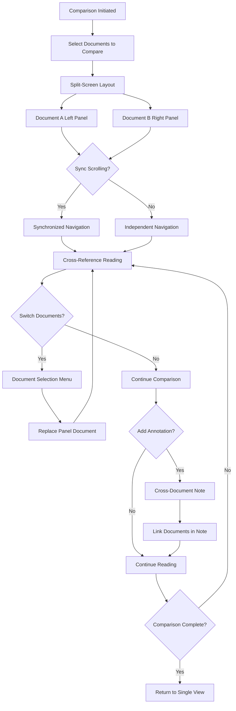

# rvGutachten Document Viewing & Interaction UI/UX Specification

**Document Version:** 1.0  
**Last Updated:** August 4, 2025  
**UX Expert:** Sally  
**Project Focus:** Document viewing and interaction experience for assessors  

## Introduction

This document defines the user experience goals, information architecture, user flows, and visual design specifications for rvGutachten's document viewing and interaction interface. It serves as the foundation for visual design and frontend development, ensuring a cohesive and user-centered experience specifically focused on how assessors interact with PDF documents within their assessment workflow.

## Overall UX Goals & Principles

### Target User Personas

- **Assessment Reviewer:** Professional assessors who need to efficiently read, annotate, and process multiple PDF documents per assignment
- **Detail-Oriented Auditor:** Users who need precise navigation, search capabilities, and reference tools within documents  
- **Multi-tasking Assessor:** Users juggling multiple assignments who need quick context switching and progress tracking

### Usability Goals

- **Fast Document Access:** Assessors can open any PDF within 2 seconds and navigate between documents seamlessly
- **Efficient Reading Experience:** Support for various reading preferences (zoom levels, layout modes, annotation tools)
- **Context Preservation:** Users never lose their place when switching between documents or assignments
- **Multi-document Workflow:** Easy comparison and reference between related documents

### Design Principles

1. **Reading First** - Document content is the primary focus; minimize UI distractions during reading
2. **Contextual Tools** - Show relevant actions (annotate, search, navigate) only when needed
3. **Seamless Transitions** - Moving between documents, assignments, and related tasks feels fluid
4. **Progress Transparency** - Users always know their reading progress and completion status
5. **Flexible Layouts** - Support different screen sizes and reading preferences

## Information Architecture

### Document-Focused Site Map

### Navigation Structure

**Primary Navigation:** Assignment-focused breadcrumb (Dashboard > Assignment > Document)

**Secondary Navigation:** Document-specific tools panel (collapsible sidebar)

**Contextual Navigation:** In-document navigation (page jumps, bookmarks, search results)

**Quick Actions:** Floating action buttons for common tasks (annotate, message, mark complete)

### Document Viewer Layout Modes

- **Immersive Mode:** Full-screen document reading with minimal UI
- **Workflow Mode:** Document viewer with assignment context panel and tools
- **Comparison Mode:** Side-by-side document viewing for related files
- **Mobile Mode:** Optimized single-column layout with swipe navigation

## User Flows

### Primary Document Interaction Flow

**User Goal:** Review and process PDF documents within an assignment efficiently

**Entry Points:**

- Assignment details page → "View Documents" button
- Dashboard notification → Direct document link
- Document list within assignment → Individual document selection

**Success Criteria:**

- User can navigate between all assignment documents seamlessly
- Reading progress is tracked and preserved
- User can complete assessment tasks without leaving document context

### Document Comparison Flow

**User Goal:** Compare information across multiple related documents

**Entry Points:**

- Document viewer → "Compare" button
- Assignment overview → "Compare Documents" action

**Success Criteria:**

- Side-by-side viewing of related documents
- Synchronized scrolling option available
- Easy switching between comparison and single-document modes

### Edge Cases & Error Handling

- **Document loading failures** → Retry mechanism with offline indicator
- **Large document performance** → Progressive loading with page chunking
- **Session timeout** → Auto-save reading position and annotations
- **Network interruption** → Offline reading mode with sync on reconnection
- **Annotation conflicts** → Version control with merge options
