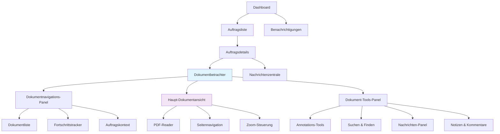
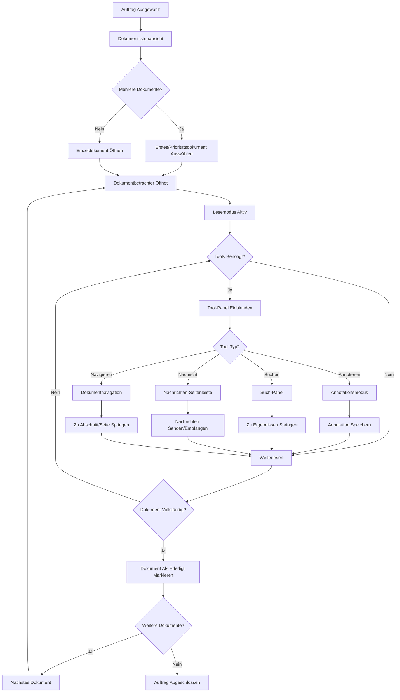
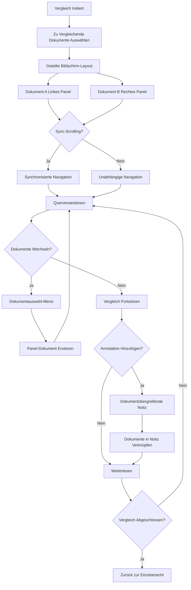

# rvGutachten Dokument-Anzeige & Interaktions-UI/UX-Spezifikation

**Dokumentversion:** 1.0  
**Letzte Aktualisierung:** 4. August 2025  
**UX-Expertin:** Sally  
**Projektfokus:** Dokumentanzeige und Interaktionserfahrung für Gutachter  

## Einführung

Dieses Dokument definiert die Benutzererfahrungsziele, Informationsarchitektur, Benutzerflüsse und visuellen Designspezifikationen für rvGutachtens Dokumentanzeige- und Interaktionsschnittstelle. Es dient als Grundlage für das visuelle Design und die Frontend-Entwicklung und gewährleistet eine kohärente und benutzerzentrierte Erfahrung, die sich spezifisch darauf konzentriert, wie Gutachter mit PDF-Dokumenten in ihrem Bewertungsworkflow interagieren.

## Übergeordnete UX-Ziele & Prinzipien

### Zielgruppen-Personas

- **Bewertungsprüfer:** Professionelle Gutachter, die mehrere PDF-Dokumente pro Auftrag effizient lesen, annotieren und bearbeiten müssen
- **Detailorientierter Auditor:** Benutzer, die präzise Navigation, Suchfunktionen und Referenztools innerhalb von Dokumenten benötigen  
- **Multitasking-Gutachter:** Benutzer, die mehrere Aufträge gleichzeitig bearbeiten und schnellen Kontextwechsel sowie Fortschrittsverfolgung benötigen

### Benutzerfreundlichkeitsziele

- **Schneller Dokumentzugriff:** Gutachter können jedes PDF innerhalb von 2 Sekunden öffnen und nahtlos zwischen Dokumenten navigieren
- **Effiziente Leseerfahrung:** Unterstützung verschiedener Lesevorlieben (Zoomstufen, Layoutmodi, Annotationstools)
- **Kontextbewahrung:** Benutzer verlieren nie ihre Position beim Wechseln zwischen Dokumenten oder Aufträgen
- **Multi-Dokument-Workflow:** Einfacher Vergleich und Referenzierung zwischen verwandten Dokumenten

### Designprinzipien

1. **Lesen steht an erster Stelle** - Dokumentinhalt ist der primäre Fokus; UI-Ablenkungen beim Lesen minimieren
2. **Kontextuelle Tools** - Relevante Aktionen (Annotieren, Suchen, Navigieren) nur bei Bedarf anzeigen
3. **Nahtlose Übergänge** - Bewegung zwischen Dokumenten, Aufträgen und verwandten Aufgaben fühlt sich flüssig an
4. **Fortschrittstransparenz** - Benutzer wissen immer über ihren Lesefortschritt und Vollendungsstatus Bescheid
5. **Flexible Layouts** - Unterstützung verschiedener Bildschirmgrößen und Lesevorlieben

## Informationsarchitektur

### Dokumentzentrierte Sitemap

### Navigationsstruktur

**Primäre Navigation:** Auftragsfokussierte Breadcrumb-Navigation (Dashboard > Auftrag > Dokument)

**Sekundäre Navigation:** Dokumentspezifisches Tools-Panel (einklappbare Seitenleiste)

**Kontextuelle Navigation:** Dokumentinterne Navigation (Seitensprünge, Lesezeichen, Suchergebnisse)

**Schnellaktionen:** Schwebende Action-Buttons für häufige Aufgaben (Annotieren, Nachricht, Als erledigt markieren)

### Dokumentbetrachter-Layoutmodi

- **Immersiver Modus:** Vollbild-Dokumentlesen mit minimaler UI
- **Workflow-Modus:** Dokumentbetrachter mit Auftragskontext-Panel und Tools
- **Vergleichsmodus:** Nebeneinander-Dokumentanzeige für verwandte Dateien
- **Mobiler Modus:** Optimiertes einspaltige Layout mit Wischnavigation

## Benutzerflüsse

### Primärer Dokumentinteraktionsfluss

**Benutzerziel:** PDF-Dokumente innerhalb eines Auftrags effizient überprüfen und bearbeiten

**Einstiegspunkte:**

- Auftragsdetailseite → "Dokumente anzeigen"-Button
- Dashboard-Benachrichtigung → Direkter Dokumentlink
- Dokumentliste innerhalb des Auftrags → Individuelle Dokumentauswahl

**Erfolgskriterien:**

- Benutzer können nahtlos zwischen allen Auftragsdokumenten navigieren
- Lesefortschritt wird verfolgt und bewahrt
- Benutzer können Bewertungsaufgaben erledigen, ohne den Dokumentkontext zu verlassen

### Dokumentvergleichsfluss

**Benutzerziel:** Informationen über mehrere verwandte Dokumente hinweg vergleichen

**Einstiegspunkte:**

- Dokumentbetrachter → "Vergleichen"-Button
- Auftragsübersicht → "Dokumente Vergleichen"-Aktion

**Erfolgskriterien:**

- Nebeneinander-Anzeige verwandter Dokumente
- Synchronisierte Scrolling-Option verfügbar
- Einfacher Wechsel zwischen Vergleichs- und Einzeldokumentmodi

### Grenzfälle & Fehlerbehandlung

- **Dokumentladefehler** → Wiederholungsmechanismus mit Offline-Anzeige
- **Große Dokumentleistung** → Progressives Laden mit Seitenstückelung
- **Session-Timeout** → Automatisches Speichern der Leseposition und Annotationen
- **Netzwerkunterbrechung** → Offline-Lesemodus mit Synchronisation bei Wiederverbindung
- **Annotationskonflikte** → Versionskontrolle mit Merge-Optionen
